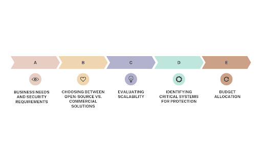
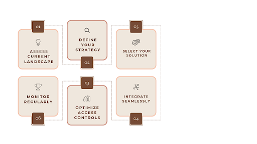

## Table of Contents

- [Introduction](#introduction)
    - [Identity and Access Management (IAM): Concept, components, and objectives.](#identity-and-access-management-iam-concept-components-and-objectives)
- [Challenges in IAM Implementation](#challenges-in-iam-implementation)
- [Key Considerations Before Implementing IAM](#key-considerations-before-implementing-iam)
- [Successful IAM Implementation in 6 Steps](#successful-iam-implementation-in-6-steps)
    - [Step 1: Assess Current Technology Landscape](#step-1-assess-current-technology-landscape)
    - [Step 2: Define Your IAM Strategy](#step-2-define-your-iam-strategy)
    - [Step 3: Select and Deploy the IAM Solution](#step-3-select-and-deploy-the-iam-solution)
    - [Step 4: Integration with Existing Systems](#step-4-integration-with-existing-systems)
    - [Step 5: Optimize Access Controls](#step-5-optimize-access-controls)
    - [Step 6: Monitor and Audit Access](#step-6-monitor-and-audit-access)
- [Common Mistakes to Avoid During IAM Solutions Implementation](#common-mistakes-to-avoid-during-iam-solutions-implementation)
- [Best Practices for IAM Implementation](#best-practices-for-iam-implementation)
- [Implement IAM Solutions with SuperTokens](#implement-iam-solutions-with-supertokens)
- [Conclusion](#conclusion)

## Introduction

With everyone connected online, adopting an Identity and Access Management (IAM) solution is crucial for businesses of all sizes. Alarmingly, [80% of cyberattacks leverage identity-based methods](https://www.tenfold-security.com/en/iam-statistics/#:~:text=80%25%20of%20cyberattacks%20leverage%20identity%2Dbased%20techniques.%20\(CrowdStrike\)), underscoring the urgent need for robust IAM systems to protect sensitive information and maintain trust in digital transactions. IAM not only safeguards valuable data but also enhances security by ensuring that only the right people have access. Think of it as a core part of your security strategy that enables you to manage user accounts, assign permissions, and reduce vulnerabilities effectively.

Creating a good identity and access management (IAM) plan helps organizations manage users better, keep security rules in place, and ensure a smooth experience for users. This is especially important today, as many people work remotely and use cloud services. It's crucial to have strong control over who can access what, while still giving users the flexibility they need.

In this article, we’ll go over the tools and services that can help fine-tune IAM processes. We’ll outline the essential steps, requirements, common challenges, and practical recommendations, all in an easy-to-follow format. Let’s get started!

### Identity and Access Management (IAM): Concept, components, and objectives.

IAM refers to a combination of policies and technologies used to manage user identities and control access in a system or application environment. Its core components include:

*   **Identity Provisioning:** Creating, maintaining, and disabling users' accounts.
*   **Authentication:** Passwords, biometric data, tokens, and other means of confirming the user’s identity.
*   **Authorization:** Controlling ability to use the resources based on the user's predefined roles and access level.
*   **Single Sign-On (SSO):** It allows a user to sign in for various applications by entering a single username and password only once.

## Challenges in IAM Implementation

While implementing IAM brings numerous benefits, it also presents several challenges:

*   **Complexity in Integrating with Existing Systems:** Organizations often struggle with combining new IAM solutions into their existing tech stacks.
*   **Resistance to Adoption:** Employees may resist changes due to unfamiliarity or recognized inconvenience.
*   **Balancing Security Needs with User Experience:** Striking a balance between robust security measures and user-friendly processes can be challenging.
*   **Compliance with Regulatory Requirements:** sticking to regulations such as GDPR or HIPAA requires careful planning and execution.
*   **Scalability Challenges:** Rapidly growing organizations may face difficulties in scaling their IAM solutions effectively.

## Key Considerations Before Implementing IAM

Before diving into implementation, consider the following key factors:

*   **Business Needs and Security Requirements:** Understand the specific security needs of your organization.
*   **Choosing Between Open-source vs. Commercial Solutions:** Weigh the pros and cons of each type based on your technical capabilities and budget.
*   **Evaluating Scalability:** Ensure that the chosen solution can scale with your organization’s growth.
*   **Identifying Critical Systems for Protection:** Determine which systems hold sensitive data that require stringent access controls.
*   **Budget Allocation:** Plan for both initial implementation costs and ongoing maintenance expenses.

## Successful IAM Implementation in 6 Steps

Successfully implementing an IAM solution requires a methodical, well-planned approach. Let's explore each step in detail to ensure your organization achieves optimal results while avoiding common pitfalls.

### Step 1: Assess Current Technology Landscape

The foundation of a successful IAM implementation begins with a comprehensive understanding of your current technological environment. This assessment phase is crucial for identifying potential integration challenges and opportunities for improvement.

Start by documenting your entire application ecosystem, including cloud-based SaaS applications, on-premise legacy systems, and custom-developed solutions. This inventory should encompass all the ways users currently access your systems, from VPN connections to public-facing applications. Pay particular attention to existing authentication mechanisms and user directories, as these will need to be carefully integrated or migrated to your new IAM solution.

Understanding your current security posture is equally important. Evaluate existing access controls, security policies, and compliance measures. This evaluation will help identify gaps that your new IAM implementation needs to address. Document any security incidents or access-related issues from the past year, as these can provide valuable insights into areas requiring special attention.

### Step 2: Define Your IAM Strategy

With a clear picture of your current landscape, the next step is developing a comprehensive IAM strategy that aligns with your business objectives. When implementing self-hosted authentication solutions, as discussed in detail in [SuperTokens' self-hosted authentication guide](https://supertokens.com/blog/self-hosted-authentication/), careful planning and configuration are essential for success.

Your strategy should begin with clear objectives and success metrics. These might include reducing security incidents, improving user satisfaction, decreasing help desk tickets related to access issues, or achieving specific compliance requirements. Each objective should be measurable and time-bound, allowing you to track progress effectively.

Policy development forms a crucial part of your strategy. Create comprehensive access policies that address the entire user lifecycle, from onboarding to offboarding. These policies should detail password requirements, multi-factor authentication protocols, session management rules, and emergency access procedures. Ensure these policies align with relevant compliance requirements while maintaining usability for end users.

### Step 3: Select and Deploy the IAM Solution

Selecting the right IAM solution is perhaps the most critical decision in your implementation journey. Modern solutions like [SuperTokens](https://supertokens.com/product) offer robust features designed to meet contemporary security challenges while maintaining flexibility for future needs.

When evaluating solutions, consider factors beyond just technical specifications. Look at the vendor's track record, support quality, documentation comprehensiveness, and community engagement. The solution should not only meet your current requirements but also have the potential to scale with your organization's growth.

Deployment should follow a carefully planned, phased approach. Begin with a proof of concept in a controlled environment, testing critical functionalities and integration points. Follow this with a pilot program involving a small group of users who can provide valuable feedback. Use this feedback to refine your implementation before proceeding with a full rollout.

### Step 4: Integration with Existing Systems

System integration represents one of the most technically challenging aspects of IAM implementation. Success requires careful planning and execution to ensure seamless operation across your entire technology stack.

Begin by prioritizing integrations based on business criticality and technical complexity. Focus first on core business applications that affect the most users or handle sensitive data. Develop a detailed integration plan for each system, including API configurations, directory synchronization requirements, and any custom development needs.

Testing is crucial during this phase. Implement comprehensive testing procedures that cover not just technical integration but also user workflows and performance under load. Pay particular attention to authentication flows and session management across integrated systems to ensure a smooth user experience.

### Step 5: Optimize Access Controls

Access control optimization focuses on striking the perfect balance between security and usability. This phase involves implementing sophisticated access models that protect your resources while enabling efficient user access.

Rather than implementing a one-size-fits-all approach, consider implementing context-aware access controls that take into account factors such as user location, device type, and time of access. This approach allows for more granular control while maintaining user convenience where appropriate.

Automation plays a key role in access control optimization. Develop workflows that automate routine tasks such as user provisioning, access requests, and periodic access reviews. These automated processes not only improve efficiency but also reduce the risk of human error in access management.

### Step 6: Monitor and Audit Access

The final step in IAM implementation establishes ongoing monitoring and auditing processes to ensure the long-term effectiveness of your solution. This phase is crucial for maintaining security and demonstrating compliance.

Implement comprehensive monitoring systems that track user access patterns, security events, and system performance. These systems should provide real-time alerting for suspicious activities while also collecting data for trend analysis and reporting.

Regular auditing processes help ensure your IAM implementation continues to meet both security and compliance requirements. Establish scheduled reviews of access rights, security controls, and policy effectiveness. Use the insights gained from these audits to continuously improve your IAM system and address emerging security challenges.

## Common Mistakes to Avoid During IAM Solutions Implementation

To maximize the success of your IAM implementation, avoid these common pitfalls:

*   **Neglecting User Training:** Failing to adequately train users can lead to resistance and misuse of the new system.
*   **Overcomplicating Configurations:** Simplify configurations to avoid operational inefficiencies.
*   **Inadequate Assessment of Needs:** Conduct thorough assessments of business requirements before selecting a solution.
*   **Using Generic Solutions:** Tailor your chosen solution to fit your organization’s specific environment rather than opting for a "one-size-fits-all" approach.
*   **Ignoring Scalability Plans:** Always plan for future growth when implementing an IAM solution.

## Best Practices for IAM Implementation

Adopting best practices can significantly enhance the effectiveness of your IAM implementation:

*   **Involve Stakeholders:** Engage IT, HR, and business leaders from the outset to ensure alignment on goals.
*   **Provide Comprehensive Training:** Offer training programs that educate employees on secure usage of the new system.
*   **Conduct Regular Access Reviews:** Regularly review user permissions to ensure compliance with least privilege principles.
*   **Use Multi-Factor Authentication (MFA):** Implement MFA across all access points for enhanced security.
*   **Monitor Activity Continuously:** Utilize logging tools to track user activity in real time for anomaly detection.
*   **Adopt a Phased Approach:** Roll out features incrementally to minimize disruptions during implementation.

## Implement IAM Solutions with SuperTokens

SuperTokens is a flexible authentication tool that seamlessly integrates with modern tech stacks, including popular frameworks like Node.js, React, Angular, and Vue, as well as backend languages like Python and Java. This compatibility makes it easy for developers to add authentication to their applications without relying on confusing third-party login screens.

As an open-source solution, SuperTokens provides businesses with full control over user authentication. Furthermore, organizations can choose to [self-host](https://supertokens.com/blog/self-hosted-authentication/) it, keeping user data secure within their systems and ensuring compliance with regulations. This feature allows for customized solutions tailored to specific business needs, supporting scalability and transparency.

SuperTokens also simplifies compliance with regulatory frameworks such as GDPR and HIPAA by providing built-in features like Multi-Factor Authentication (MFA), data encryption, and secure data storage options that facilitate data protection measures. The platform enhances user experience while bolstering security protocols, making it an ideal choice for organizations looking to implement effective IAM solutions. Here are some key features:

*   **Customizable Authentication Flows:** Tailor authentication processes according to specific organizational needs.
*   **Versatile Authentication Options:** SuperTokens offers versatile authentication options including passwordless login with OTPs or magic links for enhanced security, social login via existing social media accounts for easier onboarding, and secure traditional logins using email and phone passwords for user preference.
*   **Multi-Factor Authentication (MFA):** Enhance security by requiring multiple forms of verification from users.
*   **Session Management:** Efficiently manage user sessions while ensuring compliance with security protocols.
*   **User Roles and Access Control:** Organizations can define different user roles and permissions, allowing for fine-grained control over who has access to what resources within an application.

## Conclusion

A well-thought-through Identity and Access Management implementation is necessary for improving security in an organization, while also encouraging high operational efficiency. The proper solution, such as SuperTokens, can now be used to seriously address the issues related to IAM while achieving a goal without failures. Use best practices and avoid all common mistakes to ensure long-term success in managing identities and access in your organization.

Ready to acquire a digital security solution for your enterprise? Start implementing IAM solutions today with [SuperTokens](https://supertokens.com/product)!