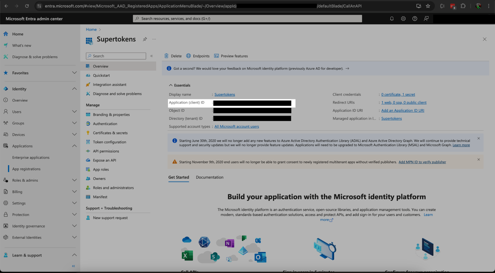
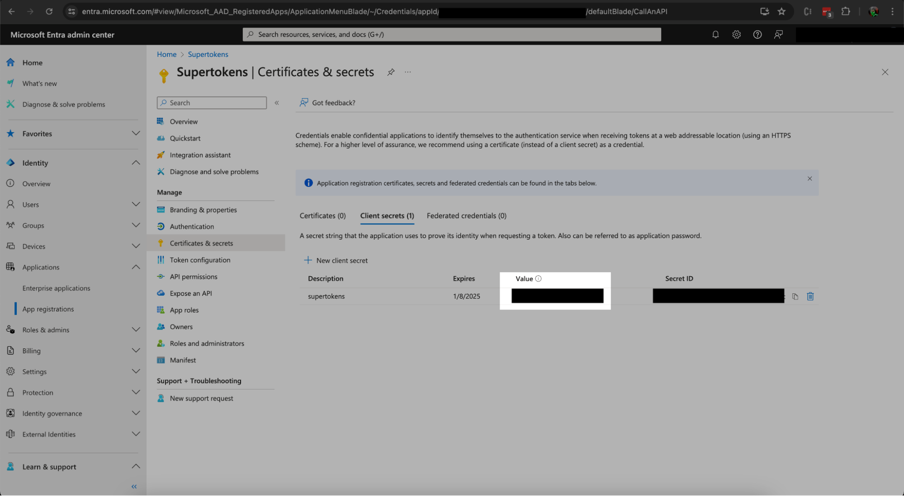
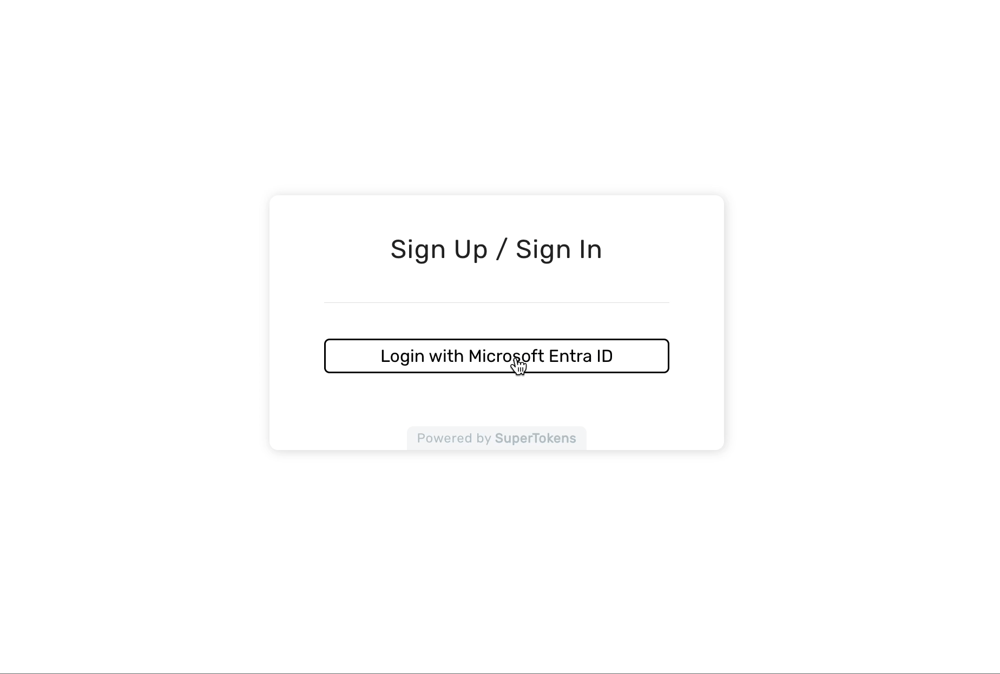

## Table of Contents

```toc
tight: true
toHeading: 3
```

## How to implement OIDC with Microsoft Entra ID

Microsoft Entra ID - previously known as Azure AD - is a popular cloud-based version of [Active Directory](https://supertokens.com/blog/what-is-ldap). Many companies love using Active Directory to organise their company and manage user permissions and roles. This makes Active Directory a great candidate for being an Identity Provider for applications that support SSO.

This guide will both show you how to make your own Oauth/OIDC implementation in express as well as how to integrate Entra ID SSO with SuperTokens. [SuperTokens is our authentication platform](https://supertokens.com/) that you can integrate in your web applications to handle user sessions.

## How the Oauth/OIDC Flow works

The user is redirected to the identity provider's website in order to give their credentials and verify themselves. After the user has been verified, the provider sends us back an authorization code that we can trade for an id token that contains the user's basic information, like name and email. The information we can read is set in the scope, which is shown to the user when they log in to their identity provider.

## Create an application in Microsoft Entra ID

In order to set up Oauth, we have to register our application with Microsoft so it knows what application is asking for user information. When we register, we are given a Client ID that we give back to Microsoft during the Oauth process so it knows it's us.

Head to the [Microsoft Entra homepage](https://entra.microsoft.com/#home). On the left sidebar, click `Applications -> App Registration -> Create a New Registration`. This page will ask you for a Redirect URI and a platform. The platform will be web. The Redirect URI is where Microsoft will send the access code to during the Oauth flow. This endpoint will need to be created later in your app, but we can tell Microsoft what it will be now.

**Express redirect URI**: `http://localhost:3000/auth/callback`

**SuperTokens redirect URI**: `http://localhost:3000/auth/callback/entra`


Under supported account types, you'll be asked if you want to handle single tenant, multi-tenant, or personal accounts. This will depend on your use case:

**Single tenant** - making an internal tool and only want people in your organisation to be able to use this application.

**Multi-tenant** - making a tool for corporate users that allows others to login with their Entra ID account.

**Common** - allows anyone with any microsoft account to log in (xbox, skype, etc)

Select whichever use case is right for you.

After saving, you should  be redirected to the overview page containing your Client ID (also referred to as an Application ID). If you aren’t redirected to this page, then you can click `security -> permissions -> app registration -> overview` in the new left hand tab. Save the Client ID to add to your application later.



Click on Authentication on the left hand side. Under the section "Implicit grant and hybrid flows", select the option:

`ID tokens (used for implicit and hybrid flows)`

And then save at the bottom.

Click “Certificates and Secrets” on the left side of the screen and create a new Client Secret. The Client Secret is used to verify that the Oauth flow was started by the owner of the registered app, as this key is meant to be kept private. Copy the Client Secret Value - and not the Client Secret ID - for use later in the application.



Finally, click `Overview -> endpoints` at the top of the page. Copy the OpenID Connect metadata document url for later.

## Configure your application for Microsoft Entra ID Oauth

If following the supertoken steps, you can scroll to the next section. If you're doing a custom integration, follow these steps.

Let's create our express server and handle the Oauth flow.
Generate a new project:

```bash
npm init
```

Then add the needed dependencies:

```bash
npm install --save express express-session axios dotenv cookie-parser
```

Create a file named .env in the root of your project and add the following values:

```bash
CLIENT_ID=<YOUR_CLIENT_ID>
CLIENT_SECRET_VALUE=<YOUR_CLIENT_SECRET_VALUE>
COOKIE_SECRET=<SECRET_FOR_COOKIES>
SECRET=<SECRET_FOR_EXPRESS_SESSION>
```

Now we can start making our express app.

We'll create an index.js file to write our express server in. After that, we'll make an auth endpoint that sends the user to Microsoft with our Client ID so Microsoft knows it's our application starting the process. We'll also add some code to initialise an express session for after the user has authenticated themselves, generate state to mitigate CSRF attacks, and a configuration object that has the Oauth information needed for Microsoft.

```javascript
require('dotenv').config()

const express = require('express');
const session = require('express-session');
const axios = require('axios');
const qs = require('querystring');
const crypto = require('crypto');
const cookieParser = require('cookie-parser');


const app = express();

// Configuration settings for Microsoft Entra ID
const config = {
  clientId: process.env.CLIENT_ID,
  clientSecret: process.env.CLIENT_SECRET_VALUE,
  redirectUri: "http://localhost:3000/auth/callback",
  scope: ["openid", "email", "profile"]
};

// Add session middleware
app.use(session({
  secret: process.env.SECRET,
  resave: false,
  saveUninitialized: true
}));

app.use(cookieParser(process.env.COOKIE_SECRET));

// The root path links us to the /auth endpoint, which generates
// the url to start oauth flow
app.get('/', (req, res) => {
  res.send('<a href="/auth">Login with Microsoft Entra ID</a>');
});

// The auth endpoint generates our oauth url for Microsoft Entra ID
app.get('/auth', (req, res) => {

  require('crypto').randomBytes(24, function(err, buffer) {
    let stateParam = buffer.toString('hex');
    res.cookie("stateParam", stateParam, { maxAge: 1000 * 60 * 5, signed: true });

    const authUrl = "https://login.microsoftonline.com/common/oauth2/v2.0/authorize?" + qs.stringify({
      client_id: config.clientId,
      response_type: 'code',
      redirect_uri: config.redirectUri,
      response_mode: 'query',
      scope: config.scope.join(" "),
      state: stateParam
    });

    res.redirect(authUrl);
  });

  
});

app.listen(3000, () => {
  console.log(`Server is running on port 3000`);
});
```

Now let's build the callback endpoint that Microsoft will send the Authorization Code to after the user has verified themselves. On this endpoint, we'll trade the Authorization Code for an Access Token and Refresh Token and save it in our express session. This endpoint needs to listen on the same path that we gave Microsoft for our Callback URI. We'll also tell this endpoint to redirect to a profile endpoint that we'll define in the next step.

```javascript
// This is our Redirect URI
// After the flow has started, Microsoft sends us back
// an authorization code, authorizing us to get access and refresh tokens
// on behalf of the user
app.get('/auth/callback', async (req, res) => {
  const { code, state } = req.query;
  const { stateParam } = req.signedCookies;

  if (stateParam !== state) {
    res.status(422).send("Invalid State");
    return;
  }

  const tokenUrl = "https://login.microsoftonline.com/common/oauth2/v2.0/token?";

  const tokenParams = {
    client_id: config.clientId,
    scope: config.scope.join(" "),
    code,
    redirect_uri: config.redirectUri,
    grant_type: 'authorization_code',
    client_secret: config.clientSecret
  };

  try {
    const response = await axios.post(tokenUrl, qs.stringify(tokenParams), {
      headers: {
        'Content-Type': 'application/x-www-form-urlencoded'
      }
    });

    // save the token data in the user session in express
    req.session.tokenSet = response.data;
    res.redirect('/profile');
  } catch (error) {
    console.error('Token exchange error:', error);
    res.redirect('/');
  }
});

```

Now we'll define our profile endpoint and logout endpoint. The Profile endpoint will use the token we received, call to Microsoft for the user's information, and display it on the screen. And the logout endpoint will destroy the express session.

```javascript
// grab token data from express session
// and get user info from microsoft
app.get('/profile', async (req, res) => {
  if (!req.session.tokenSet) {
    return res.redirect('/');
  }

  const { id_token } = req.session.tokenSet;

  // the main profile information is in the body
  // of the JWT
  const body = id_token.split(".")[1];

  // convert it from base64 to utf8
  let bufferObj = Buffer.from(body, "base64");
  let string = bufferObj.toString("utf8");

  res.send(`<h1>Profile</h1><span>${string}</span><br><br><a href="/logout">logout</a>`);
});

app.get('/logout', (req, res) => {
  req.session.destroy((err) => {
    if (err) {
      console.error(err);
    }
    res.redirect('/');
  });
});
```

Now when we run our app, we can log into our Microsoft account and see our account information. Nice! Full Oauth flow finished for Microsoft Entra ID.

## Configure SuperTokens for Microsoft Entra ID Oauth

Run to make a new SuperTokens project:

```bash
npx create-supertokens-app@latest --recipe=thirdparty
```

We need to configure the front-end to generate a “Login with Entra” button, so add the following to your front-end `config.tsx`.

```javascript
ThirdParty.init({
            signInAndUpFeature: {
                providers: [
                    {
                        // The ID sets your callback url
                        // ie http://localhost:3000/auth/callback/entra
                        id: "entra",
                        name: "Entra ID", // Will display "Continue with X"

                        // optional
                        // you do not need to add a click handler to this as
                        // we add it for you automatically.
                        buttonComponent: (props: {name: string}) => <div style={{
                            cursor: "pointer",
                            border: "1",
                            paddingTop: "5px",
                            paddingBottom: "5px",
                            borderRadius: "5px",
                            borderStyle: "solid"
                        }}>{"Login with " + props.name}</div>
                    }
                ],
            },
        }),

```

Now we need to configure the back-end to handle the OIDC calls. We'll set our scopes to ["openid", "email", "profile"], and our oidcDiscoveryEndpoint to the OpenID Connect metadata document we got in our application overview.

Add the following to your `config.ts`

```javascript
ThirdParty.init({
            signInAndUpFeature: {
                providers: [
                    {
                        config: {
		                        // The thirdPartyId connects to the front-end id
                            thirdPartyId: "entra",
                            name: "Entra ID",
                            clients: [{
                                clientId: "<CLIENT_ID>",
                                clientSecret: "<CLIENT_SECRET_VALUE>",
                                scope: ["openid", "email", "profile"]
                            }],
                            oidcDiscoveryEndpoint: "https://login.microsoftonline.com/common/v2.0/.well-known/openid-configuration",
                            userInfoMap: {
                                fromUserInfoAPI: {
                                    userId: "sub",
                                    email: "email",
                                }
                            }
                        }
                    },
                ],
            },
        })

```

Run `npm run start` and head to `localhost:3000` in the browser. You’ll see the option `Sign in with Entra`. Click it and you’ll get a session signed in from Entra ID. How easy was that?



## Conclusion

Active Directory is a time tested way to store users and permissions. Its ability to integrate as an Identity Provider makes it valuable, especially to large organisations that have lots of users and permissions to manage. If you found the usual way of integrating Entra ID to be cumbersome, then try [simplifying your SSO logins with SuperTokens](https://supertokens.com/features/social-login).

[Github repo for express instance](https://github.com/ConzorKingKong/entra-id-oidc-express)

[Github repo for SuperTokens project](https://github.com/ConzorKingKong/supertokens-entra-id)