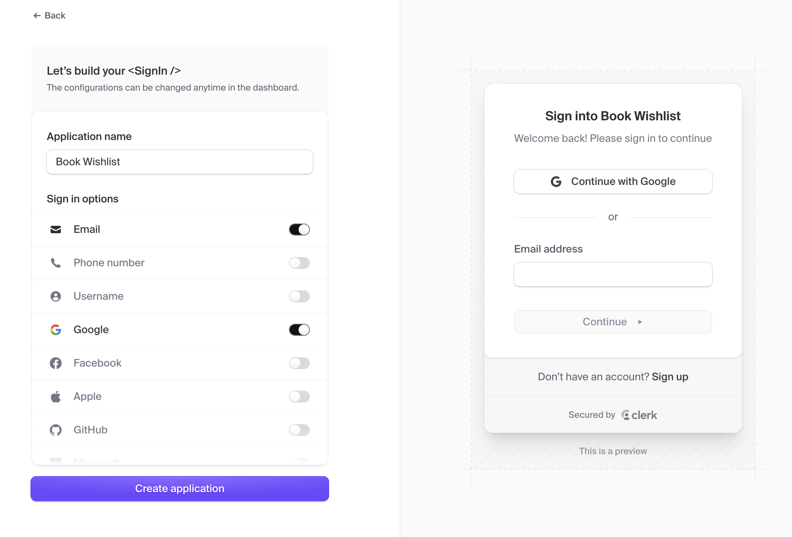

**Picture this:** You’re building the next big thing.  <br />The idea? Brilliant. The UI? Pixel-perfect. The code? Chef’s kiss.

Then reality hits: <br />
**"How do I handle authentication *and* database stuff without losing my mind?"** 😭

If your app needs accounts and saved user data (and let’s face it, it probably does), you need authentication and a database working together. Without that, your users are just anonymous ghosts shouting into the void—not exactly the personalized experience you’re aiming for.

Let’s say you’ve already picked Supabase for your backend (great choice). But now you’re wondering: <br />
**“Which authentication provider works best with Supabase in a Next.js app?”**

This two-part guide walks you through two popular options—**Clerk** and **SuperTokens**—so you can see how they compare in real projects.

* **Part I:** How to integrate **Clerk** with **Supabase** in a **Next.js** app if you want to ship quickly using beautiful out of the box components.
* **Part II:** How to swap in **SuperTokens** as an alternative auth solution if you’re looking for more control, self-hosting, customizable flows, and advanced features like multi-tenancy, passwordless login, and seamless session management—all while staying fully in charge of your user data.

## 📖 What You'll Learn

By the end, you’ll be able to compare both approaches side-by-side and choose what fits your project best.

We’ll use a [**Mermaid**](https://mermaid.js.org/) diagramming app as our running example—a tool that lets users create, save, and manage diagrams securely.

**In Part I, You'll:** 
* 📘 Learn the basics of Clerk and Supabase
* 🛠 Combine them to build a secure, data-driven app
* ⚖️ Weigh the pros and cons of using Clerk for authentication
* 🤗 Get a sneak peek at an alternative: SuperTokens

Let’s make auth and data storage actually enjoyable. <br /> First, we’ll look at a stripped-down version of the app—no auth, no persistence—so you can see the baseline. Then we’ll layer in features and see how each one improves the experience.

## 🔗 How Clerk and Supabase Work Together

Clerk and Supabase handle two essential—but separate—parts of your app:

* **Clerk = Auth & Identity** <br />Clerk manages everything about who the user is: their credentials, session, and identity. When someone signs in, Clerk gives them a unique userId.

* **Supabase = Data Storage & Rules** <br />Supabase stores and retrieves the actual user content—like saved diagrams. But crucially, it doesn’t know who a user is unless you connect the dots.

Here’s how the connection works:

1. **Clerk handles authentication.**<br /> When a user signs in, Clerk generates a session and provides a secure, unique identifier (`userId`).
2. **You send that `userId` to Supabase** when saving or retrieving data. <br />This happens in your client or server code—any time you store or fetch data, you include the user’s ID.
3. **Supabase enforces access rules using Row Level Security (RLS).** <br />With RLS enabled, you write SQL policies that make sure users can only read/write rows that belong to their userId.

    For example:

    ```sql
    policy "Users can access their own charts"
    on charts
    for all
    using (auth.uid() = user_id);
    ```

This setup means:
* Users must be logged in to interact with data.
* Every saved chart is associated with a specific user.
* Users can only see or update their own charts.

It’s a clean separation of concerns:
* Clerk handles who a user is.
* Supabase handles what they can access.

Together, they make it easy to build secure, personalized apps—without needing to spin up your own authentication or backend from scratch.

## 💻 Project Overview 

🛠️ **[Check out the GitHub repository for the demo app here.](https://github.com/meems1996/mermaid-charting-app)**


The Mermaid Charting App is a **Next.js**-based tool that integrates **Clerk** and **Supabase** to provide the following features:

* **MermaidJS Editor**: An interactive editor for generating diagrams from Mermaid syntax.
* **Authentication with Clerk**: Users can sign in or sign up, and their sessions are managed securely.
* **Chart Storage with Supabase**: Authenticated users can save their diagrams to a Supabase database and retrieve them later.

🧜‍♀️ In the video below, you’ll see the core features of the app in action -- writing and rendering a Mermaid chart, and saving it to your Saved Charts section. At this stage, the app **doesn’t** include authentication or persistence. That means anyone can view charts, and saved work vanishes when the page reloads. It’s the perfect baseline to show how Clerk and Supabase transform the experience.
 
<div style="position: relative; padding-bottom: 56.25%; height: 0;"><iframe id="js_video_iframe" src="https://jumpshare.com/embed/YOpxWr5WU4Hc9T2JEAXY" frameborder="0" webkitallowfullscreen mozallowfullscreen allowfullscreen style="position: absolute; top: 0; left: 0; width: 100%; height: 100%; border-radius: 12px;"></iframe></div>

<br />

We’ll combine Clerk and Supabase to bring this app to life:
1. 🔐 **Clerk** will manage user authentication and user sessions, allowing people to sign up, log in, and have personalized accounts.
2. 🗄️ **Supabase** will store charts and associate them with the authenticated user—so each person only sees their own saved diagrams.



By the end of this guide, we’ll have evolved from a stateless prototype to a secure, fully featured app with persistent, user-specific data.

## 🧩 What is Clerk? 

[**Clerk**](https://clerk.com/) is a developer-friendly authentication service that makes it easy to add sign-up, sign-in, and user management to your app. It offers:

* ✅ Prebuilt, customizable UI components
* 🔐 Support for modern auth features like social logins, multi-factor authentication, and webhooks
* ⚙️ Robust APIs to help you stay in control when needed

Instead of building authentication from scratch, Clerk lets you plug in secure, polished components—so you can spend less time reinventing the login screen and more time building your product.

In this project, we’ll use Clerk to authenticate users and assign each one a unique user ID. That ID is key—it lets us store and retrieve each user's charts individually in Supabase.

## 🗄️ What is Supabase? 

[**Supabase**](https://supabase.com/) is an open-source backend-as-a-service that gives you a full Postgres database, real-time subscriptions, storage, and auth—right out of the box. Think of it like Firebase, but with SQL and a developer experience that doesn’t make you want to flip a table. 🙃

With Supabase, you get:

* 🧠 A powerful Postgres database with row-level security
* ⚡️ Auto-generated APIs for your tables
* 📊 A slick dashboard for managing data and users
* 💾 Built-in storage and real-time capabilities

> **Bonus:** Supabase’s row-level security makes it easy to enforce per-user access rules—so your users only ever see their own data.

It’s fast, flexible, and works seamlessly with frameworks like Next.js and React.

Basically, it’s your app’s backend—without the backend headaches.

In this project, Supabase stores and retrieves each user's Mermaid charts. Every saved chart is linked to the unique user ID provided by Clerk. This setup ensures data is private, secure, and only visible to the right user.

## 💻 Setting Up Clerk 
To get started with Clerk, follow these simple steps to set up authentication in your app.

### 1. Sign Up for Clerk 
First, head over to [Clerk's website](https://clerk.com/) and sign up for an account. You’ll need to provide your email and create a password. Once you're in, you'll be taken to the Clerk dashboard, where you'll manage your app’s authentication settings.

### 2. Create a New Application
1. In your Clerk dashboard, click on the **Create Application** button.
2. Choose a name for your app (e.g., *Mermaid Visualizer*).
3. Choose the authentication methods from a list.
    - In this demo, we are selecting just the Email authentication method for simplicity.

<div style="position: relative; padding-bottom: 56.25%; height: 0;"><iframe id="js_video_iframe" src="https://jumpshare.com/embed/AnOxQNnud4HnDbJP94ev" frameborder="0" webkitallowfullscreen mozallowfullscreen allowfullscreen style="position: absolute; top: 0; left: 0; width: 100%; height: 100%; border-radius: 12px;"></iframe></div>

<br />

Clerk will generate a set of steps to follow to continue setting up Clerk in your application.

### 3. Install the Clerk SDK 
To integrate Clerk into your project, you'll need to install the Clerk SDK. Open your terminal and run the following command:

```bash 
# If you're using npm 
npm install @clerk/nextjs

# If you're using yarn 
yarn add @clerk/nextjs

# If you're using pnpm
pnpm add @clerk/nextjs
```

### 4. Set your Clerk API keys
Add these keys to your `.env` file, or create the file if it doesn't exist. 

```text
NEXT_PUBLIC_CLERK_PUBLISHABLE_KEY=your-clerk-key
CLERK_SECRET_KEY=your-clerk-secret
```

### 5. Update `middleware.ts`
Update your middleware file, or create one at the **root** of your project, or the **src/** directory if you're using a src/ directory structure.

The `clerkMiddleware` helper enables authentication and is where you'll configure your protected routes.

```javascript
import { clerkMiddleware } from "@clerk/nextjs/server";

export default clerkMiddleware();

export const config = {
  matcher: [
    // Skip Next.js internals and all static files, unless found in search params
    '/((?!_next|[^?]*\\.(?:html?|css|js(?!on)|jpe?g|webp|png|gif|svg|ttf|woff2?|ico|csv|docx?|xlsx?|zip|webmanifest)).*)',
    // Always run for API routes
    '/(api|trpc)(.*)',
  ],
};
```

### 6. Add ClerkProvider and the SignUp/SignIn Buttons

To enable Clerk throughout your app, you’ll use the ClerkProvider in your layout.tsx file.

Here’s what to do:
* **Import the necessary components** from `@clerk/nextjs`.
* **Wrap your app** with `ClerkProvider` to make Clerk’s features available globally.
* Use `SignedOut` to wrap the `SignInButton` and`SignUpButton`. These will only appear when the user is signed out.
* Use `SignedIn` to wrap both the `UserButton` and your app’s content. These will only show when the user is signed in.

```javascript{4-12, 36, 41-45, 47-51, 56}
import { type Metadata } from "next";
import { Geist, Geist_Mono } from "next/font/google";
import "./globals.css";
// 🔐 Clerk components for authentication flows
import {
  ClerkProvider, // Wraps your app to provide authentication context
  SignInButton, // Renders a sign-in button that opens Clerk's sign-in modal
  SignUpButton, // Renders a sign-up button that opens Clerk's sign-up modal
  SignedIn, // Conditionally renders children *only* if the user is signed in
  SignedOut, // Conditionally renders children *only* if the user is signed out
  UserButton, // Displays the user's avatar with a dropdown for account management
} from '@clerk/nextjs'

const geistSans = Geist({
  variable: "--font-geist-sans",
  subsets: ["latin"],
});

const geistMono = Geist_Mono({
  variable: "--font-geist-mono",
  subsets: ["latin"],
});

export const metadata: Metadata = {
  title: "Create Next App",
  description: "Generated by create next app",
};

export default function RootLayout({
  children,
}: Readonly<{
  children: React.ReactNode;
}>) {
  return (
    // ✅ ClerkProvider wraps the entire app, enabling access to auth state and Clerk components
    <ClerkProvider>
      <html lang="en">
        <body className={`${geistSans.variable} ${geistMono.variable} antialiased`} >
          <header className="p-5">

          {/* 👋 Show these only when the user is signed out */}
          <SignedOut>
            <SignInButton /> {/* Opens a modal for users to sign in */}
            <SignUpButton /> {/* Opens a modal for users to create an account */}
          </SignedOut>

          {/* 🙌 Show these only when the user is signed in */}
          <SignedIn>
            <UserButton /> {/* Shows user profile options like sign out */}
            {children}  {/* Show the app content only to signed-in users */}
          </SignedIn>
          
        </header>
        </body>
      </html>
    </ClerkProvider>
  );
}
```

🎉 And that’s it! You’ve now set up Clerk for user authentication in your app. Users can sign in, sign up, and see personalized content based on their auth state.

### 7. Run Your Project and Get Your First User
Start your dev server:
```bash
# If you're using npm 
npm run dev

# If you're using yarn 
yarn dev

# If you're using pnpm
pnpm dev
```

Once it’s running, head to `http://localhost:3000` in your browser. You should see your app with sign-in and sign-up options. Go ahead and register—this will create your first authenticated user.

Next up: we'll connect Supabase and set it up to store user-specific data like saved Mermaid graphs.

## 💻 Setting Up Supabase
To integrate Supabase into your project, follow these steps. 

### 1. Create a Supabase Account
Head over to [Supabase's website](https://supabase.com/) and sign up for an account. Once you have an account, you can create your first project. 

### 2. Create a New Project 
Create a new project, pick a project name (e.g., *Mermaid Visualizer*), and a strong password. Supabase has an option (*Generate a password*) that creates a strong password for you. Make sure to use your Password Manager of choice to secure your new password. For the Region, pick the closest one to where your users may be. 

<div style="position: relative; padding-bottom: 56.25%; height: 0;"><iframe id="js_video_iframe" src="https://jumpshare.com/embed/a2VexfxNR8imzVJ8Q4mJ" frameborder="0" webkitallowfullscreen mozallowfullscreen allowfullscreen style="position: absolute; top: 0; left: 0; width: 100%; height: 100%; border-radius: 12px;"></iframe></div>

To integrate Supabase into your project, follow these steps:
1. **Create a Supabase Account**: Sign up at Supabase.com and create a new project.
2. **Install Supabase**: Add the Supabase package to your project:

```bash
npm install @supabase/supabase-js
```

### Steps to get started 
You can visit [**Supabase's official documentation**](https://supabase.com/docs/guides/auth/third-party/clerk) on the subject, but we will break down the steps for our project in this section. As of April 1 2025, Supabase changed how they integrate with Clerk from JWT template to a native integration approach for enhanced security. 

There are two steps to get started to connect Clerk and Supabase together: 
1. Configure your Clerk instance for Supabase compatibility
2. Add a new Third-Party integration with Clerk in your Supabase dashboard

Now that you've set up your project, it's time to get to work.

#### Set up RLS policies using Clerk session token data

#### Create a SQL query that checks the user's Clerk ID
Create a function named `requesting_user_id()` that will parse the Clerk user ID from the authentication token. This function will be used to set the default value of user_id in a table and in the RLS policies to ensure the user can only access their data.

1. In the sidebar of your Supabase dashboard, navigate to SQL Editor. This is where you will run all your SQL queries for the rest of this guide. Paste the following into the editor:

```sql
CREATE OR REPLACE FUNCTION requesting_user_id()
RETURNS TEXT AS $$
    SELECT NULLIF(
        current_setting('request.jwt.claims', true)::json->>'sub',
        ''
    )::text;
$$ LANGUAGE SQL STABLE;
```

#### Create a charts table to handle all the saved charts 

```sql
-- Create the charts table with Clerk user support
create table charts (
  id uuid primary key default uuid_generate_v4(),
  content text not null,
  user_id text not null,
  created_at timestamptz default now()
);

-- Enable row-level security right away
alter table charts enable row level security;

-- Allow users to insert only their own charts
create policy "Users can insert their own charts"
  on charts
  for insert
  with check (user_id = auth.uid()::text);

-- Allow users to view only their own charts
create policy "Users can view their own charts"
  on charts
  for select
  using (user_id = auth.uid()::text);

-- Optional: allow deleting only their own charts
create policy "Users can delete their own charts"
  on charts
  for delete
  using (user_id = auth.uid()::text);
```

🧪 (**Test it out**) After running this script:
* Log in as a user through Clerk
* Insert a chart with `user_id = user.id` in your app
* Try querying charts — you’ll only see your own

#### Common issue with setting up Clerk and Supabase 
🛠️ What Was the Problem?

In the original Supabase Row-Level Security (RLS) policies, I used:

```sql
USING (auth.uid()::text = user_id)
```

This approach works when using Supabase Auth, where auth.uid() returns the UUID of the currently authenticated user.

However, in this project, we're using Clerk for authentication — not Supabase Auth. Clerk user IDs are strings like:

```text
"user_2w2a6PJC4T4BfXDsg72AQsLNEyU"
```

**This caused two issues:**
1. auth.uid() returns NULL because there is no Supabase Auth context.
2. Supabase attempted to treat the Clerk user ID (user_...) as a UUID, which resulted in the following error:

```bash
invalid input syntax for type uuid: "user_2w2a6PJC4T4BfXDsg72AQsLNEyU"
```

To fix this, we updated the RLS policies to read the Clerk user ID directly from the JWT passed into Supabase:

```sql
USING (user_id = current_setting('request.jwt.claims', true)::json->>'sub')
```

**This line works as follows:**
* current_setting('request.jwt.claims', true) retrieves the full JWT claims from the request context.
* ::json->>'sub' extracts the sub claim, which contains the authenticated Clerk user's ID.
* This ID is then compared against the user_id column in the database.

By doing this, Supabase enforces RLS policies based on the Clerk-authenticated user, even though Supabase Auth is not being used.

So the creating table is 

```sql
create table IF NOT EXISTS charts (
  id UUID DEFAULT gen_random_uuid() PRIMARY KEY,
  content text NOT NULL,
  user_id text NOT NULL,
  created_at timestamptz default now()
);

-- Enable row-level security right away
ALTER TABLE charts ENABLE ROW LEVEL SECURITY;

-- Allow users to insert only their own charts
create policy "Users can insert their own charts"
  on charts
  for insert
  WITH CHECK (user_id = current_setting('request.jwt.claims', true)::json->>'sub');

-- Allow users to view only their own charts
create policy "Users can view their own charts"
  on charts
  for select
  USING (user_id = current_setting('request.jwt.claims', true)::json->>'sub');

-- Allow users to delete only their own charts
create policy "Users can delete their own charts"
  on charts
  for delete
  USING (user_id = current_setting('request.jwt.claims', true)::json->>'sub');
```

## Integrating Clerk and Supabase in Next.js

The integration between Clerk and Supabase works as follows: 
1. **Authentication with Clerk**: When a user logs in, Clerk provides a unique user ID.
2. **Data Storage with Supabase**: The user ID is used to associate charts with the logged-in user in the Supabase database.

Here’s how the integration is implemented.

### Middleware for Clerk
The middleware.ts file ensures that Clerk handles authentication for protected routes:

```javascript 
import { clerkMiddleware } from "@clerk/nextjs/server";

export default clerkMiddleware();

export const config = {
  matcher: [
    '/((?!_next|[^?]*\\.(?:html?|css|js|png|svg)).*)',
    '/(api|trpc)(.*)',
  ],
};
```

### Supabase Provider
The SupabaseProvider initializes a Supabase client with the user’s session token:

```javascript 
import { createClient } from "@supabase/supabase-js";
import { useSession } from "@clerk/nextjs";

export default function SupabaseProvider({ children }: { children: React.ReactNode }) {
  const { session } = useSession();
  const supabase = createClient(
    process.env.NEXT_PUBLIC_SUPABASE_URL!,
    process.env.NEXT_PUBLIC_SUPABASE_ANON_KEY!,
    { accessToken: () => session?.getToken() }
  );

  return <Context.Provider value={{ supabase }}>{children}</Context.Provider>;
}
```

## Code Walkthrough 
### Saving Charts
The handleSave function saves a Mermaid chart to the Supabase database:

```javascript 
const handleSave = async () => {
  if (!supabase || !user) return;

  const { data, error } = await supabase
    .from('charts')
    .insert({ content: code, user_id: user.id });

  if (error) console.error('Error saving chart:', error);
};
```

### Fetching Charts
The fetchCharts function retrieves charts for the logged-in user:

```javascript 
const fetchCharts = async () => {
  const { data, error } = await supabase
    .from('charts')
    .select('content')
    .order('created_at', { ascending: false });

  if (data) setSavedCharts(data.map((item) => item.content));
};
```

### Challenges and Solutions
* **Session Management**: Ensure Clerk’s session is available before initializing Supabase.
    * Solution: Use useEffect to wait for the session before creating the Supabase client.
* **Error Handling**: Handle errors gracefully when saving or fetching data.
    * Solution: Add error checks and display user-friendly messages.

## Conclusion
By integrating Clerk and Supabase, you can build secure and scalable applications with ease. Clerk handles authentication, while Supabase manages user-specific data. This combination is ideal for projects like the Mermaid Charting App, where personalized user experiences are key

## Further Reading
* Clerk Documentation
* Supabase Documentation
* Next.js Documentation
* MermaidJS Documentation
