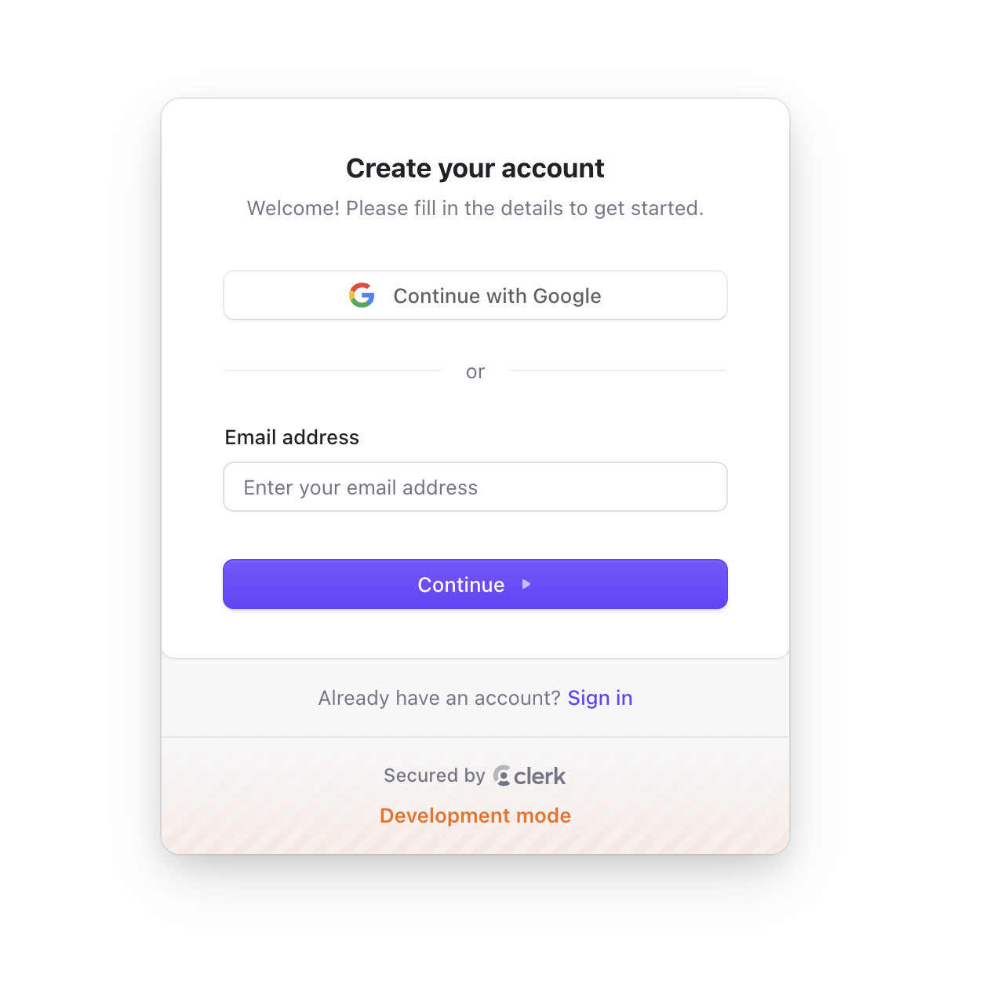
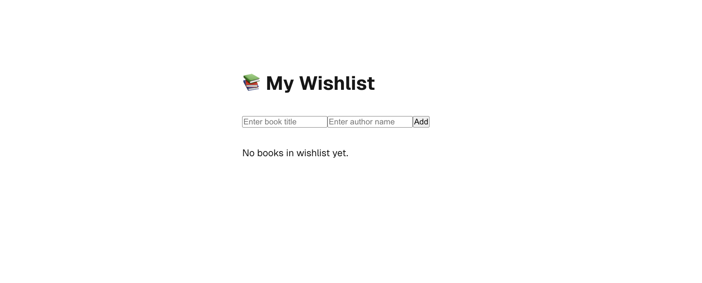
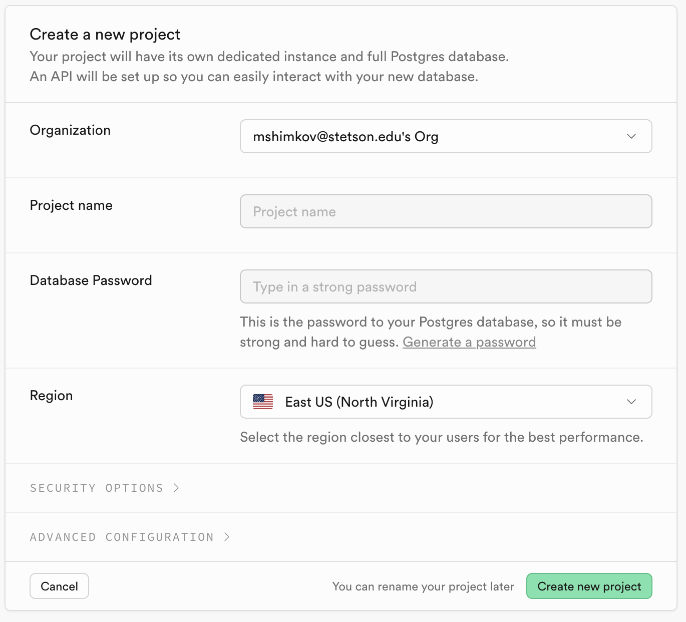
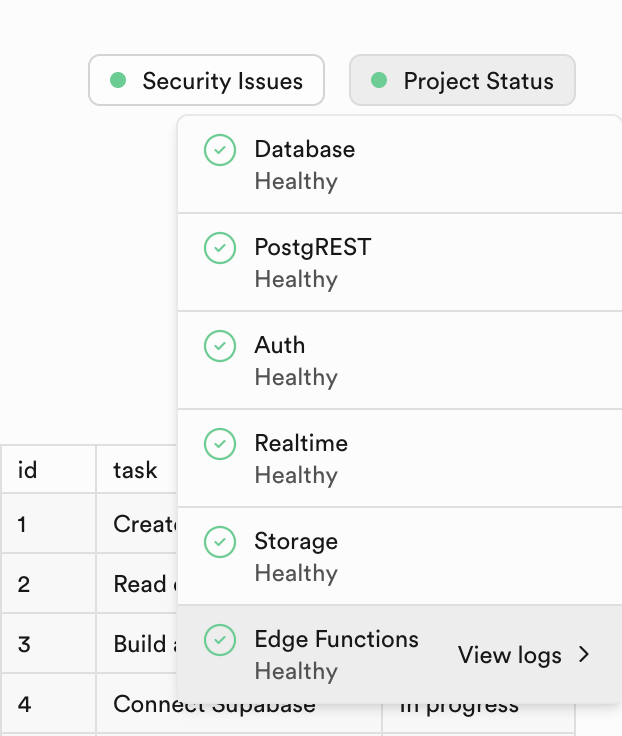
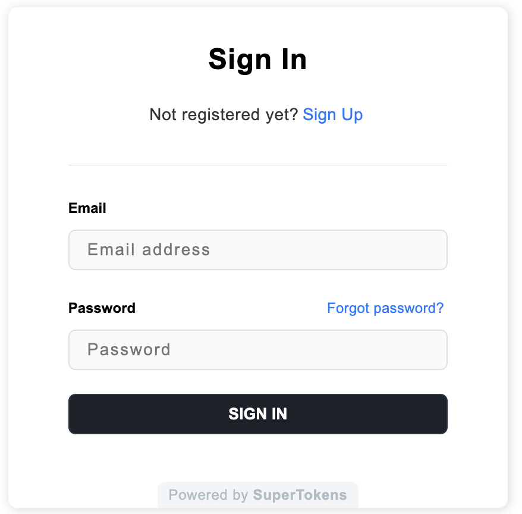

## Clerk + Supabase: How to Build Secure Authentication in Your App 

Combining Supabase with Clerk allows you to take advantage of both Supabase's powerful database capabilities and Clerk's authentication features, prebuilt components, and webhooks. In this guide we are going over the fundamentals of Clerk and Supabase, show you how to use them together to build an application, discuss the pros and cons of using Clerk for your authentication needs, and then talk about an exciting alternative. 

## 🧩 What is Clerk? 

**[Will ask nevil for an image here for Clerk]**

[**Clerk**](https://clerk.com/) is a platform that simplifies user management for developers by providing ready-made sign-in and user management UI components, saving time and enhancing the user experience. It offers tools to easily add authentication and multi-tenancy to your app, with customizable login and signup forms, giving you full control over the sign-in process to build powerful SaaS applications.

## What is Supabase? 

**[Will ask nevil for an image here for Supabase]**

Supabase is an **open-source backend platform** that makes it easy for developers to build powerful applications. It provides a **PostgreSQL database**, **real-time capabilities**, and **auto-generated API**s, so you can focus on your app without worrying about backend complexity.

## Setting Up Clerk With Your Application
**Steps:** 
1. Set up your Clerk account
2. Create a new application from your Clerk dashboard
  - Choose an application name (e.g., Book Wishlist)
  - Choose your sign in option (e.g., check email box and Google box)
  - Click **Create application** button &rarr; This will customize and create your **`<SignIn />`** drop-in component


3. Take a breather and explore the dashboard -- especially if this is your first time seeing it. 
4. In the **Overview** tab, select Next.js and follow the setup steps to add Clerk and sign up your first user.
5. Follow the steps in the guide: 
  - **Install `@clerk/next.js`**: Run `npm install @clerk/nextjs`.  
  - **Set up API keys**: Add your Clerk keys to `.env`.  
  - **Update/create `middleware.ts`**: Place it in the root or `src/` directory.  
  - **Add `ClerkProvider`**: Wrap your app with `ClerkProvider` in `layout.tsx` for global auth access.  

```javascript{2-9, 33, 37-43, 48}
import { type Metadata } from 'next'
import {
  ClerkProvider,
  SignInButton,
  SignUpButton,
  SignedIn,
  SignedOut,
  UserButton,
} from '@clerk/nextjs'
import { Geist, Geist_Mono } from 'next/font/google'
import './globals.css'

const geistSans = Geist({
  variable: '--font-geist-sans',
  subsets: ['latin'],
})

const geistMono = Geist_Mono({
  variable: '--font-geist-mono',
  subsets: ['latin'],
})

export const metadata: Metadata = {
  title: 'Clerk Next.js Quickstart',
  description: 'Generated by create next app',
}

export default function RootLayout({
  children,
}: Readonly<{
  children: React.ReactNode
}>) {
  return (
    <ClerkProvider> 
      <html lang="en">
        <body className={`${geistSans.variable} ${geistMono.variable} antialiased`}>
          <header className="flex justify-end items-center p-4 gap-4 h-16">
            <SignedOut>
              <SignInButton />
              <SignUpButton />
            </SignedOut>
            <SignedIn>
              <UserButton />
            </SignedIn>
          </header>
          {children}
        </body>
      </html>
    </ClerkProvider>
  )
}
```
6. **Create your first user:** Run your project using `npm run dev` and then visit your app's homepage at `http://localhost:3000` to sign up your first user. 🎉 🥳 🎊



7. Replace the code in the page.tsx file with the one below. This will be the wishlist of each user. And each wishlist will be unique and only visible to the authenticated user. 

```javascript
"use client";
import { useState } from "react";
import styles from "./page.module.css";

interface Book {
  title: string;
  author: string;
}

export default function Home() {
  const [wishlist, setWishlist] = useState<Book[]>([]);
  const [bookTitle, setBookTitle] = useState<string>("");
  const [bookAuthor, setBookAuthor] = useState<string>("");

  const addBook = () => {
    if (bookTitle.trim() !== "" && bookAuthor.trim() !== "") {
      setWishlist([...wishlist, { title: bookTitle, author: bookAuthor }]);
      setBookTitle("");
      setBookAuthor("");
    }
  };

  // Handle pressing the Enter key
  const handleKeyDown = (e: React.KeyboardEvent<HTMLInputElement>) => {
    if (e.key === "Enter") {
      addBook();
    }
  };
  
  return (
    <div className={styles.page}>
      <main className={styles.main}>
        <h1>📚 My Wishlist</h1>
        
        <div>
          <input
            type="text"
            value={bookTitle}
            onChange={(e) => setBookTitle(e.target.value)}
            onKeyDown={handleKeyDown}
            placeholder="Enter book title"
          />
          <input
            type="text"
            value={bookAuthor}
            onChange={(e) => setBookAuthor(e.target.value)}
            onKeyDown={handleKeyDown}
            placeholder="Enter author name"
          />
          <button onClick={addBook}>Add</button>
        </div>

        {wishlist.length > 0 ? (
          <ol>
            {wishlist.map((book, index) => (
              <li key={index}>
                <strong>{book.title}</strong> by {book.author}
              </li>
            ))}
          </ol>
        ) : (
          <p>No books in wishlist yet.</p>
        )}
      </main>
    </div>
  );
}
```

Now when you go to localhost:3000 you will see the following (if you are authenticated)



You can now add a book title and the author in the list, but the data will not persist. As soon as you reload the page or sign out, all the data will be lost. We need a database to be able to save it to and here is where we will integrate Supabase with Clerk so our users can save their lists even if they log out or refresh the data. 

## Create your books table in Supabase 
To create a Supabase table for a book wishlist that associates books with a user, you'll need to do a few things:
1. Create a table for storing the wishlist data (book titles, authors, and any additional information).
2. Ensure the table is associated with the user so that each user can have their own wishlist.
3. Use Row Level Security (RLS) policies to restrict access based on the authenticated user.

### 1. Create the Wishlist Table

| Column Name   | Description                                                                 |
|---------------|-----------------------------------------------------------------------------|
| `id`          | A primary key to uniquely identify each wishlist item.                       |
| `user_id`     | A foreign key referencing `auth.users(id)` from Supabase’s authentication system, connecting each wishlist item to a specific user. |
| `title`       | The book's title.                                                            |
| `author`      | The book's author.                                                           |
| `created_at`  | Timestamp for when the wishlist item was added.                              |
| `updated_at`  | Timestamp for when the wishlist item was last updated.                       |

SQL script to create the wishlist table:

```sql 
-- Create the wishlist table
create table wishlist (
  id serial primary key,                 -- Unique identifier for each wishlist item
  user_id uuid references auth.users(id), -- User associated with the wishlist item (foreign key)
  title text not null,                   -- Title of the book
  author text not null,                  -- Author of the book
  created_at timestamptz default now(),   -- Timestamp of when the book was added
  updated_at timestamptz default now()    -- Timestamp for when the wishlist entry was updated
);

-- Enable Row Level Security (RLS)
alter table wishlist enable row level security;

-- Create a policy to allow authenticated users to only access their own wishlist
create policy "Users can insert their wishlist items" 
  on wishlist
  for insert
  to authenticated
  with check (user_id = auth.uid());

create policy "Users can select their wishlist items" 
  on wishlist
  for select
  to authenticated
  using (user_id = auth.uid());

create policy "Users can update their wishlist items" 
  on wishlist
  for update
  to authenticated
  using (user_id = auth.uid())
  with check (user_id = auth.uid());

create policy "Users can delete their wishlist items" 
  on wishlist
  for delete
  to authenticated
  using (user_id = auth.uid());
```

### 2. Enabling RLS in Supabase
To enable RLS (Row Level Security) in Supabase:
1. Go to your Supabase project.
2. Navigate to the SQL Editor.
3. Run the SQL script to create the table and apply the RLS policies.

### 3. Using the Wishlist Table in Your App
Once the table is created, you can interact with it using the Supabase client in your Next.js app.

Here’s an example of how you can use the Supabase client to fetch, add, and delete wishlist items based on the authenticated user.

#### Fetch Wishlist Data: 
```ts
// /src/app/api/getWishlist.ts
import { NextApiRequest, NextApiResponse } from "next";
import supabase from "../../lib/supabase"; // Import your Supabase client

export default async function handler(req: NextApiRequest, res: NextApiResponse) {
  const { data, error } = await supabase
    .from("wishlist")
    .select("*")
    .eq("user_id", req.user.id); // Assuming user.id is set from authentication
  
  if (error) {
    return res.status(500).json({ error: error.message });
  }

  res.status(200).json(data);
}
```

#### Add a book to wishlist 
```ts
// /src/app/api/addBook.ts
import { NextApiRequest, NextApiResponse } from "next";
import supabase from "../../lib/supabase"; // Import your Supabase client

export default async function handler(req: NextApiRequest, res: NextApiResponse) {
  const { title, author } = req.body; // Getting book details from the request body
  
  // Assuming user ID is coming from the authenticated session
  const userId = req.user.id; 

  const { data, error } = await supabase
    .from("wishlist")
    .insert([{ user_id: userId, title, author }]);

  if (error) {
    return res.status(500).json({ error: error.message });
  }

  res.status(200).json(data);
}
```

### 4. Authenticate the User
Make sure you authenticate the user with Clerk (or any other authentication system) and pass the authenticated user's ID when interacting with the wishlist.

For example, in an API route, you can extract the user ID from the Clerk session token to ensure the user is authorized to modify their wishlist.

**Final Notes:**
The auth.users table in Supabase contains all user information (such as email and user ID). This ensures each wishlist item is linked to the correct user.

You may also want to adjust the policies depending on whether you want users to be able to update or delete their wishlist items, or if you want to include additional fields like status or rating for each book.

## Use Clerk with your Supabase project
This guide covers the new Supabase integration way. From April 1, 2025, the old way was deprecated and this is how Supabase handles Clerk integration now. We will go over it in this section, but if you want to read about it from their documentation, [**you can do so here**](https://supabase.com/docs/guides/auth/third-party/clerk).

Steps: 
1. Go to https://dashboard.clerk.com/setup/supabase and activate the integration. 
2. This will give you a Clerk domain which you will need to copy into your Supabase third-party auth settings. 
3. Go to Authentication &rarr; Sign In/Up Third Party Auth and click **Add provider** to add the Clerk domain you just copied.
4. Click **Create connection** (may take a little time so just wait it out.) This step tells Supabase that Clerk will be an external authentication provider. Users who log in via Clerk will be authenticated and recognized by Supabase.
5. Setup the Supabase client library 

In your lib folder create a supabase.ts file and paste the following code: 

```typescript 
import { createClient } from '@supabase/supabase-js'

// Create the Supabase client
const supabase = createClient('https://<supabase-project>.supabase.co', 'SUPABASE_ANON_KEY', {
  accessToken: () => {

    // Clerk's session token is passed here, which includes the user's authentication details
    return Clerk.session?.getToken()
  },
})
```
* `<supabase-project>`: Replace this with your actual Supabase project URL.

* `SUPABASE_ANON_KEY`: Replace this with your Supabase anon key (found in the project settings).

* `Clerk.session?.getToken()`: This retrieves the user's session token from Clerk, which will be used for authentication when interacting with Supabase.

The Clerk integration uses the authorization logic available in Supabase through PostgreSQL Row Level Security (RLS) policies.

**Row-Level Security (RLS)** is a way to secure access to your database by ensuring that users can only see or modify rows of data that they’re allowed to. In this case, you're using Clerk's JWT claims to define rules for data access.


**Prerequisites:**
- Have a Supabase account
- Have a database project set up 

### How the Integration Works 
RLS works by validating database queries according to the restrictions defined in the RLS policies applied to the table.

Users should only be able to access data that belongs to them. 

**In this guide, you will:**
- Create a function in Supabase to parse the Clerk user ID from the authentication token. 
- Create a `user_id` columns that defaults to the Clerk user's ID when new records are created. 
- Create policies to restrict what data can be read and inserted. 
- Use the Clerk Supabase integration helper in your code to authenticate with Supabase and execute queries. 

#### Step 1: Create your project



- Choose a name for your project. If you want to follow along with this guide name it Book Wishlist -- which is what this app would be. 
- For the password we want something strong so that the database is protected. Supabase has a Generate a password button. Click that button to generate a random password and make sure to save your password somewhere secure. Ideally in a password manager. 
- You can leave the region as is, or pick a region that is closer to where you are (or where your users would be). In this example I am picking West US. 
- Go ahead and click the Create new project button. 

> Your project will have its own dedicated instance and full Postgres database. An API will be set up so you can easily interact with your new database.

When you first create the project you will see a loading Project Status while your project is still being set up. But 

When it is done -- in about a minute or so -- you should see all the checks come out healthy like so: 



Now your project has all been set up with its own Postgres database and its own API all set up and ready for you to use. How exciting!

Take a minute to explore what you see. If this is your first time seeing this dashboard it's normal to feel a bit overwhelmed because it's new. Supabase's dashboard however looks pretty clean. 

Now you can get started by building out your database. For the sake of this guide we will keep it simple. 
You have three options regarding your database: 
- A visual table editor if you prefer a visual approach to building out your database 
- a SQL editor if writing SQL queries is your jam. 
- A link where you can learn about teh Postgres database so you are not lost, or if you are, you can find all the information you need. 


If you scroll further down, Supabase shows you some of the other products they offer -- **Authentication**, **Storage**, **Edge Functions**, **Real Time** -- but we are just using the database functionality here because we are integrating Clerk for the authentication part. 

If you scroll a little further you will see the section **Connecting to your new project**, wehre you will see the information on your Project API -- Project URL with an endpoint for querying and managing your database, an API Key, and a code sample for importing the Supabase client and setting it up in your chosen language. Here we are using javascript: 

```javascript
import { createClient } from '@supabase/supabase-js'

const supabaseUrl = 'https://qrgtntmikigtrzznravc.supabase.co'
const supabaseKey = process.env.SUPABASE_KEY
const supabase = createClient(supabaseUrl, supabaseKey)
```
***

#### Step 2: Create a `books` Table
- In your Supabase dashboard, go to the Table Editor tab.
- Click New Table and configure it as follows:

| Column Name | Data Type | Constraints |
|--------------|------------|--------------|
| `id`          | UUID        | Primary key (default UUID generation) |
| `title`        | Text        | Not null |
| `author`       | Text        | Optional |
| `status`       | Text        | Default: `"Wishlist"` |
| `user_id`      | UUID        | Foreign key to `auth.users` |

- For the `user_id` field:
  - In the **Foreign Key** dropdown, select `auth.users` &rarr; `id`.

#### Step 3: Add Row-Level Security (RLS)
Supabase requires RLS for secure data handling. Here's how to enable it:

- Go to the **Table Editor** tab and open the `books` table.
- Click on the **RLS** tab.
- Click **Enable RLS**.
- Add a new policy:
  - **Name:** `User can access their own books`
  - **Target Roles:** `authenticated`
  - **Expression:** 
  ```sql
  user_id = auth.uid()
  ```
#### Step 4: Seed the Database
Let's add some initial data to test with:

```sql
INSERT INTO books (id, title, author, status, user_id)
VALUES
  (gen_random_uuid(), 'The Hobbit', 'J.R.R. Tolkien', 'Wishlist', 'your-clerk-user-id-here'),
  (gen_random_uuid(), 'Dune', 'Frank Herbert', 'Reading', 'your-clerk-user-id-here');
```
*(Replace 'your-clerk-user-id-here' with your Clerk user ID)*

#### Step 5. Get Supabase Credentials
- Go to your **Project Settings** &rarr; **API** tab.
- Copy the **Project URL** and **anon (public) API key** for use in your Next.js app.

***

### Connecting Clerk and Supabase 
Steps: 
- In your **Clerk dashboard** go to **Configure**.
- Under **Session management** go to **JWT templates**.
- Click **New template** and choose **Supabase**.


#### User Authentication Flow
- Set up Clerk's **`SignIn`** and **`SignUp`** components.
- Use Clerk's **`useUser()`** hook to retrieve user data and associate books with the correct user in Supabase.

#### CRUD Operations
- **Create:** Add new books to the wishlist for the signed in user.
- **Read:** Display the list of books for the signed in user.
- **Update:** Allow signed in users to mark books as "Reading" or "Finished."
- **Delete:** Enable signed in users to remove books from their list.

*** 

### Setting Up the `users` Table in Supabase
To set up your users table and automatically insert user data when a new user signs up via Clerk, follow these steps:

#### 🛠️ Step 1: Create a `users` Table in Supabase
In your Supabase dashboard:
1. Go to the **Table Editor** tab.
2. Click **New Table** and configure it as follows: 

| Column Name | Data Type | Constraints |
|--------------|------------|--------------|
| `id`          | UUID        | Primary key (default UUID generation) |
| `email`       | Text         | Unique, Not null |
| `created_at`  | Timestamp    | Default: `now()` |

- For the `id` field:
  - Set it as the **Primary Key**.
  - In the **Default Value** dropdown, choose `auth.uid()` to automatically match Clerk's user ID.

#### 🔒 Step 2: Enable Row-Level Security (RLS)
1. In the `users` table, go to the **RLS** tab.
2. Click **Enable RLS**.
3. Add a new policy:
   - **Name:** `User can access their own profile`
   - **Target Roles:** `authenticated`
   - **Expression:**  
    ```sql
    id = auth.uid()
    ```
#### 🔄 Step 3: Sync Clerk Users to Supabase
To automatically insert new users in Supabase when they sign up via Clerk, you can use a [**Clerk webhook**](https://clerk.com/docs/webhooks/overview).

##### Create a Clerk Webhook
1. Go to your Clerk dashboard.
2. Navigate to **Webhooks** &rarr; **Create Webhook**.
3. Set the **URL** to your Next.js API endpoint that will handle the webhook (e.g., **`/api/webhooks/clerk`**).
4. Select the **"User Created"** event.
5. Save the webhook.

##### Create a Webhook Endpoint in Next.js
In your Next.js project, create a new API route: **`/pages/api/webhooks/clerk.js`**

```javascript
import { supabase } from '@/lib/supabaseClient';

export default async function handler(req, res) {
  if (req.method !== 'POST') {
    return res.status(405).end(); // Method not allowed
  }

  const { id, email_addresses } = req.body.data;

  const { error } = await supabase.from('users').insert([
    {
      id,
      email: email_addresses[0]?.email_address || '',
    }
  ]);

  if (error) {
    console.error('Error inserting user:', error);
    return res.status(500).json({ error: 'Failed to insert user' });
  }

  res.status(200).json({ success: true });
}
```

##### Add Route Protection
In your **`/pages/api/webhooks/clerk.js`** file, validate incoming webhook requests using Clerk’s signing secret:
1. In your Clerk dashboard, copy the **Webhook Signing Secret**.
2. Add it to the `.env.local` file: 
```ini
CLERK_WEBHOOK_SECRET=your-webhook-signing-secret
```
3. Update your webhook handler to validate requests:
```javascript
import { Webhook } from 'clerk-sdk-node';
import { supabase } from '@/lib/supabaseClient';

const webhook = new Webhook(process.env.CLERK_WEBHOOK_SECRET);

export default async function handler(req, res) {
  const payload = await webhook.verifyPayload(req);

  if (!payload) {
    return res.status(401).json({ error: 'Invalid webhook signature' });
  }

  const { id, email_addresses } = payload.data;

  const { error } = await supabase.from('users').insert([
    {
      id,
      email: email_addresses[0]?.email_address || '',
    }
  ]);

  if (error) {
    console.error('Error inserting user:', error);
    return res.status(500).json({ error: 'Failed to insert user' });
  }

  res.status(200).json({ success: true });
}
```

***

#### ✅ Step 4: Test the Setup
1. Sign up as a new user through Clerk.
2. Check your Supabase `users` table &mdash; the new user's data should appear.

*** 

### NextJS and Clerk setup 
- Install @clerk/nextjs
- Add clerkMiddleware()
- Add `<ClerkProvider>` and Clerk components
- Create your first user

#### Create a new Next.js application
Run the following command to create a new Next.js application:
```bash
npm create next-app@latest
```

#### Install `@clerk/nextjs`
Run the following command to install the Next.js SDK:
```bash
npm install @clerk/nextjs
```

#### Add `clerkMiddleware()` to your app
`clerkMiddleware()` grants you access to user authentication state throughout your app.
1. Create a middleware.ts file.
    - If you're using the /src directory, create middleware.ts in the /src directory.
    - If you're not using the /src directory, create middleware.ts in the root directory.
2. In your middleware.ts file, export the clerkMiddleware() helper:
```javascript
import { clerkMiddleware } from '@clerk/nextjs/server'

export default clerkMiddleware()

export const config = {
  matcher: [
    // Skip Next.js internals and all static files, unless found in search params
    '/((?!_next|[^?]*\\.(?:html?|css|js(?!on)|jpe?g|webp|png|gif|svg|ttf|woff2?|ico|csv|docx?|xlsx?|zip|webmanifest)).*)',
    // Always run for API routes
    '/(api|trpc)(.*)',
  ],
}
```
3. By default, `clerkMiddleware()` will not protect any routes. All routes are public and you must opt-in to protection for routes. See the [`clerkMiddleware()`](https://clerk.com/docs/references/nextjs/clerk-middleware) reference to learn how to require authentication for specific routes.

#### Add `<ClerkProvider>` and Clerk components to your app
1. Add the `<ClerkProvider>` component to your app's layout. This component provides Clerk's authentication context to your app.
2. Copy and paste the following file into your `layout.tsx` file. This creates a header with Clerk's prebuilt components to allow users to sign in and out.

```javascript
import type { Metadata } from 'next'
import {
  ClerkProvider,
  SignInButton,
  SignUpButton,
  SignedIn,
  SignedOut,
  UserButton,
} from '@clerk/nextjs'
import { Geist, Geist_Mono } from 'next/font/google'
import './globals.css'

const geistSans = Geist({
  variable: '--font-geist-sans',
  subsets: ['latin'],
})

const geistMono = Geist_Mono({
  variable: '--font-geist-mono',
  subsets: ['latin'],
})

export const metadata: Metadata = {
  title: 'Clerk Next.js Quickstart',
  description: 'Generated by create next app',
}

export default function RootLayout({
  children,
}: Readonly<{
  children: React.ReactNode
}>) {
  return (
    <ClerkProvider>
      <html lang="en">
        <body className={`${geistSans.variable} ${geistMono.variable} antialiased`}>
          <header className="flex justify-end items-center p-4 gap-4 h-16">
            <SignedOut>
              <SignInButton />
              <SignUpButton />
            </SignedOut>
            <SignedIn>
              <UserButton />
            </SignedIn>
          </header>
          {children}
        </body>
      </html>
    </ClerkProvider>
  )
}
```

#### Create your first user
1. Run your project with the following command:
```bash
npm run dev
```
2. Visit your app's homepage at http://localhost:3000.
3. Click "Sign up" in the header and authenticate to create your first user.

### SuperTokens and Supabase 

SuperTokens is an open source authentication solution which provides many stratergies for authenticating and managing users. You can use the managed service for easy setup or you can self host the solution to have complete control over your data.

With SuperTokens, Supabase can be used to store and authorize access to user data. Supabase makes it simple to setup Row Level Security(RLS) policies which ensure users can only read and write data that belongs to them.

SuperTokens is an open source authentication solution which provides many stratergies for authenticating and managing users. You can use the managed service for easy setup or you can self host the solution to have complete control over your data.

[This can be used as a framework for the introduction of this article]
In this guide we will build a simple web application using SuperTokens, Supabase, and Next.js. You will be able to sign up using SuperTokens and your email and user ID will be stored in Supabase. Once authenticated the frontend will be able to query Supabase and retrieve the user's email. Our example app will be using the Email-Password and Social Login recipe for authentication and session management.

We will use Supabase to store and authorize access to user data. Supabase makes it simple to setup Row Level Security(RLS) policies which ensure users can only read and write data that belongs to them.

#### Setup your Next.js App with SuperTokens.
Integrating SuperTokens with a Next.js app involves:
1. Calling the frontend and backend init functions
2. Adding a website page to display the auth related widgets (on /auth by default)
3. Creating a serverless function to expose the auth related APIs which will be consumed by the frontend widgets (on /api/auth/ by default)
4. Protecting website routes: Displaying them only when a user is logged in, else redirecting them to the login page
5. Performing session verification:
    - In your APIs
    - In `getServerSideProps`

Download and run an example Next.js app quickly using the following command:

```bash
npx create-supertokens-app@latest --frontend=next --recipe=emailpassword
```



## Sources: 
* [**Open Source Auth with login and secure sessions**](https://supabase.com/partners/integrations/supertokens)
* [**Clerk and Supabase**](https://supabase.com/partners/integrations/clerk)
* [**Integrate Supabase with Clerk**](https://clerk.com/docs/integrations/databases/supabase)
* [**JavaScript Client Library**](https://supabase.com/docs/reference/javascript/introduction)
