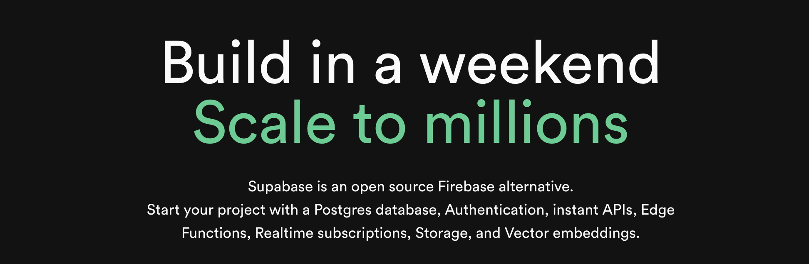

## Clerk + Supabase: How to Build Secure Authentication in Your App 

Combining Supabase with Clerk allows you to take advantage of both Supabase's powerful database capabilities and Clerk's authentication features, prebuilt components, and webhooks. In this guide we are going over the fundamentals of Clerk and Supabase, show you how to use them together to build an application, discuss the pros and cons of using Clerk for your authentication needs, and then talk about an exciting alternative. 

## What is Clerk? 


[**Clerk**](https://clerk.com/) is a **platform that makes user management easy** for developers. Instead of building authentication from scratch, you can use Clerk's ready-made sign-in and **user management UI components**, saving you time and giving your users a smooth experience.

Clerk provides a set of tools that make it easy to add authentication and multi-tenancy to your app. You can customize how the login and signup forms look, control the entire sign-in process to match your needs, and create powerful SaaS applications.

Clerk provides a few integration you can use it with, one of which is Next.js for their fullstack option: 
- For the **frontend** you can pick from pretty popular options like React, Vue, JavaScript, and even for mobile apps using Expo and iOS. 
- For the **backend** it's pretty limited to Express and Fastify. 

### 💰 Pricing 
Clerk is **free for the first 10,000 monthly active users** and **100 monthly active organizations**.

### 🌟 Overview of Clerk 
**Setting up Clerk is done through the Clerk Dashboard.** 

The Clerk Dashboard is where you as the app owner and developer can **manage the app's settings, users, and organizations.** 

For example if you want to :
- Enable other authentication methods like phone number authentication, MFA authentication, social authentication like logging in with Google
- Delete users
- Create organizations

...you can do it all from the **Clerk Dashboard.**

***

### List of Clerk Prebuilt Components 
Clerk has a comprehensive suite of components designed to seamlessly integrate authentication and multi-tenancy into your application. 

#### List of UI components

| **Component**            | **Description**                                                                                      |
|--------------------------|--------------------------------------------------------------------------------------------------------|
| `<SignIn />`              | Renders a UI to allow users to sign in or sign up by default.                                           |
| `<SignUp />`              | Renders a UI for signing up users.                                                                      |
| `<GoogleOneTap />`        | Renders the Google One Tap UI so users can sign in or sign up with their Google accounts.                |
| `<UserButton />`          | Renders the familiar user button made popular by Google. It opens a dropdown menu for settings and sign-out. |
| `<UserProfile />`         | Renders an account management UI that allows users to manage their profile and security settings.         |
| `<CreateOrganization />`  | Renders an organization creation UI that lets users create new organizations in your app.                 |
| `<OrganizationProfile />` | Renders a component that lets users manage their organization membership and security settings.            |
| `<OrganizationSwitcher />`| Renders a component that lets users switch between organizations.                                         |
| `<OrganizationList />`    | Renders a component that displays organization-related memberships, invitations, and suggestions.          |
| `<Waitlist />`            | Renders a component that lets users join a waitlist, typically for apps in early development or pre-launch. |


> The functionality of the components are controlled by the instance settings you specify in the Clerk Dashboard. 

##### How to Use a UI Component 
How to use a UI component depends on the framework you're using.

To use a component in Next.js: 

```javascript
import { SignIn, useUser } form '@clerk/nextjs'

export default function Home() {
    const { user } = useUser()

    if (!user) return <SignIn />

    return <div>Welcome!</div>
}
```
***

#### List of Control Components
Control components manage authentication related behavior. They handle tasks like controlling content visibility based on user authentication status, managing loading states during authentication processes, and redirecting users to appropriate pages. 

Control components render at **`<Loading />`** and **`<Loaded />`** states for assertions on the Clerk object. A common example is the **`<SignedIn>`** component, which lets you conditionally render content only when a user is authenticated. 

| **Component**                | **Description**                                                                                       |
|------------------------------|--------------------------------------------------------------------------------------------------------|
| `<AuthenticateWithRedirectCallback />` | Automatically handles the OAuth callback, completing the authentication process and managing the user's session. |
| `<ClerkLoaded />`             | Guarantees that the Clerk object has loaded and will be available under `window.Clerk`.                 |
| `<ClerkLoading />`            | Renders its children while Clerk is loading, and is helpful for showing a custom loading state.         |
| `<Protect />`                 | Used for authorization. It only renders its children when the current user has the specified permission or role in the organization. |
| `<RedirectToSignIn />`        | Navigates to the sign-in URL configured in your application instance.                                   |
| `<RedirectToSignUp />`        | Navigates to the sign-up URL configured in your application instance.                                   |
| `<RedirectToUserProfile />`   | Navigates to the Account Portal User Profile URL configured in your application instance.                 |
| `<SignedIn />`                | Handles authentication checks as shared functionality. Any child components wrapped by `<SignedIn>` will only be shown if a user with an active session is signed in. |
| `<SignedOut />`               | Offers authentication checks as shared functionality. Any child nodes wrapped by `<SignedOut>` will be rendered only if there's no User signed in to your application. |

#### List of Unstyled Components 

| **Component**            | **Description**                                                                                      |
|--------------------------|--------------------------------------------------------------------------------------------------------|
| `<SignInButton />`        | Renders a button that directs users to the sign-in flow when clicked.                                 |
| `<SignInWithMetamask />`  | Renders a button that allows users to sign in using their MetaMask wallet.                           |
| `<SignUpButton />`        | Renders a button that directs users to the sign-up flow when clicked.                                 |
| `<SignOutButton />`       | Renders a button that signs the user out when clicked.                                                 |

*** 

### Clerk Authentication Security 
These features do not cost extra — they are included for every application by default.

#### Vulnerability Disclosure Policy 
Researchers must avoid privacy violations, user disruptions, and data destruction. Testing should stay within defined scope, and vulnerabilities should be reported via designated channels. Discovered issues must remain confidential for 90 days.

#### XSS Leak Protection
Clerk mitigates XSS risks by using HttpOnly cookies for authenticated requests, which are inaccessible to JavaScript, preventing token theft during an attack. For maximum security, avoid storing session tokens in JavaScript-accessible locations like localStorage or non-HttpOnly cookies.

#### CSRF Protection
Clerk mitigates CSRF risks by setting the SameSite flag on session cookies to Lax, which blocks cookies from being sent during most cross-site requests while still ensuring a smooth user experience.

- **Strict** offers stronger protection but may sign users out when they visit from external links.
- **Lax** is the default in modern browsers and balances security with usability.
- **None** allows all requests but is less secure.

Although Clerk handles CSRF protection, developers should ensure that navigation actions never trigger backend mutations to avoid accidental vulnerabilities.

#### Fixation Protection
Clerk resets the session token each time a user signs in or out of a browser. When the session is reset, the old session token is invalidated and can no longer be used for authentication.

#### Password Protection and Rules
Clerk contracts with [**HaveIBeenPwned**](https://haveibeenpwned.com/) to compare prospective passwords against its corpus of over 10 billion compromised credentials.

#### Brute Force Protection and User Account Locking
Clerk applications will lock user accounts after 100 failed sign-in attempts and require a one hour cool down period before anyone can attempt to sign into that account again. (While 100 attempts may seem like a lot to a human, it is very easy to reach this maximum for a bot!)

You can [**customize the number of times a sign-in can be attempted before the account is locked, and how long lockouts last**](https://clerk.com/docs/security/customize-user-lockout).

## What is Supabase? 



Supabase is an **open-source backend platform** that makes it easy for developers to build powerful applications. It provides a **PostgreSQL database**, **real-time capabilities**, and **auto-generated API**s, so you can focus on your app without worrying about backend complexity.

## Integrating Supabase with Clerk 
The Clerk integration uses the authorization logic available in Supabase through PostgreSQL Row Level Security (RLS) policies.

**Prerequisites:**
- Have a Supabase account
- Have a database project set up 

### How the Integration Works 
RLS works by validating database queries according to the restrictions defined in the RLS policies applied to the table.

Users should only be able to access data that belongs to them. 

**In this guide, you will:**
- Create a function in Supabase to parse the Clerk user ID from the authentication token. 
- Create a `user_id` columns that defaults to the Clerk user's ID when new records are created. 
- Create policies to restrict what data can be read and inserted. 
- Use the Clerk Supabase integration helper in your code to authenticate with Supabase and execute queries. 

#### Step 1: Create your project


- Choose a name for your project. If you want to follow along with this guide name it Book Wishlist -- which is what this app would be. 
- For the password we want something strong so that the database is protected. Supabase has a Generate a password button. Click that button to generate a random password and make sure to save your password somewhere secure. Ideally in a password manager. 
- You can leave the region as is, or pick a region that is closer to where you are (or where your users would be). In this example I am picking West US. 
- Go ahead and click the Create new project button. 

> Your project will have its own dedicated instance and full Postgres database. An API will be set up so you can easily interact with your new database.

When you first create the project you will see a loading Project Status while your project is still being set up. But 

When it is done -- in about a minute or so -- you should see all the checks come out healthy like so: 


Now your project has all been set up with its own Postgres database and its own API all set up and ready for you to use. How exciting!

Take a minute to explore what you see. If this is your first time seeing this dashboard it's normal to feel a bit overwhelmed because it's new. Supabase's dashboard however looks pretty clean. 

Now you can get started by building out your database. For the sake of this guide we will keep it simple. 
You have three options regarding your database: 
- A visual table editor if you prefer a visual approach to building out your database 
- a SQL editor if writing SQL queries is your jam. 
- A link where you can learn about teh Postgres database so you are not lost, or if you are, you can find all the information you need. 


If you scroll further down, Supabase shows you some of the other products they offer -- **Authentication**, **Storage**, **Edge Functions**, **Real Time** -- but we are just using the database functionality here because we are integrating Clerk for the authentication part. 

If you scroll a little further you will see the section **Connecting to your new project**, wehre you will see the information on your Project API -- Project URL with an endpoint for querying and managing your database, an API Key, and a code sample for importing the Supabase client and setting it up in your chosen language. Here we are using javascript: 

```javascript
import { createClient } from '@supabase/supabase-js'

const supabaseUrl = 'https://qrgtntmikigtrzznravc.supabase.co'
const supabaseKey = process.env.SUPABASE_KEY
const supabase = createClient(supabaseUrl, supabaseKey)
```
***

#### Step 2: Create a `books` Table
- In your Supabase dashboard, go to the Table Editor tab.
- Click New Table and configure it as follows:

| Column Name | Data Type | Constraints |
|--------------|------------|--------------|
| `id`          | UUID        | Primary key (default UUID generation) |
| `title`        | Text        | Not null |
| `author`       | Text        | Optional |
| `status`       | Text        | Default: `"Wishlist"` |
| `user_id`      | UUID        | Foreign key to `auth.users` |

- For the `user_id` field:
  - In the **Foreign Key** dropdown, select `auth.users` &rarr; `id`.

#### Step 3: Add Row-Level Security (RLS)
Supabase requires RLS for secure data handling. Here's how to enable it:

- Go to the **Table Editor** tab and open the `books` table.
- Click on the **RLS** tab.
- Click **Enable RLS**.
- Add a new policy:
  - **Name:** `User can access their own books`
  - **Target Roles:** `authenticated`
  - **Expression:** 
  ```sql
  user_id = auth.uid()
  ```