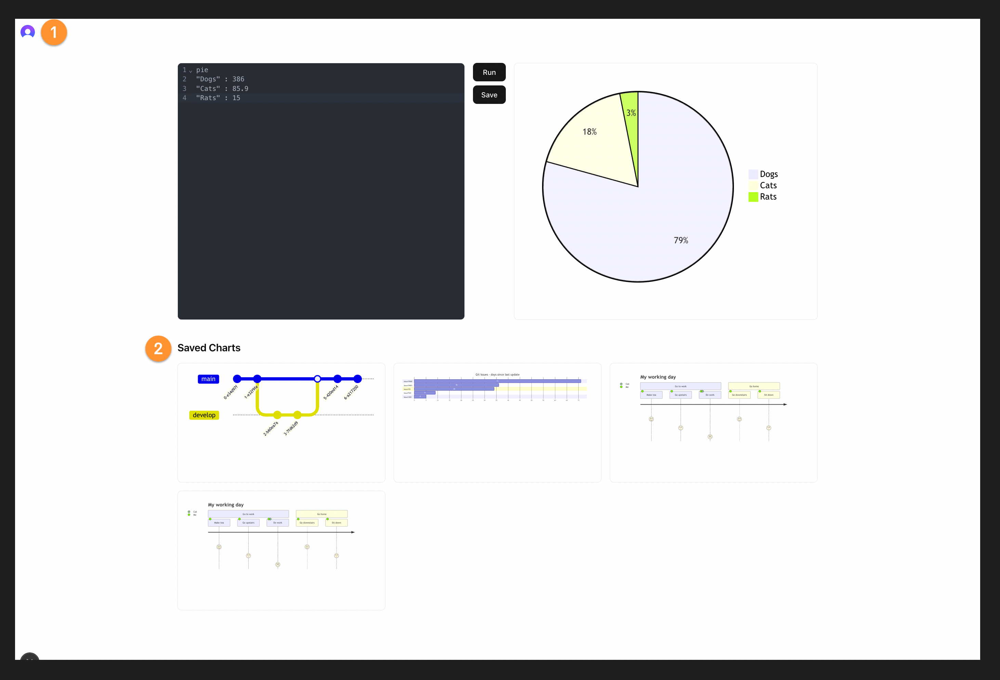

## Clerk + Supabase: How to Build Secure Authentication in Your App 

Combining Supabase with Clerk allows you to take advantage of both Supabase's powerful database capabilities and Clerk's authentication features, prebuilt components, and webhooks.

To take it a step further you can also build on this by leveraging SuperToken's flexibility in managing user sessions and permissions. 

## What is Clerk? 



Clerk is a **platform that makes user management easy** for developers. Instead of building authentication from scratch, you can use Clerk's ready-made sign-in and **user management UI components**, saving you time and giving your users a smooth experience.

## What is Supabase? 


Supabase is an **open-source backend platform** that makes it easy for developers to build powerful applications. It provides a **PostgreSQL database**, **real-time capabilities**, and **auto-generated API**s, so you can focus on your app without worrying about backend complexity.

## Step 1: Setting up a Next.js App With Clerk 

The best way to understand how something works is to see it in a simple action.

You can add Clerk to a number of web app frameworks. You can explore what Clerk offers [on their official documentation](https://clerk.com/docs).

For our demonstration we are going to use Next.js. 

Here is how to set it up. 

1. **Create a new Next.js app**

Run the following command in your terminal to create a new Next.js app: 
```bash
npm create next-app@latest
```

2. **Install `@clerk/nextjs`**

Run the following command to install the Next.js SDK:
```bash
npm install @clerk/nextjs
```

3. **Add `clerkMiddleware()` to your app**

Create a `middleware.ts` file in your `/src` directory and add the following code: 

```ts
import { clerkMiddleware } from '@clerk/nextjs/server'

export default clerkMiddleware()

export const config = {
  matcher: [
    // Skip Next.js internals and all static files, unless found in search params
    '/((?!_next|[^?]*\\.(?:html?|css|js(?!on)|jpe?g|webp|png|gif|svg|ttf|woff2?|ico|csv|docx?|xlsx?|zip|webmanifest)).*)',
    // Always run for API routes
    '/(api|trpc)(.*)',
  ],
}
```

4. Add `<ClerkProvider>` and Clerk components to your app

In your `layout.tsx` file you can import some Clerk prebuilt components and make sure your app is wrapped in a `<ClerkProvider>`:

```tsx
import type { Metadata } from 'next'

// Import Clerk prebuild components
import {
  ClerkProvider,
  SignInButton,
  SignUpButton,
  SignedIn,
  SignedOut,
  UserButton,
} from '@clerk/nextjs'

import { Geist, Geist_Mono } from 'next/font/google'
import './globals.css'

// Font configurations
const geistSans = Geist({
  variable: '--font-geist-sans',
  subsets: ['latin'],
})

const geistMono = Geist_Mono({
  variable: '--font-geist-mono',
  subsets: ['latin'],
})

// Metadata for SEO
export const metadata: Metadata = {
  title: 'Clerk + Supabase Integration',
  description: 'Combining authentication with database management',
}

export default function RootLayout({
  children,
}: Readonly<{
  children: React.ReactNode
}>) {

  return (
// Wrap your app in a <ClerkProvider> component
    <ClerkProvider>
      <html lang="en">
        <body className={`${geistSans.variable} ${geistMono.variable} antialiased`}>
          <header className="flex justify-end items-center p-4 gap-4 h-16">
            <SignedOut>
              <SignInButton />
              <SignUpButton />
            </SignedOut>
            <SignedIn>
              <UserButton />
            </SignedIn>
          </header>
          {children}
        </body>
      </html>
    </ClerkProvider>
  )
}
```

You can now open your app by running `npm run dev` in your terminal. You can view your app's homepage at http://localhost:3000

## Step 2: Integrate Supabase with Clerk 

Supabase will handle the database functionality while Clerk manages authentication.

### Key Changes
- **Supabase import and initialization**
- **SupabaseProvider** added to wrap the app for database context

```tsx
import type { Metadata } from 'next'

import {
  ClerkProvider,
  SignInButton,
  SignUpButton,
  SignedIn,
  SignedOut,
  UserButton,
} from '@clerk/nextjs'

import { Geist, Geist_Mono } from 'next/font/google'
import { createClient } from '@supabase/supabase-js'
import './globals.css'

// Supabase initialization
const supabase = createClient(
  process.env.NEXT_PUBLIC_SUPABASE_URL!,
  process.env.NEXT_PUBLIC_SUPABASE_ANON_KEY!
)

// Font configurations
const geistSans = Geist({
  variable: '--font-geist-sans',
  subsets: ['latin'],
})

const geistMono = Geist_Mono({
  variable: '--font-geist-mono',
  subsets: ['latin'],
})


export const metadata: Metadata = {
  title: 'Clerk + Supabase Integration',
  description: 'Combining authentication with database management',
}

export default function RootLayout({
  children,
}: Readonly<{
  children: React.ReactNode
}>) {
  return (
    <ClerkProvider>
      {/* Supabase context for database access */}
      <SupabaseProvider client={supabase}>
        <html lang="en">
          <body className={`${geistSans.variable} ${geistMono.variable} antialiased`}>
            <header className="flex justify-end items-center p-4 gap-4 h-16">
              <SignedOut>
                <SignInButton />
                <SignUpButton />
              </SignedOut>
              <SignedIn>
                <UserButton />
              </SignedIn>
            </header>
            {children}
          </body>
        </html>
      </SupabaseProvider>
    </ClerkProvider>
  )
}
```

