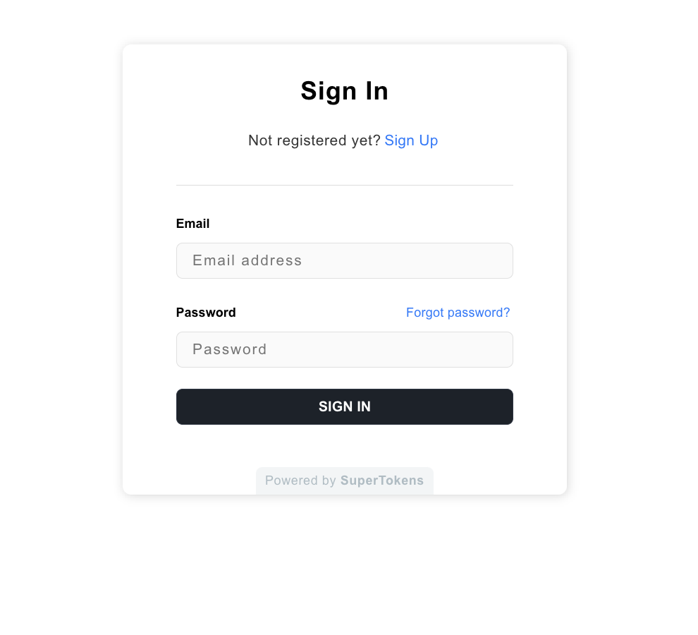

## Clerk + Supabase: How to Build Secure Authentication in Your App 

Combining Supabase with Clerk allows you to take advantage of both Supabase's powerful database capabilities and Clerk's authentication features, prebuilt components, and webhooks. In this guide we are going over the fundamentals of Clerk and Supabase, show you how to use them together to build an application, discuss the pros and cons of using Clerk for your authentication needs, and then talk about an exciting alternative. 

## What is Clerk? 


[**Clerk**](https://clerk.com/) is a **platform that makes user management easy** for developers. Instead of building authentication from scratch, you can use Clerk's ready-made sign-in and **user management UI components**, saving you time and giving your users a smooth experience.

Clerk provides a set of tools that make it easy to add authentication and multi-tenancy to your app. You can customize how the login and signup forms look, control the entire sign-in process to match your needs, and create powerful SaaS applications.

Clerk provides a few integration you can use it with, one of which is Next.js for their fullstack option: 
- For the **frontend** you can pick from pretty popular options like React, Vue, JavaScript, and even for mobile apps using Expo and iOS. 
- For the **backend** it's pretty limited to Express and Fastify. 

### 💰 Pricing 
Clerk is **free for the first 10,000 monthly active users** and **100 monthly active organizations**.

### 🌟 Overview of Clerk 
**Setting up Clerk is done through the Clerk Dashboard.** 

The Clerk Dashboard is where you as the app owner and developer can **manage the app's settings, users, and organizations.** 

For example if you want to :
- Enable other authentication methods like phone number authentication, MFA authentication, social authentication like logging in with Google
- Delete users
- Create organizations

...you can do it all from the **Clerk Dashboard.**

***

#### List of Clerk Prebuilt Components 
Clerk has a comprehensive suite of components designed to seamlessly integrate authentication and multi-tenancy into your application. 

#### Clerk Authentication Security 
These features do not cost extra — they are included for every application by default.

##### Vulnerability Disclosure Policy 
Researchers must avoid privacy violations, user disruptions, and data destruction. Testing should stay within defined scope, and vulnerabilities should be reported via designated channels. Discovered issues must remain confidential for 90 days.

##### XSS Leak Protection
Clerk mitigates XSS risks by using HttpOnly cookies for authenticated requests, which are inaccessible to JavaScript, preventing token theft during an attack. For maximum security, avoid storing session tokens in JavaScript-accessible locations like localStorage or non-HttpOnly cookies.

##### CSRF Protection
Clerk mitigates CSRF risks by setting the SameSite flag on session cookies to Lax, which blocks cookies from being sent during most cross-site requests while still ensuring a smooth user experience.

- **Strict** offers stronger protection but may sign users out when they visit from external links.
- **Lax** is the default in modern browsers and balances security with usability.
- **None** allows all requests but is less secure.

Although Clerk handles CSRF protection, developers should ensure that navigation actions never trigger backend mutations to avoid accidental vulnerabilities.

##### Fixation Protection
Clerk resets the session token each time a user signs in or out of a browser. When the session is reset, the old session token is invalidated and can no longer be used for authentication.

##### Password Protection and Rules
Clerk contracts with [**HaveIBeenPwned**](https://haveibeenpwned.com/) to compare prospective passwords against its corpus of over 10 billion compromised credentials.

##### Brute Force Protection and User Account Locking
Clerk applications will lock user accounts after 100 failed sign-in attempts and require a one hour cool down period before anyone can attempt to sign into that account again. (While 100 attempts may seem like a lot to a human, it is very easy to reach this maximum for a bot!)

You can [**customize the number of times a sign-in can be attempted before the account is locked, and how long lockouts last**](https://clerk.com/docs/security/customize-user-lockout).

## What is Supabase? 



Supabase is an **open-source backend platform** that makes it easy for developers to build powerful applications. It provides a **PostgreSQL database**, **real-time capabilities**, and **auto-generated API**s, so you can focus on your app without worrying about backend complexity.

## Integrating Supabase with Clerk 
The Clerk integration uses the authorization logic available in Supabase through PostgreSQL Row Level Security (RLS) policies.

**Prerequisites:**
- Have a Supabase account
- Have a database project set up 

### How the Integration Works 
RLS works by validating database queries according to the restrictions defined in the RLS policies applied to the table.

Users should only be able to access data that belongs to them. 

**In this guide, you will:**
- Create a function in Supabase to parse the Clerk user ID from the authentication token. 
- Create a `user_id` columns that defaults to the Clerk user's ID when new records are created. 
- Create policies to restrict what data can be read and inserted. 
- Use the Clerk Supabase integration helper in your code to authenticate with Supabase and execute queries. 

#### Step 1: Create your project


- Choose a name for your project. If you want to follow along with this guide name it Book Wishlist -- which is what this app would be. 
- For the password we want something strong so that the database is protected. Supabase has a Generate a password button. Click that button to generate a random password and make sure to save your password somewhere secure. Ideally in a password manager. 
- You can leave the region as is, or pick a region that is closer to where you are (or where your users would be). In this example I am picking West US. 
- Go ahead and click the Create new project button. 

> Your project will have its own dedicated instance and full Postgres database. An API will be set up so you can easily interact with your new database.

When you first create the project you will see a loading Project Status while your project is still being set up. But 

When it is done -- in about a minute or so -- you should see all the checks come out healthy like so: 


Now your project has all been set up with its own Postgres database and its own API all set up and ready for you to use. How exciting!

Take a minute to explore what you see. If this is your first time seeing this dashboard it's normal to feel a bit overwhelmed because it's new. Supabase's dashboard however looks pretty clean. 

Now you can get started by building out your database. For the sake of this guide we will keep it simple. 
You have three options regarding your database: 
- A visual table editor if you prefer a visual approach to building out your database 
- a SQL editor if writing SQL queries is your jam. 
- A link where you can learn about teh Postgres database so you are not lost, or if you are, you can find all the information you need. 


If you scroll further down, Supabase shows you some of the other products they offer -- **Authentication**, **Storage**, **Edge Functions**, **Real Time** -- but we are just using the database functionality here because we are integrating Clerk for the authentication part. 

If you scroll a little further you will see the section **Connecting to your new project**, wehre you will see the information on your Project API -- Project URL with an endpoint for querying and managing your database, an API Key, and a code sample for importing the Supabase client and setting it up in your chosen language. Here we are using javascript: 

```javascript
import { createClient } from '@supabase/supabase-js'

const supabaseUrl = 'https://qrgtntmikigtrzznravc.supabase.co'
const supabaseKey = process.env.SUPABASE_KEY
const supabase = createClient(supabaseUrl, supabaseKey)
```
***

#### Step 2: Create a `books` Table
- In your Supabase dashboard, go to the Table Editor tab.
- Click New Table and configure it as follows:

| Column Name | Data Type | Constraints |
|--------------|------------|--------------|
| `id`          | UUID        | Primary key (default UUID generation) |
| `title`        | Text        | Not null |
| `author`       | Text        | Optional |
| `status`       | Text        | Default: `"Wishlist"` |
| `user_id`      | UUID        | Foreign key to `auth.users` |

- For the `user_id` field:
  - In the **Foreign Key** dropdown, select `auth.users` &rarr; `id`.

#### Step 3: Add Row-Level Security (RLS)
Supabase requires RLS for secure data handling. Here's how to enable it:

- Go to the **Table Editor** tab and open the `books` table.
- Click on the **RLS** tab.
- Click **Enable RLS**.
- Add a new policy:
  - **Name:** `User can access their own books`
  - **Target Roles:** `authenticated`
  - **Expression:** 
  ```sql
  user_id = auth.uid()
  ```
#### Step 4: Seed the Database
Let's add some initial data to test with:

```sql
INSERT INTO books (id, title, author, status, user_id)
VALUES
  (gen_random_uuid(), 'The Hobbit', 'J.R.R. Tolkien', 'Wishlist', 'your-clerk-user-id-here'),
  (gen_random_uuid(), 'Dune', 'Frank Herbert', 'Reading', 'your-clerk-user-id-here');
```
*(Replace 'your-clerk-user-id-here' with your Clerk user ID)*

#### Step 5. Get Supabase Credentials
- Go to your **Project Settings** &rarr; **API** tab.
- Copy the **Project URL** and **anon (public) API key** for use in your Next.js app.

***

### Connecting Clerk and Supabase 
You'll likely want to sync authenticated users in Clerk with records in Supabase:
- Use Clerk's webhooks to listen for user creation events and insert the user into Supabase.
- Alternatively, you can create a middleware in Next.js that ensures authenticated users exist in your Supabase tables.

#### User Authentication Flow
- Set up Clerk's **`SignIn`** and **`SignUp`** components.
- Use Clerk's **`useUser()`** hook to retrieve user data and associate books with the correct user in Supabase.

#### CRUD Operations
- **Create:** Add new books to the wishlist for the signed in user.
- **Read:** Display the list of books for the signed in user.
- **Update:** Allow signed in users to mark books as "Reading" or "Finished."
- **Delete:** Enable signed in users to remove books from their list.

*** 

### Setting Up the `users` Table in Supabase
To set up your users table and automatically insert user data when a new user signs up via Clerk, follow these steps:

#### 🛠️ Step 1: Create a `users` Table in Supabase
In your Supabase dashboard:
1. Go to the **Table Editor** tab.
2. Click **New Table** and configure it as follows: 

| Column Name | Data Type | Constraints |
|--------------|------------|--------------|
| `id`          | UUID        | Primary key (default UUID generation) |
| `email`       | Text         | Unique, Not null |
| `created_at`  | Timestamp    | Default: `now()` |

- For the `id` field:
  - Set it as the **Primary Key**.
  - In the **Default Value** dropdown, choose `auth.uid()` to automatically match Clerk's user ID.

#### 🔒 Step 2: Enable Row-Level Security (RLS)
1. In the `users` table, go to the **RLS** tab.
2. Click **Enable RLS**.
3. Add a new policy:
   - **Name:** `User can access their own profile`
   - **Target Roles:** `authenticated`
   - **Expression:**  
    ```sql
    id = auth.uid()
    ```
#### 🔄 Step 3: Sync Clerk Users to Supabase
To automatically insert new users in Supabase when they sign up via Clerk, you can use a [**Clerk webhook**](https://clerk.com/docs/webhooks/overview).

##### Create a Clerk Webhook
1. Go to your Clerk dashboard.
2. Navigate to **Webhooks** &rarr; **Create Webhook**.
3. Set the **URL** to your Next.js API endpoint that will handle the webhook (e.g., **`/api/webhooks/clerk`**).
4. Select the **"User Created"** event.
5. Save the webhook.

##### Create a Webhook Endpoint in Next.js
In your Next.js project, create a new API route: **`/pages/api/webhooks/clerk.js`**

```javascript
import { supabase } from '@/lib/supabaseClient';

export default async function handler(req, res) {
  if (req.method !== 'POST') {
    return res.status(405).end(); // Method not allowed
  }

  const { id, email_addresses } = req.body.data;

  const { error } = await supabase.from('users').insert([
    {
      id,
      email: email_addresses[0]?.email_address || '',
    }
  ]);

  if (error) {
    console.error('Error inserting user:', error);
    return res.status(500).json({ error: 'Failed to insert user' });
  }

  res.status(200).json({ success: true });
}
```

##### Add Route Protection
In your **`/pages/api/webhooks/clerk.js`** file, validate incoming webhook requests using Clerk’s signing secret:
1. In your Clerk dashboard, copy the **Webhook Signing Secret**.
2. Add it to the `.env.local` file: 
```ini
CLERK_WEBHOOK_SECRET=your-webhook-signing-secret
```
3. Update your webhook handler to validate requests:
```javascript
import { Webhook } from 'clerk-sdk-node';
import { supabase } from '@/lib/supabaseClient';

const webhook = new Webhook(process.env.CLERK_WEBHOOK_SECRET);

export default async function handler(req, res) {
  const payload = await webhook.verifyPayload(req);

  if (!payload) {
    return res.status(401).json({ error: 'Invalid webhook signature' });
  }

  const { id, email_addresses } = payload.data;

  const { error } = await supabase.from('users').insert([
    {
      id,
      email: email_addresses[0]?.email_address || '',
    }
  ]);

  if (error) {
    console.error('Error inserting user:', error);
    return res.status(500).json({ error: 'Failed to insert user' });
  }

  res.status(200).json({ success: true });
}
```

***

#### ✅ Step 4: Test the Setup
1. Sign up as a new user through Clerk.
2. Check your Supabase `users` table &mdash; the new user's data should appear.

*** 

### NextJS and Clerk setup 
- Install @clerk/nextjs
- Add clerkMiddleware()
- Add `<ClerkProvider>` and Clerk components
- Create your first user

#### Create a new Next.js application
Run the following command to create a new Next.js application:
```bash
npm create next-app@latest
```

#### Install `@clerk/nextjs`
Run the following command to install the Next.js SDK:
```bash
npm install @clerk/nextjs
```

#### Add `clerkMiddleware()` to your app
`clerkMiddleware()` grants you access to user authentication state throughout your app.
1. Create a middleware.ts file.
    - If you're using the /src directory, create middleware.ts in the /src directory.
    - If you're not using the /src directory, create middleware.ts in the root directory.
2. In your middleware.ts file, export the clerkMiddleware() helper:
```javascript
import { clerkMiddleware } from '@clerk/nextjs/server'

export default clerkMiddleware()

export const config = {
  matcher: [
    // Skip Next.js internals and all static files, unless found in search params
    '/((?!_next|[^?]*\\.(?:html?|css|js(?!on)|jpe?g|webp|png|gif|svg|ttf|woff2?|ico|csv|docx?|xlsx?|zip|webmanifest)).*)',
    // Always run for API routes
    '/(api|trpc)(.*)',
  ],
}
```
3. By default, `clerkMiddleware()` will not protect any routes. All routes are public and you must opt-in to protection for routes. See the [`clerkMiddleware()`](https://clerk.com/docs/references/nextjs/clerk-middleware) reference to learn how to require authentication for specific routes.

#### Add `<ClerkProvider>` and Clerk components to your app
1. Add the `<ClerkProvider>` component to your app's layout. This component provides Clerk's authentication context to your app.
2. Copy and paste the following file into your `layout.tsx` file. This creates a header with Clerk's prebuilt components to allow users to sign in and out.

```javascript
import type { Metadata } from 'next'
import {
  ClerkProvider,
  SignInButton,
  SignUpButton,
  SignedIn,
  SignedOut,
  UserButton,
} from '@clerk/nextjs'
import { Geist, Geist_Mono } from 'next/font/google'
import './globals.css'

const geistSans = Geist({
  variable: '--font-geist-sans',
  subsets: ['latin'],
})

const geistMono = Geist_Mono({
  variable: '--font-geist-mono',
  subsets: ['latin'],
})

export const metadata: Metadata = {
  title: 'Clerk Next.js Quickstart',
  description: 'Generated by create next app',
}

export default function RootLayout({
  children,
}: Readonly<{
  children: React.ReactNode
}>) {
  return (
    <ClerkProvider>
      <html lang="en">
        <body className={`${geistSans.variable} ${geistMono.variable} antialiased`}>
          <header className="flex justify-end items-center p-4 gap-4 h-16">
            <SignedOut>
              <SignInButton />
              <SignUpButton />
            </SignedOut>
            <SignedIn>
              <UserButton />
            </SignedIn>
          </header>
          {children}
        </body>
      </html>
    </ClerkProvider>
  )
}
```

#### Create your first user
1. Run your project with the following command:
```bash
npm run dev
```
2. Visit your app's homepage at http://localhost:3000.
3. Click "Sign up" in the header and authenticate to create your first user.

### SuperTokens and Supabase 

SuperTokens is an open source authentication solution which provides many stratergies for authenticating and managing users. You can use the managed service for easy setup or you can self host the solution to have complete control over your data.

With SuperTokens, Supabase can be used to store and authorize access to user data. Supabase makes it simple to setup Row Level Security(RLS) policies which ensure users can only read and write data that belongs to them.

SuperTokens is an open source authentication solution which provides many stratergies for authenticating and managing users. You can use the managed service for easy setup or you can self host the solution to have complete control over your data.

[This can be used as a framework for the introduction of this article]
In this guide we will build a simple web application using SuperTokens, Supabase, and Next.js. You will be able to sign up using SuperTokens and your email and user ID will be stored in Supabase. Once authenticated the frontend will be able to query Supabase and retrieve the user's email. Our example app will be using the Email-Password and Social Login recipe for authentication and session management.

We will use Supabase to store and authorize access to user data. Supabase makes it simple to setup Row Level Security(RLS) policies which ensure users can only read and write data that belongs to them.

#### Setup your Next.js App with SuperTokens.
Integrating SuperTokens with a Next.js app involves:
1. Calling the frontend and backend init functions
2. Adding a website page to display the auth related widgets (on /auth by default)
3. Creating a serverless function to expose the auth related APIs which will be consumed by the frontend widgets (on /api/auth/ by default)
4. Protecting website routes: Displaying them only when a user is logged in, else redirecting them to the login page
5. Performing session verification:
    - In your APIs
    - In `getServerSideProps`

Download and run an example Next.js app quickly using the following command:

```bash
npx create-supertokens-app@latest --frontend=next --recipe=emailpassword
```


