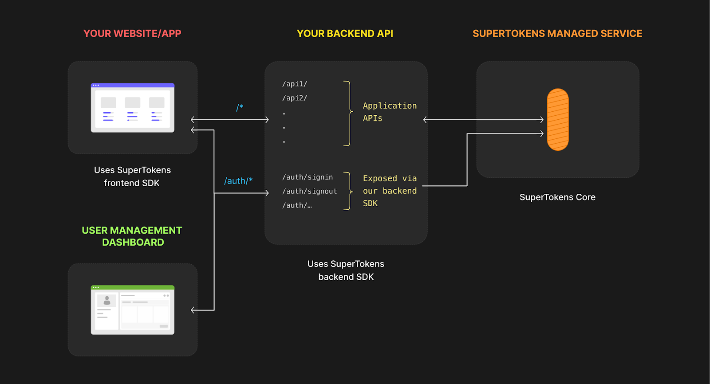
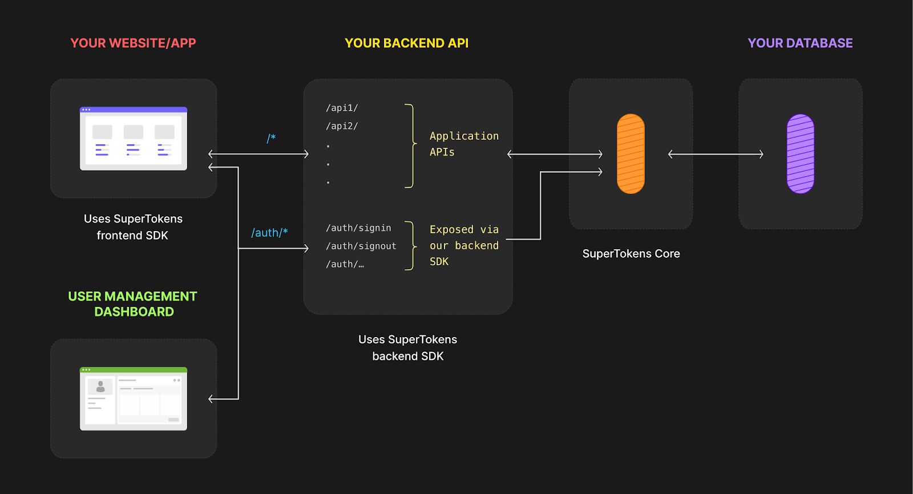

## Introduction

In this blog post, we'll explore how to secure a NestJS API using SuperTokens, an open-source user authentication solution. The purpose of this article is to give a comprehensive introduction to SuperTokens, explain how it is structured, and touch briefly on the fundamentals of authentication. Additionally, I will walk through the NestJS constructs used, making this post valuable not only to backend developers but also to those who are interested in learning more about authentication and API security.

Implementing a secure authentication layer in an application is known to be one of the most challenging and time-consuming tasks, both on the backend and frontend. It’s not just about complexity; authentication requires constant testing, development iterations, and attention to security, which can take weeks or even months of a developer's valuable time. This is where SuperTokens comes in, providing a simple yet flexible solution that streamlines the process of adding secure authentication to your application.

In this post, we will be using NestJS, a Node.js framework that excels at making backend development efficient and scalable. Inspired by mature frameworks like Spring and ASP.NET, NestJS brings the best practices from these proven systems into the JavaScript/TypeScript world.

Let’s dive into the key concepts and technologies before moving into the implementation.


## Understanding Authentication

Authentication is the cornerstone of securing modern applications. It ensures that only legitimate users or systems can access protected resources. Whether you're building a web application, mobile app, or API, implementing a robust authentication mechanism is crucial for ensuring data integrity and security.

There are several widely used authentication methods, each with its own strengths, weaknesses, and appropriate use cases. Let’s take a closer look at the most common types of authentication.


1. **Password-based Authentication**: Password-based authentication is one of the oldest and most widely used authentication mechanisms. Users provide a username and password to prove their identity.
    * Pros:
        * **Familiar and simple**: Users are accustomed to using passwords;
        * Easy to implement with minimal setup.
    * Cons:
        * **Security risks**: Passwords are vulnerable to attacks such as brute force, phishing, and credential stuffing.
        * **Poor user experience**: Users often forget passwords or create weak ones, leading to the need for password reset flows, which can be frustrating.
        * **Password management burden**: Users must manage and remember multiple passwords, often leading to reuse across services.
2. **Token-based Authentication (JWT)**: Token-based authentication relies on issuing a token, such as a JSON Web Token (JWT), after a user successfully logs in. The token is then sent with each subsequent request to authenticate the user.
    * Pros:
        * **Stateless**: Token-based authentication doesn’t require server-side session storage, making it highly scalable in distributed systems.
        * **Versatile**: Tokens can carry additional information (claims) about the user or session, which can be used by the backend for authorization decisions.
    * Cons:
        * **Token expiration:**: Access tokens have limited lifetimes and require refresh tokens to maintain sessions, adding complexity.
        * **Security concerns**: Storing tokens insecurely on the client side (e.g., in localStorage) can make them susceptible to theft or misuse.
        * **Token revocation**: Unlike session-based authentication, invalidating tokens across distributed services [can be challenging](https://supertokens.com/blog/revoking-access-with-a-jwt-blacklist), requiring additional infrastructure.
3. **OAuth and Social Authentication**: OAuth is a widely used standard for authorizing third-party applications to access user data without exposing the user’s credentials. Social authentication leverages OAuth to let users sign in using their existing accounts on services like Google, Facebook, or GitHub.
    * Pros:
        * **Easy for users**: Users can sign in with a single click without needing to remember another password;
        * **Quick onboarding**: Reduces friction during sign-up and login, as users are already familiar with their social accounts;
    * Cons:
        * **Reliance on third-party services**: If the third-party provider is down or blocked in certain regions, users won’t be able to authenticate;
        * **Data sharing concerns**: Some users may not want to link their social media accounts with your service or share personal data from those accounts;
        * **Privacy regulation**: Social logins often come with considerations around privacy and data sharing, which may introduce compliance complexities;
4. **Passwordless Authentication**: Passwordless authentication allows users to log in without a password, typically using a magic link sent via email or a One-Time Password (OTP) sent via SMS or email. The user clicks the link or enters the code to authenticate.
    * Pros:
        * **No passwords to manage**: It eliminates the risks and frustration associated with password management;
        * **Enhanced security**: Without passwords, there’s no risk of password theft, reuse, or brute force attacks;
    * Cons:
        * **Email/SMS delivery issues**: If email services or phone networks are unreliable, users may not receive the magic link or OTP. For example, in rural areas or places with poor phone signal, SMS OTPs can be delayed or fail to arrive, causing frustration;
        * **Dependence on third-party services**: Passwordless authentication depends on reliable email or SMS services, which might introduce challenges in specific regions;
        * **Less familiar**: Some users may not be accustomed to passwordless login methods and may prefer the simplicity of password-based login;


## Choosing the Right Authentication Method

The choice of authentication method depends on several factors:


1. **User Experience**: Simple methods like social login or passwordless authentication reduce friction but might not be suitable for high-security applications.
2. **Security**: For sensitive applications, methods like MFA or hardware tokens are recommended. Password-based authentication is typically the least secure option due to its vulnerability to attacks.
3. **Scalability**: Token-based authentication is scalable, especially in microservices and stateless applications, whereas session-based authentication may introduce scalability challenges;
4. **Privacy and Compliance**: When using third-party services (e.g., social login or OAuth), be mindful of data-sharing concerns and compliance with regulations like *GDPR*.

By carefully weighing these factors, you can choose an authentication method that provides the right balance of security, convenience, and scalability for your application.


## What is SuperTokens?

SuperTokens is an open-source, developer-friendly authentication solution designed to simplify the implementation of secure, scalable user authentication systems. It provides a plug-and-play model for common authentication flows like sign-up, sign-in, passwordless login, social logins, and session management—while also being customizable for more advanced use cases.

SuperTokens is built to handle the complexities of user authentication in modern applications, such as token management, session handling, and security best practices, so that developers can focus on building core functionality without worrying about intricate security details.


## SuperTokens' Architecture & SDKs

Let’s quickly explain how SuperTokens works behind the scenes and how its architecture is structured.

SuperTokens can be run both as a:


* **Self-hosted instance**
* **Managed service**

These flows are quite similar in terms of functionality, with some key differences in where the components are hosted.

### Managed Service Architecture Diagram



### Self-hosted Architecture Diagram





The primary difference between these two flows is that in the self-hosted flow, you use your own database, while in the managed service, SuperTokens automatically manages the database for you. Since the concepts are almost identical, we’ll discuss the general architecture below without focusing on whether the flow is self-hosted or managed

**Architecture Breakdown**


1. **Your Website/App**: This is the frontend of your application. While it doesn't need to be autogenerated or managed by the SuperTokens SDK, it should adhere to the Frontend Driver Interface (FDI), which I’ll explain shortly. SuperTokens offers frontend SDKs in various frameworks (React, Vue, Vanilla JS, React Native, Flutter, etc.) to handle common authentication-related challenges, such as securely storing and sending access tokens, handling refresh tokens, and more. This significantly enhances developer experience by abstracting away the complexities of token management.

    One important note: The frontend should never communicate directly with SuperTokens Core. Instead, the communication should happen via your backend API, which acts as the intermediary.

2. **Your Backend API**: This is the backend part of your application. Similar to the frontend, this part doesn’t need to be autogenerated or fully managed by the SuperTokens SDK, as long as it adheres to the Core Driver Interface (CDI), which I’ll explain below. SuperTokens provides backend SDKs for various languages and frameworks, and these SDKs handle important authentication logic, such as session management, token expiration, and more. By using the backend SDK, additional /auth routes are provided out-of-the-box, reducing the manual effort required for implementing secure authentication.

    The backend is the only part of your system that communicates directly with SuperTokens Core. It serves as the bridge between the frontend and the core authentication service.

3. **SuperTokens Core**: This is the central component of the SuperTokens architecture. It’s an HTTP service that encapsulates all the core authentication logic. SuperTokens Core handles tasks like creating and verifying tokens, session management, user state management, and more. It also interfaces with the database (either your self-hosted database or the managed service) to store and retrieve authentication-related data.

    SuperTokens Core is designed to be lightweight and highly performant, allowing it to scale easily across different environments. Your backend SDK interacts with the core to perform operations that require database access.

4. **Your database** (Self-hosted only): In the self-hosted flow, this is the database where all authentication-related data is stored. It includes user sessions, tokens, and other necessary information. You are responsible for managing this database. SuperTokens supports various database engines such as PostgreSQL and MySQL for self-hosted deployments.

    In the managed service flow, SuperTokens manages this database for you, which simplifies operations and removes the need for database management on your end.


*Even though it’s technically possible to skip using the frontend and backend SDKs and work directly with SuperTokens Core, this approach is not recommended. Doing so significantly increases the complexity of the project and undermines the main purpose of SuperTokens, which is to simplify secure authentication.*


---


## Key Note on SuperTokens APIs

When working with SuperTokens APIs, it’s crucial to follow the correct interface patterns:


* **Frontend-to-Backend Communication**: The communication between your frontend and backend should use the Frontend Driver Interface (FDI). This interface defines the API calls your frontend can make to the backend to handle authentication-related actions (like login, session validation, etc.). The FDI ensures that the frontend is abstracted from the backend’s internal logic. You can view the full [FDI API specification here](https://app.swaggerhub.com/apis/supertokens/FDI). The APIs are categorized by recipe, depending on the specific authentication method you are implementing.
* **Backend-to-Core Communication**: The communication between your backend and SuperTokens Core is defined by the Core Driver Interface (CDI). This API governs how your backend interacts with SuperTokens Core to perform operations like creating and verifying tokens, managing sessions, and querying the database for authentication data. You can view the full [CDI API specification here]((https://app.swaggerhub.com/apis/supertokens/CDI)).


### Frontend Driver Interface (FDI) and Core Driver Interface (CDI)

* **Frontend Driver Interface (FDI)**: This interface is designed to allow the frontend to communicate with the backend for all authentication-related operations (such as login, signup, session management, etc.). It is the layer that abstracts how authentication is handled in the backend. This way, the frontend does not need to worry about the complexities of session management or token handling.
* **Core Driver Interface (CDI)**: This is the interface that defines how the backend SDK communicates with SuperTokens Core. The backend SDK uses this interface to send authentication requests, manage tokens, handle user sessions, and retrieve or store data in the database. The CDI ensures that the backend and core are decoupled, which allows you to replace or extend components without affecting the core functionality.


---

By adhering to these interfaces, you can ensure that your application architecture remains modular, scalable, and easy to maintain.


### What is NestJS?

NestJS is a progressive Node.js framework built for developing efficient, scalable, and maintainable server-side applications. It embraces TypeScript by default but also supports JavaScript, offering developers the best of both worlds. Inspired by enterprise frameworks like Spring (Java) and ASP.NET (C#), NestJS incorporates design principles like modular architecture, dependency injection, and middleware support.

Key NestJS features:


* **Modularity**: Organizes the application into feature modules, making it easier to maintain.
* **Dependency Injection (DI)**: Built-in DI simplifies managing class dependencies and makes testing more efficient.
* **Built-in Middleware and Guards**: Supports adding custom middleware (like authentication checks) and Guards to protect routes.
* **Extensibility**: Works well with many other libraries (ORMs, WebSockets, etc.), and integrates with Express or Fastify under the hood.

Now, let's see how we can combine these two powerful tools to build a secure and scalable API.


## Integrating SuperTokens with NestJS

Before I continue, I must mention the fantastic [integration guide](https://supertokens.com/docs/passwordless/nestjs/guide) written by the SuperTokens team. It’s a great read and hard to beat in terms of clarity and completeness. My goal here is to provide a bit more in-depth explanation and additional context.

Depending on the state of your current project—whether you already have everything except the authentication layer or you're just getting started—there are two approaches you can take. You can either:


* Follow this guide and add the necessary parts to your existing project, or
* Generate a scaffolded version of both the frontend and backend using the SuperTokens setup command.

Which path you take depends on your knowledge of NestJS and SuperTokens. If you just want to quickly get started, run the following command:

```bash
$ npx create-supertokens-app@latest
```

By running this command, you will be prompted to select your frontend and backend frameworks, as well as the authentication methods you want to support. The setup process is intuitive, and once completed, you’ll have two generated projects.


Since this guide is focused on integrating SuperTokens with the backend (specifically NestJS), I won’t be covering the frontend part in much detail.

You can easily continue building on top of this autogenerated project without worrying about the authentication layer, as everything is already set up for you.


---

**Note:**

In the autogenerated project, the managed service flow is selected by default. If you need a self-hosted solution, you’ll need to modify the connection URI in the `config.ts` file:

```ts
export const connectionUri = 'https://try.supertokens.com';
```

Change it to this for local development using Docker (this will be explained in the next section) or the connection URI specific to your environment:

export const connectionUri = 'http://localhost:3567';

One great thing about this setup is that all configuration tweaks are centralized in the `config.ts` file. You can adjust it to fit your needs and project specifications.


---

Let’s now go step by step. Before proceeding, you'll need to decide whether you want to use the managed service or self-hosted flow. In this guide, I’ll focus on the self-hosted flow because it involves more moving parts, which allows me to explain the entire setup in greater detail.


### Docker Setup

At the start of any project, I prefer to identify the different services and databases I need and organize them in a `docker-compose.yml` file. For this guide, I’m following another great [SuperTokens guide](https://supertokens.com/docs/passwordless/pre-built-ui/setup/core/with-docker), which outlines the setup.

I chose to use PostgreSQL as the database for this example, but the choice of database doesn’t significantly impact the setup (except for the database tool used to inspect it). Here's my `docker-compose.yml` file, which is very similar to the one in the guide:

```docker
services:

  db:

    image: "postgres:latest"

    environment:

      POSTGRES_USER: user

      POSTGRES_PASSWORD: password

      POSTGRES_DB: supertokens

    ports:

      - 5432:5432

    networks:

      - app_network

    restart: unless-stopped

    healthcheck:

      test: ["CMD", "pg_isready", "-U", "user", "-d", "supertokens"]

      interval: 5s

      timeout: 5s

      retries: 5

  supertokens:

    image: registry.supertokens.io/supertokens/supertokens-postgresql:9.2.3

    depends_on:

      db:

        condition: service_healthy

    ports:

      - 3567:3567

    environment:

      POSTGRESQL_CONNECTION_URI: "postgresql://user:password@db:5432/supertokens"

    networks:

      - app_network

    restart: unless-stopped

    healthcheck:

      test: >

        bash -c 'exec 3&lt;>/dev/tcp/127.0.0.1/3567 && echo -e "GET /hello HTTP/1.1\r\nhost: 127.0.0.1:3567\r\nConnection: close\r\n\r\n" >&3 && cat &lt;&3 | grep "Hello"'

      interval: 10s

      timeout: 5s

      retries: 5

networks:

  app_network:

    driver: bridge

```

**Important note from docs**: If you are running the backend process that integrates with our backend SDK as part of the docker compose file as well, make sure to use [http://supertokens:3567](http://supertokens:3567) as the connection uri instead of [http://localhost:3567](http://localhost:3567)

This docker-compose.yml file defines two services: *db* (PostgreSQL) and *supertokens* (SuperTokens core). They are connected to a shared network and have health checks to ensure both services are functioning properly.

To start the services, run this command:

```bash
$ docker compose up -d --force-recreate
```

After the services start, test if SuperTokens is working correctly by sending a request to the `/hello` endpoint:

```bash
$ curl http://localhost:3567/hello
```

If everything is working, you should see a response with "Hello".

Next, list the running containers using:

```bash
$ docker ps
```

To inspect the database, connect to the PostgreSQL container (**db**) using its name or container ID:

```bash
$ docker exec -it &lt;container_name_or_id> bash
```

Once inside the container, connect to the PostgreSQL database:

```bash
$ psql -U user supertokens
```

This command is going to run `psql` interface which serves as an interface to connect to your PostgreSQL database.

To list all databases in the container:

```bash
$ \list
```

To connect to the `supertokens` database:

```bash
$ \c supertokens
```

To list all tables within the `supertokens` database:

```bash
$ \dt
```

One thing worth mentioning is the User Management Dashboard provided by SuperTokens. This dashboard allows you to easily manage users, sessions, and user-related operations such as viewing user details, revoking sessions, and even deleting users from the system. It's a handy tool for administrators to perform user management tasks without needing to build custom interfaces.

Since that goes beyond the scope of this article, I recommend checking out another fantastic [guide](https://supertokens.com/docs/userdashboard/about) from the SuperTokens team to explore its full capabilities.

### NestJS Integration

While the setup above provides a working example out of the box, let’s take a step back and imagine adding these NestJS constructs to an existing project. Copying from the autogenerated project into your custom one would work, but understanding how everything fits together is key.


#### Step 0: Install SuperTokens

First, install the `supertokens-node` package using your preferred package manager:

```bash
$ npm install supertokens-node
```

#### Step 1: Add an Authentication Module

We need to create a new **static** module dedicated to handling authentication. It’s a good practice to name it `auth`. You can manually add a new module, or use the NestJS CLI for convenience:

```bash
$ nest g module auth
```

As a quick reminder, in NestJS, modules organize your application into logical units, grouping related components such as controllers and services. The root module (AppModule) serves as the entry point, while feature modules like AuthModule help break down functionality into manageable parts. Modules make your application modular, scalable, and easy to maintain.

After running the command, the `auth` folder should be generated with `auth.module.ts`, and this module will be automatically registered in the root module of your application.

*auth.module.ts*
```ts
import { Module } from '@nestjs/common';

@Module({

  providers: [],

  exports: [],

  controllers: [],

})

export class AuthModule {}

*app.module.ts*

import { Module } from '@nestjs/common';

@Module({

  imports: [AuthModule],

  controllers: [],

  providers: [],

})

export class AppModule {}
```


#### Step 2: Connect with the Init Method from the Core Library

Because `supertokens-node` is a generic library designed to support multiple Node.js frameworks, we need to consider how to initialize SuperTokens Core within a NestJS project. **supertokens-node** provides an `init` method for this purpose, but the question arises: where exactly should we call it in a NestJS context?

In NestJS, the ideal place to handle this is through **Providers**. Providers are a key concept in NestJS, allowing various classes—such as services, repositories, factories, or helpers—to be injected as dependencies. This means that the initialization of SuperTokens can be done via a provider, keeping the setup modular and flexible.

Now that we've settled on using providers for this task, the next challenge is managing the configuration. The init method requires a configuration object. Initially, it might seem straightforward to solve this using environment variables. But what if you’re working in a microservice architecture where each service has different configurations? Handling multiple environment variables can quickly become overwhelming and lead to what’s commonly referred to as "config hell."

A better approach is to allow the AuthModule to be configurable by the host module. This way, each host module can pass the necessary configuration dynamically, depending on the environment or service. This is where dynamic modules in NestJS become invaluable—they allow us to pass configuration parameters during module initialization, providing flexibility and ensuring that the setup remains clean and adaptable.


    In NestJS, dynamic modules allow runtime configuration. These are typically set up using methods like forRoot() for global configuration or forRootAsync() for asynchronous configuration. This approach enables different parts of the app to pass different configurations to the module.

```ts
@Module({})

export class ConfigModule {

    static forRoot(options: ConfigOptions): DynamicModule {

        return {

            module: ConfigModule,

            providers: [

                { provide: 'CONFIG_OPTIONS', useValue: options },

            ],

        };

    }

}
```

While the idea of using **dynamic modules** solves some of our challenges, another issue comes up. We've already decided to use providers to handle the SDK initialization, but now the question is: how do we pass the configuration from the dynamic module to the provider?

In NestJS, everything is handled through Inversion of Control (IoC) and Dependency Injection (DI), meaning that the framework manages the creation and lifecycle of all constructs, including providers. So, to pass the configuration from the dynamic module to the provider, we need to leverage DI.

This is where custom providers come into play. Custom providers give us control over how dependencies are injected. By using useClass, useValue, or useFactory, we can define how configuration objects (or other data) are injected into providers. This approach ensures that the configuration passed to the dynamic module can be cleanly injected into the provider, allowing the SDK to be initialized with the correct settings.


    In NestJS, custom providers give you control over dependency injection. You can use useClass to provide an alternate class, useValue to supply a static value, useFactory to create a provider dynamically, or useExisting to reuse an existing provider. 


    When working with custom providers, you can also define injection tokens, which allow you to reference values or classes by a token rather than directly by the class. This is particularly useful for injecting non-class values, like configuration objects.
```ts
const CONFIG_TOKEN = 'CONFIG_TOKEN';

@Module({

providers: [

        { provide: CONFIG_TOKEN, useValue: { apiKey: '12345' } }

    ],

})

export class ConfigModule {}

@Injectable()

export class ConfigService {

    constructor(@Inject(CONFIG_TOKEN) config: DynamicConfig)

}
```

Here, CONFIG_TOKEN acts as an injection token, and the value associated with it can be injected into any class that needs it. This approach is flexible and allows decoupling dependencies from their implementations.

Now, let’s implement the necessary configuration for SuperTokens in a new file config.interface.ts in the auth module. This will define the types and *injection tokens*.

```ts
import { AppInfo } from 'supertokens-node/types';

export const ConfigInjectionToken = 'ConfigInjectionToken';

export type AuthModuleConfig = {

  appInfo: AppInfo;

  connectionURI: string;

  apiKey?: string;

}
```

`AppInfo` is a required object that helps SuperTokens configure essential details such as your app’s name and domain settings. Here’s what the AppInfo structure looks like:

```ts
import { AppInfo } from 'supertokens-node/types';

type AppInfo = {

    appName: string,

    websiteDomain: string,

    apiDomain: string,

    websiteBasePath?: string,  // optional

    apiBasePath?: string,  // optional

    apiGatewayPath?: string // optional

}
```
Let’s break down the `AuthModuleConfig` object:


* **connectionURI**: address of your core instance. Possible options would be:
    * in autogenerated project, this value defaults to **[https://try.supertokens.com](https://try.supertokens.com)**,
    * in local self-hosted instance (like in this example), this has to be address of **supertokens** service, **[http://localhost:3567](http://localhost:3567)**
    * in managed service flow, sign up on **supertokens.com**
* **apiKey**(optional): if using managed service flow, this is api key for your account
* **appInfo**: this object is to be specified on the frontend as well as on the backend. This is a complex object consisted from these values:
    * **appName** (mandatory): this is the name of your application. It is used when sending password reset or email verification emails (in the default email design)
    * **websiteDomain** (mandatory): this is a required configuration that defines the domain where your login UI is hosted. For local development, this might be something like [http://localhost:8080](http://localhost:8080), while for production, it would reflect your actual domain, such as [https://www.example.com](https://www.example.com). If you use a subdomain for login (e.g., [https://auth.example.com](https://auth.example.com)), that should be specified as the websiteDomain. The login UI by default appears at {websiteDomain}/auth/*, but this can be customized. This domain is needed both on the frontend for routing and on the backend for generating correct email verification and password reset links.
    * **apiDomain** (mandatory): this is a required configuration that specifies the domain of your API endpoint that the frontend communicates with. For local development, this could be something like [http://localhost:9000](http://localhost:9000), while in production, it might be [https://api.example.com](https://api.example.com). If your API is accessed via /api/_ under the same domain as the frontend, the apiDomain would match your websiteDomain. By default, the login widgets will query {apiDomain}/auth/_, though this path can be customized using the apiBasePath configuration.
    * **websiteBasePath** (optional): this is an optional configuration that allows you to change the default URL path where the login UI and other authentication-related UIs are displayed. By default, the UI is shown at {websiteDomain}/auth. If you want to use a different path, such as {websiteDomain}/user/*, you would set this value to "/user". If you're using a dedicated subdomain for authentication (e.g., [https://auth.example.com](https://auth.example.com)), set this value to "/" so the UI appears at the root of the subdomain. Remember to set the same value for this param on the backend and the frontend.
    * **apiBasePath** (optional): this is an optional configuration that allows you to customize the default /auth path where the frontend SDK queries your API. For example, if you want to version your API, you can set it to /v0/auth, or if you prefer to scope the APIs under a different path like /supertokens, you can configure it accordingly. If you don't want any scoping, set it to /, which will expose the APIs at {apiDomain}/*. Be sure to set the same value on both the backend and frontend to ensure consistency. Be cautious when changing the apiBasePath, as it will also update the refresh token API path, potentially causing previously issued refresh tokens to fail, which could log users out.

Let's create a new `config.ts` file in the root of the project. This file will serve as the unified place where all configurations for this project reside.

First, let's fill in the `appInfo` object and `connectionURI`:

```ts
export const appInfo = {

  appName: 'Demo app for NestJS',

  apiDomain: 'http://localhost:3001',

  websiteDomain: 'http://localhost:3000',

  apiBasePath: '/auth',

  websiteBasePath: '/auth',

};
```

Next, we'll modify the AuthModule to be **dynamic**. A dynamic module allows us to pass in configurations when initializing the module, making it flexible for different environments.

Here’s how the updated `auth.module.ts` will look:

```ts
import {

  Module,

  DynamicModule,

} from '@nestjs/common';

import { ConfigInjectionToken, AuthModuleConfig } from './config.interface';

@Module({

  providers: [],

  exports: [],

  controllers: [],

})

export class AuthModule {

  static forRoot({

    connectionURI,

    apiKey,

    appInfo,

  }: AuthModuleConfig): DynamicModule {

    return {

      providers: [

        {

          useValue: {

            appInfo,

            connectionURI,

            apiKey,

          },

          provide: ConfigInjectionToken,

        },

      ],

      exports: [],

      imports: [],

      module: AuthModule,

    };

  }

}
```

Here, we're using the **forRoot** method to accept a configuration object, which allows us to pass in the necessary settings. We're also registering a custom provider to supply the configuration throughout the module. When returning a **DynamicModule** object, the only required property is the **module** itself, which should match the class name of the module. All other properties like providers, exports, and imports are optional.

In this case, the **appInfo** and **connectionURI** are already populated, and we're omitting the **apiKey** for this demo. With these configurations in place, our dynamic module is fully prepared. Now, all that's left is to connect it to the root (host) module, allowing it to function across the app.

Next, connect this module to the root (host) module, AppModule:

```ts
import { Module } from '@nestjs/common';

import { AppController } from './app.controller';

import { AppService } from './app.service';

import { AuthModule } from './auth/auth.module';

import * as SuperTokensConfig from './config';

@Module({

  imports: [

    AuthModule.forRoot({

      connectionURI: SuperTokensConfig.connectionUri,

      appInfo: SuperTokensConfig.appInfo,

    }),

  ],

  controllers: [AppController],

  providers: [AppService],

})

export class AppModule {}
```

Since the init method in its configuration object expects a **recipeList**, the next step is to decide which authentication methods (or recipes) we want to support. The choice of recipes depends on the specific requirements of your business logic.

For this article, we'll support the following recipes:


* **Email** + **Password** authentication
* **Passwordless** login (via email and phone)
* **Social Logins** (Google, GitHub, Apple, Twitter)

In addition to these, we’ll enable the User Management Dashboard for easy user handling, and implement session management, token handling, and user roles.

Now, let’s add all this configuration to our `config.ts` file:

```ts
export const recipeList = [

  EmailPassword.init(),

  Passwordless.init({

    contactMethod: 'EMAIL_OR_PHONE',

    flowType: 'USER_INPUT_CODE_AND_MAGIC_LINK',

  }),

  ThirdParty.init({

    signInAndUpFeature: {

      providers: [

        {

          config: {

            thirdPartyId: 'google',

            clients: [

              {

                clientId: '&lt;YOUR_GOOGLE_CLIENT_ID>',

                clientSecret: '&lt;YOUR_GOOGLE_CLIENT_SECRET>',

              },

            ],

          },

        },

        {

          config: {

            thirdPartyId: 'github',

            clients: [

              {

                clientId: '&lt;YOUR_GITHUB_CLIENT_ID>',

                clientSecret: '&lt;YOUR_GITHUB_CLIENT_SECRET>',

              },

            ],

          },

        },

        {

          config: {

            thirdPartyId: 'apple',

            clients: [

              {

                clientId: '&lt;YOUR_APPLE_CLIENT_ID>',

                additionalConfig: {...},

              },

            ],

          },

        },

        {

          config: {

            thirdPartyId: 'twitter',

            clients: [

              {

                clientId: '&lt;YOUR_TWITTER_CLIENT_ID>',

                clientSecret: '&lt;YOUR_TWITTER_CLIENT_SECRET>',

              },

            ],

          },

        },

      ],

    },

  }),

  Session.init(),

  Dashboard.init(),

  UserRoles.init(),

];
```

The recipeList configuration is fairly straightforward, as it defines which authentication methods and features you're enabling in your app. For more specific configurations regarding social login providers, you can refer to this [guide](https://supertokens.com/docs/thirdpartypasswordless/common-customizations/sign-in-and-up/provider-config), which offers detailed instructions for each provider.

Now that we have the full configuration set up, the next step is to create the provider responsible for calling the init method from the SuperTokens SDK.

We can use the NestJS CLI to generate this service. Run the following command from the root of your project:

$ nest g service supertokens auth

This command will create a `supertokens` folder within the auth module. We’ve placed it in a separate folder to keep things organized, as this service will specifically manage interactions with the SuperTokens library. Inside this folder, you’ll find a file named `supertokens.service.ts`.

Now, let's add the following code to the `supertokens.service.ts` file:
```ts
import { Inject, Injectable } from '@nestjs/common';

import supertokens from 'supertokens-node';

import { ConfigInjectionToken, AuthModuleConfig } from '../config.interface';

import * as SuperTokensConfig from '../../config';

@Injectable()

export class SupertokensService {

  constructor(@Inject(ConfigInjectionToken) private config: AuthModuleConfig) {

    supertokens.init({

      appInfo: config.appInfo,

      supertokens: {

        connectionURI: config.connectionURI,

        apiKey: config.apiKey,

      },

      recipeList: SuperTokensConfig.recipeList,

    });

  }

}
```

If the NestJS CLI didn't automatically register this service in the dynamic AuthModule, ensure that it is manually added to the providers array in the module definition:

```ts
import {

  Module,

  DynamicModule,

} from '@nestjs/common';

import { ConfigInjectionToken, AuthModuleConfig } from './config.interface';

import { SupertokensService } from './supertokens/supertokens.service';

@Module({

  providers: [SupertokensService],

  exports: [],

  controllers: [],

})

export class AuthModule {

  static forRoot({

    connectionURI,

    apiKey,

    appInfo,

  }: AuthModuleConfig): DynamicModule {

    return {

      providers: [

        {

          useValue: {

            appInfo,

            connectionURI,

            apiKey,

          },

          provide: ConfigInjectionToken,

        },

        SupertokensService,

      ],

      exports: [],

      imports: [],

      module: AuthModule,

    };

  }

}
```

#### Step 3: Connect with the Middleware from the SDK

To handle session management, token validation, and authentication flows, we need custom middleware that intercepts HTTP requests and examines authentication data before the request reaches the route handler. Middleware is perfect for this because it operates early in the request lifecycle, making it ideal for processing session validation and managing tokens.

Middleware allows us to efficiently validate tokens and handle authentication across all incoming requests, ensuring the flow is secure and streamlined. It has access to low-level request and response objects, which is necessary for setting cookies, reading headers, and managing tokens. Interceptors, although useful, are better suited for tasks like post-processing rather than managing session lifecycles.

To create middleware in NestJS, use the following command:

$ nest g middleware auth

This will generate an `auth.middleware.ts` file in the auth module. Add the following code to incorporate SuperTokens:

```ts
import { Injectable, NestMiddleware } from '@nestjs/common';

import { middleware } from 'supertokens-node/framework/express';

@Injectable()

export class AuthMiddleware implements NestMiddleware {

  supertokensMiddleware: any;

  constructor() {

    this.supertokensMiddleware = middleware();

  }

  use(req: Request, res: any, next: () => void) {

    return this.supertokensMiddleware(req, res, next);

  }

}

The middleware from the express framework within SuperTokens is now integrated, but we still need to apply it globally. Let’s modify the `auth.module.ts` file to register this middleware:

import {

  MiddlewareConsumer,

  Module,

  NestModule,

  DynamicModule,

} from '@nestjs/common';

import { AuthMiddleware } from './auth.middleware';

import { ConfigInjectionToken, AuthModuleConfig } from './config.interface';

import { SupertokensService } from './supertokens/supertokens.service';

@Module({

  providers: [SupertokensService],

  exports: [],

  controllers: [],

})

export class AuthModule implements NestModule {

  configure(consumer: MiddlewareConsumer) {

    consumer.apply(AuthMiddleware).forRoutes('*');

  }

  static forRoot({

    connectionURI,

    apiKey,

    appInfo,

  }: AuthModuleConfig): DynamicModule {

    return {...}

  }

}
```

In NestJS, this is how we configure middleware. By implementing the **NestModule** interface from **@nestjs/common**, we can define a **configure** method that applies middleware to specific routes. In the line `consumer.apply(AuthMiddleware).forRoutes('*')`, we ensure that the AuthMiddleware is applied globally across all routes in the application. This middleware intercepts every incoming request to manage session validation, token verification, and other authentication tasks before the request reaches the route handler. Since we've already covered why middleware is the ideal choice for handling such tasks, this configuration simply ensures that the middleware is active for all incoming HTTP traffic.


#### Step 4: Update CORS Settings (Optional)

If your frontend is running on a different domain or port from your backend, you'll likely encounter issues with cross-origin requests being blocked by the browser.

CORS (Cross-Origin Resource Sharing) is a security feature in browsers that restricts web pages from making requests to a different domain than the one that served the page. It's designed to prevent unauthorized access to resources on different domains.

To fix this, you need to enable and configure CORS in your NestJS application. Modify `main.ts` as follows:

```ts
import { NestFactory } from '@nestjs/core';

import { AppModule } from './app.module';

import supertokens from 'supertokens-node';

import * as SuperTokensConfig from './config';

async function bootstrap() {

  const app = await NestFactory.create(AppModule);

  app.enableCors({

    origin: [SuperTokensConfig.appInfo.websiteDomain],

    allowedHeaders: ['content-type', ...supertokens.getAllCORSHeaders()],

    credentials: true,

  });

  await app.listen(3001);

}

bootstrap();
```

Make sure to restart your server after these changes to ensure they are applied.


#### Step 5: Add SuperTokens Error Handling

We’ve successfully integrated all the components, and the logic for communicating with the SuperTokens core is in place, but something crucial is still missing: error handling. For instance, what happens when an access token expires, or a session becomes invalid? Who manages these scenarios, and how are error responses formatted? Currently, we don’t have a unified way of handling such issues—but that’s where exception filters come in.

In NestJS, an exception filter is a powerful feature that captures exceptions thrown during the request lifecycle. It intercepts errors and allows us to return customized, consistent HTTP responses rather than letting those errors propagate and potentially crash the application. By using exception filters, we can centralize error handling, making our application more robust and ensuring that user-facing error messages are clear and controlled. Exception filters can be applied globally or scoped to specific parts of the application, giving us flexible control over error management.

Run the following command to generate an exception filter:

```bash
$ nest g filter auth
```

This will create an `auth.filter.ts` file in the auth module. Add the following code:

```ts
import { ExceptionFilter, Catch, ArgumentsHost } from '@nestjs/common';

import { Request, Response, NextFunction, ErrorRequestHandler } from 'express';

import { errorHandler } from 'supertokens-node/framework/express';

import { Error as STError } from 'supertokens-node';

@Catch(STError)

export class SupertokensExceptionFilter implements ExceptionFilter {

  handler: ErrorRequestHandler;

  constructor() {

    this.handler = errorHandler();

  }

  catch(exception: Error, host: ArgumentsHost) {

    const ctx = host.switchToHttp();

    const resp = ctx.getResponse&lt;Response>();

    this.handler(

      exception,

      ctx.getRequest&lt;Request>(),

      resp,

      ctx.getNext&lt;NextFunction>(),

    );

  }

}
```

Let’s break down what’s happening here. This code defines a custom exception filter in NestJS to handle SuperTokens-specific errors. The `@Catch` decorator is used to capture exceptions of the type `STError`, which come from the SuperTokens SDK. The SupertokensExceptionFilter class utilizes the `errorHandler()` function from SuperTokens to manage these errors. The two key elements here are the `STError` (a custom error type from the SDK) and the `errorHandler()`, both of which allow us to process SuperTokens-related errors effectively.

Inside the `catch()` method, the filter switches the context to HTTP using `ArgumentsHost`, which gives access to the request and response objects. It retrieves the request, response, and the next middleware function in the chain. The SuperTokens `errorHandler` is then invoked to process the caught exception and respond with an appropriate message.

Now, you might wonder why nothing changes if you run your app with an expired token. This could make you think the exception filter isn't needed—but that's not the case. You need to ensure the filter is applied to the correct part of your application. For example, you can use it on a specific controller like this:

```ts
@UseFilters(new HttpExceptionFilter())

export class CatsController {}

However, applying it to each controller individually can be tedious and lead to boilerplate code. Instead, we can register the exception filter globally, so it handles all relevant errors throughout the application. To do this, modify your `main.ts` file to include the global filter registration. Here's how:

import { NestFactory } from '@nestjs/core';

import { AppModule } from './app.module';

import { SupertokensExceptionFilter } from './auth/auth.filter';

async function bootstrap() {

  const app = await NestFactory.create(AppModule);

  /*  OMITTED FOR BREVITY  */

  app.useGlobalFilters(new SupertokensExceptionFilter());

  await app.listen(3001);

}

bootstrap();
```

This global setup ensures that the exception filter is automatically applied to all relevant routes, simplifying your error management.


#### Step 6: Fine-Grained Route Protection with Guards

At this point, you might be wondering if all routes in our application are protected or none of them are. Both extremes are undesirable—what we really need is fine-grained control over which routes require protection. That’s where **guards** come in.

While middleware excels at handling global tasks like validating tokens and managing sessions for every incoming request, it lacks the specificity required for controlling access to individual routes or methods. This is where guards in NestJS shine.

A guard in NestJS allows you to define conditions for accessing specific routes. For example, while middleware might ensure a user’s session is valid, a guard can enforce more nuanced logic, such as ensuring the user is authenticated before accessing a certain route or verifying that the user has a particular role or permission.

Guards provide the flexibility to secure sensitive parts of the application based on your exact needs, working in tandem with middleware for session management. By using guards, you can prevent unauthorized users from reaching certain routes even if their requests have passed through middleware checks.

When you run the NestJS CLI command:

```bash
$ nest g guard auth
```

it will generate a new file, `auth.guard.ts`, which contains the basic structure for the guard. Now we need to add logic to this guard to handle session-based authentication.

Here’s the logic we’ll add to the `auth.guard.ts` file:

```ts
import { CanActivate, ExecutionContext, Injectable } from '@nestjs/common';

import {

  getSession,

  VerifySessionOptions,

} from 'supertokens-node/recipe/session';

@Injectable()

export class AuthGuard implements CanActivate {

  constructor(private readonly getSessionOptions?: VerifySessionOptions) {}

  public async canActivate(context: ExecutionContext): Promise&lt;boolean> {

    const ctx = context.switchToHttp();

    const req = ctx.getRequest();

    const resp = ctx.getResponse();

    // If the session doesn't exist and {sessionRequired: true} is passed to the AuthGuard constructor (default is true),

    // getSession will throw an error that will be handled by the exception filter, returning a 401 response.

    // To avoid an error when the session doesn't exist, pass {sessionRequired: false} to the AuthGuard constructor.

    // In this case, req.session will be undefined if the session doesn't exist.

    const session = await getSession(req, resp, this.getSessionOptions);

    req.session = session;

    return true;

  }

}
```

Let’s break down what’s happening in the **AuthGuard**.

The **@Injectable()** decorator makes the **AuthGuard** class available for dependency injection in NestJS. This class implements the **CanActivate** interface, which defines the **canActivate** method responsible for determining whether a request should proceed to the route handler.

The guard's constructor accepts an optional **VerifySessionOptions** argument, which allows customization of the session verification behavior. For example, you can specify whether a session is required for the route or if it’s optional.

In the **canActivate method**, the HTTP request (**req**) and response (**resp**) are extracted from the **ExecutionContext**. The key logic lies in the call to **getSession(req, resp, this.getSessionOptions)** — this method checks for an active session on the request.

* If a session exists, it’s attached to **req.session**, making session details accessible in the request.
* If no session exists and **{sessionRequired: true}** is passed (the default behavior), **getSession** will throw an error, which triggers the exception filter to return a 401 Unauthorized response.
* If **{sessionRequired: false}** is passed, the request will proceed even without a session, but **req.session** will be **undefined**.

In the end, the guard returns **true**, meaning the request can continue as long as session validation passes.

Now, when you run your application and try to access any protected route, nothing will happen — why? This is because we haven't yet told the app where to use the guard.

In NestJS, guards are flexible and can be applied at different levels:

* **Global level**: Protects every route in the app.
* **Controller level**: Protects all routes within a specific controller.
* **Route level**: Protects individual routes.

Let’s attach our newly created guard at the controller level. You likely have an **AppController** already generated when you scaffolded the project. Here’s how to apply the guard:

```ts
import { Controller, Get, UseGuards } from '@nestjs/common';

import { AuthGuard } from './auth/auth.guard';

@UseGuards(AuthGuard)

@Controller()

export class AppController {

  constructor(private readonly appService: AppService) {}

  @Get('/protected-route')

  getProtectedRouteInfo() {...}

}
```

Alternatively, in some examples, you might see the guard applied like this:

```ts
import { Controller, Get, UseGuards } from '@nestjs/common';

import { AuthGuard } from './auth/auth.guard';

@UseGuards(new AuthGuard())

@Controller()

export class AppController {

  constructor(private readonly appService: AppService) {}

  @Get('/protected-route')

  getProtectedRouteInfo() {...}

}
```

In the first example, we pass the **AuthGuard** class itself, allowing NestJS to manage its instantiation, which also enables dependency injection. In the second example, we manually instantiate the guard, which can be useful in certain scenarios.

The guard now protects the entire controller, but if we wanted to protect only a specific route, we could do it like this:

```ts
import { Controller, Get, UseGuards } from '@nestjs/common';

import { AuthGuard } from './auth/auth.guard';

@Controller()

export class AppController {

  constructor(private readonly appService: AppService) {}

  @UseGuards(AuthGuard)

  @Get('/protected-route')

  getProtectedRouteInfo() {...}

}
```

This approach allows you to selectively protect routes without applying the guard globally across the entire controller.


#### Step 7: Accessing Session Data with Decorators

To effectively manage user authentication and session handling, it is often necessary to retrieve session data (like user ID or session-specific metadata) from incoming requests. Instead of manually extracting session information from each request, NestJS provides a more elegant solution through parameter decorators.

Decorators simplify how we access session data by allowing us to inject session details directly into controller methods. This approach ensures clean, reusable code while keeping authentication-related logic separate from business logic.

To create a custom decorator for session data:


1. Run the following command from the root of the project:

```bash
$ nest g decorator session auth
```

This command will generate a `session.decorator.ts` file inside the `auth/session` folder.

2. Now, add the following code to the session.decorator.ts file:

```ts
    import { createParamDecorator, ExecutionContext } from '@nestjs/common';


    export const Session = createParamDecorator(


        (data: unknown, ctx: ExecutionContext) => {


            const request = ctx.switchToHttp().getRequest();


            return request.session;


        },


    );
```

The Session decorator uses the createParamDecorator function to extract the session data from the request. By tapping into the ExecutionContext, it switches to the HTTP layer, retrieves the request object, and returns the session attached to it. This session contains essential information such as the user ID, session handle, and access token payload.

Use Cases for Session Decorators

1. **User Identification**: You might want to retrieve the authenticated user’s ID for various actions such as updating profiles, managing orders, or handling permissions.

    const userId = session.getUserId();

2. **Access Control**: You can access roles or permissions stored in the session's token payload to implement role-based access control (RBAC). This can determine whether the user has the right to perform specific actions.

    const userRole = session.getAccessTokenPayload().role;

3. **Session Metadata**: You can also track session-specific metadata, such as when the session was created, or apply additional logic like refreshing session tokens.

To utilize the custom Session decorator in a protected controller, we inject it as a parameter:

```ts
import { Controller, Get, UseGuards } from '@nestjs/common';

import { SessionContainer } from 'supertokens-node/recipe/session';

import { Session } from './auth/session/session.decorator';

import { AuthGuard } from './auth/auth.guard';

@UseGuards(AuthGuard)

@Controller()

export class AppController {

  constructor(private readonly appService: AppService) {}

  @Get('/protected-route')

  getProtectedRouteInfo(@Session() session: SessionContainer) {

    // you can inspect session object

    /**

     * console.log(session.getHandle());

     * console.log(session.getUserId());

     * console.log(session.getAccessTokenPayload());

    */

  }

}
```

### Why Use Decorators for Session Data?

* **Consistency**: Decorators standardize how session information is accessed across the application, ensuring consistent session handling.
* **Code Reusability**: Once the decorator is implemented, it can be reused across multiple controllers without repeating session extraction logic.
* **Separation of Concerns**: By isolating session handling in decorators, we keep the core business logic focused and avoid cluttering controllers with authentication details.

By using this setup, you can streamline how session data is handled in your NestJS application and ensure efficient authentication management.

For more advanced use cases and customizations, you can explore the [SuperTokens documentation](https://supertokens.com/docs/thirdpartypasswordless/common-customizations/sessions/about). This setup gives you the foundation for a robust authentication layer and user management.


## Conclusion

In conclusion, integrating SuperTokens with NestJS provides a seamless and robust solution for managing authentication in modern applications. Throughout this article, we explored the fundamental concepts of authentication, the benefits of using NestJS as a backend framework, and how SuperTokens simplifies session management and token-based authentication.

By leveraging middleware, exception filters, and guards, we demonstrated how to effectively handle authentication flows within a NestJS application. Whether you're working on user sessions, role-based access control, or token validation, SuperTokens offers a flexible and scalable approach to securing your app without the complexity typically associated with building authentication from scratch.

With the knowledge of how to configure both self-hosted and managed SuperTokens setups, you're now equipped to implement secure, user-friendly authentication in your own NestJS projects. As your application scales, SuperTokens will continue to offer both simplicity and customization to meet your evolving security needs.

Feel free to explore further customization and deepen your understanding of SuperTokens by exploring their detailed documentation and integrating additional features into your application.