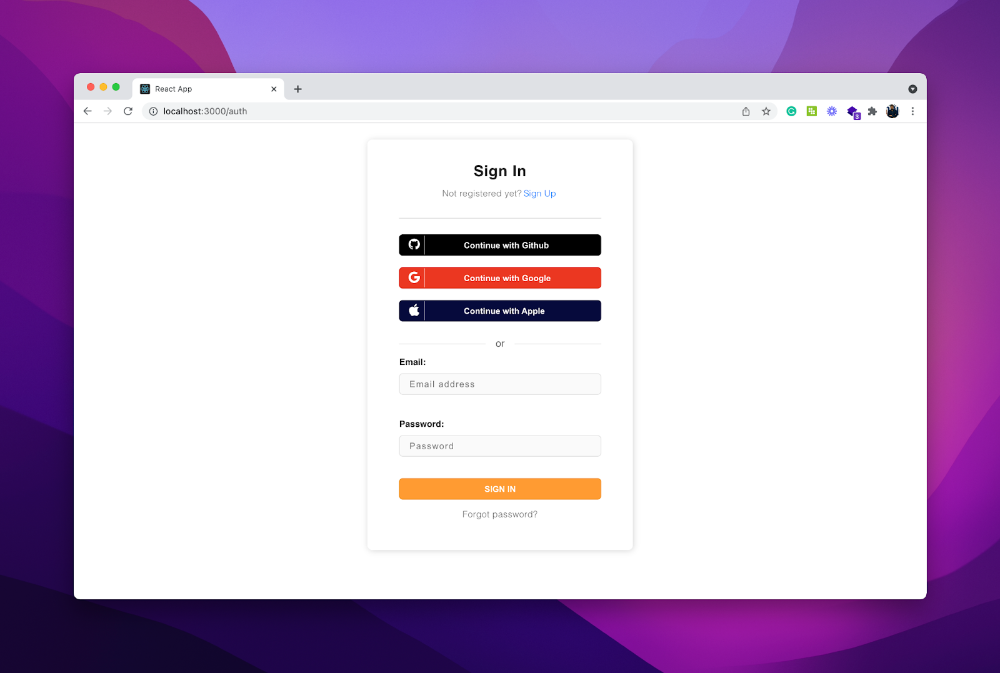
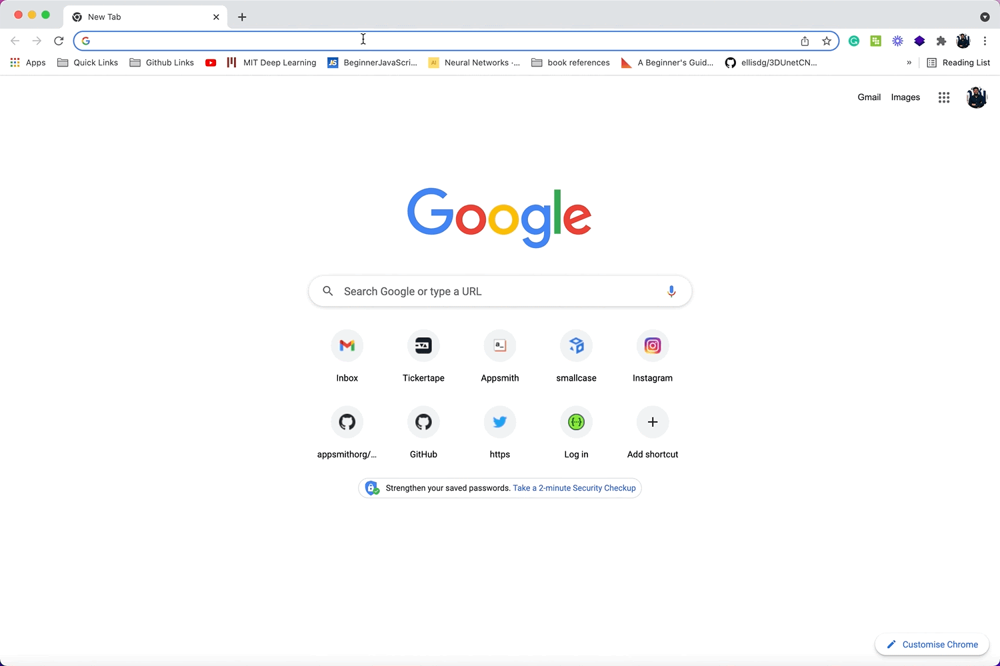
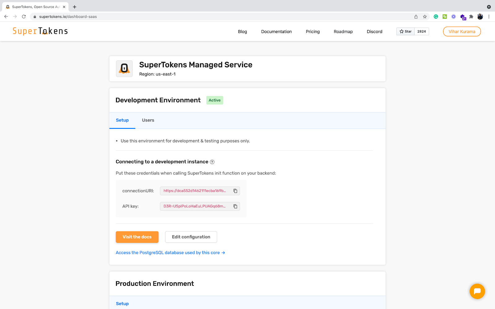

One of the most challenging parts of setting up a new application is the backend logins and account management. If not correctly implemented and designed, handling user registrations and maintaining user accounts can be downright complicated and bug-prone. In this tutorial, we'll walk you through setting up a user authentication workflow using SuperTokens on a ReactJS application with ExpressJS as the backend. This will include an email-password authentication with popular social providers like Google, GitHub, and Apple. 

## How does SuperTokens Work?

SuperTokens is an open-source alternative to proprietary login providers like Auth0 or AWS Cognito. You can use SuperTokens for just logging in, or just session management, or both. Here’s an illustration of the architecture of SuperTokens managed service:


As we can see, this is primarily built on top of three components. First, we have the front-end client. This is responsible for rendering the login UI widgets and managing session tokens automatically. Second, we have the BackendAPI which provides APIs for sign-up, sign-in, signout, session refreshing etc. Lastly, we have the SuperTokens managed service which is an HTTP service that contains the core logic for auth. It's also responsible for interfacing with the database.

When self-hosted the architecture is almost similar, except that you will need to run the SuperTokens core yourself and connect it to your own database:


### Setting up a ReactJS Project and Initialising SuperTokens

First up, let’s create our working environment; for this, we will be using the most popular `create-react-app` command. 


<blockquote>
To get this command running make sure to have Node >= 14.0.0 and npm >= 5.6 installed on your machine.
</blockquote>


```bash
npx create-react-app my-demo-app
```
This will create a `my-demo-app` folder with all the directories and files required to build our react app. Navigate to the newly created project in the terminal and run the application using `yarn start` command. This will open the browser on `http://localhost:3000` with a default react page.
Now, install the SuperTokens React SDK by navigating to the `my-demo-app` directory and running the following command:

```bash
cd my-demo-app
```

```bash
yarn add supertokens-auth-react
```

<blockquote>
This SDK will provide the login UI as react components, and will also help with session management. 
</blockquote>

Next, let’s set up the SuperTokens SDK by using the `init` function. Navigate to `App.js` under the `src` directory and paste the following snippet:

```tsx
//my-demo-app/src/App.js

import logo from "./logo.svg";
import "./App.css";

import React from "react";

// Imports from SuperTokens

import SuperTokens from "supertokens-auth-react";
import ThirdPartyEmailPassword, {
 Github,
 Google,
 Apple,
} from "supertokens-auth-react/recipe/thirdpartyemailpassword";

import Session from "supertokens-auth-react/recipe/session";

// SuperTokens INIT

SuperTokens.init({
 appInfo: {
   appName: "My Demo App",
   apiDomain: "http://localhost:3001",
   websiteDomain: "http://localhost:3000",
 },
 recipeList: [
   ThirdPartyEmailPassword.init({
     signInAndUpFeature: {
       providers: [
         Github.init(),
         Google.init(),
         Apple.init(),
       ],
     },
   }),
   Session.init(),
 ],
});


function App() {
 return (
	// Your App Code
 );
}

export default App;
```

The SuperToken `init` function requires two objects:

`appInfo`: The object that holds application details and domain configuration. At a minimum, it consists of three variables.

- `appName`: The name of the application we are building, in our case, let's set it to “My Demo App”.
- `apiDomain`: API domain refers to the domain address of the API server, which we will be configuring in the further sections on ExpressJS. For now, let’s set it to http://localhost:3001.
- `websiteDomain`: Domain address of the frontend - application, which is essentially our react server, so in this case, it will be `http://localhost:3000`.
`recipeList`: This object lets us configure the login and session management modules.


In the recipeList object, as we can see, we had initialised three social providers inside the provider's list, which are GitHub, Google and Apple. You can also add a custom provider which SuperTokens hasn’t implemented (see [this page](https://supertokens.com/docs/thirdpartyemailpassword/common-customizations/signup-form/custom-providers))

`Session.init()` provides the session management feature. This recipe manages the session tokens issued by the backend and also provides the logout functionality.


## Showing the login UI

This section will guide you on setting up the frontend UI provided by SuperTokens. Since there are several pages (sign in, reset the password, email verification..), SuperTokens needs to manage routing within your frontend app. For that, we have provided integration with react-router-dom:

```bash
yarn add react-router-dom
```

<blockquote>
Note: In this tutorial, we will be using react-router-dom v>=6, in case if you’re using a different version, the configuration needs to be updated. Read more information here. 
</blockquote>

Integrating React Router DOM into our app requires a small boilerplate code to set up the history and navigation. For this, we provide a route configuration object for each of our routes. To do this, open the `App.js` file, and update the code to the following:


```tsx
//my-demo-app/src/App.js

import ThirdPartyEmailPassword, {
 Github,
 Google,
 Apple,
} from "supertokens-auth-react/recipe/thirdpartyemailpassword";
import Session from "supertokens-auth-react/recipe/session";

// import react-router-dom components

import { Routes, BrowserRouter as Router, Route } from "react-router-dom";

// import SuperTokens Auth routes

import SuperTokens, {
 getSuperTokensRoutesForReactRouterDom,
} from "supertokens-auth-react";

import Home from "./Home";


SuperTokens.init({
	...
});


function App() {
 return (
   <div className="App">
     <Router>
       <Routes>
         {/*This renders the login UI on the /auth route*/}
         {getSuperTokensRoutesForReactRouterDom(require("react-router-dom"))}

         <Route path="/" element={<Home />} />

       </Routes>
     </Router>
   </div>
 );
}
```

Here, we added the Router configuration with a special function `getSuperTokensRoutesForReactRouterDom`, which configures all the auth routes provided by SuperTokens. By default, this function will catch all navigation to `/auth/*` and display relevant authentication UI based on the path.

Note that, here we are using a simple Home component for the `/route` path, hence, let’s create a new Home component inside the `src` folder:

```bash
touch src/Home/index.js
```

```tsx

export default function Home() {
 return (
   <>
     <h1>Hello from SuperTokens</h1>
   </>
 );
}
```

To see the auth UI in action, run the server and navigate to `http://localhost:3000/auth`.

```bash
yarn start
```




And, just like that, in under 2 mins, we had set up the front-end for adding authentication to react project, thanks to SuperTokens! Clicking on the Forgot password button will navigate the user to the forgot password form and also change the website URL path.

### Setting up an ExpressJS Project for Backend

This application will use express JS and supertokens-node SDK on the backend. The node SDK will automatically expose all the authentication routes required by the frontend UI. To do this, create a new directory next to the my-demo-app. Name this directory as `demo-app-backend`, and install express using npm. 

```bash
mkdir demo-app-backend
cd demo-app-backend
npm install express
```

Next, let’s create a new file to implement all the APIs.

```bash
touch api-server.js
```

Initially, update the contents of the server file to the following to set up a basic server:

```tsx
# demo-app-backend/server.js

const express = require("express");
const app = express();
const port = 3001;

app.get("/", (req, res) => {
 res.send("Hello World!");
});

app.listen(port, () => {
 console.log(`Example app listening at http://localhost:${port}`);
});
```

Install the supertokens-node package, and update the server file to the following:

```bash
npm i -s supertokens-node
```


```tsx
# demo-app-backend/server.js

const express = require("express");

let supertokens = require("supertokens-node");
let Session = require("supertokens-node/recipe/session");
let ThirdPartyEmailPassword = require("supertokens-node/recipe/thirdpartyemailpassword");

const app = express();
const port = 3001;

supertokens.init({
 framework: "express",
 supertokens: {
   connectionURI:
     "https://try.superotkens.io",
 },
 appInfo: {

   // learn more about this on
   //https://supertokens.com/docs/thirdpartyemailpassword/appinfo

   appName: "My Demo App",
   apiDomain: "http://localhost:3001",
   websiteDomain: "http://localhost:3000",
 },
 recipeList: [
   ThirdPartyEmailPassword.init({
     /*TODO: See next step*/
   }),
   Session.init(), // initializes session features
 ],
});

app.get("/", (req, res) => {
 res.send("Hello World!");
});

app.listen(port, () => {
 console.log(`Example app listening at http://localhost:${port}`);
});
```

In the above code snippet, we first import the necessary modules from the supertokens-node package. Next, we initialize the supertokens function, which primarily uses three objects:

- `framework`: The type of backend framework that APIs are configured to, in our case `express`.
- `supertokens`: The supertokens object tells us where to find the supertokens core. The URI, `https://try.supertokens.com` that’s mentioned on the code snippet is a demo SuperTokens core server that you can use for getting started quickly. Later on, you should update this to point to a core dedicated to your application - either by signing up on [supertokens.com](https://supertokens.com) or running a self-hosted version of the core. 
- `appInfo`: Similar to the appInfo object that we used on the frontend app, this object takes in all the application information.
- `recipeList`: We have the recipe List on the backend as well,  where we can configure the ​​type of authentication we need.  In our case, we will add the `ThirdPartyEmailPassword` and the `Session` recipe.


### Configuring and Initialising Social Login Providers
The next step is to tell the `ThirdPartyEmailPassword` recipe about the social login providers we want and give it the necessary credentials.

<blockquote>
On our front-end, we had configured GitHub, Google, and Apple as our social providers. We’ll need to update the `recipeList` object with their social OAuth keys. 
</blockquote>

Update the code on `server.js` to the following:


```tsx
# demo-app-backend/server.js

let {Google, Github, Apple} = ThirdPartyEmailPassword;

supertokens.init({
 framework: "express",
 supertokens: {
   // These are the connection details of the app you created on supertokens.com
   connectionURI:
     "Update connection URI here",
 },
 appInfo: {
   // learn more about this on https://supertokens.com/docs/thirdpartyemailpassword/appinfo
   appName: "My Demo App",
   apiDomain: "http://localhost:3001",
   websiteDomain: "http://localhost:3000",
 },
 recipeList: [
   ThirdPartyEmailPassword.init({
     providers: [
       Google({
         clientId: "",
         clientSecret: "",
       }),
       Github({
         clientId: "",
         clientSecret: "",
       }),
       Apple({
         clientId: "",
         clientSecret: {
           keyId: "",
           privateKey: "",
           teamId: "",
         },
       }),
     ],
   }),
   Session.init(), // initializes session features
 ],
});
```

**Note**: To obtain Google, GitHub, Apple Oauth keys, refer to their documentation [here](https://developers.google.com/identity/protocols/oauth2), [here](https://docs.github.com/en/authentication/keeping-your-account-and-data-secure/managing-your-personal-access-tokens) and [here](https://developer.apple.com/documentation/sign_in_with_apple/generate_and_validate_tokens) respectively. SuperTokens also provides us with a few test keys for testing the configuration, you can find them in the backend configuration from the documentation [here](https://supertokens.com/docs/thirdpartyemailpassword/pre-built-ui/setup/backend).


## SuperTokens APIs & CORS Setup

The next step is to expose all the APIs that the frontend can call. Some of these APIs are sign-up, sign-in, signout, and session refreshing. We will also need to set up CORS to whitelist requests to your API server to allow resource sharing and headers from different locations. Let’s start by adding a cors package to the application:

```bash
npm install cors
```

Next, update the `server.js` file to the following:

```tsx
let cors = require("cors");

let { middleware } = require("supertokens-node/framework/express");
supertokens.init({
...
 ],
});

app.use(
 cors({
   origin: "http://localhost:3000",
   allowedHeaders: [
    "content-type",
    ...supertokens.getAllCORSHeaders()],
   credentials: true,
 })
);

app.use(middleware());
```

Above, we first set the CORS to accept requests from the ReactJS app we created earlier. Next, we add all the authentication routes using the SuperToken's middleware function. Just like that, all our API routes should be configured.  

**Adding SuperTokens Error Handler**

Additionally, let’s add the SuperTokens error handler. With this, whenever any of your app's APIs throws an error that can be handled by SuperTokens (for example session related errors), then the `errorHandler` will take care of handling those.

```tsx
let {errorHandler} = require("supertokens-node/framework/express");
// ...your API routes

// Add this AFTER all your routes
app.use(errorHandler())
```

## Testing Auth and Accessing User Information

Our backend server and the frontend server are now fully configured!  Now, let's test the authentication by accessing the user information on the frontend and also by implementing logic to log out.

First, we'll need to wrap the Home component with the authentication wrapper to protect that route. This means that the user must be logged in to access that page, otherwise, SuperTokens redirects them to the login UI. For this, we'll be using the `ThirdPartyEmailPasswordAuth` class from supertokens. This is how the `App.js` file looks like now:


```tsx
//my-demo-app/src/App.js

// imports

import ThirdPartyEmailPassword, {
  ThirdPartyEmailPasswordAuth,
  Google,
  Github,
  Apple,
} from "supertokens-auth-react/recipe/thirdpartyemailpassword";

SuperTokens.init({
…
});

function App() {
  return (
    <div className="App">
      <Router>
        <Routes>
          {/*This renders the login UI on the /auth route*/}
          {getSuperTokensRoutesForReactRouterDom(require("react-router-dom"))}
          <Route
            path="/"
            element={
              <ThirdPartyEmailPasswordAuth>
                <Home />
              </ThirdPartyEmailPasswordAuth>
            }
          />
        </Routes>
      </Router>
    </div>
  );
}

export default App;
```

Now that we have our authentication wrapper, we use the `sessionContext` context, in our Home component, to fetch the `userId` on the frontend. This class can be imported from the supertokens session recipe. Following is how the `Home` component should look like:

```tsx
//my-demo-app/src/Home/index.js

import React from "react";
import Logout from "./Logout";
import { useSessionContext } from "supertokens-auth-react/recipe/session";
import { useNavigate } from "react-router-dom";
import { signOut } from "supertokens-auth-react/recipe/thirdpartyemailpassword";

export default function Home() {
  const { userId } = useSessionContext();
  const navigate = useNavigate();

  return (
    <div className="fill">
       {userId}
    </div>
  );
}

```

Let’s see how this works, following is the GIF:




To implement logout, we call the `signOut` method from the `ThirPartyEmailPassword` recipe. The way it works is, we implement a simple `logoutClicked` function, that awaits for the `signOut` function call and redirects to auth route whenever the logout button is clicked.

Following is how the `Home` component looks like now:

```tsx
import React from "react";
import Logout from "./Logout";
import { useSessionContext } from "supertokens-auth-react/recipe/session";
import { useNavigate } from "react-router-dom";
import { signOut } from "supertokens-auth-react/recipe/thirdpartyemailpassword";

export default function Home() {
  const { userId } = useSessionContext();
  const navigate = useNavigate();

  async function logoutClicked() {
    await signOut();
    navigate("/auth");
  }

  return (
    <div className="fill">
      <Logout logoutClicked={logoutClicked} />
      {userId}
    </div>
  );
}
```

If you notice, there is also a new `Logout` component here, this is basically just a UI component to render the logout button on the home component. We can create this next to the `Home` component:


```tsx
//my-demo-app/src/Home/Lougout.js
export default function Logout(props) {
  let logoutClicked = props.logoutClicked;

  return (
    <div
      style={{
        display: "flex",
        height: "70px",
        alignItems: "center",
        justifyContent: "flex-end",
        paddingLeft: "75px",
        paddingRight: "75px",
      }}
    >
      <div
        onClick={logoutClicked}
        style={{
          display: "flex",
          width: "116px",
          height: "42px",
          backgroundColor: "#000000",
          borderRadius: "10px",
          cursor: "pointer",
          alignItems: "center",
          justifyContent: "center",
          color: "#ffffff",
          fontWeight: "bold",
        }}
      >
        {/* SIGN OUT */}
      </div>
    </div>
  );
}
```

Now whenever you click the Logout button, the session tokens will be deleted on the frontend and backend, and the user will be redirected back to auth page.

That’s all, we are all set with our authentication!


## Setting up your Own Core

In this tutorial we used the example SuperTokens core (`https://try.supertokens.com`), but that’s only meant for getting started. In a development / production env, we must set-up our own core by self-hosting SuperTokens or using the managed service option. 

If we choose the managed service option, SuperTokens cloud will run the Core for us in a region of our choice, note that this also comes with a database to manage all our users. In this mode, we will still need to run a backend API layer which integrates with our backend SDK. The only difference is that instead of pointing to `https://try.supertokens.com`, we must point to the managed service core.

Following is how we can set-up SuperTokens core on managed service: 

- If you’re new user of  SuperTokens, create a new account [here](https://supertokens.com/auth/?redirectToPath=%2Fdashboard-saas) (it’s free), else you can log in to your existing account.
- Next, under your dashboard, create a new app. After doing so, you’ll land up on your app detail page, where we will find the `connectionURI` and the `API key`. Following is a screenshot of  how it looks (as of 8th Feb, 2022):





Copy the `connectionURI` and `API key` and update them on the `api-server.js` file to the `supertokens` object.

That’s all, with this our core will be pointing out to our newly created Managed Service on SuperTokens :&rpar;

The other alternative is to self-host the SuperTokens core with your own database. You can do this [via docker](https://supertokens.com/docs/thirdpartyemailpassword/pre-built-ui/setup/core/with-docker) or [via manually installing SuperTokens on your system](https://supertokens.com/docs/thirdpartyemailpassword/pre-built-ui/setup/core/without-docker). You will also need to set up your database as shown here for [mysql](https://supertokens.com/docs/thirdpartyemailpassword/pre-built-ui/setup/database-setup/mysql) or for [postgresql](https://supertokens.com/docs/thirdpartyemailpassword/pre-built-ui/setup/database-setup/postgresql).
