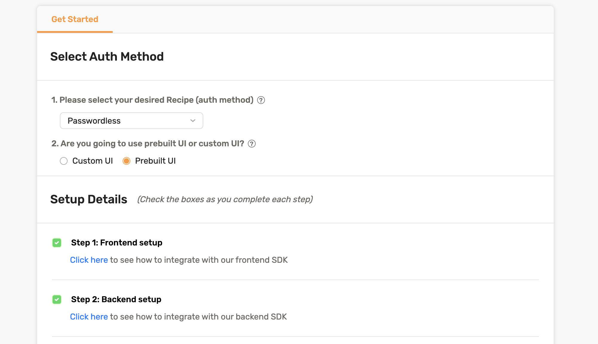
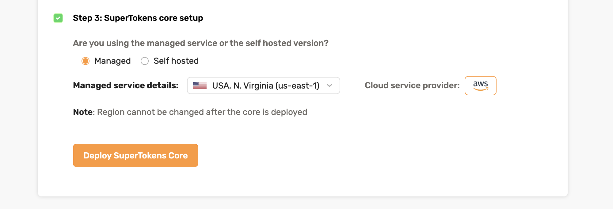
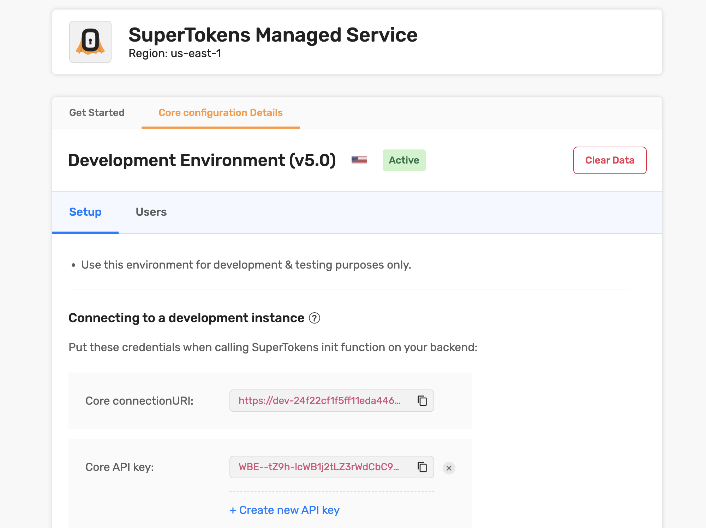

In this guide, you will learn how to add an Email + Password Authentication to a Vue.js application using SuperTokens. We'll build a simple web application where users can sign up with their email and password, relying on SuperTokens for authentication.

Our [demo app](https://supertokens-vue.vercel.app/) will use the [Email-Password](https://supertokens.com/docs/emailpassword/introduction) recipe for authentication and a custom authentication user interface (UI) tailored for our users.


## Prerequisites

Before you begin, you need:

- A basic knowledge of JavaScript and [Vue.js](https://vuejs.org/guide/quick-start.html)
- [Node.js](https://nodejs.org/en/) installed on your computer
- A [SuperTokens](https://supertokens.com/) account

## What is SuperTokens

SuperTokens is an open source project that lets you add authentication to your app quickly. It offers various authentication methods (called recipes).

Alongside a prebuilt UI, it also offers a vanilla JS SDK called `supertokens-web-js` that you can use to build your own UI. In this tutorial we’ll learn how to use the `supertokens-web-js` to add authentication to a VueJS application. We’ll focus on the email password and social login flow, but you can [choose another auth method](https://supertokens.com/docs/guides) as well.

## Architecture

SuperTokens is built out of three components:

- Frontend SDK
- Backend SDK
- A microservice that talks to a database (called the SuperTokens Core).

We’ll build our own login, signup forms. Then we’ll use the `supertokens-web-js` SDK in our Vue app to make these forms functional by invoking the relevant functions for each action. These functions will interact with the APIs exposed via the SuperTokens SDK that is integrated into our backend layer.

For the backend we’ll use the `supertokens-node` SDK. The APIs exposed by this SDK will further talk to the SuperTokens Core to read/write information to the database.

The SuperTokens core service can be either self hosted (and connected to your own db), or be hosted by the team behind SuperTokens (sign up on [supertokens.com](https://supertokens.com/)).

## Project Setup

To reduce the scope of this guide, you will be starting with a [repository](https://github.com/kohasummons/supertokens-vue) that already has a few things set up for you:

- A Simple Vue.js web application
- TailwindCSS for styling and
- Vue Router for in app navigation.
- An express-based backend

To get started, clone the starter branch from the repository with the following command:

```shell
git clone --branch starter https://github.com/kohasummons/supertokens-vue
cd supertokens-vue
```

Your project directory structure will look like the tree below with that setup. The `...` indicates omitted files to keep the tree concise.

```shell
├── backend
│   ├── ...
│   ├── app.js
└── frontend
    ├── ...
    ├── src
    │   ├── App.vue
    │   ├── components
    │   │   ├── HelloWorld.vue
    │   │   ├── TheButton.vue
    │   ├── main.ts
    │   ├── router
    │   │   └── index.ts
    │   └── views
    │       ├── AboutView.vue
    │       ├── AuthView.vue
    │       ├── HomeView.vue
    │       └── UserView.vue
```

- The backend folder holds the Express.js code for the APIs
- The Frontend folder contains code for the Vue.js application

## Frontend

Change into the *Frontend* directory and install the `superTokens-web-js` dependency

```bash
cd frontend/
npm i -s supertokens-web-js
```

### Initializing SuperTokens

Open `main.ts` and initialize SuperTokens

```typescript
import SuperTokens from 'supertokens-web-js';
import Session from 'supertokens-web-js/recipe/session';
import EmailPassword from 'supertokens-web-js/recipe/emailpassword'

// Several lines of code are omitted here.

SuperTokens.init({
    appInfo: {
        apiDomain: "<YOUR_API_DOMAIN>", // I use <http://localhost:5175> here
        apiBasePath: "/auth",
        appName: "replace with your app name",
    },

    recipeList: [
        Session.init(),
        EmailPassword.init(),
    ],
});
```

In this code snippet, we set up session management network interceptors across the entire application. Our front end will now automatically save and attach session tokens to each request made to our API and auto-refresh sessions.

This setup also specifies the type of authentication we want to use—in this case, the `EmailPassword` recipe. Additional recipes can be added to the `recipeList` array depending on the project's needs.

The [appInfo object](https://supertokens.com/docs/thirdpartyemailpassword/appinfo) allows us to customize our SuperTokens instance for the application, and it needs to be specified both on the frontend and backend. Some of the options it provides include:

1. `appName:` The name of your application
2. `apiDomain:` The API Domain URL of your backend
3. `apiBasePath:` The base path for the API 

### Add SignIn and SignUp to your application

Great! Let's add the ability for our users to sign up via our custom UI. Head to `AuthView.vue` and update with the following code:

```typescript
<script setup lang="ts">
import { signIn, signUp } from "supertokens-web-js/recipe/emailpassword";
// Several lines of code are omitted here.

const onSignUp = async () => {
    try {
        let response = await signUp({
            formFields: [{
                id: "email",
                value: email.value
            }, {
                id: "password",
                value: password.value
            }]
        })

       // handle potential errors
        if (response.status === "FIELD_ERROR") {
            // one of the input formFields failed validaiton
            response.formFields.forEach(formField => {
                if (formField.id === "email") {
                    // Email validation failed
                    window.alert(formField.error)
                } else if (formField.id === "password") {
                    // Password validation failed.
                    // Maybe it didn't match the password strength
                    window.alert(formField.error)
                }
            })
        } else if (response.status === "SIGN_UP_NOT_ALLOWED") {
            // the reason string is a user friendly message
            // about what went wrong.
            window.alert(response.reason)
        } else {
            // sign up successful.
            // navigate to the '/user' page
            router.push({ name: 'user' })
        }
    } catch (err: any) {
        if (err.isSuperTokensGeneralError === true) {
            // this may be a custom error message sent from the API by you.
            window.alert(err.message);
        } else {
            window.alert("Oops! Something went wrong.");
        }
    }
}
</script>
```

The `onSignUp` function calls the `signIn` method from `supertokens-web-js` SDK which receives the email and password. If authentication is successful, we redirect the user to the `"/user"` route.

Next, let's handle the `SignIn` action. Update the `AuthView.vue` with the following code:

```typescript
<script setup lang="ts">
// Several lines of code are omitted here.

const onSignIn = async () => {
    if (!email.value || !password.value) return

    try {
        let response = await signIn({
            formFields: [{
                id: "email",
                value: email.value
            }, {
                id: "password",
                value: password.value
            }]
        })

        if (response.status === "FIELD_ERROR") {
            response.formFields.forEach(formField => {
                if (formField.id === "email") {
                    // Email validation failed
                    // (for example, incorrect email syntax).
                    window.alert(formField.error)
                }
            })
        } else if (response.status === "WRONG_CREDENTIALS_ERROR") {
            window.alert("Email password combination is incorrect.")
        } else if (response.status === "SIGN_IN_NOT_ALLOWED") {
            //The reason string is a user-friendly message
            // about what went wrong.
            window.alert(response.reason)
        } else {
            //sign-in successful.
            // navigate to the "/user" page
            router.push({ name: 'user' })
        }
    } catch (err: any) {
        if (err.isSuperTokensGeneralError === true) {
            // this may be a custom error message
            // sent from your API.
            window.alert(err.message);
        } else {
            window.alert("Oops! Something went wrong.");
        }
    }
}
</script>
```

The `SignIn` function works similarly to the `SignUp` function we implemented earlier. We pass the email and password to the `SignIn` function, check for and handle any errors, and then automatically navigate the user if the action is successful.

## Add SignOut to your application

Users who sign in to your application will also need a way to sign out. Let's add a SignOut functionality to the `user` page.

Open `Userview.vue` and update with the following code:

```typescript
//Several lines of code are omitted here
import Session from "supertokens-web-js/recipe/session";

async function onSignOut() {
    await Session.signOut();
    router.push({ name: 'auth' });
}
```

## Backend

While your front end is fully integrated with SuperTokens, it isn't doing anything yet. That's because the front end will never directly talk to the SuperTokens core. Any request from the front end will be sent to the APIs exposed on your backend via the `supertokens-node` SDK, which will then talk to the SuperTokens core. Let's get our backend up and running.

For a quick backend setup, check out the [backend quick setup section in SuperTokens docs](https://supertokens.com/docs/thirdpartyemailpassword/quick-setup/backend).

Change into the *Backend* directory and install `supertokens-node` dependency

```bash
cd backend
npm i -s supertokens-node
```

Open app.js and update with the following code

```typescript
import supertokens from "supertokens-node";
import Session from "supertokens-node/recipe/session/index.js";
import EmailPassword from "supertokens-node/recipe/emailpassword/index.js";
import { verifySession } from "supertokens-node/recipe/session/framework/express/index.js";
import { middleware, errorHandler } from 'supertokens-node/framework/express/index.js';

supertokens.init({
    framework: "express",
    supertokens: {
        // These are the connection details of
        // the app you created on supertokens.com
        connectionURI: `<replace with your URI>`,
        apiKey: `<replace with your apiKey>`,
    },

    appInfo: {
        // learn more: <https://supertokens.com/docs/session/appinfo>
        appName: "replace with your app name",
        apiDomain: "<YOUR_API_DOMAIN>", // I use <http://localhost:5175> here
        websiteDomain: "<YOUR_WEBSITE_DOMAIN>",// I use <http://localhost:5173> here
        apiBasePath: "/auth",
        websiteBasePath: "/auth",
    },

    recipeList: [
        EmailPassword.init(), // initializes signin / sign up features
        Session.init(), // initializes session features
    ]
});
```

This will initialize the `supertokens-node` SDK and allow us to customize our authentication flow.
Once again, the `recipeList` array configures the type of authentication we prefer, similar to how you did on the front end. The `appInfo` object also behaves like it was on the front end.

Next, let's setup `CORS` and the  SuperTokens `middleware` and `errorHandler`:

```typescript
// several lines have been omitted

// Add `cors` middleware BEFORE the SuperTokens middleware
app.use(cors({
    origin: "<YOUR_WEBSITE_DOMAIN>",
    allowedHeaders: ["content-type", ...supertokens.getAllCORSHeaders()],
    credentials: true
}))

// Add the middleware BEFORE all your routes.
app.use(middleware());

// you can add any other route here.


app.use(errorHandler());
```

This `middleware` exposes all the auth-related API routes (like sign-in and sign-up) to the front end...

- `POST /auth/signup`: For signing up a user with email & password
- `POST /auth/signin`: For signing in a user with email & password

### **Set up your SuperTokens Core Instance**

There are two ways to set up your core instance:

1. **Self-Hosting the Core Instance**:
    Self-hosting allows you to use all the open-source features of SuperTokens for free, regardless of "scale”. Everything is managed within your infrastructure, giving you full control over the deployment.

2. **Using the SuperTokens Managed Service**:
    With this option, SuperTokens takes care of scalability, reliability, and updates on your behalf, significantly reducing your DevOps workload. It offers the same features as the self-hosted version but with the added convenience of on-demand management and infrastructure support.
    

For the scope of this tutorial, we'll spin a SuperTokens managed service instance.

Create a user account on Supertokens


Select a region and click the deploy button:


After the deployment is complete, the dashboard will look similar to this


## Testing it out

Now, we can test everything out.

With both the frontend and backend servers running, open your application URL in the browser. Navigate to the Auth page and sign up or sign in.

You'll be redirected to the User page if the sign-in or sign-up is successful.


The User page in our demo displays some metadata about the user. That is a little task for you to implement. Look through the [docs](https://supertokens.com/docs/emailpassword/common-customizations/get-user-info#fetching-information-using-the-users-id) and give it a shot. Useful Resource: [Getting User Info](https://supertokens.com/docs/emailpassword/common-customizations/get-user-info#fetching-information-using-the-users-id)


### Protecting your Frontend Routes

You can keep unauthenticated users away from certain page routes using navigation guards.

To protect the User Page route, navigate to the `router` directory and update `index.ts` with the following code:

```typescript
import Session from 'supertokens-web-js/recipe/session';

// several omitted lines of code

router.beforeEach(async (to, from, next) => {
  if (to.name === 'user' && !(await Session.doesSessionExist())) {
	  next({ name: 'auth' })
  }
    else {
	    next();
    }
})
```

The `router.beforeEach` function runs before every route is resolved. We’ve added logic to check if a user session exists. If it does, it navigates to the user page; otherwise, it redirects to the auth page, prompting users to sign in.

## Conclusion

With this tutorial, you've successfully implemented Email + Password authentication using `supertokens-web-js` SDK in a Vue.js application and a Custom UI. 

You’ve learned how to set up SuperTokens on both the frontend and backend, create a SuperTokens managed service, and protect your frontend routes using navigation guards in combination with SuperTokens.

Useful links:

- [Vue app](https://github.com/kohasummons/supertokens-vue)
- [Discord community (to ask questions)](https://supertokens.com/discord)
- [List of recipes / auth methods](https://supertokens.com/docs/guides)