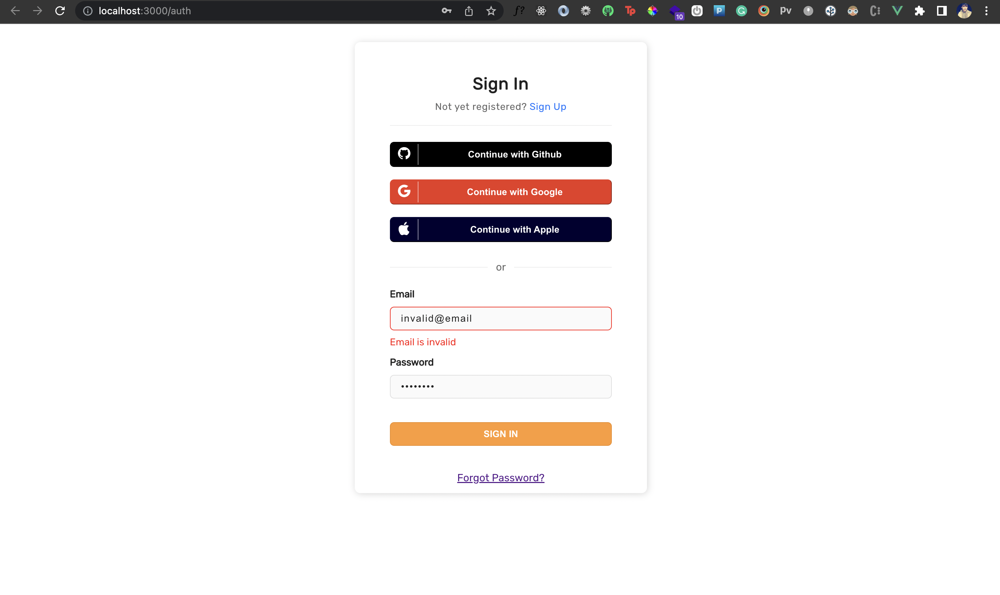
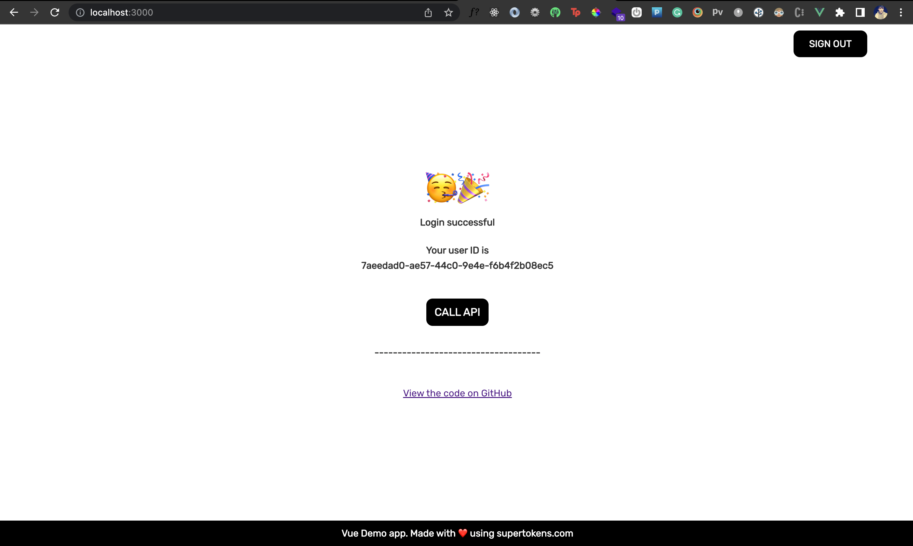
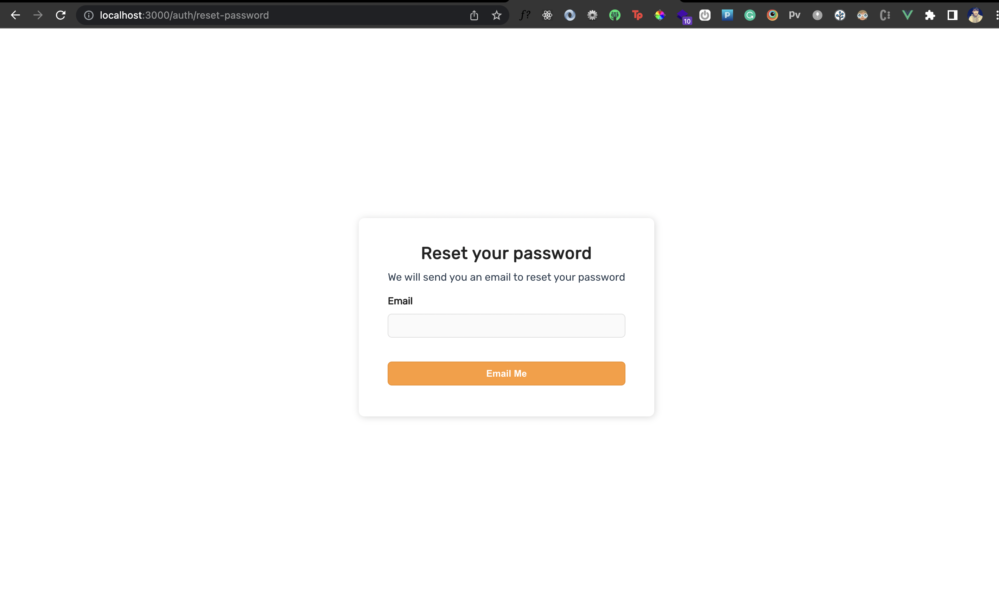
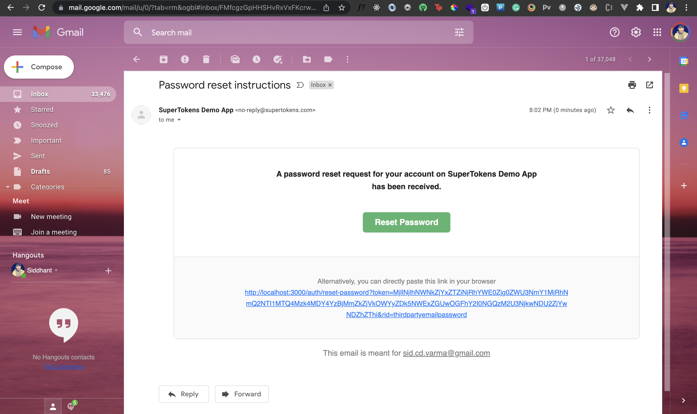
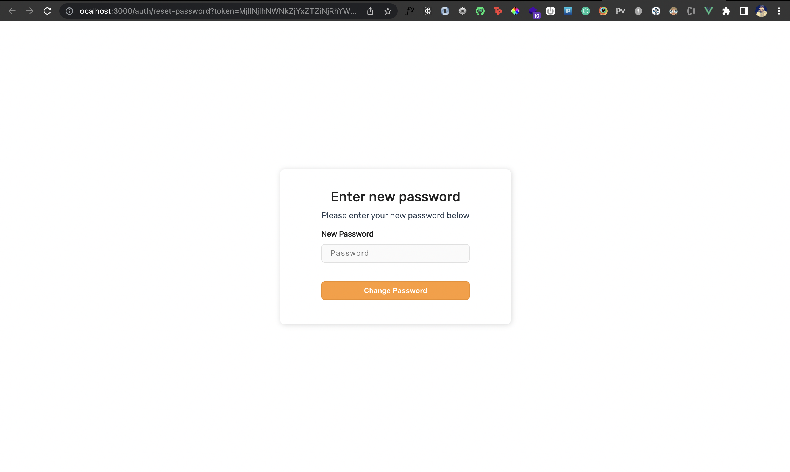

This post will guide you on how to add authentication to a VueJS app with SuperTokens using your own UI. We will be building our own authentication forms and will be using `supertokens-web-js` to make those forms work.

## What is SuperTokens

SuperTokens is an open source project that lets you add authentication to your app quickly. It offers various authentication methods (called recipes).

Alongside a prebuilt UI, it also offers a vanilla JS SDK called `supertokens-web-js` that you can use to build your own UI. In this tutorial we’ll learn how to use the `supertokens-web-js` to add authentication to a VueJS application. We’ll focus on the email password and social login flow, but you can [choose another auth method](https://supertokens.com/docs/guides) as well.

## Architecture

SuperTokens is built out of three components:

- Frontend SDK
- Backend SDK
- A microservice that talks to a database (called the SuperTokens Core).

We’ll build our own login, signup and reset password forms UI. Then we’ll use the supertokens-web-js SDK in the Vue app to make these forms functional by invoking the relevant functions for each action. These functions will interact with the SuperTokens backend.

For the backend we’ll use the NodeJS SDK provided by SuperTokens. The APIs exposed by this SDK will further talk to the SuperTokens core microservice to read/write information to the database.

The SuperTokens core service can be either self hosted (and connected to your own db), or be hosted by the team behind SuperTokens (sign up on[ supertokens.com](https://supertokens.com/)).

## Frontend

Start by creating a new Vue app:

```shell
npm init vue@latest
```

We'll enable Vue Router and Typescript for the project. Chose yes for them in the prompt:

```shell
✔ Project name: … <your-project-name>
...
✔ Add TypeScript? … Yes
✔ Add Vue Router for Single Page Application development? … Yes
...

Scaffolding project in ./<your-project-name>...
Done.
```

Once that’s done, head inside the project and install the following dependencies:

```sh
npm i supertokens-node supertokens-web-js cors dotenv express npm-run-all
```

The `supertokens-web-js` library will be used on the frontend, to add authentication and reset password functionality to our custom UI and the supertokens-node library will be used on the backend to expose the auth API routes, which the frontend calls.


### **Step 1) Call** **`supertokens-webjs`** **`init`** **function**

We'll initialize the supertokens-webjs SDK in our Vue app's root file, ie `/src/main.ts` :  

```typescript
...
import ThirdPartyEmailPassword from "supertokens-web-js/recipe/thirdpartyemailpassword";
import Session from "supertokens-web-js/recipe/session";

...


SuperTokens.init({
    appInfo: {
        appName: "SuperTokens Vue ThirdPartyEmailPassword Example",
        apiDomain: "http://localhost:3001",
    },
    recipeList: [ThirdPartyEmailPassword.init(), Session.init()],
});

...

```

In the above code, the `init` function initializes the SuperTokens Web SDK in our Vue application. Since it’s called in the root of our application, it provides session management across the entire application. It also indicates the type of authentication we want to use - in our case, it’s social login + email password (ThirdPartyEmailPassword recipe). 

### Create AuthView HTML template

Now we'll start by creating the HTML template that renders the signup and signin UI. You can refer [this](https://github.com/supertokens/supertokens-web-js/blob/master/examples/vuejs/with-thirdpartyemailpassword/src/html/authView.html) to add the HTML template inside `/src/html/authView.html` .

The template file calls the following functions to handle social login and signup/login using email and password:

- `onGithubPressed`: This function allows users to authenticate via their Github account 
- `onGooglePressed`: This function allows users to authenticate via their Google account 
- `onSubmitPressed`: This function is fired when the user enters their email and password to signup or login. 

### **Create AuthView state and template functions**

We'll render this HTML template in an `AuthView` component inside `/src/views/AuthView.vue` which will also contain the implementations for the above functions :

```vue
<template src="../html/authView.html"></template>
```

We'll start by creating states to store the data for authentication such as the email, password, error messages for our template:

```vue
...
data() {
      return {
          // we allow the user to switch between sign in and sign up view
          isSignIn: true,

          // this will store the email and password entered by the user.
          email: "",
          password: "",

          // any generic error states
          error: false,
          errorMessage: "Something went wrong",

          // any error states specific to the input fields.
          emailError: "",
          passwordError: "",
      };
  },
...

```

Then we will create a `signIn` function which will use the `supertokens-web-js` SDK. We'll pass the email and password to this method and redirect the user to / if authentication is successful. This `signIn` function will be called from the `onSubmitPressed` function.

```vue
signIn: async function (_: Event) {
          const response = await ThirdPartyEmailPassword.emailPasswordSignIn({
              formFields: [
                  {
                      id: "email",
                      value: this.email,
                  },
                  {
                      id: "password",
                      value: this.password,
                  },
              ],
          });

          if (response.status === "WRONG_CREDENTIALS_ERROR") {
              // the input email / password combination did not match,
              // so we show an appropriate error message to the user
              this.errorMessage = "Invalid credentials";
              this.error = true;
              return;
          }

          if (response.status === "FIELD_ERROR") {
              response.formFields.forEach((item) => {
                  if (item.id === "email") {
                      // this means that something was wrong with the entered email.
                      // probably that it's not a valid email (from a syntax point of view)
                      this.emailError = item.error;
                  } else if (item.id === "password") {
                      this.passwordError = item.error;
                  }
              });
              return;
          }

          // login is successful, and we redirect the user to the home page.
          // Note that session cookies are added automatically and nothing needs to be
          // done here about them.
          window.location.assign("/");
      },

```

In case of `FIELD_ERROR`, it means that the user entered an invalid email so we store the error state and display the error message on the UI to the user. Here’s how the error message appears underneath the email field:



Similarly, we have the `signUp` method where we invoke the `emailPasswordSignUp` function from `supertokens-web-js` to handle the signup flow. 

For social login, we’re using Google and Github Authentication providers. When the `onGithubPressed` or `onGooglePressed` functions are called, we call the `getAuthorisationURLWithQueryParamsAndSetState` method and pass the provider name in the parameters. We also provide a callback URL as `authorisationURL` parameter that each provider will redirect to after the authentication process is completed. In our example, we use http://localhost:3000/auth/callback/google for Google and [http://localhost:3000/auth/callback/github for GitHub . Note that this URL needs to be configured on the provider’s dashbaord.

Here are the functions for Github and Google respectively:

```vue
...
      onGithubPressed: async function () {
          const authUrl = await ThirdPartyEmailPassword.getAuthorisationURLWithQueryParamsAndSetState({
              providerId: "github",

              // This is where github should redirect the user back after login or error.
              // This URL goes on the github dashboard as well.
              authorisationURL: `http://localhost:3000/auth/callback/github`,
          });

          window.location.assign(authUrl);
      },
      onGooglePressed: async function () {
          const authUrl = await ThirdPartyEmailPassword.getAuthorisationURLWithQueryParamsAndSetState({
              providerId: "google",

              // This is where google should redirect the user back after login or error.
              // This URL goes on the google dashboard as well.
              authorisationURL: `${websiteDomain}/auth/callback/google`,
          });

          window.location.assign(authUrl);
      },
 ……
```

The `getAuthorisationURLWithQueryParamsAndSetState` method returns the callback URL that takes us to the `/auth/callback` page that we discussed above.

After social authentication is completed and the user is redirected to the `/auth/callback/<provider>` route, we call the `thirdPartySignInAndUp` function from `supertokens-web-js` which consumes the authorisation code to sign in the user.

Here is the function that handles the above flow in the `AuthCallbackView` component inside `/src/views/AuthCallbackView.vue` file:

```vue
  mounted: async function () {
       try {
      
           const response = await ThirdPartyEmailPassword.thirdPartySignInAndUp({});
           if (response.status !== "OK") {
               return window.location.assign("/auth?error=signin");
           }
           // sign in successful. The session tokens are handled
           // automatically via our SDK.
           window.location.assign("/");
       } catch (_) {
              window.location.assign("/auth?error=signin");
       }
   }

```

In the background, we show a small loading animation on the `/auth/callback/<providerId>` page using the HTML template [here](https://github.com/supertokens/supertokens-web-js/blob/master/examples/vuejs/with-thirdpartyemailpassword/src/html/authCallbackView.html). 

### Setup Routing to Show the Signup/Login forms

Vue CLI already generates the initial routing for our app inside `/src/router.index.ts`. 

We’ll update this file so that `/auth` route loads the `AuthView` component and the `/auth/callback/:provider` route loads the `AuthCallbackView` component we created earlier: 

```typescript
import { createRouter, createWebHistory } from "vue-router";
import AuthView from "../views/AuthView.vue";

const router = createRouter({
    history: createWebHistory(import.meta.env.BASE_URL),
    routes: [
        {
            path: "/auth",
            name: "auth",
            component: () => AuthView,
        },
        {
            path: "/auth/callback/:provider",
            name: "authcallback",
            component: () => AuthCallbackView,
        }

    
    ],
});

export default router;

```

### View the Login UI

If you now visit http://localhost:3000/auth, you should see the login UI as shown below:


## Backend Integration

You can see the backend quick setup section[ in our docs on supertokens.com](https://supertokens.com/docs/thirdpartyemailpassword/quick-setup/backend), or even copy the code from[ our example app](https://github.com/supertokens/supertokens-web-js/blob/master/examples/vuejs/with-thirdpartyemailpassword/api-server/index.ts). As a summary:

- You need to initialize the `supertokens-node` SDK and provide it the `recipeList` (similar to how you did on the frontend).
- Then you need to setup `CORS`, add the SuperTokens `middleware` and `errorHandler` to your app. The SuperTokens `middleware` exposes all the auth related API routes (like sign in, sign up, sign out etc) to the frontend.
- Finally, you need to provide the `connectionURI` (location) of the SuperTokens core. To get started quickly, you can provide it `https://try.supertokens.com` (this is a core that we host for demo purposes).

Once you’ve successfully setup your server, you can now try and sign up on the frontend.

## Session management

After authentication, we'll render a `HomeView` component on the page inside `/src/views/HomeView.vue`. First, we'll create the HTML template at `/src/html/homeView.html`:

```html
<div v-if="session">
    <div class="fill">
        <div class="top-bar">
            <div class="sign-out" v-on:click="signOut">SIGN OUT</div>
        </div>
        <div class="fill home-content">
            <span class="home-emoji">🥳🎉</span>
            Login successful
            <div style="height: 20px" />
            Your user ID is <br />
            {{ `${userId}` }}
            <div style="height: 40px" />
            <div class="session-button" v-on:click="callAPI">CALL API</div>
            <div style="height: 30px" />
            ------------------------------------
            <div style="height: 40px" />
            <a
                href="https://github.com/supertokens/supertokens-web-js/tree/master/examples/vuejs/with-thirdpartyemailpassword"
                target="_blank"
                rel="noreferrer"
                >View the code on GitHub</a
            >
        </div>
        <div class="bottom-banner">Vue Demo app. Made with ❤️ using supertokens.com</div>
    </div>
</div>

```

Then inside` /src/views/HomeView.vue`, we’ll check if the user is authenticated using the `doesSessionExist` method exposed by the Session recipe from the `supertokens-web-js` SDK. 

For authenticated users, we render logout button with information about their session (like their userId). When a user clicks this button, we call the `signOut` method from `supertokens-web-js` which clears the user’s session.

For unauthenticated users, we can redirect them to the `/auth` page.

```vue
<script lang="ts">
import { defineComponent } from "vue";
import Session from "supertokens-web-js/recipe/session";
import ThirdPartyEmailPassword from "supertokens-web-js/recipe/thirdpartyemailpassword";

const apiPort = import.meta.env.VUE_APP_API_PORT || 3001;
const apiDomain = import.meta.env.VUE_APP_API_URL || `http://localhost:${apiPort}`;

export default defineComponent({
    data() {
        return {
            // if session is false, we show a blank screen
            // else we render the UI
            session: false,
            userId: "",
        };
    },
    methods: {
        signOut: async function () {
            await ThirdPartyEmailPassword.signOut();
            window.location.assign("/auth");
        },

        checkForSession: async function () {
            if (!(await Session.doesSessionExist())) {
                // since a session does not exist, we send the user to the login page.
                return window.location.assign("/auth");
            }
            const userId = await Session.getUserId();
            // this will render the UI
            this.session = true;
            this.userId = userId;
        },

        callAPI: async function () {
            const response = await fetch(`${apiDomain}/sessionInfo`);

            if (response.status === 401) {
                // this means that the session has expired and the
                // user needs to relogin.
                window.location.assign("/auth");
                return;
            }

            const json = await response.json();

            window.alert("Session Information:\n" + JSON.stringify(json, null, 2));
        },
    },

    mounted() {
        // this function checks if a session exists, and if not,
        // it will redirect to the login screen.
        this.checkForSession();
    },
});
</script>

<template src="../html/homeView.html"></template>

<style>
@import "@/assets/base.css";
@import "../css/homeview.css";
</style>

```

Similarly, if the user is authenticated we'll redirect them to the Home page if they try to visit the `/auth` page. So we'll use `Session.doesSessionExist` in the `/src/views/AuthView.vue` file as well:

```vue
...
checkForSession: async function () {
            if (await Session.doesSessionExist()) {
                // since a session already exists, we redirect the user to the HomeView.vue component
                window.location.assign("/");
            }
 },
...
```

To load the `HomeView` component on `/` we’ll update the `/src/router/index.ts` file:

```typescript
...

const router = createRouter({
    history: createWebHistory(import.meta.env.BASE_URL),
    routes: [
        {
            path: "/",
            name: "home",
            component: () => HomeView,
        },
        ...
        
    ],
});

export default router;

```

If you now visit [http://localhost:3000](http://localhost:3000/) after authentication,  you should see the following page:





## Forgot Password

In the Sign In UI, we have a link to the forgot password page. On this page the user can enter their email and receive a password reset link in their inbox. When they visit that link, they can then enter their new password on that page to reset their old password. 

First we'll create a ForgotPassword HTML template inside` /src/html/forgotPassword.html`. An example of that can be found [here](https://github.com/supertokens/supertokens-web-js/blob/master/examples/vuejs/with-thirdpartyemailpassword/src/html/forgotPassword.html). 

We'll create a component inside `/src/views/ForgotPassword.vue` file where we will render the above template:

```vue
<template src="../html/forgotPassword.html"></template>

```

In the HTML template above, we conditionally render a form based on a variable called `tokenPresent` (which is a state variable representing if a password reset token has been generated or not). This `tokenPresent` variable is set based on the token present in the query parameters of the page’s URL. In the case where the user has clicked on the forgot password button, there is no token present in the query parameters of the page’s URL, hence the `tokenPresent` variable is set to false. 

Since  `tokenPresent` is false.  , we render the form where the user will enter their email to get the reset password link. When the user enters their email on this form and submits it, we call the `sendPasswordResetEmail` method from `supertokens-web-js` and pass their email inside it. This function interacts with a backend API to send a password reset link on the user’s email.

The password reset link is of the form [http://localhost:3000/auth/reset-password?token=&rid=thirdpartyemailpassword]( http://localhost:3000/auth/reset-password?token=&rid=thirdpartyemailpassword). This link has the same path as the forgot password page, however, since the URL has the token query parameter, it will render the form where the user can enter their new password. 

When they enter their new password in the form, we call the submitNewPassword method from supertokens-web-js with the new password. This function will read the token from the URL and call the backend API to change the user’s password.

In case the token was consumed already or had expired, we show a message on the UI to prompt the user to go back to the login screen. 

```vue
<script lang="ts">
import ThirdPartyEmailPassword from "supertokens-web-js/recipe/thirdpartyemailpassword";
import { defineComponent } from "vue";

export default defineComponent({
    data() {
        /**
         * If the URL has a token query param, it means that we should show the
         * "enter new password" screen, else we should ask the user for their email
         * to send the password reset link.
         */
        const urlParams = new URLSearchParams(window.location.search);
        const token = urlParams.get("token");
        return {
            // the email property is used for the enter email screen
            email: "",
            error: false,
            errorMessage: "Something Went Wrong",
            didSubmit: false,
            // if tokenPresent is true, it means that the user has clicked on the
            // reset password link.
            tokenPresent: token !== null,
            password: "",
        };
    },
    methods: {
        onSubmitClicked: async function () {
            if (this.tokenPresent) {
                // we try and change the user's password now by consuming the token
                try {
                    const response = await ThirdPartyEmailPassword.submitNewPassword({
                        formFields: [
                            {
                                id: "password",
                                value: this.password,
                            },
                        ],
                    });

                    if (response.status === "FIELD_ERROR") {
                        // this indicates that the password entered by the user
                        // did not match the backend password validation logic.
                        throw new Error(response.formFields[0].error);
                    } else if (response.status === "RESET_PASSWORD_INVALID_TOKEN_ERROR") {
                        // the password reset token was consumed already, or has expired.
                        // in this case, the user should go back to the login screen or the
                        // enter email screen
                        throw new Error("Password reset token has expired, please go back to the sign in page");
                    }

                    // password reset successful.
                    window.location.assign("/auth");
                } catch (e: any) {
                    this.errorMessage = e.message;
                    this.error = true;
                }
            } else {
                // the user has entered an email for whom the password reset link
                // will be sent.
                try {
                    const response = await ThirdPartyEmailPassword.sendPasswordResetEmail({
                        formFields: [
                            {
                                id: "email",
                                value: this.email,
                            },
                        ],
                    });

                    if (response.status !== "OK") {
                        // this means that the email validation logic failed.
                        throw new Error(response.formFields[0].error);
                    }

                    // a password reset email was sent successfully.

                    if (this.didSubmit !== true) {
                        // we change the UI to show that the email has been sent
                        this.didSubmit = true;
                    }
                } catch (e: any) {
                    this.errorMessage = e.message;
                    this.error = true;
                }
            }
        },
    },
});
</script>


```

Also, If either the the `sendPasswordResetEmail` or `submitNewPassword` functions throw an error, we store the error message in the `errorMessage` variable and show it on the UI. If the `submitNewPassword` function is successful, it means the user’s password has been successfully reset and we redirect the user back to the `/auth` page so they can now login with their new password. 

To load the ForgotPassword component on the route `/auth/reset-password`, we'll make the following changes in the `/src/router/index.ts` file:

```typescript
...

const router = createRouter({
    history: createWebHistory(import.meta.env.BASE_URL),
    routes: [
       ...
        {
            path: "/auth/reset-password",
            name: "resetPassword",
            component: () => ForgotPasswordView,
        },
    ],
});

...

```

Once you do that, if you now visit[ http://localhost:3000/auth/reset-password](http://localhost:3000/auth/reset-password), you should see the following page:



If you enter your email and press the Email Me button, you should receive a link to reset your password on the entered email:




If you click on the link, you can enter your new password and hit the Change Password button to update your password:



## SuperTokens Core Setup
Whilst doing the backend setup, we are using https://try.supertokens.com as the connectionURI for the core. This is a demo core instance hosted by the team of SuperTokens. You can use this for as long as you like, but when you are committed to using SuperTokens, you should switch to a[ self hosted](https://supertokens.com/docs/thirdpartyemailpassword/quick-setup/core/with-docker) or a[ managed version](https://supertokens.com/docs/thirdpartyemailpassword/quick-setup/core/saas-setup) of the core.

## Conclusion
We used the `supertokens-web-js` SDK to add email password and social authentication along with the forgot password functionality to a Vue app. Useful links:

- [Example Vue app](https://github.com/supertokens/supertokens-web-js/tree/master/examples/vuejs/with-thirdpartyemailpassword)
- [Discord community (to ask questions)](https://supertokens.com/discord)
- [List of recipes / auth methods](