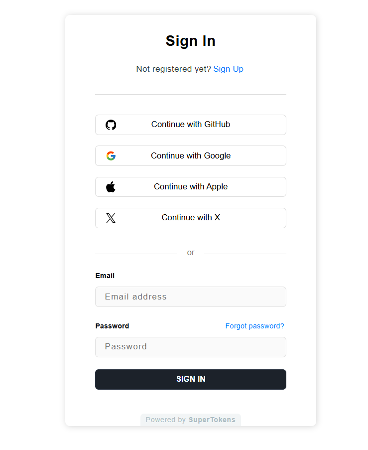

## Table of Contents

1. [Introduction](#introduction)
2. [What is SuperTokens?](#what-is-supertokens)
3. [The Modular Architecture of SuperTokens](#the-modular-architecture-of-supertokens)
   - [Frontend SDK](#frontend-sdk)
   - [Backend SDK](#backend-sdk)
   - [Core Microservice](#core-microservice)
4. [Frontend Integration](#frontend-integration)
   - [Automatic Setup Using CLI](#automatic-setup-using-cli)
   - [Manual Setup Steps](#manual-setup-steps)
     - [Install SuperTokens Web SDK](#install-supertokens-web-sdk)
     - [Create HomeView.vue](#create-homeviewvue)
     - [Architecture of SuperTokens SDK Setup](#architecture-of-supertokens-sdk-setup)
     - [Creating the /auth Route](#creating-the-auth-route)
     - [Initialize SuperTokens in main.ts](#initialize-supertokens-in-maints)
     - [Setup Routing to Show the Login UI](#setup-routing-to-show-the-login-ui)
     - [View the Login UI](#view-the-login-ui)
5. [Backend Integration](#backend-integration)
   - [Install Backend SDK](#install-backend-sdk)
   - [Initialize SuperTokens](#initialize-supertokens)
   - [Initialize Social Login Providers](#initialize-social-login-providers)
   - [Add the SuperTokens APIs & CORS Setup](#add-the-supertokens-apis--cors-setup)
   - [Add the SuperTokens Error Handler](#add-the-supertokens-error-handler)
6. [SuperTokens Core Setup](#supertokens-core-setup)
   - [Self-hosted Setup](#self-hosted-setup)
   - [Managed Service](#managed-service)
7. [Conclusion](#conclusion)

Building a secure and scalable authentication system from scratch can be a daunting task. Fortunately, SuperTokens is here to simplify the process and help you add robust authentication to your Vue.js application in no time. In this step-by-step guide, we'll walk you through the integration of SuperTokens' pre-built UI into your Vue.js app, allowing you to focus on building the core features of your application.

## What is SuperTokens?

SuperTokens is an open-source project that enables you to add auth to your app quickly. It gives you a pre-built auth UI and backend APIs for an end-to-end integration experience.

Before we dive into the code, let’s discuss the overall architecture.

## The Modular Architecture of SuperTokens

SuperTokens' architecture is designed to be modular and flexible, consisting of three main components:

- **Frontend SDK**: This is the library you'll use in your Vue.js app to render the pre-built authentication UI, including login, signup, and password reset forms.
- **Backend SDK**: This is the library you'll use in your backend to expose the authentication-related API endpoints.
- **Core Microservice**: This is the central service that handles all the authentication logic and communicates with the database. It can either be self-hosted using Docker or AWS, or it can be a managed service handled by the SuperTokens team.

SuperTokens simplifies authentication integration by separating its components, enabling you to incorporate secure user management into your app effortlessly. This approach shields you from the intricacies of authentication systems, allowing you to focus on your core application logic.

The modular structure of SuperTokens facilitates a straightforward implementation process, which we'll explore in detail through a step-by-step guide to setting up this powerful authentication solution in your project.


## Frontend Integration

SuperTokens offers an easy way to integrate authentication into your Vue.js application using its pre-built UI. Whether you're using React, Angular, or Vue.js, SuperTokens provides support across various frameworks. For mobile apps, please see the "Using your own UI" section in the SuperTokens documentation.

### Automatic Setup Using CLI

For the quickest setup, run the following command in your terminal:

```bash
npx create-supertokens-app@latest --recipe=thirdpartyemailpassword
```

This command automatically sets up your project with SuperTokens' Third-Party Email Password recipe. Once this is done, you can skip steps 1 and 2 in this section and move directly to setting up the SuperTokens core (Step 3).

Alternatively, you can manually integrate SuperTokens by following the steps below.

### Manual Setup Steps

1. **Install SuperTokens Web SDK**
    Start by installing the SuperTokens web SDK using the following command:

```bash
npm install supertokens-web-js
```

2. **Initialize the SuperTokens SDK**

Before initializing the SuperTokens SDK, let's explore how to integrate it into our Vue app.

But first, let's create a `HomeView` to have an unprotected route from which we can do the login.

#### Create HomeView.vue

Create a new file named `HomeView.vue` in your `src/views` directory and add the following code:

```html
<script lang="ts">
import * as Session from "supertokens-web-js/recipe/session";
import { defineComponent } from "vue";

export default defineComponent({
  data() {
    return {
      session: false,
      userId: "",
    };
  },
  mounted() {
    this.getUserInfo();
  },
  methods: {
    redirectToLogin() {
      window.location.href = "/auth";
    },
    async getUserInfo() {
      this.session = await Session.doesSessionExist();
      if (this.session) {
        this.userId = await Session.getUserId();
      }
    },
    async onLogout() {
      await Session.signOut();
      window.location.reload();
    },
  },
});
</script>

<template>
  <main>
    <div class="body">
      <h1>Hello</h1>

      <div v-if="session">
        <span>UserId:</span>
        <h3>{{ userId }}</h3>

        <button @click="onLogout">Sign Out</button>
      </div>
      <div v-else>
        <p>
          Visit the
          <a href="https://supertokens.com">SuperTokens tutorial</a> to learn
          how to build Auth under a day.
        </p>
        <button @click="redirectToLogin">Sign in</button>
      </div>
    </div>
  </main>
</template>

<style scoped>
.body {
  text-align: center;
  display: flex;
  flex-direction: column;
  justify-content: center;
  align-items: center;
  height: 100vh;
}
.user {
  display: flex;
  flex-direction: row;
  justify-content: space-between;
  align-items: baseline;
  padding: 0.1rem;
}
span {
  margin-right: 0.3rem;
  font-size: large;
}
h3 {
  color: #ff3e00;
}
h1 {
  color: #ff3e00;
  text-transform: uppercase;
  font-size: 4em;
  font-weight: 100;
}
button {
  cursor: pointer;
  background-color: #ffb399;
  border: none;
  color: rgb(82, 82, 82);
  padding: 0.75rem;
  margin: 2rem;
  transition: all 0.5s ease-in-out;
  border-radius: 2rem;
  font-size: large;
}
button:hover {
  transform: scale(1.1);
  background-color: #ff3e00;
  color: white;
}
</style>
```

### Architecture of SuperTokens SDK Setup

The `supertokens-web-js` SDK is responsible for session management and providing helper functions to check if a session exists or validate access token claims on the frontend. We will initialize this SDK in the root of your Vue app so that all pages can use it.

We will create an `/auth*` route in the Vue app to render the pre-built UI, which will also need to be initialized, but only on that route.

### Creating the /auth Route

Create a new file `AuthView.vue`. This Vue component will be used to render the auth component:

```html
<script lang="ts">
import { defineComponent, onMounted, onUnmounted } from 'vue';
export default defineComponent({
    setup() {
        const loadScript = (src: string) => {
            const script = document.createElement('script');
            script.type = 'text/javascript';
            script.src = src;
            script.id = 'supertokens-script';
            script.onload = () => {
                (window as any).supertokensUIInit("supertokensui", {
                    appInfo: {
                        appName: "<YOUR_APP_NAME>",
                        apiDomain: "<YOUR_API_DOMAIN>",
                        websiteDomain: "<YOUR_WEBSITE_DOMAIN>",
                        apiBasePath: "/auth",
                        websiteBasePath: "/auth"
                    },
                    recipeList: [
                        (window as any).supertokensUIEmailPassword.init(),
                        (window as any).supertokensUIThirdParty.init({
                            signInAndUpFeature: {
                                providers: [
                                    (window as any).supertokensUIThirdParty.Github.init(),
                                    (window as any).supertokensUIThirdParty.Google.init(),
                                    (window as any).supertokensUIThirdParty.Facebook.init(),
                                    (window as any).supertokensUIThirdParty.Apple.init(),
                                ]
                            }
                        }),
                        (window as any).supertokensUISession.init(),
                    ],
                });
            };
            document.body.appendChild(script);
        };

        onMounted(() => {
            loadScript('https://cdn.jsdelivr.net/gh/supertokens/prebuiltui@v0.47.0/build/static/js/main.00ec3e91.js');
        });

        onUnmounted(() => {
            const script = document.getElementById('supertokens-script');
            if (script) {
                script.remove();
            }
        });
    },
});
</script>

<template>
    <div id="supertokensui" />
</template>
```

In the `loadScript` function, we provide the SuperTokens config for the UI. This includes email-password, session, and social login recipes with GitHub, Google, Facebook, and Apple login buttons.

### main.ts

Next, initialize the `supertokens-web-js` SDK in your Vue app's `main.ts` file. This will provide session management across your entire application.

Copy and paste this in your `main.ts`:

```ts
import { createApp } from "vue";
import SuperTokens from "supertokens-web-js";
import Session from "supertokens-web-js/recipe/session";
import App from "./App.vue";
import router from "./router";

SuperTokens.init({
    appInfo: {
        appName: "<YOUR_APP_NAME>",
        apiDomain: "<YOUR_API_DOMAIN>",
        apiBasePath: "/auth",
    },
    recipeList: [
        Session.init(),
    ],
});

const app = createApp(App);

app.use(router);
app.mount("#app");
```

### 3) Setup Routing to Show the Login UI

Update your Vue router so that all auth-related requests load the `AuthView` component.

```ts
import { createRouter, createWebHistory } from "vue-router";\
import HomeView from "../views/HomeView.vue";\
import AuthView from "../views/AuthView.vue";

const router = createRouter({\
    history: createWebHistory(import.meta.env.BASE_URL),\
    routes: [\
        {\
            path: "/",\
            name: "home",\
            component: HomeView,\
        },\
        {\
            path: "/auth",\
            name: "auth",\
            component: AuthView,\
        },\
    ],\
});

export default router;
```

### 4) View the Login UI

You can view the login UI by visiting /auth in your browser. You can also see all the designs of the pre-built UI for each page on this [link](https://master--6571be2867f75556541fde98.chromatic.com/?path=/story/auth-page--playground).


At this stage, you've successfully integrated your front end with SuperTokens. The next section will guide you through setting up your backend.


### Backend Integration

SuperTokens provides a powerful backend authentication service that can be easily integrated with various backend frameworks like Node.js, GoLang, Python, and others. This guide will walk you through setting up SuperTokens with Node.js, specifically using Express.

#### 1. Install Backend SDK

Begin by installing the SuperTokens Node SDK via npm:

```bash
npm install supertokens-node
```

#### 2. Initialize SuperTokens

To get started, you need to initialize SuperTokens in your server's initialization file. Here's how you can do it with Node.js:

```ts
import supertokens from "supertokens-node";
import Session from "supertokens-node/recipe/session";
import EmailPassword from "supertokens-node/recipe/emailpassword";
import ThirdParty from "supertokens-node/recipe/thirdparty";


supertokens.init({
    framework: "express",
    supertokens: {
        // Replace with your core instance URL or self-hosted core
        connectionURI: "https://try.supertokens.com",
        // apiKey: "<API_KEY(if configured)>",
    },
    appInfo: {
        // Information about your app
        appName: "<YOUR_APP_NAME>",
        apiDomain: "<YOUR_API_DOMAIN>",
        websiteDomain: "<YOUR_WEBSITE_DOMAIN>",
        apiBasePath: "/auth",  // The base path for SuperTokens APIs
        websiteBasePath: "/auth"  // The base path where the login UI will be rendered
    },
    recipeList: [
        EmailPassword.init(),
        ThirdParty.init({
            // Add third-party login providers in the next step
        }),
        Session.init(), // Initializes session features
    ]
});

```

### 3) Initialize Social Login Providers

To enable third-party authentication, populate the providers array with the relevant OAuth providers. Here's an example:

Copy this code and replace SuperTokens.init() in the above server initialization file:

### Final Thoughts

With just a few lines of code, you've added a fully functional, pre-built authentication UI to your Vue.js application. SuperTokens allows you to integrate email/password and social logins easily, and its modular architecture ensures that it's flexible enough for your specific use case.

For more advanced use cases, such as customizing the login UI or handling multiple recipes in parallel, be sure to check out the official SuperTokens documentation.

```ts
SuperTokens.init({
    appInfo: {
        apiDomain: "<YOUR_API_DOMAIN>",
        appName: "<YOUR_APP_NAME>",
        websiteDomain: "<YOUR_WEBSITE_DOMAIN>",
    },
    recipeList: [
   EmailPassword.init()
        ThirdParty.init({
            signInAndUpFeature: {
                providers: [
                    {
                        config: {
                            thirdPartyId: "google",
                            clients: [{
                                clientId: "YOUR_GOOGLE_CLIENT_ID",
                                clientSecret: "YOUR_GOOGLE_CLIENT_SECRET"
                            }]
                        }
                    },
                    {
                        config: {
                            thirdPartyId: "github",
                            clients: [{
                                clientId: "YOUR_GITHUB_CLIENT_ID",
                                clientSecret: "YOUR_GITHUB_CLIENT_SECRET"
                            }]
                        }
                    },
                    {
                        config: {
                            thirdPartyId: "apple",
                            clients: [{
                                clientId: "YOUR_APPLE_CLIENT_ID",
                                additionalConfig: {
                                    keyId: "YOUR_KEY_ID",
                                    privateKey: "YOUR_PRIVATE_KEY",
                                    teamId: "YOUR_TEAM_ID"
                                }
                            }]
                        }
                    }
                ],
            }
        }),
       
    ]
});
```

Ensure that you replace the placeholder values ("YOUR_GOOGLE_CLIENT_ID", "YOUR_GOOGLE_CLIENT_SECRET", etc.) with your actual OAuth credentials. For production, make sure to use your own OAuth keys.

### 4) Add the SuperTokens APIs & CORS Setup

You need to set up middleware in your Express application to handle SuperTokens' APIs and manage CORS. Add this configuration before all your routes in your backend's index.ts:


```ts
import express from "express";
import cors from "cors";
import supertokens from "supertokens-node";
import { middleware } from "supertokens-node/framework/express";


let app = express();


app.use(cors({
    origin: "<YOUR_WEBSITE_DOMAIN>",
    allowedHeaders: ["content-type", ...supertokens.getAllCORSHeaders()],
    credentials: true,
}));


// IMPORTANT: CORS should be configured before the SuperTokens middleware.
app.use(middleware());


// Define your API routes here
```

This middleware setup adds several key APIs, including:

- POST /auth/signinup: For signing up/signing in a user using a third-party provider.
- POST /auth/signup: For signing up a user with email & password.
- POST /auth/signin: For signing in a user with email & password.


### 5) Add the SuperTokens Error Handler

To properly handle errors related to SuperTokens, add the following error handler middleware after your routes in your backend's index.ts:

```ts
import { errorHandler } from "supertokens-node/framework/express";
import express from "express";


let app = express();


// Define your API routes here


// Add the SuperTokens error handler after your routes
app.use(errorHandler());


// Your custom error handler
app.use((err, req, res, next) => {
    // Handle errors
});
```


## SuperTokens Core Setup

During the backend setup, we are using https://try.supertokens.com as the connectionURI for the Core, which is a demo instance hosted by the SuperTokens team. This instance is available for as long as needed, but once you decide to fully integrate SuperTokens into your application, it's recommended to transition to either a self-hosted or managed version of the Core.

For a [self-hosted](https://supertokens.com/docs/thirdpartyemailpassword/pre-built-ui/setup/core/without-docker) setup, you can deploy the Core using [Docker](https://supertokens.com/docs/thirdpartyemailpassword/pre-built-ui/setup/core/with-docker) or through cloud platforms like [AWS](https://supertokens.com/docs/thirdpartyemailpassword/pre-built-ui/setup/core/aws-setup-with-stacksnap). This option offers greater control over your infrastructure, allowing you to customize the deployment according to your specific needs.

Alternatively, SuperTokens offers a [managed service](https://supertokens.com/docs/thirdpartyemailpassword/pre-built-ui/setup/core/saas-setup), where they handle the hosting and maintenance of the Core for you. This option provides the advantage of reduced operational overhead, as the SuperTokens team manages updates, scaling, and security for you.


## Conclusion

By following this guide, you've successfully integrated SuperTokens' pre-built authentication UI into your Vue.js application. With this setup in place, you can now concentrate on developing your app's core features, while SuperTokens takes care of the complexities of user authentication.

For additional information and advanced use cases, be sure to explore the detailed [documentation](https://supertokens.com/docs/thirdpartyemailpassword/introduction) available on the SuperTokens website. Should you have any questions or require further assistance, the SuperTokens team is always ready to help.