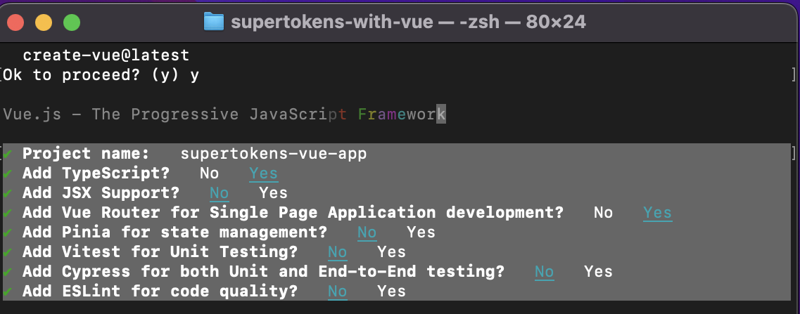
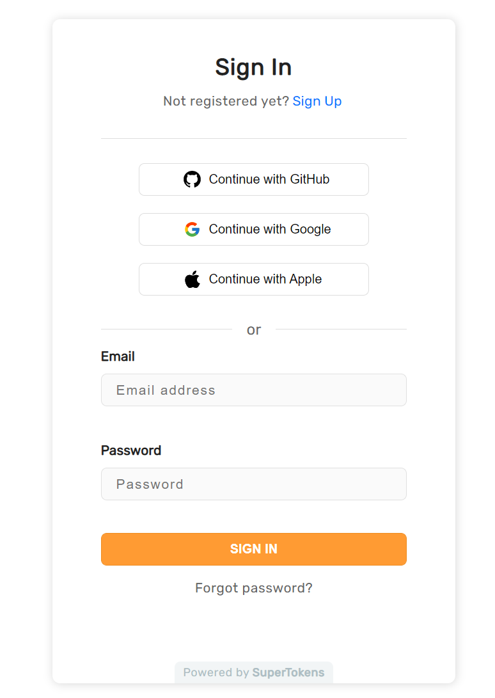
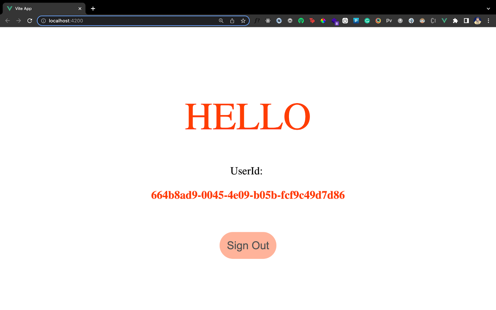

Building your own auth service can be tedious, complex and time-consuming. To save time, developers often resort to using third party auth services for auth. This post will guide you on how to add authentication to a VueJS app with SuperTokens. 

## What is SuperTokens?

[SuperTokens](https://supertokens.com) is an open source project which enables you to add auth to your app quickly. It gives you a pre-built auth UI and backend APIs for an end-to-end integration experience. 

Before we dive into the code, let’s discuss the overall architecture.

## Architecture

SuperTokens is built out of three components:
- Frontend SDK
- Backend SDK
- Core microservice that talks to a database.

We’ll use the SuperTokens frontend SDK in our Vue app to add all the auth forms (login, signup, reset password etc). You can also build your own UI using the helper functions from frontend SDKs, but we will focus on the pre built UI in this blog. 

The pre built UI are ReactJS components (provided by the [`supertokens-auth-react` library](https://github.com/supertokens/supertokens-auth-react)). In order to use them, we will have to render React components in our VueJS app.

For the backend, we will use the NodeJS SDK provided by SuperTokens ([`supertokens-node` library](https://github.com/supertokens/supertokens-node)). This SDK exposes all of the auth APIs (like `/auth/signin`, `/auth/signout` etc) via a middleware, for the frontend to call. When these APIs are called, the SDK will talk to the SuperTokens Core microservice to read and write information to the database.

The SuperTokens core service can be either self hosted (and connected to your own db), or be hosted by the team behind SuperTokens (sign up on [supertokens.com](https://supertokens.com)).

> In order to keep the app’s bundle size small, we will limit the use of the `supertokens-auth-react` SDK to all of the auth related routes (`/auth/*` by default), and use a lighter weight, vanilla JS SDK ([`supertokens-web-js` library](https://github.com/supertokens/supertokens-web-js)) for all other routes in our app. Finally, we will then use code splitting and lazy importing to make sure that the `supertokens-auth-react` SDK is only bundled when visiting the `/auth/*` routes.


## Frontend Integration

### 1. Setup and Install

Create a new Vue + Typescript app:

```bash
npm init vue@latest
```

In the prompt, select Typescript and Vue Router:



Once that’s done, head inside the project and install the following dependencies:

```bash
npm i --save cors express npm-run-all react supertokens-auth-react react-dom supertokens-node
```

The `supertokens-auth-react` library will be used on the frontend to render the login UI, and the `supertokens-node` library will be used on the backend to expose the auth API routes.

### 2. Call the `supertokens-auth-react` and `supertokens-web-js` `init` function

Start by create the `AuthView` component inside `/src/views` folder. This component will render the SuperTokens React component to handle authentication on the frontend:

```html
<script lang="ts">
    export default {
        // See next sections
    }
</script>

<template>
    <main>
        <div id="authId" />
    </main>
</template>
```

Notice that we have made a `<div>` element with the `id="authId"`. This is where we will render the react components provided by SuperTokens.

Next, let's create a file - `/src/components/Supertokens.tsx` which is the actual React component that we will be rendering. Inside this file, we will initialize the `supertokens-auth-react` SDK and use it in the React `render` function.

```ts
import * as React from "react";
import * as SuperTokens from "supertokens-auth-react";
import * as ThirdPartyEmailPassword from "supertokens-auth-react/recipe/thirdpartyemailpassword";
import { Github, Google } from "supertokens-auth-react/recipe/thirdpartyemailpassword";
import Session from "supertokens-auth-react/recipe/session";

SuperTokens.init({
   appInfo: {
       appName: "SuperTokens Demo App",
       apiDomain: "http://localhost:3001",
       websiteDomain: "http://localhost:4200",
   },
   recipeList: [
       ThirdPartyEmailPassword.init({
           signInAndUpFeature: {
               providers: [Github.init(), Google.init()],
           }
       }),
       Session.init(),
   ],
});

class SuperTokensReactComponent extends React.Component {
   override render() {
       if (SuperTokens.canHandleRoute()) {
           return SuperTokens.getRoutingComponent();
       }
       return "Route not found";
   }
}

export default SuperTokensReactComponent;
```

> The snippet above uses the `ThirdPartyEmailPassword` recipe (social + email / password login). You can choose another recipe as well by following the quick setup section in the [guides on supertokens.com](https://supertokens.com/docs/guides).

Next, we will load this `SuperTokensReactComponent` inside the `AuthView` component:

```html
<script lang="ts">
import * as React from "react";
import * as ReactDOM from "react-dom";
import SuperTokensReactComponent from "../components/Supertokens";

export default{
    mounted(){
        ReactDOM.render(React.createElement(SuperTokensReactComponent),
            document.getElementById('authId'));
    }
    beforeDestroy(){
        ReactDOM.unmountComponentAtNode(document.getElementById('authId') as Element);
    }
}
</script>
```

The above takes care of the `/auth/*` related routes. For all the other pages in our app, we want to be able to know if a session exists and extract information from it. To do this, we will use the `supertokens-web-js` SDK. We initialize this SDK in our Vue app's root file `/src/main.ts`:

```ts
import Vue from "vue";
import VueCompositionAPI, { createApp, h } from "@vue/composition-api";
import * as SuperTokens from "supertokens-web-js";
import * as Session from "supertokens-web-js/recipe/session";

import App from "./App.vue";
import router from "./router";

SuperTokens.init({
    appInfo: {
        appName: "SuperTokens Demo",
        apiDomain: "http://localhost:3001",
    },
    recipeList: [Session.init()],
});

Vue.use(VueCompositionAPI);

const app = createApp({
    router,
    render: () => h(App),
});

app.mount("#app");
```

> The config for the `Session.init` call, the `apiDomain` and the `appName` for both the `init` functions (`supertokens-auth-react` and `supertokens-web-js`) should always be the same.

### 3. Setup Routing to show the Login UI

Vue CLI already generates the initial routing for our app inside `/src/router.index.ts`. We'll update this file so that all `/auth/*` routes load the `AuthView` component we created earlier:

```ts
import Vue from 'vue'
import VueRouter from 'vue-router'
import HomeView from '../views/HomeView.vue'

Vue.use(VueRouter)

const router = new VueRouter({
    mode: 'history',
    base: import.meta.env.BASE_URL,
    routes: [{
        path:'/auth*',
        name:'auth',
        component: () => import('../views/AuthView.vue'),
    }]
})

export default router
```

The path for the `AuthView` component is `/auth*`. The `*` indicates that any sub / nested paths with `/auth` as the parent path should be rendered by the `AuthView` component. The `AuthView` component will in turn render the ReactJS component we created earlier which will use the `supertokens-auth-react` SDK to show the auth UI. 

We lazy load the `/auth` route because the `AuthView` component loads ReactJS as a dependency. Lazy loading makes sure that these dependencies are only injected in the `AuthView` component when you visit the `/auth/*` routes. For all of the other routes, these dependencies are not imported thereby maintaining the overall bundle size of the application.

### 4. View the Login UI

If you now visit http://localhost:4200/auth, you should see the login UI as shown below:



## Backend Integration

You can see the backend quick setup section [in our docs on supertokens.com](https://supertokens.com/docs/thirdpartyemailpassword/quick-setup/backend), or even copy the code from [our example app](https://github.com/supertokens/supertokens-auth-react/blob/master/examples/with-vue-thirdpartyemailpassword/server.ts). As a summary:

- You need to initialize the `supertokens-node` SDK and provide it the `recipeList` (similar to how you did on the frontend).
- Then you need to setup `CORS`, add the SuperTokens `middleware` and `errorHandler` to your app. The SuperTokens `middleware` exposes all the auth related API routes (like sign in, sign up, sign out etc) to the frontend.
- Finally, you need to provide the `connectionURI` (location) of the SuperTokens core. To get started quickly, you can provide it `https://try.supertokens.com` (this is a core that we host for demo purposes). 

Once you’ve successfully setup your server, you can now try and sign up on the frontend.

## Session management

Inside `/src/views/HomeView.vue` file we'll check if the user is authenticated and conditionally render a template. For authenticated users, we can show them a logout button with information about their session (like their `userId`). For unauthenticated users, we can show them a button to route to the `/auth` page. 

```ts
<script lang="ts">
import * as Session from "supertokens-web-js/recipe/session";
export default {
    data() {
        return {
            session: false,
            userId: "",
        };
    },
    mounted() {
        this.getUserInfo();
    },
    methods: {
        redirectToLogin() {
            window.location.href = "/auth";
        },
        async getUserInfo() {
            this.session = await Session.doesSessionExist();
            if (this.session) {
                this.userId = await Session.getUserId();
            }
        },
        async onLogout() {
            await Session.signOut();
            window.location.reload();
        },
    },
};
</script>

<template>
    <main>
        <div class="body">
            <h1>Hello</h1>

            <div v-if="session">
                <span>UserId:</span>
                <h3>{{ userId }}</h3>

                <button @click="onLogout">Sign Out</button>
            </div>
            <div v-else>
                <p>
                    Visit the <a href="https://supertokens.com">SuperTokens tutorial</a> to learn how to build Auth
                    under a day.
                </p>
                <button @click="redirectToLogin">Sign in</button>
            </div>
        </div>
    </main>
</template>
```

To load the `HomeView` component on `/` we'll update the `/src/router/index.ts` file:

```ts
const router = new VueRouter({
    // ...
    routes: [{
        path: "/",
        name: "home",
        component: HomeView,
    }, /*...*/],
});
```

If you now visit http://localhost:4200, you should see the following page:



## SuperTokens Core Setup

Whilst doing the backend setup, we are using `https://try.supertokens.com` as the `connectionURI` for the core. This is a demo core instance hosted by the team of SuperTokens. You can use this for as long as you like, but when you are committed to using SuperTokens, you should switch to a [self hosted](https://supertokens.com/docs/thirdpartyemailpassword/quick-setup/core/with-docker) or a [managed version](https://supertokens.com/docs/thirdpartyemailpassword/quick-setup/core/saas-setup) of the core.

## Conclusion

To summarise, we used the ReactJS SDK provided by SuperTokens to show the pre-built login UI for our Vue app. We also optimised the bundle size so that the ReactJS SDK is only loaded for auth related routes.
Useful links:

- [Example Vue app](https://github.com/supertokens/supertokens-auth-react/tree/master/examples/with-vue-thirdpartyemailpassword)
- [Discord community (to ask questions)](https://supertokens.com/discord)
- [List of recipes / auth methods](https://supertokens.com/docs/guides)

