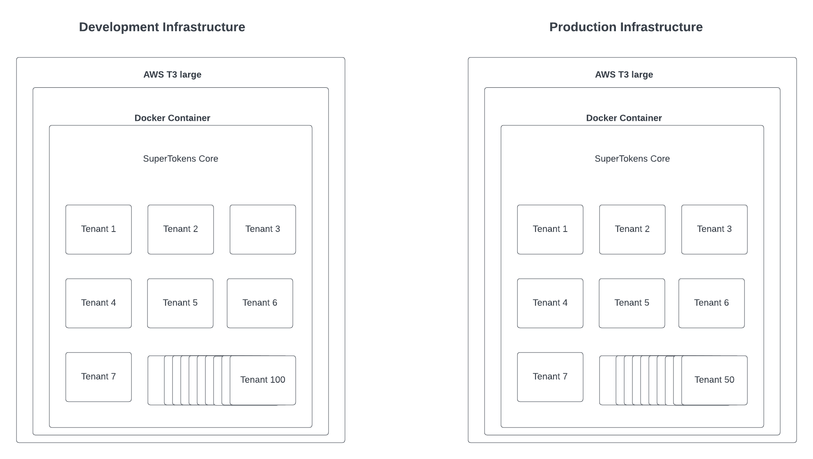

This is part 2 in a two-part series where we go over how we cut down our AWS billing by 50%.

In this part we will go over SuperTokens Multi-tenancy feature and how it evolved our deployment cycle to cut our AWS billing by 50%.

As a recap here's what we discussed in our [last post](../how-we-cut-our-aws-costs/):
- SuperTokens infrastructure and deployment cycle.
- Improvements made to the SuperTokens deployment cycle to speed up production deployment times by 30%
- How our infra costs were not sustainable and why it needed to change.

## What is multi-tenancy?

As mentioned in Part 1, "We saw multi-tenancy as an opportunity to optimize the utilization of our EC2 instances by consolidating our core instances. This would cut down our costs while also providing the expected performance"... But what does that mean? Lets break it down. Multi-tenancy is a feature, typically used by B2B SaaS companies to allow multiple organizations to sign up to their SaaS app, with the ability for each organization to have their own login methods or SSO configurations. Additionally, user pools can also be segmented. Heres how it helped us.

## How we implemented SuperTokens Multi-tenancy 

With multi-tenancy we re-architected the way we host and manage our users. Initially whenever a signed up and created an app with SuperTokens, it would trigger the following flow:

[SuperTokens Old Deployment Process](./supertokens-deployment-process.png)

In this process each development and production SuperTokens core ran in their own separate EC2 instances. With Multi-tenancy we now treat all SuperTokens customers as tenants. This means that we could now host multiple users on a single SuperTokens instance. Our deployment process now looks like this:

[SuperTokens New Deployment Process](./supertokens-deployment-process-new.png.png)

As you can see in the new deployment strategy, when a new user signs up, we now create a new tenant in a SuperTokens instance. These instances run in `T3 large` instances. In our testing, for development mode, up to 100 tenants can be run seamlessly on a single instance and for production mode, up to 50 tenants can be created on single instance.

- 100 apps per container. One example compared to 10 instances.

- Bit larger. T3 medium or t3 large 4x price still less than 10. Major expense is ec2 instances and rds. WIth rds last month we use reserved instances to reduce the costs.

Production 50 t3 large non paying

Paying is t3 small individual 
