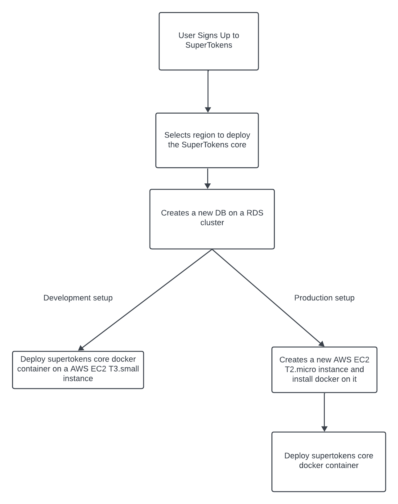
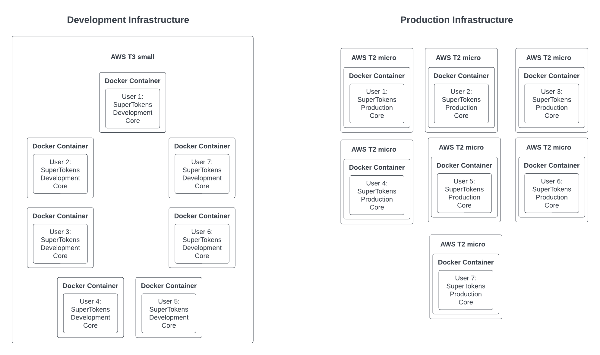

In this two part series we will go over SuperTokens manged service infrastructure and the changes we made to cut our AWS billing by ore than 60%. 

**Part 1: How does the SuperTokens managed service work and why does it need to change.**

## Introduction

The SuperTokens managed service powers numerous web products, mobile applications, and services and is primarily hosted on AWS. Our infrastructure leverages a suite of AWS tools, including AWS RDS for our database, EC2 instances for SuperToken deployments, and System Manager for instance management and automation. Over time, we've refined our deployment cycle to enhance stability, fault tolerance, and cost efficiency but our most recent update has yielded our biggest savings yet, slashing costs by over 60% while achieving [record scalability](https://twitter.com/supertokensio/status/1701600309397852270). 

## What was the SuperTokens infrastructure like?

To gain a better understanding of the SuperTokens infrastructure, it's crucial to grasp the initial deployment cycle. 

SuperTokens deploys two instances of the SuperTokens core for each user, consisting of a development and production core instance. Here's the breakdown of each:

**Development SuperTokens Core:**
The Development core instance runs on an *EC2 T3 small* instance. To maximize resource utilization, we deploy up to seven development core instances on the same *T3 small* instance. This configuration results in a remarkably swift setup for new development cores, typically taking a mere 15-20 seconds and is suitable for testing purposes.

**Production SuperTokens Core:**
In contrast, the Production SuperTokens core follows a different deployment strategy. Each production SuperTokens core instance is hosted on a dedicated *EC2 T2 micro* instance. This means that when a new production SuperTokens core instance needs to be created, a fresh *T2 micro* instance is spun up, and the operating system with Docker needs to be installed. Consequently, this process requires additional time compared to the development deployment method, with an average deployment time of around 4-5 minutes.

For example, if 7 users were to sign up for SuperTokens, it would look like the following:

### Initial Improvements to the deployment cycle

One of our initial optimizations focused on reducing the startup time for generating production instances. We recognized that creating a custom [AMI](https://docs.aws.amazon.com/AWSEC2/latest/UserGuide/AMIs.html)(Amazon Machine Image) pre-installed with Docker alongside the operating system that would cut down on start-up time. This change trimmed approximately 45 seconds from the production deployment procedure, reducing the setup time to approximately 3-4 minutes.

In retrospect, another avenue for improvement that we identified was the usage of [AWS Reserved Instances](https://aws.amazon.com/ec2/pricing/reserved-instances/). While this approach would have entailed an upfront cost, it would have resulted in substantial long-term savings.

So what prompted us to change our deployment process?

## Why we had to change our deployment process
The past year has been quite a ride for SuperTokens. We rolled a host of new features and saw a big uptick in users. But, as our user numbers climbed, so did our infrastructure costs. With our AWS credits running out soon, we knew we had to do something to cut our expenses.

With the release of our new multi-tenancy feature  we saw the opportunity to consolidate core instances to optimize the utilization of our EC2 instances to cut down our costs while also providing the expected performance. 

In part 2 we will go over the changes we made to achieve this. 

