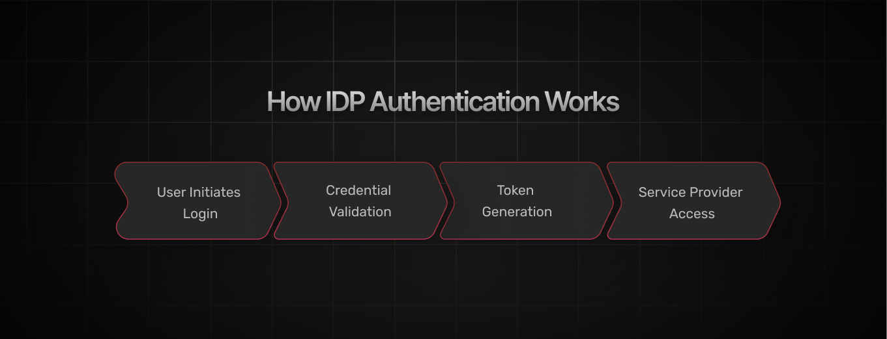
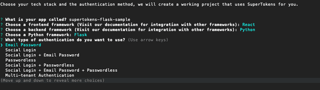
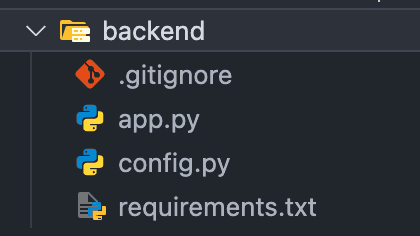

Picture a master key that effortlessly unlocks every secure door in your digital world. That’s the essence of Identity Provider (IDP) authentication—a centralized system that verifies your identity once and grants you seamless access across multiple applications. Instead of juggling a different set of credentials for every service, an IDP becomes your trusted digital gatekeeper, ensuring streamlined logins and robust protection against cyber threats.

In this article, we’ll break down the mechanics of IDP authentication, spotlight its transformative benefits, and explore how cutting-edge tools like SuperTokens are simplifying the integration process. Whether you’re a developer aiming for efficiency or a security professional focused on safeguarding access, join us as we unlock the future of secure digital identity management.

## What Is IDP Authentication?

Identity Provider (IDP) authentication is a process where an external service, called an IDP, verifies the identity of users and grants them access to applications. By acting as a trusted intermediary, IDPs handle authentication securely, allowing applications to offload the complexity of managing user credentials. In simple terms, the IDP ensures that the person trying to log in is who they claim to be.

IDPs play a crucial role in modern access management by streamlining the authentication process across multiple applications. Instead of users maintaining separate credentials for every app they access, an IDP centralizes identity verification, saving time and enhancing security. Popular examples of IDPs include Google, which powers logins for countless websites through Google accounts, [Okta](https://www.okta.com/), a favorite among enterprises for managing employee access, and [SuperTokens](https://supertokens.com), which offers flexible and developer-friendly solutions for integrating IDP authentication.

**Consider this scenario**: Imagine you're attending a sprawling music festival with several stages and activities spread across a large area. Instead of showing your ticket at every single event or stage, you’re given a festival wristband at the main entrance. This wristband has been pre-verified and serves as your all-access pass, allowing you to move freely between different stages and activities without needing to prove your identity repeatedly. In this analogy, the wristband is like the IDP—it confirms your identity once and then lets you enjoy the entire festival (or access multiple applications) seamlessly and securely.

This streamlined approach not only simplifies the login process but also enhances overall security by centralizing identity verification in a trusted service.

## How IDP Authentication Works

IDP authentication operates through a sequence of steps designed to securely validate user identity and grant access to resources. Here’s a breakdown of how the process typically works, coupled with real-world examples to illustrate its application:



1. **User Initiates Login**: When a user attempts to log in to an application, they are redirected to the IDP’s login page. For instance, when accessing a third-party app like Slack using Google SSO, the user is seamlessly redirected to Google’s login portal to authenticate.
2. **Credential Validation**: The IDP validates the credentials entered by the user. This step can include verifying passwords, biometrics (like fingerprints or facial recognition), or multi-factor authentication (MFA) codes. For example, a financial app may require both a password and a one-time code sent via SMS for additional security.
3. **Token Generation**: Upon successful validation, the IDP generates an authentication token—a digital certificate confirming the user’s identity. This token is securely sent back to the application. For instance, a user logging into their Microsoft 365 account receives a token from Azure AD that allows them to access email, documents, and other services without repeated logins.
4. **Service Provider Access**: The application (or Service Provider) validates the token received from the IDP. If the token is valid and unexpired, the user is granted access to the application’s features. An e-commerce website, for instance, might validate a token from Facebook to enable users to log in and save their cart for future purchases.

### Common Protocols for IDP Authentication
Several protocols underpin this process, ensuring compatibility and security between IDPs and applications:

- **[SAML (Security Assertion Markup Language)](https://supertokens.com/docs/authentication/enterprise/saml/what-is-saml)**: is widely used in enterprise environments to facilitate single sign-on (SSO). A classic example is employees accessing corporate tools like Salesforce or Workday through their company’s identity portal.

- **[OAuth 2.0 and OpenID Connect](https://supertokens.com/blog/oauth)**
These protocols are favored for their flexibility and scalability, especially in consumer-facing applications. For example, Spotify uses OAuth 2.0 to let users log in with their Google or Facebook accounts without exposing their passwords to Spotify.

## Benefits of IDP Authentication

### Centralized Identity Management

One of the most significant advantages of IDP authentication is the consolidation of user credentials across multiple applications. For example, a company using Google Workspace allows employees to access tools like Gmail, Google Drive, and Google Meet with a single Google account. This not only simplifies IT management but also reduces the risk of weak or reused passwords across applications.

- **Fewer Password Resets**: Centralized identity systems significantly cut down password reset requests, which can account for a large percent of IT support tickets in large organizations.
- **Audit Trails**: IDPs like Okta and Azure AD provide comprehensive logging and reporting features, making it easier to monitor and audit user access.

### Enhanced Security

IDPs bolster security by integrating advanced authentication mechanisms such as Multi-Factor Authentication (MFA). For instance, enabling MFA in Microsoft Azure AD adds an extra layer of protection, requiring users to verify their identity with SMS codes, biometrics, or authenticator apps. This approach ensures that even if passwords are compromised, unauthorized access remains unlikely.

- **Adaptive Authentication**: Many IDPs now use machine learning to analyze login behavior, flagging unusual activity and requiring additional verification only when needed.

- **Token-Based Security**: Protocols like OAuth 2.0 ensure sensitive information is never exposed, as tokens replace credentials during authentication flows.

### Improved User Experience

Single Sign-On (SSO) capabilities eliminate the need for multiple logins, reducing frustration and improving the overall user experience.

- **Faster Onboarding**: New employees or users can instantly access all required applications once their IDP account is created, reducing time-to-action.
- **Cross-Device Access**: With SSO, users can seamlessly transition between devices (e.g., logging in on both a laptop and mobile app) without additional steps.

### Scalability

IDP solutions are designed to scale effortlessly (be it on their cloud, or your), making them ideal for organizations managing large user bases. For instance, cloud-based IDPs like Auth0 or SuperTokens can handle authentication for millions of users, enabling e-commerce platforms or SaaS businesses to grow without overhauling their security infrastructure. This scalability is essential for enterprises and global organizations that regularly onboard new employees, customers, or partners.

- **Tenant Management**: Modern IDPs like SuperTokens support multi-tenancy, enabling businesses to manage multiple customer groups or internal divisions with separate IDPs.

- **Customizable Workflows**: Many IDPs allow organizations to implement workflows tailored to their needs, such as tiered user access or region-based authentication requirements.

## Common Use Cases for IDP Authentication

### Enterprise Access Management
In modern workplaces, controlling employee access to corporate applications is a top priority. IDPs streamline this by providing centralized control over who can access sensitive resources, based on predefined roles and permissions.

- **Role-Based Access Control (RBAC)**: Enterprise tools like Okta allow IT administrators to assign permissions based on roles (e.g., HR, finance, or engineering), ensuring employees only access the tools they need.
- **Quick Deprovisioning**: When employees leave, their access can be revoked instantly across all systems from the IDP, reducing the risk of lingering credentials.

### SaaS Applications
For SaaS providers, offering customers Single Sign-On (SSO) capabilities improves both security and user experience. By integrating with common IDPs, SaaS companies allow their customers to use existing credentials, reducing friction.

- **Team Collaboration Tools**: Apps like Slack and Trello support SSO, enabling teams to authenticate via corporate IDPs like Google Workspace or Azure AD. This ensures seamless onboarding for new team members.
- **Scalable Multi-Tenancy**: IDPs like SuperTokens support multi-tenancy, allowing SaaS platforms to configure unique authentication setups for different customer organizations.

### E-Commerce
In e-commerce, smooth and secure login experiences can directly impact sales. IDPs eliminate the need for customers to create and remember new passwords for every store they shop at.

- **Faster Checkout**: Retailers like Amazon allow customers to log in with their Google or Apple ID, streamlining the checkout process and reducing cart abandonment rates.
- **Improved Fraud Prevention**: By using IDPs with advanced authentication protocols and MFA, e-commerce platforms can mitigate account takeover risks.

### Educational Platforms
Educational institutions increasingly rely on IDPs to manage logins for students, faculty, and staff. Integration with institutional IDPs enhances security while simplifying access to digital resources.

- **Institutional Credentials**: Universities often use identity systems like Shibboleth or Okta to provide students and staff access to platforms like Canvas, Zoom, and library databases.
- **Temporary Access for Guests**: Some IDPs offer flexible access for guest lecturers or visiting students, ensuring their credentials are valid only during their stay.

## Key Features of a Robust IDP Solution

### Support for Multiple Protocols
A robust IDP solution must support a range of authentication protocols, such as SAML, OAuth 2.0, and OpenID Connect, to ensure compatibility with diverse applications and systems.

- **SAML**: Widely used in enterprise environments for Single Sign-On (SSO), SAML is crucial for integrating legacy systems with modern cloud applications. For instance, organizations often use SAML to link HR platforms like Workday with their internal portals.
- **OAuth 2.0 and OpenID Connect**: These protocols are preferred for their scalability and ease of use in consumer-facing applications. OpenID Connect, built on top of OAuth 2.0, adds an identity layer, making it suitable for platforms like social media logins on Spotify or gaming platforms like Xbox.

### Multi-Factor Authentication (MFA)
MFA is a critical feature for enhancing security by requiring users to verify their identity using two or more factors.

- **Multiple MFA Options**: Leading IDPs like Okta or SuperTokens offer various MFA methods, including email-based codes, SMS, TOTP (Time-Based One-Time Passwords), and hardware tokens like YubiKey.
- **Contextual MFA**: Advanced IDPs enable adaptive MFA, where additional verification is required only under suspicious circumstances, such as login attempts from a new device or an unusual location.

### Role-Based Access Control (RBAC)
RBAC allows organizations to assign permissions based on user roles, ensuring employees, customers, or partners can only access what is necessary for their tasks.

- **Granular Permissions**: With RBAC, companies can create detailed policies, such as granting read-only access to interns or limiting financial data access to specific executives.
- **Dynamic Roles**: Some IDPs support dynamic role updates, automatically adjusting permissions when users change departments or are promoted within the organization.

### Session Management
Effective session management is essential for maintaining security and providing a seamless user experience.

- **Secure Token Storage**: IDPs use encrypted tokens to validate active sessions, ensuring sensitive information is never exposed. For example, SuperTokens employs token rotation and blacklisting to prevent session hijacking.
- **Token Expiration and Refresh**: Robust IDPs automatically refresh tokens for active users, allowing extended access without requiring constant re-login. This feature is crucial for platforms like e-learning sites, where users may stay logged in for hours.

## How SuperTokens Simplifies IDP Authentication

### Flexible Protocol Support
SuperTokens provides seamless integration with widely-used protocols like OAuth 2.0 and OpenID Connect, making it an ideal choice for implementing IDP authentication across diverse applications.

- **Wide Compatibility**: With support for OAuth 2.0, SuperTokens enables secure delegation of authentication, allowing third-party platforms to integrate IDPs like Google, Facebook, or Microsoft effortlessly.
- **Ease of Implementation**: SuperTokens offers developer-friendly SDKs and APIs, reducing the time and complexity of integrating IDP authentication into applications, regardless of the protocol used.

### Multi-Tenancy Support
SuperTokens excels in environments where applications need to serve multiple tenants or customers, each with their own IDP configuration.

- **Custom Configurations for Tenants**: SuperTokens enables businesses to define unique IDP setups for each tenant, ensuring seamless authentication for different organizations using the same SaaS platform.
- **Scalable for Large Organizations**: Whether managing a few clients or thousands, SuperTokens scales effortlessly to accommodate complex multi-tenancy requirements.

### MFA and SSO Integration
SuperTokens integrates built-in Multi-Factor Authentication (MFA) options to enhance security while complementing Single Sign-On (SSO) flows.

- **Out-of-the-Box MFA**: SuperTokens supports TOTP (e.g., Google Authenticator) and other MFA methods without requiring additional configurations, helping businesses add an extra layer of security to IDP authentication.
- **Streamlined SSO**: By enabling SSO, users can authenticate once and gain access to multiple connected applications, improving user experience and productivity. For example, a company using SuperTokens can provide employees access to HR, communication, and productivity tools with a single login.

### Secure Session Management
Session management is a cornerstone of SuperTokens, ensuring secure and reliable authentication flows while protecting against common threats like session hijacking.

- **Token Rotation and Blacklisting**: SuperTokens implements token rotation to minimize the risk of session hijacking and allows administrators to blacklist tokens in real-time if suspicious activity is detected.
- **Automatic Expiration Handling**: With features like automatic token refresh, SuperTokens ensures users stay logged in securely without disruptions while maintaining strict expiration policies to prevent unauthorized access.

By combining flexibility, scalability, and security, SuperTokens offers a developer-friendly and efficient way to implement IDP authentication.

## How to Implement IDP Authentication

In this section, we will quickly, and trust me when I say quickly, make a simple app with [SuperTokens CLI](https://supertokens.com/docs/platform-configuration/supertokens-core/cli/overview)-a command line interface for scafolding applicaitons with authenication by SuperTokens, plus you get a fully functioning web application using the frontend you like.

> This is a partial from a SuperTokens tutorial [Adding Authentication to Your Flask Backend with SuperTokens](https://supertokens.com/blog/flask-user-authentication).

### Initialize the CLI

To get started open your terminal and run the following command:
```bash
npx create-supertokens-app@latest
```
You will be presented with the following options:


- **App name**: This is used as the folder name when generating the project.
- **Frontend Framework**: Choose a framework you intend to use for your project. Some of the options include React, Next etc
- **Backend Framework**: In this case we will select Python which allows us to present Flask when prompted.
- **Authentication Type**: This lets you choose what authentication mechanism to use in your system. This option tells the CLI what ‘recipes’ and APIs need to be added, you can change or modify this later in code. In this example we will use email password, visit the documentation to see the full list of mechanisms and learn how they work.

### Understanding the generated project

Once the CLI completes you can open the project in the IDE of your choice, for the sake of this example we will cover just the backend side of things.



The generated structure is fairly straightforward, if you need to set up a specific folder structure for your architecture it is better to do so now to avoid having to change imports later. Code snippets in this article will assume you have not changed the structure.

### Configuring SuperTokens

The `config.py` file is where you configure SuperTokens.

```py
supertokens_config = SupertokensConfig(
    connection_uri="https://try.supertokens.com")
```

The `connection_uri` property tells the SDK where the SuperTokens core is hosted, this can be a self hosted core or using the managed service SuperTokens provides. In this example we are using a demo core, this should be replaced with your own connection URI because the demo core is not suitable for production.

```py
app_info = InputAppInfo(
    app_name="Supertokens",
    api_domain="http://localhost:3001",
    website_domain="http://localhost:3000",
)
```

The `api_domain` should be the domain where your API layer will be hosted (or localhost during testing), this is used for session management. Similarly the website_domain should be where your frontend will be hosted, if you are not building a frontend right now you can leave this as is or use a dummy domain.

```py
recipe_list = [
    session.init(),
    emailpassword.init(),
    dashboard.init(),
]
```
The `recipe_list` tells the SuperTokens SDK what features and Authentication mechanisms you want to enable. In this example we are enabling session management which is the central feature for all authentication mechanisms and email password. We are also enabling the dashboard recipe, read the [documentation](https://supertokens.com/docs/emailpassword/pre-built-ui/setup/user-management-dashboard/users-listing-and-details) to understand what this is and how you can use it.

### Initialising SuperTokens

Inside the `app.py` file you will see the following code (For the sake of this article we are only covering important snippets of the full file):

```py
from supertokens_python import (
    get_all_cors_headers,
    init,
)
from flask_cors import CORS

from supertokens_python.framework.flask import Middleware
import config

init(
    supertokens_config=config.supertokens_config,
    app_info=config.app_info,
    framework=config.framework,
    recipe_list=config.recipe_list,
)

app = Flask(__name__)
Middleware(app)
CORS(
    app=app,
    supports_credentials=True,
    origins="http://localhost:3000",
    allow_headers=["Content-Type"] + get_all_cors_headers(),
)
```

The `init` function is what you use to initialize the SuperTokens SDK, here you provide the configuration options defined in the `config.py` file.

SuperTokens provides its own APIs and logic for handling authentication, the `Middleware` adds this to your system. This means that you do not need to implement your own APIs for handling authentication.

We also use the `get_all_cors_headers` function provided by SuperTokens to add all the relevant CORS headers to the `CORS` middleware. Notice that the origin must match the `website_domain` set in the `config.py` file. To learn more about CORS read this [article](https://supertokens.com/blog/what-is-cross-origin-resource-sharing).

### Run the project

You can run the project by running the following command:
```bash
cd supertokens-flask-sample
npm run start
```
And that’s it, the project is set up and you can start building your actual project logic instead of spending time trying to build authentication from scratch. Here are some quick links for you:

- The [official documentation](https://supertokens.com/docs/guides) for a list of all features and authentication mechanisms
- Once you are ready to deploy your project be sure to use your own core by following the [documentation](https://supertokens.com/docs/emailpassword/pre-built-ui/setup/core/saas-setup)
- The generated project adds some custom APIs for demonstration purposes, refer to [this page](https://supertokens.com/docs/emailpassword/pre-built-ui/securing-routes) to learn how to protect your APIs


## Best Practices for IDP Authentication

### Regularly Rotate Keys and Secrets for IDP Configurations
Access keys, secrets, and certificates used in IDP configurations should be rotated periodically to minimize the risk of unauthorized access.

- **Mitigating Key Leaks**: Regular rotation ensures that even if keys are exposed, their utility is limited to a short timeframe.
- **Automated Rotation**: Using tools like AWS Secrets Manager or Azure Key Vault can automate the rotation process, reducing administrative overhead and potential errors.

### Enable Logging and Monitoring to Detect Unusual Activity
Comprehensive logging and real-time monitoring are vital for identifying and responding to potential security breaches.

- **Activity Monitoring**: Logs should capture authentication attempts, failed logins, and token usage patterns to detect anomalies such as brute force attacks or unauthorized access.
- **Integration with SIEM Tools**: Forwarding IDP logs to security information and event management (SIEM) platforms like Splunk or Azure Sentinel enables organizations to correlate data and spot patterns indicating potential threats.

### Offer Fallback Authentication Methods for Redundancy
To prevent lockouts and improve the user experience, organizations should provide backup authentication options.

- **Alternative Login Methods**: Users should have access to secondary methods such as email-based OTPs, security questions, or SMS-based authentication if their primary method fails.
- **Account Recovery**: Implement clear and secure recovery workflows, like account unlock via email verification, to help users regain access without compromising security.

## Common Challenges in IDP Authentication

### Handling Protocol Mismatches Between IDP and SP
Protocol mismatches between Identity Providers (IDPs) and Service Providers (SPs) can create significant integration challenges. These mismatches often occur when an SP supports a specific protocol like OAuth 2.0, while the IDP primarily operates on SAML or a proprietary standard. Resolving these issues may require intermediary solutions, such as protocol converters or gateways, to ensure compatibility. This complexity can increase integration time and maintenance overhead, particularly in legacy systems or multi-tenant environments.

### Resolving Issues with Token Expiration and Refresh Cycles
Token expiration and refresh cycles are critical for maintaining secure sessions while providing a seamless user experience. However, improperly managed tokens can lead to unexpected logouts, user frustration, or security vulnerabilities. For instance, if refresh tokens are not securely stored or invalidated upon logout, attackers could exploit them to gain unauthorized access. Implementing robust session management practices, such as token rotation and inactivity detection, is essential to address these issues effectively.

### Avoiding Vendor Lock-In by Choosing Flexible Solutions
Vendor lock-in is a common concern when adopting IDP authentication solutions, as proprietary implementations can limit flexibility and scalability. Organizations that rely on a single IDP without considering interoperability may face challenges if they need to switch providers or integrate with new systems in the future. Opting for flexible solutions like SuperTokens, which support multiple protocols and allow for easy customization, can mitigate the risks of vendor lock-in while ensuring long-term adaptability.

## Future Trends in IDP Authentication

Passwordless authentication, such as biometrics and magic links, is rapidly gaining popularity for enhancing security and user convenience. AI is also playing a growing role in adaptive access control, dynamically adjusting authentication requirements based on user behavior and risk levels. Additionally, decentralized identity systems using blockchain are emerging, offering users greater control over their credentials while reducing reliance on centralized IDPs.

### Conclusion

IDP authentication is essential for modern applications, providing secure, streamlined access management while enhancing user experiences. By centralizing identity verification and leveraging robust protocols like OAuth 2.0 and SAML, organizations can protect sensitive resources and simplify workflows for both users and administrators.

SuperTokens stands out as a developer-friendly solution, offering seamless integration, flexibility, and advanced features like multi-tenancy and secure session management. Explore [SuperTokens](https://supertokens.com) today to implement scalable, secure, and customizable IDP authentication tailored to your application's needs.
