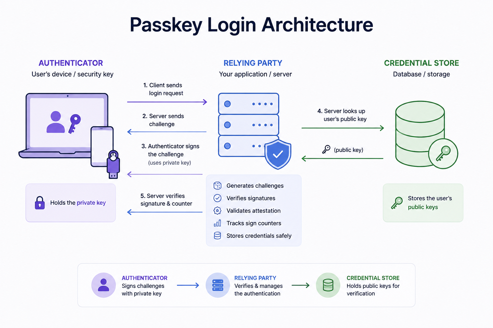

Most passkey tutorials for Next.js stop where the real work begins. They show a dashboard toggle or a thin wrapper around `navigator.credentials`, then hand-wave the server side that actually decides whether a login is genuine. This guide does the opposite. It walks through a complete, self-hosted passkey flow in a Next.js App Router app, registration and authentication, using [SuperTokens](https://supertokens.com/) for the relying-party logic so no third-party identity provider ever holds the credentials.

This post assumes the conceptual grounding from Post 1, What Are Passkeys? A Developer's Guide to WebAuthn and FIDO2. The WebAuthn ceremony, origin binding, and public-key model are explained there and are not repeated here.

## Prerequisites

Five things are needed before starting:

- A [Next.js](https://nextjs.org/) project using the App Router
- SuperTokens Node SDK installed ([`supertokens-node`](https://supertokens.com/docs/quickstart/backend-setup) on the backend, [`supertokens-web-js`](https://supertokens.com/docs/quickstart/frontend-setup?uiType=custom) on the frontend for custom UI)
- A SuperTokens Core instance (the hosted `try.supertokens.io` works for development; [self-host](https://supertokens.com/docs/deployment/self-host-supertokens) or [SuperTokens Cloud](https://supertokens.com/docs/quickstart/next-steps) for production)
- A database. Examples reference PostgreSQL, but the Core abstracts storage, so MySQL or the managed option work identically.
- Familiarity with the [App Router](https://nextjs.org/docs/app) and basic [TypeScript](https://www.typescriptlang.org/docs/)

## Architecture Overview



A passkey login involves three parties. The **authenticator** is the user's device or security key, and it holds the private key. The **relying party** is the server that issues challenges and verifies signatures. The **credential store** is where the user's public keys live. In a from-scratch build, all of the relying-party responsibility falls on application code: generating cryptographically random challenges, parsing and validating attestation objects, verifying signatures against stored public keys, tracking signature counters, and storing credentials safely.

This is exactly where SuperTokens changes the shape of the work. In this architecture, SuperTokens Core is the relying party and the credential store. The Next.js app exposes SuperTokens' authentication endpoints through a single route handler, the frontend calls SuperTokens SDK methods, and the Core performs challenge generation, attestation verification, and signature verification against the stored public key. Application code never touches an attestation object or a signature counter. That is the difference between wiring up a WebAuthn library by hand and standing on a maintained, open-source relying party that runs on infrastructure the team controls.

The trade-off worth naming: rolling your own gives total control at the cost of owning every cryptographic edge case, and those edge cases are where WebAuthn implementations most often go subtly wrong. Delegating the ceremony to SuperTokens trades some of that low-level control for correctness that is already tested and maintained. For the large majority of teams shipping passkeys, that is the right trade.

## Project Setup: Wiring SuperTokens Into Next.js

Three files connect SuperTokens to a Next.js App Router project: shared app info, the backend config, and the catch-all route handler that exposes the authentication APIs.

Start with the shared configuration that both frontend and backend read. The `apiBasePath` of `/api/auth` is what makes the route handler below work, and the domains must match the actual origin the app runs on, which matters for passkeys specifically because credentials are origin-bound.

```ts
// config/appInfo.ts
import { AppInfo } from "supertokens-node/types";

export const appInfo: AppInfo = {
 appName: "Passkeys Demo",
 apiDomain: process.env.NEXT_PUBLIC_API_DOMAIN || "http://localhost:3000",
 websiteDomain: process.env.NEXT_PUBLIC_WEBSITE_DOMAIN || "http://localhost:3000",
 apiBasePath: "/api/auth",
 websiteBasePath: "/auth",
};
```

Next, the backend config. Adding passkeys is a single line in the `recipeList`: `WebAuthn.init()`. The `Session.init()` recipe issues the session once a passkey login succeeds.

```ts
// config/backend.ts
import SuperTokens from "supertokens-node";
import Session from "supertokens-node/recipe/session";
import WebAuthn from "supertokens-node/recipe/webauthn";
import { TypeInput } from "supertokens-node/types";
import { appInfo } from "./appInfo";

export const backendConfig = (): TypeInput => ({
 framework: "custom",
 supertokens: {
   connectionURI: process.env.SUPERTOKENS_CONNECTION_URI || "https://try.supertokens.io",
   // apiKey: process.env.SUPERTOKENS_API_KEY, // set this for a self-hosted or cloud Core
 },
 appInfo,
 recipeList: [
   WebAuthn.init(),
   Session.init(),
 ],
 isInServerlessEnv: true,
});

let initialized = false;

export function ensureSuperTokensInit() {
 if (!initialized) {
   SuperTokens.init(backendConfig());
   initialized = true;
 }
}
```

Finally, the catch-all route handler. This single file exposes every SuperTokens authentication endpoint, including all the `webauthn/*` routes, under `/api/auth`. It proxies each HTTP method to the SuperTokens handler.

```ts
// app/api/auth/[[...path]]/route.ts
import { getAppDirRequestHandler } from "supertokens-node/nextjs";
import { NextRequest } from "next/server";
import { ensureSuperTokensInit } from "../../../../config/backend";

ensureSuperTokensInit();

const handleCall = getAppDirRequestHandler();

export async function GET(request: NextRequest) {
 const response = await handleCall(request);
 if (!response.headers.has("Cache-Control")) {
   response.headers.set(
     "Cache-Control",
     "no-cache, no-store, max-age=0, must-revalidate"
   );
 }
 return response;
}

export async function POST(request: NextRequest) {
 return handleCall(request);
}

export const DELETE = POST;
export const PUT = POST;
export const PATCH = POST;
export const HEAD = GET;
```

On the frontend, initialize the web SDK for custom UI. This is what exposes the passkey helper methods to the browser.

```ts
// config/frontend.ts
import SuperTokensWebJs from "supertokens-web-js";
import Session from "supertokens-web-js/recipe/session";
import WebAuthn from "supertokens-web-js/recipe/webauthn";
import { appInfo } from "./appInfo";

let initialized = false;

export function ensureSuperTokensFrontendInit() {
 if (!initialized) {
   SuperTokensWebJs.init({
     appInfo,
     recipeList: [Session.init(), WebAuthn.init()],
   });
   initialized = true;
 }
}
```

With those in place, the authentication flows themselves are short, because the ceremony lives inside the SDK and the Core.

## The Registration Flow

Registration creates a new passkey and links it to a new user account. On the client, a single SuperTokens method drives the whole ceremony. `registerCredentialWithSignUp` fetches the registration options from the backend, invokes the browser's WebAuthn API to create the key pair, and submits the resulting credential back for verification. The component below is the full, copyable registration UI.

```tsx
// app/auth/PasskeyAuth.tsx
"use client";

import { useEffect, useState } from "react";
import {
 registerCredentialWithSignUp,
 authenticateCredentialWithSignIn,
} from "supertokens-web-js/recipe/webauthn";
import { ensureSuperTokensFrontendInit } from "../../config/frontend";

export default function PasskeyAuth() {
 const [email, setEmail] = useState("");
 const [message, setMessage] = useState("");

 useEffect(() => {
   ensureSuperTokensFrontendInit();
 }, []);

 async function handleSignUp() {
   try {
     const response = await registerCredentialWithSignUp({ email });

     if (response.status === "OK") {
       setMessage("Passkey created. You are signed up and logged in.");
     } else if (response.status === "INVALID_EMAIL_ERROR") {
       setMessage("Please enter a valid email address.");
     } else if (response.status === "EMAIL_ALREADY_EXISTS_ERROR") {
       setMessage("That email already has an account. Try signing in instead.");
     } else if (response.status === "WEBAUTHN_NOT_SUPPORTED") {
       setMessage("This browser or device does not support passkeys.");
     } else if (response.status === "SIGN_UP_NOT_ALLOWED") {
       // response.reason is a user-friendly message, sometimes with a support code
       setMessage(response.reason);
     } else if (response.status === "AUTHENTICATOR_ALREADY_REGISTERED") {
       setMessage("This passkey is already registered to an account.");
     } else {
       // INVALID_CREDENTIALS_ERROR, OPTIONS_NOT_FOUND_ERROR,
       // INVALID_OPTIONS_ERROR, FAILED_TO_REGISTER_USER, etc.
       setMessage("Could not create a passkey. Please try again.");
     }
   } catch (err: any) {
     if (err.isSuperTokensGeneralError === true) {
       setMessage(err.message);
     } else {
       setMessage("Something went wrong. Please try again.");
     }
   }
 }

 async function handleSignIn() {
   try {
     const response = await authenticateCredentialWithSignIn();

     if (response.status === "OK") {
       setMessage("Signed in with your passkey.");
     } else if (response.status === "WEBAUTHN_NOT_SUPPORTED") {
       setMessage("This browser or device does not support passkeys.");
     } else if (response.status === "SIGN_IN_NOT_ALLOWED") {
       setMessage(response.reason);
     } else {
       // INVALID_CREDENTIALS_ERROR, FAILED_TO_AUTHENTICATE_USER
       setMessage("Could not sign in. Please try again.");
     }
   } catch (err: any) {
     if (err.isSuperTokensGeneralError === true) {
       setMessage(err.message);
     } else {
       setMessage("Something went wrong. Please try again.");
     }
   }
 }

 return (
   <div>
     <input
       type="email"
       value={email}
       onChange={(e) => setEmail(e.target.value)}
       placeholder="you@example.com"
     />
     <button onClick={handleSignUp}>Create account with passkey</button>
     <button onClick={handleSignIn}>Sign in with passkey</button>
     <p role="status">{message}</p>
   </div>
 );
}
```

### **Under The Hood**

The single `registerCredentialWithSignUp` call is not magic, and understanding what it does is what separates a working integration from a mysterious one. It runs the exact WebAuthn ceremony from Post 1, mapped onto three SuperTokens endpoints exposed by the route handler:

- It POSTs to `/api/auth/webauthn/register/options` with the email. SuperTokens Core generates a random challenge and returns the registration options, including a `webauthnGeneratedOptionsId` that ties the rest of the flow to that specific challenge.
- It passes those options to the browser's `navigator.credentials.create()`, which prompts the user for a biometric or PIN and generates the key pair in secure hardware.
- It POSTs the new credential to `/api/auth/webauthn/signup`, sending the `webauthnGeneratedOptionsId` alongside the credential's `clientDataJSON` and `attestationObject`. The Core verifies the attestation, stores the public key, creates the user, and issues a session.

The reason to use the SDK method rather than calling those endpoints by hand is serialization. WebAuthn passes binary data, and every field crossing the browser boundary has to be base64url-encoded and decoded precisely. The SDK handles that encoding, which is one of the most common sources of silent failures in hand-rolled implementations. Teams that need full control, for a non-web platform or a heavily customized UI, can call the three endpoints directly, but for a Next.js web app the helper is both correct and complete.

### **Common Pitfalls**

Two misconfigurations account for most first-run failures, and both trace back to origin binding. The first is an **origin mismatch**: the `apiDomain` and `websiteDomain` in `appInfo` must match the actual URL the browser loads. A passkey created while the app runs on `localhost:3000` will not verify if the request appears to originate from `127.0.0.1:3000`, because the browser treats those as different origins. The second is a **relying-party ID misconfiguration**: the RP ID is the registrable domain, with no scheme and no port, so `example.com`, not `https://example.com:3000`. A passkey is permanently bound to the RP ID it was created under, and even a mismatched subdomain can cause a silent failure where the authenticator simply declines to produce a credential with no obvious error. When a passkey flow fails quietly in production but works in development, the RP ID and origin configuration is the first place to look.

## The Authentication Flow

Authentication proves an existing user with a passkey they already registered. The client side is the `handleSignIn` function already shown in the component above, driven by `authenticateCredentialWithSignIn`. Notice it takes no email argument. Passkeys registered as discoverable credentials let the authenticator present the available accounts for the site directly, so the user picks their passkey from the browser or OS prompt rather than typing an identifier first.

### **Under The Hood**

Authentication mirrors registration across two endpoints:

- `authenticateCredentialWithSignIn` POSTs to `/api/auth/webauthn/signin/options`, and SuperTokens Core returns a fresh random challenge plus a webauthnGeneratedOptionsId.
- It passes the options to the browser's `navigator.credentials.get()`, which prompts the user and signs the challenge with the private key held in secure hardware.
- It POSTs the signed assertion to `/api/auth/webauthn/signin`, sending the `clientDataJSON`, `authenticatorData`, and `signature`. SuperTokens Core verifies that signature against the public key it stored at registration, and on success issues a session.

The private key never leaves the device in either flow. Registration transmits a public key once, and every authentication transmits only a signature over a one-time challenge, which is what makes the flow phishing-resistant rather than merely passwordless.

Once a session exists, protecting routes uses the standard SuperTokens session verification. On the client, `Session.doesSessionExist()` from `supertokens-web-js/recipe/session` gates UI, and on the server, session verification through the SuperTokens Node SDK gates data. Session handling is shared across all SuperTokens recipes and is not specific to passkeys, so an existing SuperTokens app gains passkey login without changing how sessions work.

## Cross-Device Passkeys

A user often registers a passkey on one device and later signs in on another. What happens next depends entirely on the passkey type covered in Post 1. A **synced passkey**, stored in iCloud Keychain, Google Password Manager, or a Windows-linked account, propagates to the user's other devices automatically, so authentication on a second device just works with no extra code. A **device-bound passkey** on a hardware key does not sync, and authenticating on a new device uses the cross-device hybrid flow, where the user scans a QR code with the phone holding the passkey and approves the login over a proximity channel.

From the application's perspective, none of this requires special handling as long as the RP ID is configured correctly, because the browser and operating system manage the transport. The one requirement is that the RP ID stays consistent across every surface the app runs on, since a passkey bound to example.com will not present itself on a different registrable domain. A full treatment of cross-device edge cases and conditional UI autofill is a candidate for a dedicated future post, but this is enough that a cross-device login will not come as a surprise.

## Recovery Flow Considerations

This is the section that competitor guides consistently flag as the most commonly botched part of a passkey rollout, and the advice is blunt: do not ship passkeys without deciding this first. A passkey login is only as reliable as its recovery path, and the failure mode is severe. If a user's only passkey lives on a single device and that device is lost, and no fallback exists, that account is permanently locked out.

The design question to answer before launch is what happens when a user has no working authenticator. Three approaches cover most products. The first is a **fallback authentication factor**: keep email one-time codes or a password available as an alternate way in, so a lost device is an inconvenience rather than a lockout. The second is a **recovery token flow**: SuperTokens' WebAuthn recipe exposes account recovery token generation, which can email a user a time-limited link that lets them register a new passkey after proving control of their email. The third is **encouraging multiple passkeys** at enrollment, prompting users to add a second authenticator such as a hardware key, so the loss of one device never removes their only credential.

The mistake to avoid is treating recovery as a later problem. A passkey system with no recovery design is not a minimal version of a passkey system, it is a lockout generator waiting for its first lost phone. Decide the fallback, build it alongside the happy path, and test the lost-device scenario before any real user hits it.

## Migration: Adding Passkeys Alongside Existing Password Auth

Many teams do not want to replace passwords, they want to offer passkeys as an additional, better option. SuperTokens supports this directly, because authentication methods are modular recipes. An app already running `EmailPassword.init()` adds passkeys by including `WebAuthn.init()` in the same `recipeList`, with no removal of the existing flow.

```ts
recipeList: [
 EmailPassword.init(),
 WebAuthn.init(),
 Session.init(),
],
```

With both recipes active, existing users keep signing in with their password while new and returning users can enroll a passkey as an alternative. SuperTokens' account linking ties multiple login methods to a single user identity, so a user who signs up with a password and later adds a passkey remains one account rather than two. This is the low-risk migration path: offer passkeys alongside passwords, let adoption grow, and treat passwords as the fallback factor the recovery section calls for rather than deprecating them on day one. Teams arriving from another provider, following a Firebase Authentication or WorkOS migration guide, can layer passkeys on during the same move.

## The Full Working Code Sample

The snippets above are the complete flow, but a runnable reference is faster to start from. The quickest way to a working passkeys project is the SuperTokens scaffolding tool, which generates a full App Router app with the recipe already wired:

```bash
npx create-supertokens-app@latest
```

Select the App Router and the passkeys option when prompted, and the generated project contains the backend config, the route handler, and a working custom UI equivalent to what this post builds. [A companion repository with the exact code from this tutorial is linked here.] It contains the full Next.js project, environment variable setup, and both the SDK-based flow and the raw-endpoint version for readers who want to see the ceremony wired by hand.

## Closing

That is a complete, self-hosted passkey implementation in Next.js: registration, authentication, cross-device behavior, a recovery design, and a migration path, with SuperTokens acting as the relying party so the credentials never leave infrastructure the team controls. For teams still weighing whether passkeys are the right call for their product, Post 3 in this series compares passkeys against the alternatives and lays out where they fit and where they do not. For the broader picture of structuring authentication in a Next.js App Router app, the Next.js App Router authentication guide covers session handling, route protection, and server-side verification end to end. SuperTokens supports passkeys as one recipe in an open-source, self-hostable authentication stack, which is what lets the entire flow above run without handing any part of it to a third party.
