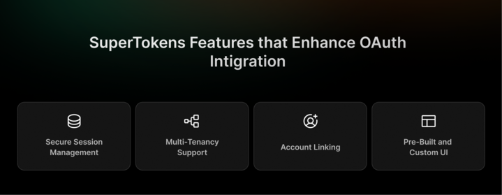
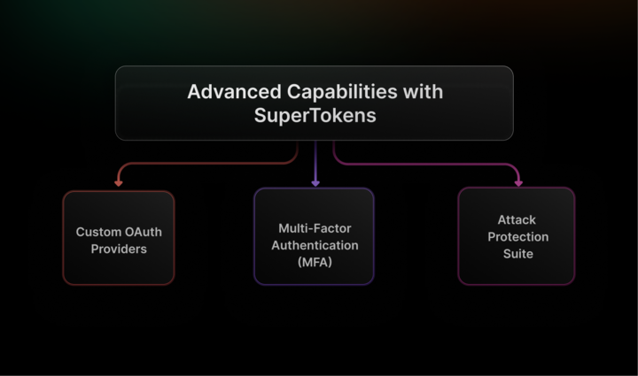

## Table of Contents

- [What Are OAuth Providers and How Do They Work?](#what-are-oauth-providers-and-how-do-they-work)
- [Why Use SuperTokens for OAuth Integration?](#why-use-supertokens-for-oauth-integration)
- [Step-by-Step Guide to Setting Up OAuth with SuperTokens](#step-by-step-guide-to-setting-up-oauth-with-supertokens)
- [SuperTokens Features That Enhance OAuth Integration](#supertokens-features-that-enhance-oauth-integration)
- [How SuperTokens Elevates OAuth Provider Integration](#how-supertokens-elevates-oauth-provider-integration)
- [Common Use Cases for OAuth Integration](#common-use-cases-for-oauth-integration)
- [Security Considerations and Best Practices](#security-considerations-and-best-practices)
- [Advanced Capabilities with SuperTokens](#advanced-capabilities-with-supertokens)
- [Conclusion and Next Steps](#conclusion-and-next-steps)

Integrating OAuth providers is essential for enabling seamless and
secure authentication and authorization in applications. Businesses and
developers rely on OAuth to enhance user experience, simplify login
processes, and strengthen security. According to a study by
[Janrain](https://www.marketingprofs.com/charts/2012/7060/social-media-users-prefer-social-login-over-traditional),
77% of social media users believe websites should offer social login as
an alternative to traditional account creation.

However, managing OAuth integrations securely comes with challenges.
Developers must address potential vulnerabilities, ensure proper
implementation, and safeguard user data throughout the authentication
process. Misconfigurations or weak security measures can expose
applications to unauthorized access, making robust security practices
necessary.

## **What Are OAuth Providers and How Do They Work?**


OAuth 2.0, which stands for \"Open Authorization,\" was introduced in
2012 as an improvement over OAuth 1.0. It allows third-party
applications to gain limited access to user accounts on an HTTP service,
such as social media platforms or cloud storage, without exposing the
user\'s long-term credentials. Instead of sharing passwords, users grant
access through tokens that represent their permissions.

OAuth 2.0 is the current standard for authorization, distinguishing
between authorization and authentication.


### **Authorization**

Authorization allows a client application to access resources on behalf
of the user.

-   **How It Works:** When a user grants permission to an application,
    the authorization server issues an access token that specifies
    what resources the client can access and for how long. The client
    then uses this token to request resources from the resource
    server.

-   **Key Components:**

    -   **Access Token:** A string that represents the authorization
        granted to the client by the resource owner.

    -   **Scopes:** Define specific permissions associated with the
        access token, such as read or write access.

    -   **Authorization Server:** The entity that issues access tokens
        after verifying user consent, typically following
        authentication by an identity provider.

### **Authentication**

Authentication is the process of verifying the identity of a user or
system. It ensures that users are who they claim to be before granting
them access to resources.

-   **How It Works:** In OAuth 2.0, authentication typically occurs
    before authorization. The user is first redirected to an
    authorization server, where they go through the authentication
    process via an identity provider. Once successfully authenticated,
    they are then given the option to grant permissions to third-party
    applications.

-   **Key Components:**

    -   **User Credentials:** The username and password (or other
        credentials) that the user provides to the identity provider
        for authentication.

    -   **Identity Provider (IdP):** The system that verifies a user's
        identity (e.g., Google, Okta, Microsoft Entra ID).

    -   **Authentication Protocols:** Methods like OpenID Connect (OIDC)
        or SAML that enable authentication.

### **Key Components of OAuth Flows:**

-   **Resource Owner:** The user who owns the data and grants permission
    to the client application to access their protected resources.

-   **Client:** The application requesting access to the user\'s data,
    acting on behalf of the resource owner to perform authorized
    actions.

-   **Authorization Server:** The server is responsible for verifying
    successful authentication, obtaining user consent, and issuing
    access tokens to the client application.

-   **Resource Server:** The server that hosts and protects the user\'s
    data, responding to API requests from the client upon validating
    the provided access token.

### **Popular OAuth providers include:**

#### **Google**

Google provides OAuth 2.0 as part of its identity platform, allowing
developers to integrate Google accounts into their applications.

-   **How It Works:** Users authenticate through Google\'s login page,
    granting permission for applications to access specific data (like
    Google Drive or Gmail). After successful authentication, an access
    token is issued, allowing the client application to make API calls
    on behalf of the user.

#### **Facebook**

Facebook\'s OAuth implementation allows third-party applications to
authenticate users using their Facebook accounts.

-   **How It Works:** Users are redirected to Facebook\'s login page
    (another major oauth-provider) where they can log in and grant
    permissions for specific actions (like posting on their timeline).
    Once authorized, Facebook returns an access token that can be used
    by clients to interact with Facebook\'s Graph API.

#### **Microsoft**

Microsoft offers OAuth 2.0 through its Azure Active Directory (AAD)
service, enabling secure authentication for various Microsoft services.

-   **How It Works:** Similar to other providers, users authenticate via
    Microsoft\'s login interface (an enterprise-focused
    oauth-provider) and authorize applications to access their data
    (like OneDrive or Outlook). An access token is then issued for
    subsequent API calls.

## **Why Use SuperTokens for OAuth Integration?**


Integrating OAuth providers can be complex, requiring careful management
of tokens, sessions, and security mechanisms. SuperTokens addresses
these challenges by providing a comprehensive platform for OAuth
integration. Here's why SuperTokens stands out:

### **Simplified Integration**

SuperTokens streamlines the process of integrating OAuth 2.0 and OpenID
Connect providers. Its pre-built recipes reduce development time and
ensure consistency.

### **Built-In Security**

Managing access tokens and refresh tokens securely is critical.
SuperTokens provides features like rotating refresh tokens, token theft
detection, and PKCE support to reduce vulnerabilities.

### **Unified Architecture**

SuperTokens architecture supports multi-tenancy, making it ideal for
applications serving diverse user bases or enterprise-level clients.
This flexibility ensures scalability and adaptability.

## **Step-by-Step Guide to Setting Up OAuth with SuperTokens**

### **Prerequisites:**

-   Backend SDK setup (Node.js, Python, or Golang).

-   Frontend SDK setup (React, Vanilla JS, or other frameworks).

### **Implementation Steps:**

1.  **Initialize SuperTokens Core with OAuth Recipe:** Set up the core
    system to handle OAuth flows.

2.  **Configure Provider Details:** Input client ID and secret obtained
    from your chosen OAuth provider.

3.  **Redirect Users for Authentication:** Use the Authorization Code
    Flow to guide users to the provider\'s login page.

4.  **Handle Token Exchange:** Exchange the authorization code for
    access tokens and manage user sessions.

### **Code Example:**

**Node.js Backend Example:**

```javascript
const SuperTokens = require("supertokens-node");
const ThirdParty = require("supertokens-node/recipe/thirdparty");

SuperTokens.init({
  appInfo: {
    appName: "My App",
    apiDomain: "http://localhost:3000",
    websiteDomain: "http://localhost:3000"
  },
  supertokens: {
    connectionURI: "http://localhost:3567"
  },
  recipeList: [
    ThirdParty.init({
      signInAndUpFeature: {
        providers: [
          ThirdParty.Google({
            clientId: "GOOGLE_CLIENT_ID", 
            clientSecret: "GOOGLE_CLIENT_SECRET" 
          })
        ]
      }
    })
  ]
});
```

**React Frontend Example:**

``` javascript
import SuperTokens from "supertokens-auth-react";
import ThirdParty, {Google} from "supertokens-auth-react/recipe/thirdparty";

SuperTokens.init({
  appInfo: {
    appName: "My App",
    apiDomain: "http://localhost:3000",
    websiteDomain: "http://localhost:3000"
  },
  recipeList: [
    ThirdParty.init({
      signInAndUpFeature: {
        providers: [Google.init()]
      }
    })
  ]
});
```

## **SuperTokens Features That Enhance OAuth Integration**



SuperTokens offers several features that significantly improve the
integration of OAuth providers:

-   **Secure Session Management:** Enhance security by implementing
    rotating refresh tokens and advanced token theft detection
    mechanisms to protect user sessions from unauthorized access.

-   **Multi-Tenancy Support:** Enable the creation and management of
    multiple tenants within a single application, ensuring scalability
    and security to meet enterprise-level requirements effectively.

-   **Account Linking:** This allows users to link multiple OAuth
    accounts seamlessly, providing a unified identity and enhancing
    user convenience across platforms.

-   **Pre-Built and Custom UI Options:** Facilitate a smooth and
    intuitive user experience by offering customizable interfaces
    alongside pre-built UI components for quick integration.

## **How SuperTokens Elevates OAuth Provider Integration**

SuperTokens makes OAuth provider integration developer-friendly by
offering:

-   **Streamlined Onboarding**: Simplify user sign-up and login flows by
    minimizing friction and providing an intuitive, user-friendly
    experience across all devices.

-   **Flexible Provider Configuration**: Dynamically customize provider
    settings to adapt to the unique requirements of your application,
    ensuring seamless integration with various identity providers.

-   **Comprehensive SDKs**: Offer extensive support for multiple
    frameworks and programming languages, enabling developers to
    easily integrate authentication features into their applications.

## **Common Use Cases for OAuth Integration**

OAuth integration is beneficial in various scenarios:

-   **Multi-Platform Login:** Provide users with a seamless and unified
    account experience across web, mobile, and desktop platforms,
    ensuring their data, preferences, and sessions are synchronized
    effortlessly.

-   **Enterprise Applications:** Implement Single Sign-On (SSO) for
    workforce identity providers, enabling employees to access
    multiple enterprise applications securely and efficiently with a
    single set of credentials.

-   **Social Login:** Simplify authentication for customer-facing apps
    by integrating with popular providers like Google, Facebook, or
    others, allowing users to log in quickly without the need to
    create and remember new credentials.

By addressing these use cases, OAuth integrations ensure a seamless user
experience across various platforms and applications.

## **Security Considerations and Best Practices**

When implementing OAuth 2.0, security is paramount. Developers should
adhere to best practices to mitigate risks:

-   **Implement PKCE (Proof Key for Code Exchange):** PKCE enhances
    security by preventing Cross-Site Request Forgery (CSRF) attacks
    during authorization flows. The client must generate a unique code
    challenge and verifier, ensuring that only the legitimate client
    can exchange the authorization code for an access token.

-   **Securely Handle Refresh Tokens:** Refresh tokens should be stored
    securely to protect user sessions. Developers should implement
    practices such as rotating refresh tokens regularly and
    invalidating them when a user logs out or changes their password,
    minimizing the risk of unauthorized access.

-   **Conduct Regular Audits:** Regularly reviewing OAuth provider
    configurations helps identify potential vulnerabilities. This
    practice ensures that security policies are up-to-date and that
    any changes in the OAuth landscape are addressed efficiently.

## **Advanced Capabilities with SuperTokens**



SuperTokens also offers advanced capabilities that enhance security and
functionality:

-   **Custom OAuth Providers:** Developers can create tailored
    authentication solutions for specific needs. This flexibility
    allows organizations to integrate unique identity providers or
    customize existing ones to fit their security requirements.

-   **Multi-Factor Authentication (MFA):** By adding MFA, SuperTokens
    provides an extra layer of security after the initial OAuth
    authentication. This ensures that even if credentials are
    compromised, unauthorized access is still prevented through
    additional verification methods.

-   **Attack Protection Suite:** SuperTokens has features that can
    effectively identify and address suspicious activities. This
    proactive strategy helps protect applications from common threats,
    ensuring a safe environment for users and their data.

## **Conclusion and Next Steps**

Integrating OAuth providers with SuperTokens offers simplicity,
security, and scalability. Developers can focus on building exceptional
user experiences without worrying about authentication complexities.

Explore [SuperTokens](https://supertokens.com/docs) and
live demos to get started. As OAuth continues to evolve, staying
informed about new trends and best practices will help you maintain a
competitive edge in delivering secure user authentication solutions.
