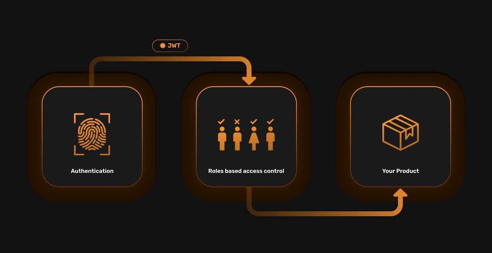
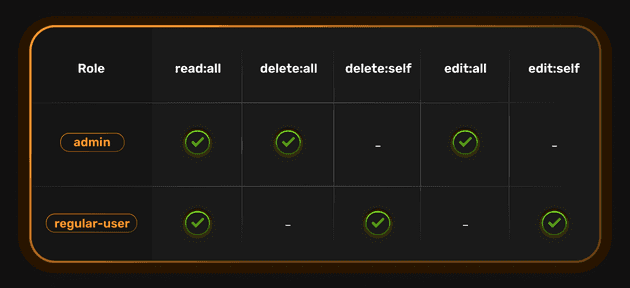
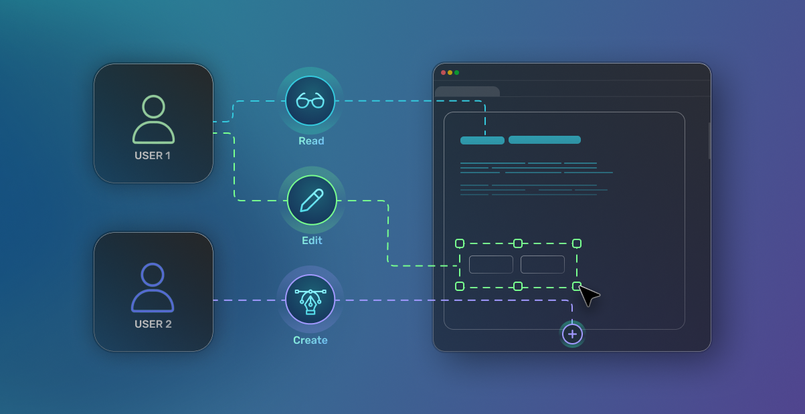

### Table of Contents
- [Part 1 - Introducing user roles and understanding why authorization matters](#part-1---introducing-user-roles-and-understanding-why-authorization-matters)
  - [Introduction](#introduction)
  - [What are user roles and why are they important for user authentication?](#what-are-user-roles-and-why-are-they-important-for-user-authentication)
  - [User Roles and SuperTokens](#user-roles-and-supertokens)
- [Part 2 - implement SuperTokens User Roles](#part-2---implement-supertokens-user-roles)
  - [Enabling user roles with Supertokens](#enabling-user-roles-with-supertokens)
  - [Step 1) Creating the roles and permissions](#step-1-creating-the-roles-and-permissions)
  - [Step 2) Assigning roles to users on sign up](#step-2-assigning-roles-to-users-on-sign-up)
  - [Step 3) Guarding APIs based on a user's role or permissions](#step-3-guarding-apis-based-on-a-users-role-or-permissions)

## Part 1 - Introducing user roles and understanding why authorization matters

### Introduction

Today, we’re excited to announce the launch of user roles within SuperTokens! With user roles, you can now easily attach different sets of permissions to each user. 

At SuperTokens, we’ve put a lot of thought into authentication and authorization.

Authentication is about: “Which user is this request coming from?”

Authorization is about: “Is this user allowed to do a certain operation?”

In the past, we've focused on authentication with our [email password](https://supertokens.com/docs/emailpassword/introduction), [password-less](https://supertokens.com/docs/passwordless/introduction), [social](https://supertokens.com/docs/thirdparty/introduction), and [phone](https://supertokens.com/docs/phonepassword/introduction) authentication recipes.

User roles address the authorization side of the puzzle. Continuing on our momentum with our authentication product, we’re excited to help you manage your users with finer controls without compromising on application security. 

If you're looking to implement user roles today, check out the second part of this post or our [user roles documentation](https://supertokens.com/docs/userroles/introduction).



### What are user roles and why are they important for user authentication?

User Roles is built based on principles of roles-based access control (RBAC).

RBAC is a security model that restricts access to resources based on the roles that users have within an organization. Users are assigned to specific roles and those roles are granted permissions to access certain resources.

Let's try building a blogging app with user roles.  

We'd want to have a `regular users` role that allows `regular users` to read all blog posts, but only edit or delete posts created by themselves. We'd also want to have an `admin` role where `admins` can create, edit, and delete all blog posts.

In formal notation, the actions that can be taken can be represented as strings like:

-   Read all blogs: `read:all`

-   Delete all blogs: `delete:all`

-   Delete blogs created by self: `delete:self`

-   Edit all blogs: `edit:all`

-   Edit blogs created by self: `edit:self`

These are known as permissions. In a grid form, the roles and permissions for our example app will look like this:




The "edit:all" permission implies "edit:self" as well. Same goes for the "delete" permission.

To learn more about RBAC, check out our [blog post going in depth on RBAC](http://supertokens.com/blog/roles-based-access-control-with-supertokens).

### User Roles and SuperTokens

We built user roles with simplicity in mind. Our goal was to build secure authorization that can be set up in the span of minutes, not hours. As a result, our default user roles product is perfect for most non-complex use cases. For power users, we've left plenty of room to work with a product such as [permit.io](http://permit.io/) to extend our core permission feature set.

Today, you can create new roles and permissions, assign them to users, and protect API and website routes with SuperTokens. Let's go over each one at a high level.

Create new roles and permissions - With SuperTokens, roles and permissions are simple strings that can be assigned to users. That means you can name your role anything from `user` to `super-admin-i-have-all-the-permissions`.

Assign roles to users - Once you've created the role, you can assign roles to users before or after sign up. In fact, you can even assign multiple roles to a single user, so you could give someone both `regular-user` and `admin` permissions.

Product API and website routes - Now to verify if a user has proper permissions, we need to verify that a session exists and validate that the roles/permissions saved in the access token payload have the appropriate value. Getting the user role is simple with `UserRoleClaim` and since our roles are strings, verification is as simple as a string comparison.


## Part 2 - implement SuperTokens User Roles



### Enabling user roles with Supertokens

With SuperTokens, you can implement user roles in as little as 5 minutes. In this post, we'll walk through how to implement user roles into your application.

If user roles and RBAC are unfamiliar terms to you, check out our [RBAC primer](http://supertokens.com/blog/roles-based-access-control-with-supertokens) and user roles launch post for context.

For our example, we'll be building a blogging app.

First, we have a `regular-user` role which will allow users to read all blog posts, but only edit or delete posts created by them.

We will also have an `admin` role which allows admins to create, edit, and delete any blog posts.

> The code snippets below are for a NodeJS backend, but similar logic applies for the other backend SDKs offered by SuperTokens as well. 

### Step 1) Creating the roles and permissions

To start, SuperTokens needs to know about the roles and permissions before they can be assigned to users. For that, we can use the UserRoles.createNewRoleOrAddPermissions function exposed by the SDK:

```ts

import UserRoles from "supertokens-node/recipe/userroles";
// creating the admin role and adding permissions to it.

await UserRoles.createNewRoleOrAddPermissions("admin", ["read:all", "delete:all", "edit:all"])
// creating the regular-user role and adding permissions to it.

await UserRoles.createNewRoleOrAddPermissions("regular-user", ["read:all", "delete:self", "edit:self"])

```

This allows us to declare both the name of the role as well as the permissions related to the role. Fairly simple stuff.

### Step 2) Assigning roles to users on sign up

With SuperTokens you can:

-   Assign roles to users and their sessions

-   Remove roles from users and their sessions

-   Get a list of all roles assigned to a specific user

-   Get a list of all users that are assigned a specific role

For our example, we'll simply assign our created roles to users through the UserRoles.addRoleToUser function. To do this, we use the following snippet in our override function for the sign up API:

```ts

import UserRoles from "supertokens-node/recipe/userroles";

// The value of roleToAssign needs to be fetched by you.
// For example, you could check if the user's email is of a certain domain,
// and if it is, then they would be an admin, else not.

if (roleToAssign === "admin") {
    // the userId belongs to the user who just signed up.

    await UserRoles.addRoleToUser(userId, "admin");
} else {
    await UserRoles.addRoleToUser(userId, "regular-user");
}

```

We can even manually [add the roles and permissions to the user's session payload](https://supertokens.com/docs/userroles/managing-roles-and-users) for efficient access at a later point. SuperTokens does this for you automatically as long as you have assigned the roles to a user before their session is created.

### Step 3) Guarding APIs based on a user's role or permissions

Assigning roles to users is only half the battle.

We also need to retrieve the roles and permissions to understand if a user is allowed to perform certain functions. We can use the following code snippet to complete session verification (the authentication piece of the puzzle) and then implement our authorization logic:

```ts

import { verifySession } from "supertokens-node/recipe/session/framework/express";

import UserRoles from "supertokens-node/recipe/userroles";

app.delete("/blog", verifySession(), async (req, res) => {

    let blogId = req.body.blogId

    let userId = req.session.getUserId();

    let roles = session.getClaimValue(UserRoles.UserRoleClaim)
        // if the user is an admin, we will be ["admin"], else we will get ["regular-user"]

    let permissions = await session.getClaimValue(UserRoles.PermissionClaim)
        // if the role is "admin", we get ["read:all", "delete:all", "edit:all"]
        // else we get ["read:all", "delete:self", "edit:self"]

        if (permissions.includes("delete:all")) {
            // allow delete
        } else if (permissions.includes("delete:self")) {

            if (getOwnerOfBlog(blogId) === userId) {
                // allow delete
            } else {
                // return access denied error
            }

        }

    })

```

And we're done! We've now created new roles + permissions, assigned them to users, and protected our API routes against unauthorized access.

Our goal is to make the best user authentication tool, together with you. We’re just getting started.

You can learn more about how to use user roles and permissions with SuperTokens via the [recipe guides docs!](https://supertokens.com/docs/userroles/introduction).