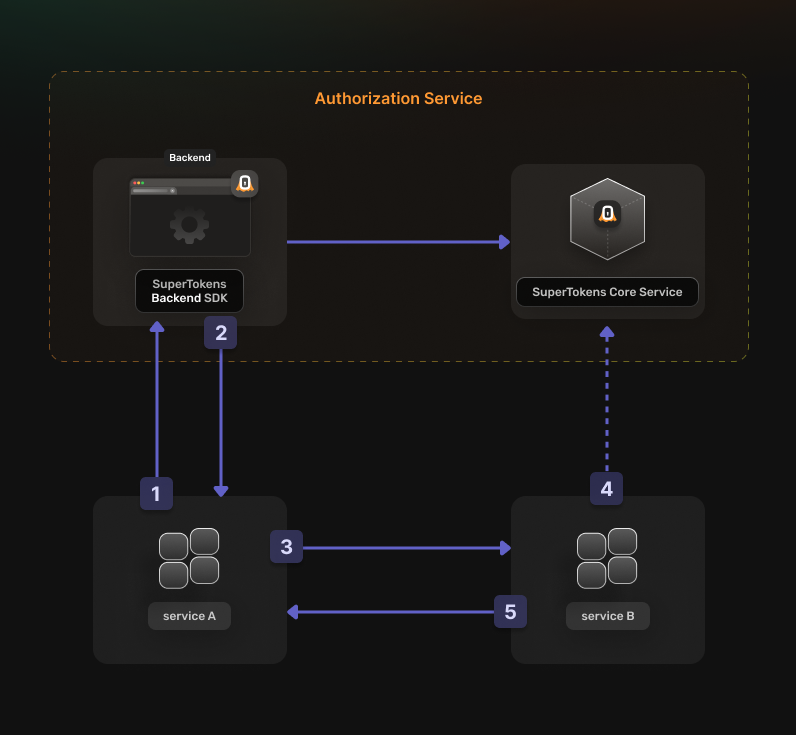

**When you think about authentication the first thing that comes to mind is most likely a user to machine authentication, like logging into a social media or banking app.**

But there is another case where machines need to exchange data between each other in what is aptly called **machine to machine (M2M) communication**. And as with any digital exchange of data we want to make sure that not everyone can access that data. This is why we authenticate ourselves as people in order to be able to access certain data. But when machines need to access private data, we also need to make sure that they have the right methods of authenticating themselves so that no malicious actors get a hold of important data. 

This is where **machine to machine authentication** comes in, and this article is exploring all the intricacies of machine to machine authentication. 

Let's enter the world of machines. 🤖


```toc
tight: true
toHeading: 3
```
## What is a Machine? 
In machine to machine communication, "machines" can refer to servers, applications, Internet of Things devices, or APIs. A pretty broad term. 

## Machine to Machine Communication
**Simply put, the automated exchange of information between machines, without human involvement.** ❌🧑

### Some Examples of M2M Communication: 
- ☁️ A cloud service retrieving data from a database
- 🔄 An API fetching information from another service 
- 📡 Two IoT (Internet of Things) devices synchronizing their status

Unlike human-to-machine communication (*like logging into a website with a username and password* 💻)  where the identity of the human needs to be verified, **M2M communication requires authentication mechanisms that verify the identity of a machine.** 

## Machine-to-Machine Authentication?

Machine-to-Machine Authentication is **the process of verifying the identity of a machine** that is trying to communicate with another machine. This is a broad definition that can be broken down further. 

You can have M2M communication and therefore authentication both in hardware and software. 

An cool example of a hardware machine that other machines need to communicate with and authenticate would be the Mars Rover.  

In software we also have a ton of services that constantly communicate with each other and pass on or request data. That data needs to be passed on securely so those machines need to be authenticated to make sure that any sensitive data is not passed to the wrong machine hands. 🦾

M2M authentication uses protocols like OAuth 2.0 (Open Protocol) to make sure that authentication is robust and data remains secure. 

This can be done using various methods, like API keys, OAuth tokens, mutual TLS (mTLS), or cryptographic certificates. 

Strong M2M authentication prevents unauthorized access, protects sensitive data, and ensures that only trusted entities can interact within a network. 

| **User Authentication 👤** | **M2M Authentication 🤖** |
|----------------------------|----------------------------|
| Requires human interaction (e.g., login form, password) | Fully automated (no human input) |
| Uses username/password or social logins (OAuth Authorization Code Flow) | Uses **client ID and secret** or service accounts |
| Access is tied to a user session | Access is tied to a **machine identity** |
| Example: A user logs into a social media site and gets a session token | Example: A backend service calls an API using a client credentials token |

## M2M authentication vs M2M authorization
Developers often use M2M authentication and M2M authorization interchangeably. Here is a simple explanation of the differences: 
- M2M authentication means **verifying the identity** of the machine. 
- M2M authorization determines **what actions the verified machine is allowed to perform or what data it can access**. 

If you want to read more about the difference between authentication and authorization, you can check out the article, [**Authentication vs Authorization: What's the difference?**](https://supertokens.com/blog/authentication-vs-authorization)

## Deeper Look Into How M2M Authentication Works

1. Devices exchange data without human interaction or oversight. 
2. Devices authenticate by presenting their unique Client ID and Secret to an OAUth 2.0 Authorization server. 
3. Post-authentication, devices receive an Access Token that grants them the necessary permissions to perform specific tasks or access certain resources. 
4. Ensure that only authenticated devices can initiate communication, enhancing the security of data transfers. 
5. M2M utilizes standards like MQTT, CoAP, and more to fit specific needs of device communication and scalability. 
6. Prevents unauthorized access and ensures that data exchanges between machines are secure. 
7. Facilitates communication in large-scale systems such as IoT (Internet of Things) and cloud infrastructures without compromising security. 
8. Allows machines to perform tasks autonomously, reducing the need for human intervention and increasing operational efficiency. 

## Why is machine-to-machine authorization important?
The most efficient way of ensuring only authorized services are able to interact with one another.

## Common Use Cases for M2M Authentication 

In this section we will take a look at common scenarios where M2M authentication makes sense. 

### Service to Service 

### Daemon to Backend 

### CLI client to Internal Service 

### Internet of Things tools 

## Benefits of Using M2M Authentication 
One of the primary advantages of using an authorization service is that it simplifies the development process and enhances the resilience and deployability of your application.

## How to Secure Your Machine Communication With SuperTokens
SuperTokens recommends securing your machine to machine communication with OAuth2 specifications. You have to create an OAuth2 Provider and use the OAuth2 CLient Credentials Flow for authorization. 

1. Service A uses credentials to get an OAuth2 Access Token 
2. Authorization Service returns the OAuth2 Access Token 
3. Service A uses the OAuth Access Token to communicate with Service B
4. Service B validates the OAuth2 Access Token
5. If the token is valid then Service B returns the requested resource. 



Before going into the actual instructions, start by imagining a real life example that you can reference along the way. This makes it easier to understand what is happening. We are going to configure authentication for the following setup. 

- Calendar Service that exposes these actions: event.view, event.create, event.update, and event.delete
- A file Service that exposes these actions: file.view, file.create, file.update, and file.delete
- a Task service that interacts with the calendar service and the file service in the provess of scheudling a taslk. 

The goal is to allow trhe task service to perform an authenticatioed action on the calendar service. Proceed to the actual steps. 

SuperTokens offers machine to machien authentication using the OAUth2 Protocol -- the industry standrard for machine to machine authentication. 

## Implementing M2M Authentication with SuperTokens -- Super Simple to Set Up
1. Enable the OAuth2 features from the Dashboard 

2. Create the OAuth2 Clients 

3. Set Up Your Authorization Service 

4. Generate Access Tokens 

5. Verify an OAuth2 Access Token 


## Conclusion 

If two backend services **authenticate using tokens without any user involvement, it is M2M authentication**. This enables secure, automated communication between APIs, microservices, cloud workloads, and IoT devices. The key distinction from traditional authentication is that **it relies on machine identities instead of user credentials**.

👉 Curious to dive deeper into building secure and efficient APIs? Check out these helpful resources: [THIS WILL BE REPLACED WITH ANOTHER ARTICLE]
1. [**Token-Based Authentication for APIs: What It Is and How It Works**](https://supertokens.com/blog/token-based-authentication-in-api)