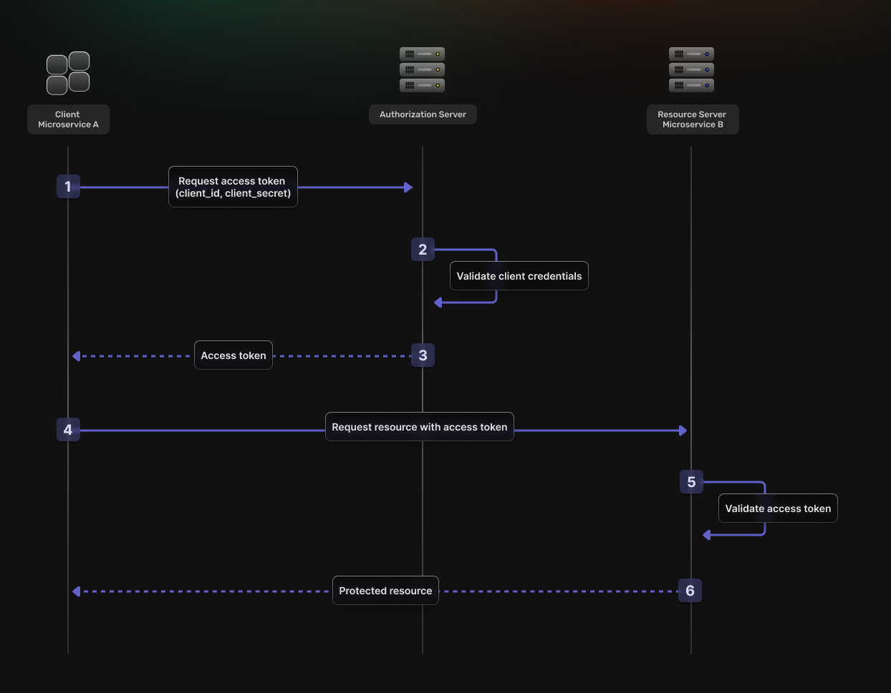

**When you think of authentication, your mind probably jumps to the classic user-to-machine scenario &mdash; like logging into your favorite social media app or checking your bank account. You know the drill: type in your username, punch in your password, and hope you didn’t forget it (again).**

But humans aren’t the only ones logging in &mdash; machines do it too, and they’re far busier than we are. As we go about our day (and even while we sleep), machines are constantly exchanging data behind the scenes.

This non-stop chatter is called **machine-to-machine (M2M) communication**, and just like with any digital conversation, we need to make sure only the right participants have access. That’s why we authenticate ourselves before accessing certain information &mdash; and machines need to do the same to keep sneaky bad actors from getting their hands on sensitive data.

Enter **machine-to-machine (M2M) authentication** &mdash; the key to ensuring machines can securely prove they’re who they claim to be.

Let's boot up and explore the world of machines.  🤖


```toc
tight: true
toHeading: 3
```
## What is a Machine? 
In machine-to-machine communication, the term "machine" covers a lot of ground. It can mean servers, applications, APIs, Internet of Things (IoT) devices, or even cronjobs.

For this article, we're focusing on authentication between services  &mdash; not IoT gadgets like robots or smart home devices.

## M2M Communication
Simply put, M2M communication is the automated exchange of information between machines  &mdash; no human involvement required. ❌🧑

### Examples of M2M Communication: 
- ☁️ A cloud service retrieving data from a database
- 🔄 An API fetching information from another service 
- 📡 Two or more IoT devices syncing their status

Unlike human-to-machine communication (like logging into a website with a username and password 💻), where a **person's** identity needs to be verified, M2M communication requires authentication methods that confirm the **identity of a machine** instead.

## M2M Authentication?

Machine-to-machine (M2M) authentication is the process of verifying the identity of a machine that’s trying to communicate with another machine. While this sounds straightforward, it covers a broad range of scenarios.

M2M communication  &mdash; and therefore authentication  &mdash; can happen in both hardware and software.

Take the Mars Rover, for example. This iconic piece of hardware needs to communicate securely with other systems to send data back to Earth  &mdash; and those systems must authenticate each other to ensure the data isn't intercepted or altered.  

In software, M2M communication happens constantly. Services exchange data, make requests, and pass information back and forth  &mdash; and this needs to happen securely. Authenticating these services ensures sensitive data doesn't end up in the wrong hands. 🦾 

**Common methods include:**
- API keys
- OAuth tokens
- Mutual TLS (mTLS)
- Cryptographic certificates 

| **User Authentication 👤** | **M2M Authentication 🤖** |
|----------------------------|----------------------------|
| Requires human interaction (e.g., login form, password) | Fully automated (no human input) |
| Uses username/password or social logins (OAuth Authorization Code Flow) | Uses **client ID and secret** or service accounts |
| Access is tied to a user session | Access is tied to a **machine identity** |
| Example: A user logs into a social media site and gets a session token | Example: A backend service calls an API using a client credentials token |

By ensuring machines can confidently identify each other, M2M authentication plays a crucial role in keeping modern digital ecosystems secure.

## M2M authentication vs M2M authorization
Developers often mix up M2M authentication and M2M authorization, but they’re not the same. Here's a simple way to remember the difference:

- **M2M authentication** verifies *who* the machine is.
- **M2M authorization** determines *what* that verified machine can do or access. 

Think of it like this:
- 🔐 **Authentication** is like showing your ID to prove who you are.
- 🛂 **Authorization** is like getting a backstage pass that defines where you can go and what you can do once you're inside.

For a deeper dive into these concepts, check out the article: [**Authentication vs Authorization: What's the difference?**](https://supertokens.com/blog/authentication-vs-authorization)

## ✨ A Closer Look at How M2M Authentication Works ✨

### 1. Device Identification and Authentication
Devices authenticate themselves by presenting a unique Client ID and Secret to an OAuth 2.0 Authorization server. This process verifies the device's identity before granting any permissions.

### 2. Access Token Issuance
Upon successful authentication, the authorization server issues an Access Token. This token carries specific permissions that allow the device to perform authorized tasks or access designated resources.

### 3. Secure Communication
Only devices with valid tokens can initiate communication, ensuring that unauthorized entities are blocked. This strengthens data security by reducing the risk of malicious access.

### 4. Communication Standards
M2M systems often rely on protocols like MQTT, CoAP, and others to optimize data exchange for different use cases. These standards ensure efficient communication even in resource-constrained environments.

### 5. Enhanced Security and Efficiency 
By enforcing strict authentication protocols, M2M communication prevents unauthorized access and ensures that data exchanges remain secure. This method is especially valuable in large-scale systems such as IoT networks and cloud infrastructures.

### 6. Autonomous Operations
M2M authentication enables devices to perform tasks independently, reducing the need for human oversight and improving operational efficiency in automated environments.


### 🚀 Step-by-Step: The Client Credentials Grant Flow

M2M authentication often uses the [**Client Credentials Grant Flow**](https://datatracker.ietf.org/doc/html/rfc6749#section-4.4) in OAuth 2.0. 

The **Client Credentials Grant Flow** involves an application exchanging its application credentials, such as client ID and client secret, for an access token. This flow is ideal for M2M applications where the system needs to authenticate and authorize the application itself rather than a user.

Here's how it works:
1. The **Client** authenticates with the **Authorization Server** using its **Client ID** and **Client Secret**.
2. The **Authorization Server** verifies the credentials.
3. If valid, the **Authorization Server** issues an **OAuth2 Access Token**.
4. The **Client** includes the **Access Token** in its requests to the **Resource Server**.
5. The **Resource Server** verifies the Access Token.
6. If the token is valid, the **Resource Server** grants access to the requested resource.



This flow ensures secure, efficient authentication — keeping your data safe while allowing machines to communicate seamlessly.

## Why Is Machine-to-Machine Authentication Important? 🛡️

### 1. Prevents Unauthorized Access
By verifying machine identities, M2M authentication ensures that only trusted devices can connect and exchange data.

### 2. Protect Sensitive Data
Strong authentication mechanisms prevent unverified machines from accessing confidential information, reducing the risk of data leaks.

### 3. Enables Scalable Systems
M2M authentication simplifies security management in large networks, allowing new devices to authenticate securely without manual intervention.

### 4. Ensures Compliance 
Implementing proper authentication protocols helps organizations meet security and privacy standards in industries like healthcare, finance, and IoT.

### 5. Improves Operational Efficiency
By automating the authentication process, M2M authentication minimizes human involvement, streamlining communication between services.

## How to Secure Your Machine Communication With SuperTokens
SuperTokens recommends securing your machine-to-machine communication with **OAuth2 specifications**. You have to create an **OAuth2 Provider** and use the **OAuth2 Client Credentials Flow** for authorization. 

1. **Service A** reaches out to the **SuperTokens Backend SDK** to get an **OAuth Access Token**.
2. The **SuperTokens Backend SDK** responds back to **Service A** with an **OAuth2 Access Token**.
3. **Service A** then communicates with **Service B** using the **OAuth Access Token**.
4. **Service B** talks to the **SuperTokens Core Service** to validate the **OAuth Access Token**.
5. If the **OAuth Access Token** is valid, then **Service B** returns the requested resource. 


## Steps to Implementing M2M Authentication with SuperTokens &mdash; Super Simple Set Up

✅ SuperTokens makes OAuth2 setup straightforward with its dashboard and API.

✅ Each service should have its own Client ID and Secret for secure authentication.

✅ Tokens ensure services can only perform authorized tasks.

✅ Token validation helps confirm the authenticity and permissions of each request.

### 🚀 Step 1: Enable OAuth2 in SuperTokens Dashboard

In the **SuperTokens Dashboard**, you need to enable the **OAuth2 feature**. This feature allows services (like APIs or background jobs) to authenticate securely without user involvement. Once enabled, you'll see OAuth options in your application settings.

- Go to your **SuperTokens.com Dashboard**.
- Enable the **OAuth2 feature**.
- This unlocks OAuth recipes for your applications.

### 🔧 Step 2: Create OAuth2 Clients
Each service that needs authentication will need its own OAuth2 client. Think of this like giving each service its own ID badge.

- For each service (e.g., Task Service, Calendar Service), create a unique OAuth2 client.
- Use this code snippet to create a client:

```javascript
const BASE_URL = '<CORE_API_ENDPOINT>';
const API_KEY = '<YOUR_API_KEY>';

const url = `${BASE_URL}/recipe/oauth/clients`;
const options = {
  method: 'POST',
  headers: {
    'api-key': API_KEY,
    'Content-Type': 'application/json; charset=utf-8',
  },
  body: JSON.stringify({
    clientName: "TaskService",
    grantTypes: ["client_credentials"],
    scope: "event.create",
    audience: ["event"],
  })
};

fetch(url, options)
  .then(response => response.json())
  .then(json => console.log(json))
  .catch(err => console.error(err));
```
✅ This registers your service so it can request access tokens later.

**Key Details:**
- `"clientName"` identifies the service (e.g., `TaskService`).
- `"grantTypes": ["client_credentials"]` specifies that this client will authenticate using M2M.
- `"scope"` defines the permissions this client will have.


### 🏗️ Step 3: Single App vs Multi App Setup
**Single App Setup:** For one project (e.g., a web app or API) that handles everything.<br>
**Multi App Setup:** For larger projects where multiple services share one SuperTokens core.
- **Single App Example URL:** `BASE_URL = "<CORE_API_ENDPOINT>"`
- **Multi App Example URL:** `BASE_URL = "<CORE_API_ENDPOINT>/appid-task_service"`
*If you're managing several services, the multi-app setup keeps things organized.*

### 🔐 Step 4: Set Up the Authorization Service
This is where you tell your app how to handle OAuth2 tokens.

**Code Example:**
```javascript
import supertokens from "supertokens-node";
import OAuth2Provider from "supertokens-node/recipe/oauth2provider";

supertokens.init({
    supertokens: {
        connectionURI: "...",
        apiKey: "...",
    },
    appInfo: {
        appName: "...",
        apiDomain: "...",
        websiteDomain: "...",
    },
    recipeList: [
      OAuth2Provider.init(),
    ]
});
```
This setup tells SuperTokens:
- Where to find your core server (connectionURI).
- The app’s name and domains.
- To include the OAuth2 provider.

### 🔄 Step 5: Generate Access Tokens

To generate a token, you send a POST request like this:

```javascript
import fetch from "node-fetch";

const response = await fetch("<YOUR_API_DOMAIN>/auth/oauth/token", {
  method: "POST",
  headers: { "Content-Type": "application/json" },
  body: JSON.stringify({
    clientId: "<CLIENT_ID>",
    clientSecret: "<CLIENT_SECRET>",
    grantType: "client_credentials",
    scope: ["event.create"],
    audience: "event"
  })
});

const data = await response.json();
console.log(data.accessToken);
```
**Response Example:**

```json
{
  "accessToken": "<TOKEN_VALUE>",
  "expiresIn": 3600
}
```
*The token is valid for **60 minutes**. After that, you'll need to request a new one.*

### ✅ Step 6: Verify an Access Token
To confirm a token is valid:
**Code Example Using `jose`:**

```javascript
import jose from "jose";

const JWKS = jose.createRemoteJWKSet(new URL('<YOUR_API_DOMAIN>/auth/jwt/jwks.json'))

async function validateClientCredentialsToken(jwt) {
  const requiredScope = "event.create";
  const audience = "event";

  try {
    const { payload } = await jose.jwtVerify(jwt, JWKS, {
      audience,
      requiredClaims: ['stt', 'scp'],
    });

    if (payload.stt !== 1) return false;
    return payload.scp.includes(requiredScope);
  } catch (err) {
    return false;
  }
}
```
This checks:
- **stt (SuperTokens Token Type)** &mdash; Ensures it's an OAuth2 token.
- **scp (Scope)** &mdash; Confirms the token has the required permission.

### 🌍 Step 7: Example of Two Services Communicating Using M2M
Imagine you have two services:

- Task Service &mdash; Creates tasks.
- Calendar Service &mdash; Manages events.

**Flow:**
1. Task Service requests a token from the Authorization Server.
2. Using that token, Task Service makes a POST request to Calendar Service to create an event.

#### Step 1: Task Service Requests Token

```javascript
const tokenResponse = await fetch("<YOUR_API_DOMAIN>/auth/oauth/token", {
  method: "POST",
  headers: { "Content-Type": "application/json" },
  body: JSON.stringify({
    clientId: "task_service",
    clientSecret: "super_secret_value",
    grantType: "client_credentials",
    scope: ["event.create"],
    audience: "event"
  })
});

const { accessToken } = await tokenResponse.json();
```

#### Step 2: Task Service Sends Request to Calendar Service

```javascript
await fetch("https://calendar.example.com/events", {
  method: "POST",
  headers: {
    "Authorization": `Bearer ${accessToken}`,
    "Content-Type": "application/json"
  },
  body: JSON.stringify({
    title: "Team Meeting",
    date: "2025-03-25",
    location: "Conference Room A"
  })
});
```

#### Step 3: Calendar Service Verifies the Token

```javascript
app.post('/events', async (req, res) => {
  const token = req.headers['authorization']?.split('Bearer ')[1];

  if (!token) return res.status(401).send("Unauthorized");

  try {
    const valid = await validateClientCredentialsToken(token);
    if (!valid) return res.status(403).send("Forbidden");

    // Token is valid — proceed with event creation
    res.status(201).send({ message: "Event created successfully!" });
  } catch {
    res.status(403).send("Invalid token");
  }
});
```

## Conclusion 

**Machine-to-machine (M2M) authentication** is a way for services to securely communicate without human involvement. Instead of a person logging in, one service presents a token or key to prove its identity to another service.

M2M authentication is especially important for:
- ✅ **Microservices** that need to share data securely.
- ✅ **Automated systems** like order processing, data syncing, or scheduled tasks.
- ✅ **API integrations** that connect external services safely.

By implementing M2M authentication, you ensure that your services can trust one another, reducing the risk of unauthorized access and improving overall system security.

By using M2M authentication, your services can trust each other, reducing security risks and keeping data safe. Whether you're working with microservices, internal APIs, or third-party integrations, this method offers a solid, lightweight solution for secure communication.