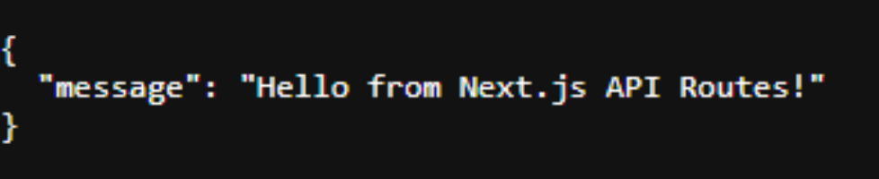
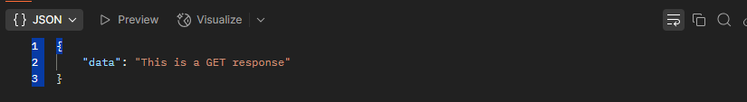
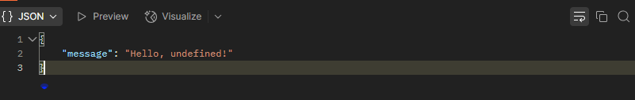
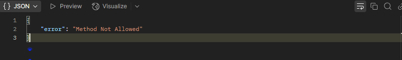
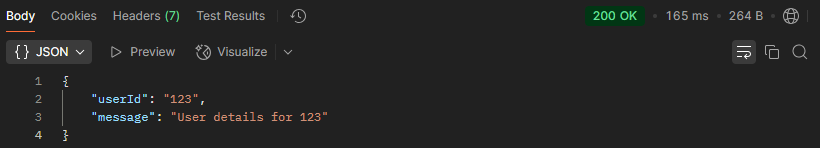
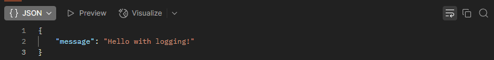
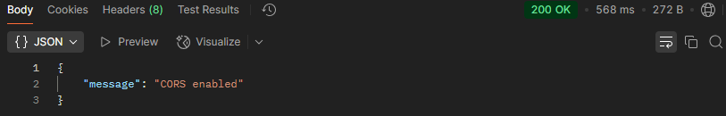
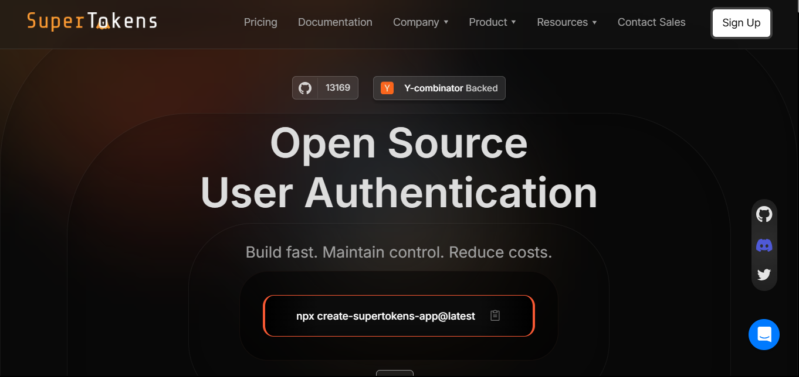

Next.js API Routes offer a powerful way to add backend functionality to your Next.js projects without the need for a separate server or extensive configuration. By creating serverless functions within your application, you can handle requests, interact with databases, and
integrate with authentication services all in one unified framework. In this guide, we'll explore what API Routes are, how they differ from traditional backend APIs, and share best practices for building, testing, and securing these routes. We'll also look at integrating SuperTokens for secure session management. Whether you're a seasoned developer or just getting started, this guide will help you harness the power of Next.js API Routes to create robust backend solutions.

## **What Are API Routes in Next.js?**

Next.js API Routes let you create serverless endpoints directly within your application. By placing files in the `/pages/api` directory, each file becomes an endpoint that can handle HTTP requests. This built-in serverless support simplifies deployment, as your frontend and backend code share the same codebase and infrastructure.

### **Comparison with Traditional Backend APIs**

While frameworks like Node.js/Express or Django require a separate backend server, Next.js API Routes provide a lightweight alternative integrated into your Next.js project. The benefits include:

- **Built-in Serverless Support:** Automatically scales with your application.

- **Seamless Integration with Frontend:** Share code, models, and utilities between client and server.

- **Simplified Deployment:** Fewer moving parts mean faster development cycles.

## **Setting Up Your First API Route in Next.js**

### **Creating a Simple API Route**

1.  **Create the Directory** 

      Next.js automatically treats files in the `/pages/api` directory as API endpoints. If the directory doesn't exist, create it at the root of your project.

2.  **Create a File** 

      Inside `/pages/api`, create a file (e.g., `hello.js`). This file will export a handler function.

3.  **Define the Handler** 

      Here's an example of a simple API route that returns a greeting:

```javascript
// pages/api/hello.js

export default function handler(req, res) {
  res.status(200).json({ message: "Hello from Next.js API Routes!" });
}
```

4.  **Access the Endpoint** 

      Once deployed, you can access the endpoint at `/api/hello` from your browser or via curl.



This basic example demonstrates how to quickly set up an endpoint without any additional configuration.

## **Handling HTTP Methods in API Routes**

Next.js API Routes are versatile and can handle different HTTP methods (GET, POST, PUT, DELETE) within the same endpoint. You can implement logic based on the HTTP verb by checking the `req.method` property.

```javascript
// pages/api/data.js

export default function handler(req, res) {
  if (req.method === "GET") {
    // Handle GET request
    res.status(200).json({ data: "This is a GET response" });
  } else if (req.method === "POST") {
    // Handle POST request
    const { name } = req.body;
    res.status(201).json({ message: `Hello, ${name}!` });
  } else {
    // Handle any other HTTP method
    res.status(405).json({ error: "Method Not Allowed" });
  }
}
```







This approach allows you to consolidate related functionality into one endpoint, keeping your API structure clean and maintainable.

## **Dynamic API Routes in Next.js**

Dynamic API Routes allow you to create endpoints that respond to parameters in the URL, making your API more flexible and powerful.

### **Using Dynamic Parameters**

Create a dynamic route by naming your file with brackets. For instance, to handle requests for user-specific data:

```javascript
// pages/api/user/[id].js

export default function handler(req, res) {
  const { id } = req.query;

  res.status(200).json({ userId: id, message: `User details for ${id}` });
}
```

Accessing `/api/user/123` would yield a response containing the user ID `123`.



### **Catch-All API Routes**

To handle multiple dynamic segments, use the `[...]` syntax. For example:

```javascript
// pages/api/user/[...params].js

export default function handler(req, res) {
  const { params } = req.query;

  res.status(200).json({ params, message: "Catch-all API Route" });
}
```

Accessing `/api/user/profile/settings` would return all segments in an array.

## **Middleware in API Routes**

Middleware functions in Next.js API Routes allow you to run custom logic before the main handler processes the request. This is useful for tasks like logging, authentication, and more.

### **Implementing Custom Middleware**

You can add middleware by creating higher-order functions that wrap your handler. For instance, to log incoming requests:

```javascript
// lib/logger.js

export function withLogger(handler) {
  return async (req, res) => {
    console.log(`Request received: ${req.method} ${req.url}`);
    return handler(req, res);
  };
}
```

Then, use it in your API route:

```javascript
// pages/api/hello.js

import { withLogger } from "../../lib/logger";

const handler = (req, res) => {
  res.status(200).json({ message: "Hello with logging!" });
};

export default withLogger(handler);
```



### **Using Third-Party Middleware**

For more advanced features like CORS, you can use third-party middleware packages. For example, to add CORS support

```javascript
// pages/api/cors.js

import Cors from "cors";

// Initializing the CORS middleware
const cors = Cors({
  methods: ["GET", "HEAD"],
});

// Helper method to wait for a middleware to execute before continuing
function runMiddleware(req, res, fn) {
  return new Promise((resolve, reject) => {
    fn(req, res, (result) => {
      if (result instanceof Error) {
        return reject(result);
      }
      return resolve(result);
    });
  });
}

export default async function handler(req, res) {
  await runMiddleware(req, res, cors);
  res.status(200).json({ message: "CORS enabled" });
}
```



This ensures your API routes comply with cross-origin resource-sharing requirements.

## **Error Handling in API Routes**

Robust error handling is crucial for providing meaningful responses and debugging issues. Next.js API Routes allow you to use try-catch blocks to manage errors gracefully.

Example:

```javascript
// pages/api/data.js

export default function handler(req, res) {
  try {
    // Simulate processing
    if (!req.query.id) {
      throw new Error("ID is required");
    }

    res.status(200).json({ data: "Success", id: req.query.id });
  } catch (error) {
    console.error("Error occurred:", error);
    res.status(500).json({ error: error.message });
  }
}
```

Using such patterns improves the usability and reliability of your API.

## **Testing API Routes**

Testing your API routes ensures they work as expected. You can use tools like Jest and Supertest for unit and integration testing.

### **Example Jest Test for an API Route**

Install Jest and Supertest:

```sh
npm install jest supertest --save-dev
```

Create a test file:

```javascript
// __tests__/hello.test.js

import request from "supertest";
import handler from "../pages/api/hello";

describe("GET /api/hello", () => {
  it("should return a greeting message", async () => {
    const req = {};

    const res = {
      status: jest.fn(() => res),
      json: jest.fn(),
    };

    await handler(req, res);

    expect(res.status).toHaveBeenCalledWith(200);
    expect(res.json).toHaveBeenCalledWith({
      message: "Hello from Next.js API Routes!",
    });
  });
});
```

Run your tests with:

```sh
npx jest
```

### **Integration Testing with Next.js' Built-In Test Utilities**

Next.js comes with integrated support for testing that helps streamline the process of validating your API routes in a more realistic,end-to-end scenario. For integration testing, you can use Next.js' built-in utilities alongside Jest to simulate how your API routes work
in the context of your full application. These utilities help set up a test environment that mimics production more closely than isolated unit tests.

For example, you can create integration tests that use the Next.js server runtime to call your API routes and verify their behavior under
conditions similar to real-world usage. Here's a simplified example:

```javascript
// __tests__/integration/hello.integration.test.js

import { createServer } from "http";
import next from "next";
import request from "supertest";

const dev = process.env.NODE_ENV !== "production";
const app = next({ dev });
const handle = app.getRequestHandler();

describe("Integration Test for /api/hello", () => {
  let server;

  beforeAll(async () => {
    await app.prepare();
    server = createServer((req, res) => {
      handle(req, res);
    }).listen(3001);
  });

  afterAll(() => {
    server.close();
  });

  it("should return a greeting message on GET /api/hello", async () => {
    const res = await request(server).get("/api/hello");

    expect(res.status).toBe(200);
    expect(res.body).toEqual({ message: "Hello from Next.js API Routes!" });
  });
});
```

In this integration test:

- We prepare the Next.js app and create a real HTTP server using `createServer`.

- The test makes an actual GET request to `/api/hello` on the server.

- We then validate the response status and body.

This approach simulates a real-world scenario more closely than unit tests alone, ensuring that your API routes are properly integrated
within the Next.js framework.

Testing&mdash;both unit and integration&mdash;ensures that your API functions remain reliable as your application grows and evolves.

## **Securing Next.js API Routes with SuperTokens**



Integrating robust authentication and session management is crucial for protecting your API routes. [SuperTokens](https://supertokens.com/) offers a developer-friendly solution that enhances security while maintaining flexibility.

### **Why Use SuperTokens?**

SuperTokens simplifies session management and provides:

- **Short-Lived Access Tokens and Rotating Refresh Tokens:** Limit the window of opportunity for attackers by ensuring tokens expire quickly.

- **Token Theft Detection:** Built-in mechanisms detect suspicious activity and revoke compromised tokens.

- **Customizable Authentication Flows:** Easily integrate and tailor authentication processes to suit your needs.

- **High Scalability:** Using JWTs allows your system to handle large-scale applications without performance degradation.

### **Integrating SuperTokens into API Routes**

Example integration in a Node.js environment:

```javascript
// pages/api/protected.js

import { verifySession } from "supertokens-node/recipe/session";

export default async function handler(req, res) {
  try {
    // Verify user session using SuperTokens
    await verifySession(req, res);

    // Proceed if session is valid
    res.status(200).json({ message: "Authenticated request!" });
  } catch (error) {
    res.status(401).json({ error: "Unauthorized access" });
  }
}
```

This setup ensures that only authenticated users can access protected API routes, enhancing the security of your backend operations.

## **Optimizing API Routes for Performance**

Performance is critical for user experience and scalability. Here are some strategies to optimize your Next.js API routes:

### **Caching Strategies**

- **Server-Side Caching:** Use caching mechanisms (like Redis) to store frequently requested data. This reduces load on your database and speeds up responses.

- **Static Generation:** Where possible, pre-render static responses to reduce computation time.

### **Optimizing Database Queries**

- **Indexing:** Ensure your database queries are optimized with proper indexing.

- **Query Optimization:** Use efficient query patterns and limit data retrieval to only what is necessary.

### **Minimizing API Payload Size**

- **Data Compression:** Enable gzip compression for API responses.

- **Selective Fields:** Return only essential data in your API responses to minimize payload size.

## **Conclusion**

Next.js API Routes simplify backend development by allowing you to integrate serverless functions directly within your Next.js application. With built-in serverless support, seamless integration with the frontend, and simplified deployment, API Routes empower you to build robust backend functionality without the need for separate servers or complex configurations.

In this guide, we explored:

- **What API Routes are** and how they differ from traditional backend APIs.

- **How to set up your first API Route**, handle HTTP methods, and create dynamic routes.

- **The role of middleware** in logging, security, and request modification.

- **Error handling and testing** techniques to ensure reliability.

- **Securing your API Routes with SuperTokens** for robust session management and authentication.

- **Performance optimization strategies** to ensure your API Routes remain efficient and scalable.

By mastering Next.js API Routes and integrating advanced solutions like SuperTokens, you can build secure, high-performance backend functionality that scales with your application. Whether you're building a small project or a large enterprise system, these techniques will help you manage requests efficiently, protect your data, and deliver a seamless user experience.

**_Embrace the power of Next.js API Routes to simplify your backend development while ensuring robust security and performance. Happy
coding!_**
