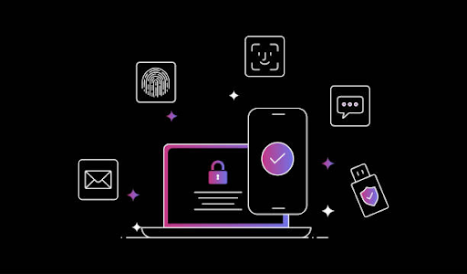
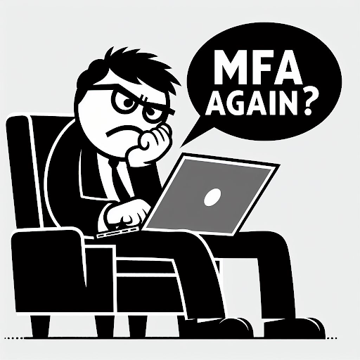

## Table of Content
- [Introduction](#introduction)
- [Understanding MFA and 2FA](#understanding-mfa-and-2fa)
- [Where MFA and 2FA fall short](#where-mfa-and-2fa-fall-short)
- [Conclusion](#conclusion)

## Introduction

Developing strong security measures for websites and applications is crucial. However, overly complex authentication methods can frustrate users and hinder product adoption.

**Multi-factor authentication (MFA)** and **Two-factor authentication (2FA)** can ease the authentication process, making applications more accessible to all users. In this article, we will explore the following: 
- The differences between MFA and 2FA from both the developers’ and the end users’ perspectives.
- How to balance security and user experience for successful product adoption.
- Best practices for creating a user-friendly login experience. 

## Understanding MFA and 2FA

Traditional password and username logins aren't enough in today's digital landscape. MFA and 2FA add additional layers of security during the login process to prevent unauthorized access.

**Two-factor authentication (2FA)** is like having an alarm system for your house. In addition to a key to unlock your front door, you would also need a code to turn off the alarm system. This represents 2FA’s requirement of needing **two authentication methods** to verify identity.  

In the digital world, a 2FA login process requires you to submit a factor **indicating your knowledge** and another **indicating ownership**. This may look like providing the following factors: 
- **Indicates knowledge**: Inputting your username and password 
- **Indicates ownership**: Verifying your login with a one-time code sent to your phone

**Multi-factor authentication (MFA)** is like having an alarm system, doorbell camera, and fingerprint scanner to unlock your front door. It expands on 2FA by requiring **multiple authentication methods** for enhanced security. Think of MFA as a layered security approach. 

The following table compares and contrasts 2FA and MFA based on several features: 

| Feature  	| 2FA 	| MFA 	|
|---	|---	|---	|
| Verification methods 	| Two factor 	| Multiple factors 	|
| Security Level 	| High 	| Very High 	|
| Examples 	| Social media login with password and one-time code from a phone 	| Corporate application access with password, one-time code, and fingerprint 	|

Just how effective are MFA and 2FA? The following statistics paint a clear picture: 

- A [Microsoft study](https://learn.microsoft.com/en-us/partner-center/security-at-your-organization) reports that 99.9% of compromised accounts don’t have MFA. 
- A [Gitnux](https://gitnux.org/two-factor-authentication-statistics/) study reports that 38% of financial companies reported that traditional security measures cannot keep data safe.  

## Where MFA and 2FA fall short

MFA and 2FA adoption and implementation are increasing, but it is crucial to examine where they fall short and how we can implement them intelligently. While these methods effectively enhance security, they can create several challenges for user experience.

- **User experience (UX) pitfalls**: A simple login process can increase user satisfaction and product adoption. However, if users have to enter a one-time password (OTP) every time they log in, it can be tedious and time-consuming.
- **Security vulnerabilities**: Due to sophisticated phishing and smishing attacks, hackers can intercept OTPs. Additionally, weak security questions and account recovery processes can create vulnerabilities. 
- **MFA fatigue**: Being prompted for multiple authentication factors every login can be tiring for users, leading to frustration and reduced product adoption. Users may also feel the additional security measures are unnecessary, especially for low-risk accounts.

What's the Strongest Authentication Method?
The strongest authentication methods consider risk to overcome these limitations. For example, logging into your social media account from your trusted device at home is less risky than logging in from a public computer. **Risk-based authentication** tailors the verification process to the situation.

The most robust authentication methods are categorized based on the factors they use. Here's a ranking of factors by strength:

### The Strongest Factor: Something You Are

A common “something you are” factor is biometric authentication. Biometric authentication uses unique physical characteristics, like fingerprints, facial recognition, or iris scans. The following attributes make it the strongest factor for several reasons: 

- **Uniqueness**: Biometric data is inherent to each person, making it difficult to duplicate or steal. Your fingerprint or facial features are yours alone. 
- **Liveness detection**: Many biometric systems use liveness detection, which ensures the presented fingerprint, face, or iris belongs to a living person, not a photo or replica. Read Forbe’s “[A Guide To Liveness Detection: Enhancing Facial Recognition Security](https://www.forbes.com/sites/forbesbusinesscouncil/2024/02/09/a-guide-to-liveness-detection-enhancing-facial-recognition-security/?sh=6575eb6686e7)” for an overview of how liveness detection works.

### The Medium Factor: Something You Have

This factor requires users to have a physical token or phone to authenticate their login—for example, a security key or a one-time code sent to the user's phone. While not as strong as biometrics, it offers a signification improvement over passwords: 

- **Added layer of security**: If a bad actor steals your password, they still need the physical token or one-time code to gain access. 
- **Limited lifespan**: One-time codes typically expire within a short timeframe, reducing the window of opportunity for attackers to intercept and use them.
- **Physical contact**: Physical tokens often require physical contact with the device being accessed, adding another layer of protection compared to receiving one-time codes. 

Where do “something you have” factors fall short of biometrics?

- **Physical loss or theft**: If a user loses their token or phone, unauthorized individuals may be able to gain access. 
- **One-time code interception**: One-time codes sent over SMS may be vulnerable to interception via smishing.   

### The Weakest Factor: Something You Know
This authentication factor relies on users remembering a password or PIN. While it is the most common, it is also the weakest. Here’s what makes it the weakest: 

**Hackable**: Attackers use techniques such as brute-force attacks, social engineering, and credential stuffing to guess weak passwords or crack strong ones. 
**Reusability**: People often reuse the same password across multiple accounts. If one account is compromised, attackers may be able to gain access to others. 
**Human error**: Complex passwords are hard to remember, leading users to choose weaker ones or write them down.   

### Best Practices
To achieve the perfect balance between security and user experience, here are some best practices that you can follow:

**Create user profiles** to understand your users’ technical skill levels, needs, and device preferences. Refer to the following best practices: 

- Implement a user onboarding process that gathers information about how the user intends to use the product, their background, skill level, and more. 
- Use analytics tools to analyze user behavior and identify preferred devices, login times, and typical actions.
- Consider offering different security levels based on user profiles. For example, a super user might be comfortable with multi-factor authentication (MFA) by default. In contrast, a less technical user might prefer a more straightforward process with the option to enable MFA later.

**Implement an adaptive authentication system** to detect unusual login behavior using risk factors and request additional verification. For example, further verification may be required if a user logs in from an unknown device or location. Refer to the following best practices: 

- Flag logins from geographically unexpected locations and request MFA. Additionally, you can offer the option to permit trusted locations to have recurring access. 
- Require additional verification for logins from unknown devices. To avoid friction, you can also allow users to pre-register trusted devices. 
- Monitor login attempts outside of usual login hours and prompt for MFA.  

**Educate your users** about the importance of strong passwords, not sharing login credentials, and regularly updating their account recovery information. Education can help prevent security vulnerabilities and reduce the need for frequent authentication factors. Refer to the following best practices: 

- Instead of just requiring strong passwords, educate users on password managers and the dangers of password reuse. 
- Implement security strength meters during onboarding and suggest improvements. 
- Integrate security reminders within your application or website. 

Combining these best practices with SuperToken’s [User Recipes](https://supertokens.com/docs/guides), you can implement user-friendly and secure authentication methods for your application or website.  

## Conclusion
The key to implementing authentication methods is to find the right balance between security and UX. Developers should always prioritize security without frustrating the user. Adopting best practices, conducting UX research, and opening ongoing feedback loops are crucial to refine your approach to security and ensure user satisfaction. 

Remember, security and UX are not opposing forces but rather interdependent aspects of a successful product. By constantly refining your approach and adapting to evolving threats, you can create a secure environment that fosters user trust and loyalty. After all, a happy and secure user is a user who will keep coming back.
