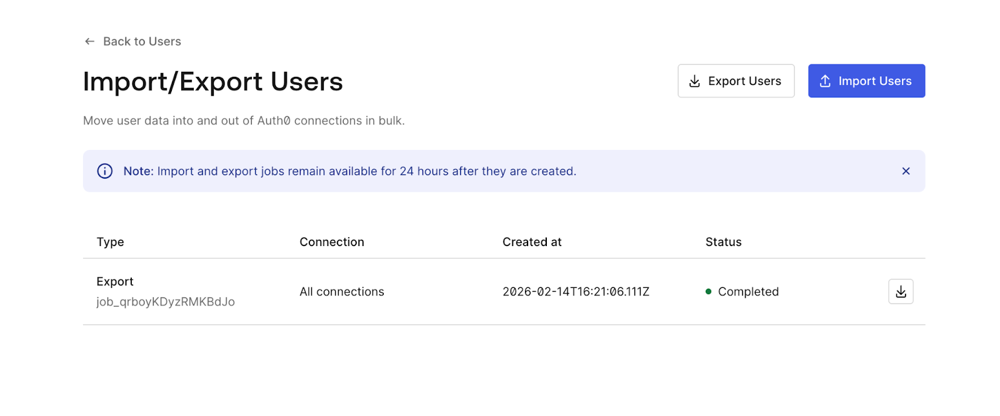
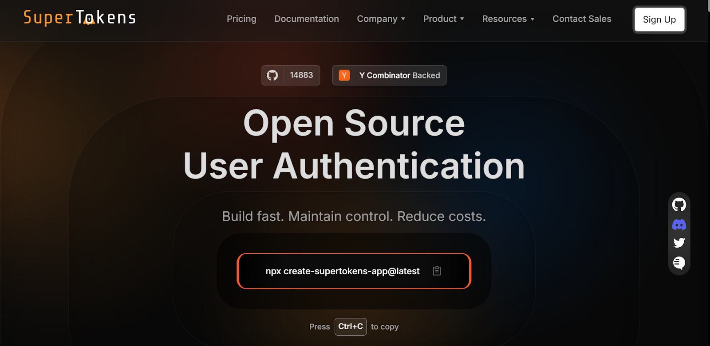

Authentication systems form the security foundation of modern applications. Migrating from [Auth0](https://auth0.com/) to [SuperTokens](https://supertokens.com/) involves transferring user credentials, preserving session state, and maintaining service continuity, while users remain unaware of backend changes. Whether driven by cost optimization, control requirements, or feature needs, successful migration demands careful planning and execution.

This guide provides developers with practical strategies for Auth0-to-SuperTokens migration, covering user export procedures, migration pattern selection, implementation details, and common challenges.

## Choosing the Right Migration Strategy

Your migration strategy needs to balance user disruption, engineering effort, and timeline constraints. Four primary approaches exist, each with distinct trade-offs regarding complexity, user impact, and migration completeness.

### **What Are Your Auth0 Migration Options?**

- **Lazy Migration** transfers users individually upon their next login attempt. The authentication system checks SuperTokens first; and if the user doesn't exist, it authenticates against Auth0, imports the user to SuperTokens, and issues a new session. This gradual approach minimizes risk and distributes the load over time.
- **Trickle Migration** triggers user transfers during specific events, such as logins, profile updates, password changes, or API usage. It's similar to lazy migration, but extends beyond authentication events to capture users through various interaction points. This accelerates migration for active users while maintaining a gradual rollout.
- **Automatic Migration** proactively transfers users by using Auth0 webhooks, rules, or scheduled jobs. Rather than waiting for user-initiated events, automated scripts move users in batches. This requires capturing credentials during Auth0 authentication, preserve password-based login.
- **Full Export and Re-Import** exports all users from Auth0 and imports them into SuperTokens in bulk operations. This is the fastest migration path, but it requires maintenance windows and coordination to avoid authentication failures during the transition.

Each strategy suits different scenarios. Small active user bases benefit from the simplicity of lazy migration. Large inactive user populations may require automatic migration to ensure completeness. Enterprise applications with strict SLAs often choose full export to control cutover timing precisely.

### **Lazy Migration Explained**

Lazy migration implements a fallback authentication pattern where SuperTokens becomes the primary source, while Auth0 serves as a backup for unmigrated users.

- **Flow:** User submits credentials → application checks SuperTokens → if the user is not found, authenticate against Auth0 → on success, create user in SuperTokens with metadata → issue SuperTokens session. Subsequent logins go directly to SuperTokens.
- **Advantages:** Zero downtime with both systems running in parallel, users notice nothing, active users migrate automatically, and easy rollback by disabling fallback logic.
- **Considerations:** Requires maintaining both systems during transition, inactive users may never migrate without eventual bulk import, and password hashes typically can't be transferred initially.

### **Trickle Migration Explained**

Trickle migration extends the lazy approach by triggering imports across more events: login attempts, profile updates, password reset requests, OAuth token refreshes, and session extensions.

```js
async function migrateUserIfNeeded(userId, triggerEvent) {
  // Check if user exists in SuperTokens
  const stUser = await SuperTokens.getUserById(userId);
 
  if (!stUser) {
    // User not yet migrated - fetch from Auth0
    const auth0User = await auth0.getUser(userId);
   
    // Import to SuperTokens
    await SuperTokens.importUser({
      userId: auth0User.user_id,
      email: auth0User.email,
      emailVerified: auth0User.email_verified,
      metadata: auth0User.user_metadata,
      appMetadata: auth0User.app_metadata,
    });
   
    logMigrationEvent(userId, triggerEvent);
  }
 
  return stUser || await SuperTokens.getUserById(userId);
}
```
**Advantages:** Faster migration than a lazy migration, multiple touchpoints capture more users, maintains gradual rollout safety, and it is transparent to users.

**Considerations:** More integration points increase code complexity, must handle migration failures gracefully across multiple flows, and it still requires eventual bulk import for completely inactive users.

### **Automatic Migration Explained**

Automatic migration proactively transfers users by using Auth0's extensibility mechanisms, combined with scheduled batch jobs.

**Auth0 Rules-Based Migration:** Rules execute during authentication and can capture plaintext credentials before hashing, and forward them to SuperTokens:

```js
function migrateToSuperTokens(user, context, callback) {
  if (user.app_metadata && user.app_metadata.migrated_to_supertokens) {
    return callback(null, user, context);
  }


  request.post({
    url: 'https://your-api.com/migrate-user',
    json: {
      userId: user.user_id,
      email: user.email,
      password: context.request.body.password,
      metadata: user.user_metadata,
    },
  }, function(err, response, body) {
    if (!err && response.statusCode === 200) {
      user.app_metadata = user.app_metadata || {};
      user.app_metadata.migrated_to_supertokens = true;
      auth0.users.updateAppMetadata(user.user_id, user.app_metadata);
    }
    callback(null, user, context);
  });
}
```
For users who haven't logged in recently, scheduled batch jobs handle the remainder &mdash; though password hashes are typically unavailable, meaning those users must reset passwords on their first SuperTokens login.

**Advantages:** Proactive migration independent of user activity, predictable, controllable timeline, and it captures inactive users.

**Considerations:** Password capture only works during authentication events, Auth0 API rate limits constrain batch speed, and it requires careful credential handling.

### **Full Export and Re-Import Explained**

Full export and re-import executes a coordinated bulk transfer during a planned cutover window: export the complete user database, transform the data, bulk import to SuperTokens in batches of 1,000--10,000, update application configuration, monitor traffic, and send password reset emails if needed.

**Advantages:** Fastest path to complete migration, predictable timeline measured in hours or days rather than weeks, no dual-system complexity, and it captures inactive users immediately.

**Considerations:** Requires a maintenance window, users typically must reset passwords, higher risk since a single event impacts everyone, and rollback is complex after cutover.

This approach works best for organizations that can schedule downtime, need rapid Auth0 cost elimination, or have large inactive user bases that lazy migration wouldn't efficiently capture.

## How to Export Users from Auth0

Auth0 provides multiple user export mechanisms, each with different capabilities regarding password hash access and metadata completeness.

### **Using Auth0's User Import/Export Extension**

Auth0's management dashboard includes user export functionality through the User Import/Export extension or the Management API.

**Dashboard Export:**

1. Navigate to Auth0 Dashboard → Users.
2. Click "Export Users" (or install the User Import/Export extension if not available).
3. Configure export parameters:
    - Connection type (database, social, enterprise)
    - User fields to include
    - Export format (JSON or CSV)
4. Initiate export job.
5. Download the resulting file via email link or dashboard.



**Management API Export:**

```js
const ManagementClient = require('auth0').ManagementClient;

const management = new ManagementClient({
  domain: 'YOUR_DOMAIN.auth0.com',
  clientId: 'YOUR_CLIENT_ID',
  clientSecret: 'YOUR_CLIENT_SECRET',
});


async function exportUsers() {
  let users = [];
  let page = 0;
  const perPage = 100;
 
  while (true) {
    const batch = await management.getUsers({
      per_page: perPage,
      page: page,
    });
   
    if (batch.length === 0) break;
   
    users = users.concat(batch);
    page++;
  }
 
  return users;
}
```

**Required Permissions:**

- `read:users` scope for basic user data.
- `read:user_idp_tokens` for social connection tokens.
- Application must be authorized for the Management API.

Exports include user identifiers, email addresses, metadata, and profile information, but typically exclude password hashes for security reasons.

### **Can You Export Users With Passwords?**

Auth0 stores password hashes in a secure internal storage inaccessible via standard APIs. If password migration is required, Auth0's Custom Database feature with "migration mode" enabled captures credentials progressively as users authenticate &mdash; create a Custom Database connection, implement a login script that verifies against SuperTokens with an Auth0 fallback, and then enable "Import Users to Auth0." Passwords transfer automatically as users log in.

If that's not feasible, the simpler alternative is forcing password resets: export users without passwords, import to SuperTokens, and send reset emails during migration. Note that the password hash algorithm (bcrypt, scrypt, PBKDF2) must match between systems for any direct hash import, mismatches require resets regardless.

### **Secure User Export Tips**

User exports contain sensitive personal information and should be treated as critical security artifacts throughout the migration process.Use HTTPS exclusively for all API calls, store export files in encrypted storage with automatic expiration, restrict filesystem permissions to migration service accounts, never commit export files to version control, and delete files immediately after successful import. Limit export access to the minimum required personnel, use short-lived API tokens, and require MFA for export initiation. Export only the fields needed, anonymize PII where possible, and document all operations for GDPR/CCPA audit trails.

## Implementing SuperTokens After Auth0

Successful migration requires proper SuperTokens configuration that matches your application architecture and security requirements.

### **SuperTokens Setup Essentials**

SuperTokens offers two deployment options: self-hosted or managed cloud service. Selection depends on infrastructure preferences, compliance requirements, and operational capacity.

**Managed Service Setup:**

1. Create an account at supertokens.com.
2. Obtain the connection URI and the API key from the dashboard.
3. Configure the backend SDK with credentials.
4. Deploy the frontend SDK in the application.

**Self-Hosted Setup:**

1. Deploy SuperTokens Core via Docker:
```js
docker run -p 3567:3567 -d registry.supertokens.io/supertokens/supertokens-postgresql
```
2. Configure a PostgreSQL or MySQL database.
3. Set environment variables for the database connection.
4. Initialize the backend SDK to point to the self-hosted core.

**Backend Configuration:**

```js
import SuperTokens from "supertokens-node";
import EmailPassword from "supertokens-node/recipe/emailpassword";
import Session from "supertokens-node/recipe/session";


SuperTokens.init({
  framework: "express",
  supertokens: {
    connectionURI: "https://your-instance.supertokens.io",
    apiKey: "your-api-key",
  },
  appInfo: {
    appName: "Your App",
    apiDomain: "https://api.yourapp.com",
    websiteDomain: "https://yourapp.com",
    apiBasePath: "/auth",
    websiteBasePath: "/auth",
  },
  recipeList: [
    EmailPassword.init(),
    Session.init(),
  ],
});
```

**Frontend Configuration:**
```js
import SuperTokens from "supertokens-auth-react";
import EmailPassword from "supertokens-auth-react/recipe/emailpassword";
import Session from "supertokens-auth-react/recipe/session";


SuperTokens.init({
  appInfo: {
    appName: "Your App",
    apiDomain: "https://api.yourapp.com",
    websiteDomain: "https://yourapp.com",
    apiBasePath: "/auth",
    websiteBasePath: "/auth",
  },
  recipeList: [
    EmailPassword.init(),
    Session.init(),
  ],
});
```

### **Importing Users to SuperTokens**

User import maps Auth0 data structures to SuperTokens schema while preserving essential authentication and profile information.

**Field Mapping:**
| **Auth0 Field** | **SuperTokens Field** | **Notes** |
|-----------------|-----------------------|-----------|
| `user_id` | `externalUserId` | Preserves user identity |
| `email` | `email` | Primary identifier |
| `email_verified` | `isEmailVerified` | Email verification status |
| `user_metadata` | `userMetadata` | Custom user data |
| `app_metadata` | `userMetadata` or custom storage | Application-specific data |
| `created_at` | `timeJoined` | Account creation timestamp |

**Import API Usage:**

```js
import { createUser } from "supertokens-node/recipe/emailpassword";


async function importAuth0User(auth0User) {
  try {
    const result = await createUser({
      email: auth0User.email,
      password: generateTemporaryPassword(), // If password unavailable
    });
   
    // Store Auth0 ID for reference
    await updateUserMetadata(result.user.id, {
      auth0UserId: auth0User.user_id,
      migratedAt: new Date().toISOString(),
      ...auth0User.user_metadata,
    });
   
    return result;
  } catch (error) {
    console.error(`Failed to import user ${auth0User.email}:`, error);
    throw error;
  }
}
```

**Lazy Migration Import:**

For lazy migration, import happens during authentication:

```js
app.post("/auth/signin-with-migration", async (req, res) => {
  const { email, password } = req.body;
 
  // Try SuperTokens first
  try {
    const session = await EmailPassword.signIn(email, password);
    return res.json({ status: "OK", session });
  } catch (stError) {
    // User not in SuperTokens - check Auth0
    try {
      const auth0Session = await auth0.authenticate(email, password);
     
      // Import to SuperTokens
      await createUser({
        email: email,
        password: password, // Password captured during auth
      });
     
      // Create SuperTokens session
      const session = await EmailPassword.signIn(email, password);
      return res.json({ status: "OK", session, migrated: true });
    } catch (auth0Error) {
      return res.status(401).json({ error: "Invalid credentials" });
    }
  }
});
```

### **Preserving Sessions and User Context**

Session continuity during migration prevents forcing users to re-authenticate unnecessarily.

**JWT Claims Mapping:**

Auth0 access tokens contain claims that applications depend on. SuperTokens sessions must include equivalent claims:

```js
import Session from "supertokens-node/recipe/session";


Session.init({
  override: {
    functions: (originalImplementation) => ({
      ...originalImplementation,
      createNewSession: async (input) => {
        // Fetch user roles and permissions
        const userRoles = await getUserRoles(input.userId);
        const permissions = await getUserPermissions(input.userId);
       
        // Add Auth0-compatible claims
        input.accessTokenPayload = {
          ...input.accessTokenPayload,
          "https://yourapp.com/roles": userRoles,
          "https://yourapp.com/permissions": permissions,
          sub: input.userId,
          email: input.userDataInJWT.email,
        };
       
        return originalImplementation.createNewSession(input);
      },
    }),
  },
});
```

**SSO Preservation:**

Applications using Auth0 for SSO across multiple domains require coordination:

1. Deploy SuperTokens with a matching domain configuration.
2. Maintain cookie domains consistent with the Auth0 setup.
3. Gradually migrate applications to SuperTokens sessions.
4. Use feature flags to control which apps use SuperTokens.
5. Ensure session token formats remain compatible across apps.

## Planning Your Migration Rollout

Structured rollout planning minimizes disruption, while enabling rapid response to unexpected issues.

### **Define Your Migration Goals**

Clear, quantifiable objectives guide strategy selection and justify engineering investment across three areas:

- **Cost Reduction:** Calculate Auth0 spending, project SuperTokens costs, and set target savings timelines.
- **Increased Control:** Identify Auth0 limitations, define compliance needs, and specify required authentication flows.
- **Feature Additions:** Document new authentication methods, integrations, and security enhancements needed.

### **Test in Staging First**

Mirror production architecture with anonymized data and replicate the Auth0 configuration before touching production. Cover all critical test scenarios &mdash; SSO, passwordless authentication, RBAC, social login, MFA, password reset, and session management &mdash; then performance test authentication latency under load and stress test failover between both systems. Comprehensive staging validation prevents production incidents and builds confidence before cutover.

### **Communicate Clearly With Users**

Proactive communication at every stage reduces support burden and maintains trust.

- **Pre-Migration:** Send email announcements, add in-app banners, publish FAQs, and train your support team.
- **During Migration:** Provide status updates, clear password reset instructions, and escalation paths for blocked users.
- **Post-Migration:** Send confirmation emails, announce new capabilities, and collect feedback on the authentication experience.

## Addressing Migration Challenges

Common migration obstacles have established solutions that reduce risk and complexity.

### **Dealing With Incomplete Data**

Auth0 exports may lack required fields or contain inconsistent data.

**Missing Metadata:**

Use the Auth0 Management API to fetch complete user profiles:

```js
async function enrichUserData(exportedUser) {
  // Fetch full profile from Auth0
  const completeUser = await auth0Management.getUser({
    id: exportedUser.user_id,
  });
 
  // Get user roles
  const roles = await auth0Management.getUserRoles({
    id: exportedUser.user_id,
  });
 
  // Get user permissions
  const permissions = await auth0Management.getUserPermissions({
    id: exportedUser.user_id,
  });
 
  return {
    ...completeUser,
    roles: roles.map(r => r.name),
    permissions: permissions.map(p => p.permission_name),
  };
}
```
**Inconsistent Data:**

Validate and normalize during import:

```js
function validateUserData(user) {
  return {
    email: normalizeEmail(user.email),
    emailVerified: Boolean(user.email_verified),
    createdAt: parseDate(user.created_at),
    metadata: sanitizeMetadata(user.user_metadata),
  };
}
```

### **Managing Rate Limits and Bulk Exports**

Auth0 API rate limits constrain export and migration speed.

**Rate Limit Handling:**

```js
async function exportWithRateLimit() {
  const users = [];
  let page = 0;
  const perPage = 50; // Conservative batch size
 
  while (true) {
    try {
      const batch = await auth0.getUsers({
        per_page: perPage,
        page: page,
      });
     
      if (batch.length === 0) break;
     
      users.push(...batch);
      page++;
     
      // Wait between requests to respect rate limits
      await sleep(200);
    } catch (error) {
      if (error.statusCode === 429) {
        // Rate limited - exponential backoff
        const retryAfter = error.headers['retry-after'] || 5;
        await sleep(retryAfter * 1000);
        continue; // Retry same page
      }
      throw error;
    }
  }
 
  return users;
}
```

**Incremental Sync:**

Use webhooks or change data capture to sync users continuously:

```js
// Auth0 webhook handler
app.post("/auth0/webhook", async (req, res) => {
  const event = req.body;
 
  if (event.type === "slo" || event.type === "ss") {
    // User login or signup - trigger migration
    await migrateUserIfNeeded(event.user_id);
  }
 
  res.status(200).send();
});
```

### **Ensuring Zero Downtime During Cutover**

Feature flags enable gradual traffic shifting without downtime.

**Feature Flag Implementation:**

```js
const featureFlags = {
  useSuperTokensAuth: process.env.USE_SUPERTOKENS === "true",
  superTokensPercentage: parseInt(process.env.ST_TRAFFIC_PERCENT) || 0,
};


async function authenticate(email, password) {
  const useSuperTokens = featureFlags.useSuperTokensAuth ||
    (Math.random() * 100 < featureFlags.superTokensPercentage);
 
  if (useSuperTokens) {
    return await authenticateWithSuperTokens(email, password);
  } else {
    return await authenticateWithAuth0(email, password);
  }
}
```
**Gradual Rollout:**

1. Deploy SuperTokens with 0% traffic.
2. Increase to 5% and monitor for 24 hours.
3. Scale to 25% if no issues are detected.
4. Reach 50%, then 75%, then 100% incrementally.
5. Maintain Auth0 fallback for 30 days post-cutover.
6. Decommission Auth0 after stability confirmation.

This approach enables rapid rollback if issues emerge while proving SuperTokens stability under real production load.

## How SuperTokens Simplifies the Migration Process



SuperTokens provides migration-specific features, reducing implementation complexity and risk.

### **Built-In Support for Lazy and Trickle Migration**

SuperTokens documentation includes migration guides with code examples for common scenarios.

**Custom Authentication APIs:**

Override default authentication APIs to implement fallback logic:

```js
import EmailPassword from "supertokens-node/recipe/emailpassword";


EmailPassword.init({
  override: {
    apis: (originalImplementation) => ({
      ...originalImplementation,
      signInPOST: async (input) => {
        try {
          // Try SuperTokens first
          return await originalImplementation.signInPOST(input);
        } catch (error) {
          // User not found - check Auth0
          const email = input.formFields.find(f => f.id === "email").value;
          const password = input.formFields.find(f => f.id === "password").value;
         
          const auth0User = await verifyAuth0Credentials(email, password);
         
          if (auth0User) {
            // Import to SuperTokens
            await importUserFromAuth0(auth0User, password);
           
            // Retry SuperTokens authentication
            return await originalImplementation.signInPOST(input);
          }
         
          throw error;
        }
      },
    }),
  },
});
```
This pattern integrates seamlessly with SuperTokens' existing authentication flows.

### **Developer-Centric Tooling**

SuperTokens prioritizes developer experience through comprehensive SDKs and debugging capabilities.

**SDK Coverage:**

- Backend: Node.js, Python, Go
- Frontend: React, Vue, Angular, vanilla JavaScript
- Mobile: React Native, Flutter

**Debugging Features:**

- Detailed error messages with resolution guidance
- Request/response logging for authentication flows
- Session debugging tools in the dashboard
- Migration event tracking and analytics

**Documentation Quality:**

- Step-by-step migration guides
- Code examples for common scenarios
- API reference documentation
- Video tutorials and webinars

### **Zero Lock-In Post-Migration**

Unlike Auth0's proprietary systems, SuperTokens maintains portability.

**Standard Formats:**

- JWT tokens with standard claims
- OAuth 2.0 / OpenID Connect protocols
- Standard password hashing (bcrypt, argon2)
- PostgreSQL/MySQL for user storage

**Export Capabilities:**

- Full user data export via API
- Direct database access for self-hosted
- Password hash export (self-hosted)
- No export fees or restrictions

**Self-Hosting Option:** Managed service customers can migrate to self-hosted SuperTokens without changing application code, same APIs,
same SDKs, different infrastructure.

This architecture prevents future vendor lock-in, reducing long-term risk regardless of authentication requirements.

## Conclusion

Migrating from Auth0 to SuperTokens requires choosing an appropriate migration strategy: lazy, trickle, automatic, or full export; based on your user base characteristics, operational constraints, and risk tolerance. Lazy migration offers the safest gradual approach, automatic migration provides predictable timelines, full export enables controlled cutover timing.

**Key Success Factors:**

- Secure user export handling with encryption and access controls.
- Comprehensive staging environment testing before production deployment.
- Clear user communication throughout the migration lifecycle.
- Gradual rollout with feature flags enabling rapid rollback.
- Monitoring and observability to detect issues early.

SuperTokens simplifies migration through built-in support for common patterns, developer-friendly SDKs, and comprehensive documentation. The combination of managed service convenience and self-hosting flexibility prevents future lock-in, while reducing immediate Auth0 costs.

**Next Steps:**

1. Review the official SuperTokens migration documentation at [https://supertokens.com/docs/migration/overview](https://supertokens.com/docs/migration/overview).
2. Test migration strategies in the staging environment.
3. Calculate cost savings and timeline requirements.
4. Select a migration approach that matches your constraints.
5. Implement a gradual rollout with monitoring.
