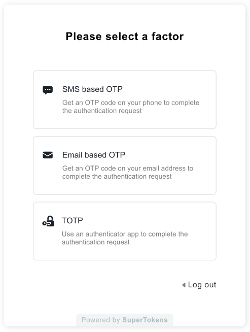

## Introduction

Security has always been crucial, especially in today’s digital landscape, where so much is at stake if security practices are weak or missing. The challenge with security is that the solutions and best practices are often logical and even obvious—yet, for various reasons, we sometimes choose to ignore them.

Historically, efforts to protect data have evolved significantly. For instance, the ancient [Caesar cipher](https://en.wikipedia.org/wiki/Caesar_cipher) was an early attempt at encryption. Over time, especially during pivotal moments like World War II, security became a strategic focus, with the Allies striving to crack Axis encrypted messages. This culminated in Alan Turing’s breakthrough with the Enigma machine, which was a major leap forward in cryptography.

In the modern era, security practices have continued to evolve rapidly. The fascinating part is that security has two sides: the development of practices and tools to safeguard information, and the relentless advancement of methods to breach these defenses. This push and pull is what drives the continuous evolution of technology. Just consider how modern encryption methods compare to those of the WWII era—remarkably advanced in less than a century.

However, for the average person, keeping up with this constant evolution in security can be overwhelming. Let’s think back to the early login methods. Initially, you’d simply enter a username (or email) and a password. While this was fine at first, passwords soon became problematic: people tended to use weak, obvious passwords and repeated them across multiple sites. If one site was breached, attackers had a good idea of that user’s passwords elsewhere. Compounding this, developers weren’t always encrypting passwords in databases, which increased risk. Eventually, password rotation policies came into play, but many users would just increment a year or a month in their password, making them easy for attackers to predict.

Soon after, we saw the emergence of password policies that required special characters, numbers, and mixed-case letters—an improvement, but still vulnerable to cracking, especially as technology advanced. Plus, deception tactics like phishing became common, tricking users into sharing their credentials. Password managers were introduced as a way to generate, store, and autofill unique, complex passwords safely, even avoiding filling passwords on suspicious sites. From a technology standpoint, developers were doing their best to secure passwords. Yet, one persistent vulnerability remained—and probably will for years: human error.

Despite all efforts, people were still deceived, and passwords continued to leak. It became clear that passwords alone weren’t enough. Something else was needed to secure accounts—something that added another layer of verification, ideally a layer that was harder to guess, changed regularly, or was highly specific to the user, like a fingerprint. This is where Multi-Factor Authentication (MFA) comes in. MFA adds an additional layer of protection, making it incredibly hard for unauthorized users to access accounts.

Research indicates that MFA can prevent over 99.9% of account compromise attacks, effectively safeguarding users from unauthorized access. For more on this, check out the research and statistics on MFA’s effectiveness on [LLC Buddy](https://llcbuddy.com/data/multi-factor-authentication-software-statistics/) and the [Microsoft website](https://www.microsoft.com/en-us/research/publication/how-effective-is-multifactor-authentication-at-deterring-cyberattacks/).

## Understanding Multi-Factor Authentication (MFA)

Multi-Factor Authentication (MFA) is a security process that requires users to provide two or more verification factors to access an account or system. Unlike single-factor authentication, which only requires a password, MFA layers multiple independent forms of authentication. This approach significantly improves security by reducing the likelihood that a compromised password alone will allow unauthorized access.

### Key Types of MFA

MFA generally falls into three categories:

1. **Something you know** (Passwords, PINs)
2. **Something you have** (Security Tokens, Mobile Devices)
3. **Something you are** (Biometrics)

Let's dive into each type.

**Something you know** includes information only the user should know, such as passwords or PINs. This type of authentication relies on the user's memory and is very common. Think of a credit card PIN code, or the SIM card PIN codes from the early days of mobile phones. However, it is the least secure of the three types since it depends on the user’s memory and habits. Common vulnerabilities include **phishing attacks** (where users may be tricked into revealing passwords through deceptive emails or websites) and **password reuse** across multiple accounts. If users choose this method, it's best to use a password manager for generating and securely storing unique, strong passwords. Password managers help enforce complex password policies and reduce the risks associated with weak, easily guessed passwords. Some notable password managers are **1Password**, **LastPass**, **Bitwarden**, etc.

**Something you have** relies on possession-based MFA, requiring users to have a physical item to verify their identity. Examples include push notifications for verification, mobile authentication apps like **Google Authenticator**, **Authy**, or **Microsoft Authenticator**, and SMS codes sent to the user’s device. Some banks use possession-based MFA for transactions—imagine trying to make a purchase and receiving a prompt to approve the action on your banking app, or getting a code via SMS to verify the transaction. This method is more secure than passwords or PINs, but there’s still a risk if the device is lost or stolen.

**Something you are** is the most secure type of MFA, as it relies on unique physical traits, such as fingerprints, facial recognition, voice recognition, or retina scans. You may recognize this from movies, where characters are authenticated by scanning their eyes or voices. In real life, this is commonly used on smartphones that unlock by scanning the user’s face or with a fingerprint. While this method is highly secure, it’s not without challenges: **false positives** or **false negatives** can occur if the biometric scanner misreads due to changes in physical conditions or poor-quality scans.

Whether you choose the most secure option, like biometrics, or the more accessible but less secure PIN codes or passwords, one thing is certain—you’re making life more difficult for attackers.

## Implementing MFA in Your App: Key Considerations

#### Choose Your MFA Methods

When adding MFA to your application, it’s essential to choose methods that align best with your app’s goals and user needs, rather than just opting for the "strongest" or "most secure" option. Different MFA methods offer unique benefits:

* **Time-Based One-Time Passwords (TOTPs)**: This approach uses apps like Google Authenticator or Authy to generate time-sensitive codes;
* **SMS-based Verification**: A more traditional option that adds accessibility by sending codes via SMS, making it easy for users who might not have an authenticator app;
* **Push Notifications**: Allows for a seamless experience by prompting users directly in an app to approve actions;
* **Biometric Authentication**: Provides a high level of security and a quick user experience by leveraging device-based biometrics like fingerprint or facial recognition;

#### Integrating MFA into Your Authentication Flows

To ensure a smooth experience, prompt users to set up MFA either during the sign-up process or as part of the onboarding. Incorporate MFA in the login flow, and consider offering recovery options, like backup codes or secondary methods, to prevent lockouts if a primary MFA method is unavailable.

#### Prioritizing User Experience (UX)

MFA should improve security without making the login experience cumbersome. One way to balance security and convenience is by allowing users to mark devices as trusted, so they won’t need to re-enter MFA codes repeatedly on those devices.

#### Utilize Existing Solutions for Faster Integration

Creating MFA from scratch can be time-consuming and complex. Thankfully, many solutions exist to help developers implement MFA efficiently without building it all from the ground up.

[**SuperTokens**](https://supertokens.com/product) is an excellent choice—not just for MFA but for the entire authentication layer. SuperTokens is an open-source, developer-friendly authentication platform designed to simplify the setup of secure, scalable user authentication. It offers a plug-and-play approach for typical authentication flows like sign-up, sign-in, passwordless login, social logins, session management, and MFA. Plus, it’s customizable to suit advanced use cases.

Using SuperTokens, you can add MFA to your app quickly—often in just a few steps with their CLI and pre-built “recipes.” Here’s a look at some of the options [SuperTokens offers for MFA](https://supertokens.com/docs/additional-verification/mfa/introduction), which streamline implementation and allow you to focus on building your app’s core features.

## Real-World Examples of MFA

### Banking and Financial Services

Banks, being prime targets for cyberattacks, have led the way in MFA adoption to secure financial transactions and account access. Many banks employ a variety of MFA methods, such as **SMS verification**, **app-based prompts**, and **hardware tokens** to protect their users.

For instance, whenever I make an online purchase, I receive an SMS with the transaction amount and a unique code to authorize it. My friend, on the other hand, receives a push notification whenever she logs into her bank account, requiring her to confirm that it’s really her. For my company’s account, I use an RSA token that generates a Time-Based One-Time Password (TOTP) every 30 seconds. This token is necessary each time I log in or make a purchase, adding an extra layer of security. I imagine you, the reader, might have similar experiences with your bank, as financial institutions have really stepped up their security game.

One [case study](https://www.humansecurity.com/learn/case-studies/top-regional-bank) highlighted a regional bank that implemented app-based MFA after a series of phishing attacks compromised accounts. The new system reduced unauthorized access attempts by 70% within the first year, showcasing the effectiveness of app-based prompts in combating phishing and enhancing overall account security.

### Healthcare Industry

With strict regulations like HIPAA, the healthcare sector relies heavily on MFA to secure electronic health records (EHRs) and other sensitive data.

Healthcare facilities often use biometric methods, such as fingerprint scanners or facial recognition, to allow doctors and nurses to access EHRs. These systems don’t just secure health records—they also regulate physical room access for authorized staff. When accessing patient records through a portal, some systems require a One-Time Password (OTP) sent to a mobile device or email, adding another layer of protection.

MFA in healthcare doesn’t always need to be automated, though. In the country I live in, each citizen has a unique health card with a specific ID number. To access my own portal-based health records, I need to enter this unique number. Similarly, when visiting a doctor, I have to provide this ID number to give the doctor or any authorized staff member access to my health records.

One [case study](https://www.hipaajournal.com/hc3-provides-guidance-on-multifactor-authentication-and-highlights-smishing-risks/) describes how a major hospital chain implemented a combined approach of biometrics and mobile OTPs for off-site access to EHRs. This strategy helped them meet regulatory standards and protect against data breaches, showcasing the effectiveness of MFA in healthcare.
Another example of a good [read](https://tilsecurity.com/multi-factor-authentication-for-healthcare/).

### Education Sector

Educational institutions are increasingly adopting MFA to protect student and faculty information. For instance, many universities implement MFA for accessing student portals, which store grades, financial information, and personal records.

Common MFA methods include **One-Time Passwords (OTPs)** for student portal logins, **hardware tokens** for faculty accessing sensitive research data, and **SMS verification** for added security.

For instance, in my country, parents can access their children’s grades in high school and elementary school systems. When they log in, they receive either an SMS code for verification or a push notification on their phone, depending on their chosen method.

One [case study](https://link.springer.com/chapter/10.1007/978-3-031-34754-2_6) highlights how the rise of online exams, particularly during COVID-19, led some universities to confront security challenges like unauthorized access and academic dishonesty. A security audit revealed vulnerabilities in their exam systems, prompting one university to implement MFA to enhance protection. Students were required to authenticate using OTPs sent through mobile apps or SMS, ensuring that only authorized users could access exams, even if passwords were compromised. Faculty members accessing sensitive data used hardware tokens generating time-based one-time passcodes (TOTPs) for added security. To prevent lockouts, backup codes were provided, and the platform included monitoring to detect unusual login patterns. The MFA integration significantly reduced unauthorized access attempts and instances of cheating, helping to maintain academic integrity and foster trust in the online examination process.

### E-commerce Platforms

Online shopping is booming, but so are the security threats that come with it—things like account takeovers, fraud, and unauthorized transactions. For e-commerce sites, Multi-Factor Authentication (MFA) is a game-changer for keeping customer data safe and transactions secure.

Big names in e-commerce, like Amazon, offer optional MFA to give customers peace of mind. You’ll see app-based OTPs (those time-sensitive codes from apps like Google Authenticator) or good old SMS verification. This means that if someone tries to sign in from a new device or make a high-stakes purchase, there’s an extra step to confirm it’s actually the customer. Shopify takes it a step further, giving store owners the option to enable MFA on their admin accounts, which protects sensitive operations—only verified users can access and manage these important settings.

Some e-commerce apps are even rolling out push notifications for specific purchases, especially high-value orders. Say you’re making a big buy, like a new laptop; you might get a prompt to confirm the transaction through a push notification. This isn’t just a nice-to-have feature; it’s extra security that lets customers double-check their orders and instantly catch any shady activity.

An online marketplace took MFA seriously after seeing a wave of phishing scams targeting its users. People’s accounts were getting hijacked, leading to unauthorized purchases and a lot of stress. To tackle this, the marketplace made MFA available for customer accounts and mandatory for merchants. Customers could opt for OTPs or SMS codes during login, and merchants had to use MFA to access their accounts and manage orders.

Not stopping there, they also added transaction approvals for those big-ticket items or unusual account activity. This way, if someone tried to make a large purchase or change account settings, they’d get an instant prompt to confirm. The result? A massive drop in unauthorized access and fraudulent transactions, and a boost in user trust. People felt a lot safer using the platform, knowing it had extra defenses in place. It’s a good reminder that in e-commerce, a bit of extra security can go a long way in making people feel valued and protected.

## Conclusion

Multi-Factor Authentication (MFA) has proven itself as one of the most effective ways to safeguard digital accounts and protect sensitive information in today’s high-risk environment. From financial services and healthcare to education and e-commerce, MFA adds a critical layer of defense, making it significantly harder for unauthorized users to gain access. By requiring multiple forms of authentication—whether something you know, have, or are—MFA addresses the limitations of traditional password-based security and reduces vulnerabilities like phishing and account takeovers.

Implementing MFA in applications is simpler than ever, thanks to tools like [SuperTokens](https://supertokens.com/). SuperTokens offers a range of MFA methods, including Time-Based One-Time Passwords (TOTPs), SMS verification, and app-based push notifications, making it easy to choose the right solution for your users’ needs. With its open-source platform, SuperTokens streamlines the authentication setup process, providing developers with a quick, secure way to add MFA without compromising on user experience. For more details on how to integrate SuperTokens’ MFA options, visit their [product page](https://supertokens.com/product) and explore their comprehensive [documentation](https://supertokens.com/docs/guides).

As we continue to move more of our lives and sensitive data online, MFA is no longer optional—it’s a necessity. By adopting MFA and leveraging solutions like SuperTokens, both businesses and individuals can stay one step ahead of potential threats, ensuring that their data and transactions remain safe and secure.
