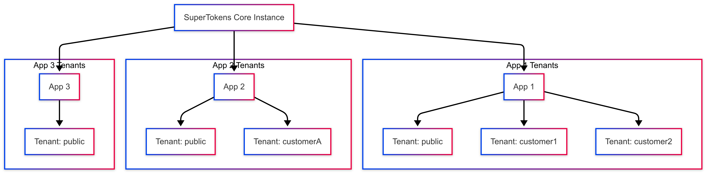

In today’s digital economy, Software‑as‑a‑Service (SaaS) providers must deliver robust, secure, and scalable solutions to meet diverse customer needs. Multi‑tenancy—a design paradigm that lets a single application instance serve multiple customers—is at the heart of this evolution. In this post, we delve deeper into multi‑tenancy, exploring its economic benefits, technical challenges, research-backed best practices, and how SuperTokens leverages this architecture to optimize cost and performance.

> **Pro Tip:** For a detailed analysis on cost‑savings, check out [How we used multi‑tenancy to cut our AWS costs by 50%](https://supertokens.com/blog/how-we-cut-our-aws-costs-part-2)

---

## What is Multi‑Tenancy? A Detailed Perspective

Multi‑tenancy is more than just sharing resources; it’s a strategic architecture that provides each tenant with a virtually isolated experience while leveraging a common infrastructure. Unlike single‑tenant solutions—where each customer runs on a dedicated instance—multi‑tenant systems reduce redundancy by:

- **Sharing Core Resources:** Databases, servers, and application logic are shared.
- **Ensuring Isolation:** Logical (or sometimes physical) boundaries guarantee that each tenant’s data, workflows, and settings remain separate.
  
Research from industry leaders shows that a well‑implemented multi‑tenant system not only reduces operational overhead but also accelerates innovation by centralizing maintenance and updates.

---

## The Economics of Multi‑Tenancy

Multi‑tenancy plays a pivotal role in cost optimization. Consider these points:

- **Shared Infrastructure Reduces Costs:**  
  By pooling resources, companies can scale more cost‑effectively. Studies indicate that companies adopting multi‑tenant models can reduce infrastructure costs by up to 50% compared to single‑tenant architectures.

- **Economies of Scale:**  
  As usage grows, the marginal cost of adding new tenants decreases, allowing for more predictable and manageable expenses. This economic efficiency is especially critical in cloud environments, where resource utilization directly impacts cost.

- **Improved Operational Efficiency:**  
  Centralized maintenance and updates eliminate redundant processes and reduce downtime. This contributes to lower support and maintenance costs over the lifecycle of the application.

---

## Architectural Models in Multi‑Tenant Systems

There are several design patterns for implementing multi‑tenancy, each with its trade‑offs. The primary models include:

### 1. Database‑per‑Tenant
- **Overview:**  
  Each tenant has its own dedicated database.
- **Pros:**  
  Maximum isolation, which can simplify regulatory compliance.
- **Cons:**  
  Increased resource consumption and operational complexity as tenant count grows.
- **Research Insight:**  
  Academic and industry research highlights that this approach is suitable for high‑security environments where data isolation is non‑negotiable.

### 2. Schema‑per‑Tenant
- **Overview:**  
  A single database hosts multiple schemas—one per tenant.
- **Pros:**  
  Balances isolation and resource sharing.
- **Cons:**  
  Complexity in schema management and potential performance overhead with a large number of tenants.
- **Research Insight:**  
  Research suggests this method is a middle‑ground solution, providing a blend of isolation and efficient resource utilization.

### 3. Shared Database, Shared Schema
- **Overview:**  
  All tenants share the same database and schema, with row‑level security enforcing isolation.
- **Pros:**  
  Highest resource efficiency and simplified management.
- **Cons:**  
  Greater risk if isolation controls fail; requires rigorous security measures.
- **Research Insight:**  
  This approach is popular in SaaS platforms with a high volume of small tenants, where performance tuning and security automation are essential.

---

## Security Considerations and Research‑Backed Best Practices

### Data Isolation and Encryption
- **Isolation Techniques:**  
  Implementing robust access controls, such as row‑level security, ensures that tenant data remains private. Research by security experts emphasizes the importance of “defense in depth” in multi‑tenant systems.
- **Encryption:**  
  Data should be encrypted both in transit and at rest. Advanced encryption standards (AES‑256) are widely recommended.
- **Compliance:**  
  Adhering to regulations like GDPR, HIPAA, and PCI‑DSS is critical. Best practices from industry whitepapers stress continuous security audits and vulnerability assessments.

### Performance and Scalability
- **Dynamic Resource Allocation:**  
  Leveraging container orchestration tools (e.g., Kubernetes) enables dynamic scaling based on tenant load. Research shows that auto‑scaling can reduce response time variations and minimize the “noisy neighbor” effect.
- **Load Balancing:**  
  Distributing traffic with load balancers prevents resource contention. Academic research in cloud computing supports this approach as vital for high‑availability systems.

### Operational Best Practices
- **Centralized Monitoring:**  
  Advanced monitoring solutions (such as Prometheus and Grafana) are used to track tenant‑specific performance metrics. Research underscores the importance of real‑time analytics in identifying and mitigating performance bottlenecks.
- **Automated Onboarding and Provisioning:**  
  API‑driven tenant management streamlines onboarding and reduces human error. Industry case studies, including those from Salesforce and Shopify, validate the effectiveness of automation in multi‑tenant environments.

---

## SuperTokens’ Multi‑Tenancy: A Deep Dive

SuperTokens has engineered a multi‑tenant architecture that exemplifies best practices in modern SaaS design. Here’s how we do it:

### Tenant Level
- **Dedicated User Pools:**  
  Each tenant receives its own user pool with configurable authentication methods. This ensures that even if multiple tenants use the same email address, their data remains isolated.
- **Security and Compliance:**  
  Our approach integrates state‑of‑the‑art encryption and continuous monitoring, ensuring compliance with stringent regulatory standards.

### App Level
- **Unified Core Instance:**  
  A single SuperTokens core instance supports multiple applications and environments (development, staging, production). This design minimizes redundancy and reduces overhead.
- **Dynamic Tenant Management:**  
  When the core initializes, it creates a default app (`appId = "public"`) and tenant (`tenantId = "public"`). New apps and tenants can be added dynamically via APIs, ensuring scalability and flexibility.

### Architecture Diagram

### 1. Database‑per‑Tenant
- **Overview:**  
  Each tenant has its own dedicated database.
- **Pros:**  
  Maximum isolation, which can simplify regulatory compliance.
- **Cons:**  
  Increased resource consumption and operational complexity as tenant count grows.
- **Research Insight:**  
  Academic and industry research highlights that this approach is suitable for high‑security environments where data isolation is non‑negotiable.

### 2. Schema‑per‑Tenant
- **Overview:**  
  A single database hosts multiple schemas—one per tenant.
- **Pros:**  
  Balances isolation and resource sharing.
- **Cons:**  
  Complexity in schema management and potential performance overhead with a large number of tenants.
- **Research Insight:**  
  Research suggests this method is a middle‑ground solution, providing a blend of isolation and efficient resource utilization.

### 3. Shared Database, Shared Schema
- **Overview:**  
  All tenants share the same database and schema, with row‑level security enforcing isolation.
- **Pros:**  
  Highest resource efficiency and simplified management.
- **Cons:**  
  Greater risk if isolation controls fail; requires rigorous security measures.
- **Research Insight:**  
  This approach is popular in SaaS platforms with a high volume of small tenants, where performance tuning and security automation are essential.

---

## Security Considerations and Research‑Backed Best Practices

### Data Isolation and Encryption
- **Isolation Techniques:**  
  Implementing robust access controls, such as row‑level security, ensures that tenant data remains private. Research by security experts emphasizes the importance of “defense in depth” in multi‑tenant systems.
- **Encryption:**  
  Data should be encrypted both in transit and at rest. Advanced encryption standards (AES‑256) are widely recommended.
- **Compliance:**  
  Adhering to regulations like GDPR, HIPAA, and PCI‑DSS is critical. Best practices from industry whitepapers stress continuous security audits and vulnerability assessments.

### Performance and Scalability
- **Dynamic Resource Allocation:**  
  Leveraging container orchestration tools (e.g., Kubernetes) enables dynamic scaling based on tenant load. Research shows that auto‑scaling can reduce response time variations and minimize the “noisy neighbor” effect.
- **Load Balancing:**  
  Distributing traffic with load balancers prevents resource contention. Academic research in cloud computing supports this approach as vital for high‑availability systems.

### Operational Best Practices
- **Centralized Monitoring:**  
  Advanced monitoring solutions (such as Prometheus and Grafana) are used to track tenant‑specific performance metrics. Research underscores the importance of real‑time analytics in identifying and mitigating performance bottlenecks.
- **Automated Onboarding and Provisioning:**  
  API‑driven tenant management streamlines onboarding and reduces human error. Industry case studies, including those from Salesforce and Shopify, validate the effectiveness of automation in multi‑tenant environments.

---

## SuperTokens’ Multi‑Tenancy: A Deep Dive

SuperTokens has engineered a multi‑tenant architecture that exemplifies best practices in modern SaaS design. Here’s how we do it:

### Tenant Level
- **Dedicated User Pools:**  
  Each tenant receives its own user pool with configurable authentication methods. This ensures that even if multiple tenants use the same email address, their data remains isolated.
- **Security and Compliance:**  
  Our approach integrates state‑of‑the‑art encryption and continuous monitoring, ensuring compliance with stringent regulatory standards.

### App Level
- **Unified Core Instance:**  
  A single SuperTokens core instance supports multiple applications and environments (development, staging, production). This design minimizes redundancy and reduces overhead.
- **Dynamic Tenant Management:**  
  When the core initializes, it creates a default app (`appId = "public"`) and tenant (`tenantId = "public"`). New apps and tenants can be added dynamically via APIs, ensuring scalability and flexibility.

---

## Implementation Roadmap

Building a robust multi‑tenant system requires careful planning and execution. Here’s a step‑by‑step roadmap:

1. **Evaluate Your Requirements:**  
   Understand your compliance, performance, and isolation needs. Choose the right database model (dedicated, schema‑per‑tenant, or shared).

2. **Design a Scalable Architecture:**  
   Use container orchestration, auto‑scaling, and load balancing to handle increasing loads. Incorporate centralized monitoring tools for real‑time performance analysis.

3. **Develop Robust Authentication Mechanisms:**  
   Implement tenant‑specific authentication and authorization. Use solutions like SuperTokens to ensure that user identities and permissions are managed securely.

4. **Implement Security Best Practices:**  
   Apply multi‑layered security measures, including encryption, regular audits, and continuous monitoring. Ensure that your system complies with relevant regulations.

5. **Automate Tenant Onboarding:**  
   Use APIs to streamline tenant creation and management. This reduces manual errors and accelerates time‑to‑value for new customers.

6. **Conduct Extensive Testing:**  
   Simulate multi‑tenant loads to validate performance, security, and data isolation. Use both synthetic benchmarks and real‑world scenarios to fine‑tune your system.

7. **Plan for Continuous Improvement:**  
   Monitor your system continuously and iterate based on performance data and customer feedback. Stay updated with emerging research and industry trends.

---

## Emerging Trends and Future Directions

The multi‑tenant landscape is evolving. Key trends include:

- **Microservices and Serverless Architectures:**  
  These paradigms further abstract resource management and can complement multi‑tenant designs by isolating workloads at the function level.
  
- **AI‑Driven Resource Management:**  
  Leveraging machine learning to predict usage patterns can optimize resource allocation, reduce costs, and enhance performance.
  
- **Edge Computing:**  
  As applications demand lower latency, integrating edge computing with multi‑tenant systems will be crucial for real‑time data processing and improved user experiences.

---

## Conclusion

Multi‑tenant architecture is not just a design pattern—it’s a strategic enabler for scalable, cost‑efficient SaaS applications. By centralizing maintenance, optimizing resources, and leveraging robust security practices, multi‑tenancy offers a compelling model for modern software delivery. SuperTokens is at the forefront of this innovation, providing a secure and flexible multi‑tenant solution that adapts to the evolving needs of the digital landscape.

**Ready to dive deeper into multi‑tenant user management?** Enhance your SaaS platform’s security and scalability with SuperTokens. [Learn more here](https://supertokens.com/product).

