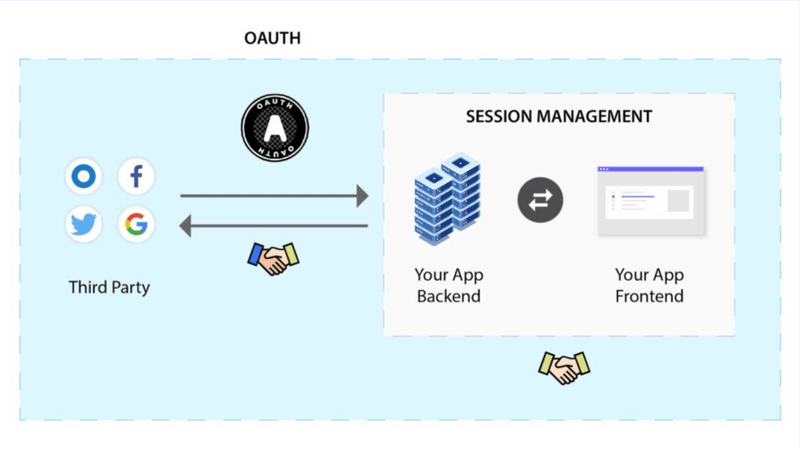
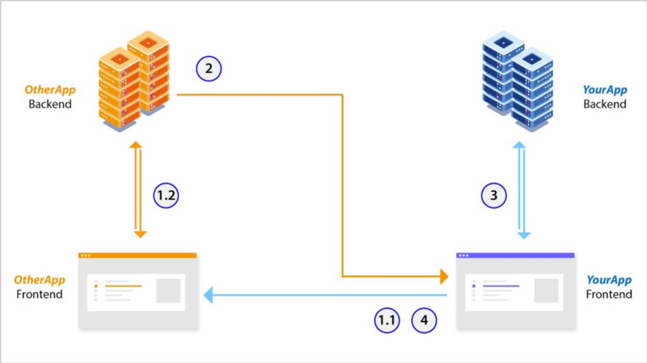
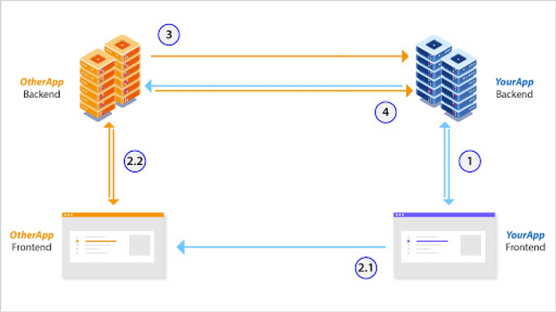
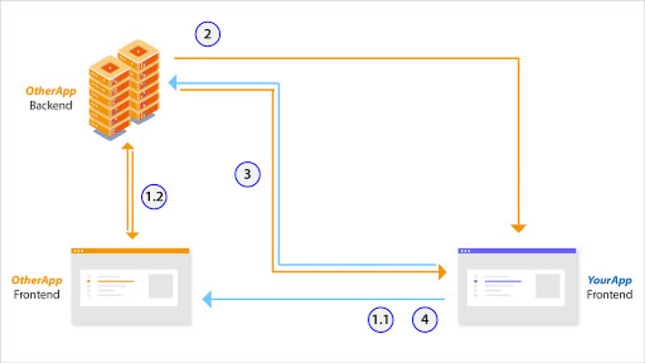

There seems to be a lot of misinformation on when OAuth 2.0 (henceforth referred to as OAuth) is appropriate for use. A lot of developers confuse OAuth with web session management and hence end up using the wrong protocol / set of technologies. This, in turn, leads to security issues. This article will clarify when to use regular session management solutions and when to use any one of the OAuth flows.

## The most important difference

Ideally, we would like all authenticated communication to be long lived (to provide the best user experience). The difference between user session management and OAuth is the level of trust between the communicating parties.

While using user sessions, it is assumed that one of the two communicating parties is untrusted (your app’s frontend) and the other party is trusted (your app’s backend). In OAuth flows, generally, the two communicating parties are both trusted (i.e. your app’s backend and third party app’s backend). In some OAuth flows, one of the two parties is also untrusted, in which case, it would require a handshake that is ‘short lived’. We will talk more about “trusted parties” in the next section.

As a result, session management generally refers to communication between your own app’s backend and frontend. Whereas, OAuth is used when your app (frontend or backend) needs to communicate with a third party’s backend – if you use Google / Facebook Sign in for your app or if your app uses Okta / Auth0 for managing users.

*Think about this like global trade. OAuth is the system that lets countries trade with each other, whereas session management is the system that enables trade within a country. You always require local trade – regardless of whether you exchange goods (data) with other countries or not (see “OAuth depends on Session management” section).*

## About Trust

Put simply, in any app, the frontend is untrusted, whereas the backend is trusted. This is because the backend is under strict control of the app developers who generally mean no harm to the users or to the app[[1]](#footnote). In contrast, the app developers have no control over the frontend. The frontend device could be compromised via social engineering techniques or malware, and there is nothing the app developers can do to mitigate that.

If a frontend is compromised, then the attacker may have an easy way to “harm” the app or its users. Hence, it is advisable that no data being sent from the frontend be blindly trusted. We must always verify and sanitize the incoming data, and try to minimise risk as far as possible.

## OAuth depends on Session management

In order to show this dependency, let’s examine the different ways two apps can communicate with each other using the Authorisation code grant flow[[2]](#footnote). The setup is that we have two apps: “YourApp” and “OtherApp”.

YourApp has the following components:

- A frontend (untrusted)
- An optional backend server

OtherApp has the following components:

- A frontend (untrusted)
- A backend

Now, let’s see the different access patterns:

1. YourApp has a backend server

    a) YourApp’s frontend wants to access YourApp’s backend server
    b) YourApp’s frontend / backend wants to access OtherApp’s backend server.

2. YourApp doesn’t have a backend server

    a) YourApp’s frontend wants to access OtherApp’s backend server

### Access pattern 1a)

One way of doing this is to simply use session management between your frontend and backend. Another method, if you are using an external identity management solution like Okta or Auth0, is:

1. YourApp’s frontend redirects the user to OtherApp (1.1) where the user logs into OtherApp’s frontend which talks to its backend via session management (1.2).
2. Upon successful authentication, OtherApp’s backend issues a short lived access token[[3]](#footnote) which is stored on YourApp’s frontend.
3. YourApp’s frontend then uses this access token to talk to YourApp’s backend.
4. When this access token expires, the user is redirected to OtherApp’s frontend. If the session between OtherApp’s frontend and backend is still alive, then a new access token is immediately issued to YourApp’s frontend, (via the authorisation code) otherwise, the user must login again.

### Access pattern 1b)

1. The user logs into YourApp’s backend via YourApp’s frontend. Data between the two is exchanged via session management.
2. The user authenticates themselves (after a redirection – 2.1) on OtherApp’s frontend, which talks to its backend via session management (2.2).
3. Upon successful authentication, OtherApp’s backend issues a short lived access token (stored on YourApp’s frontend and / or backend) and a long lived refresh token (stored only in YourApp’s backend, which is trusted).
4. YourApp’s frontend / backend can now use the access token to talk to OtherApp’s backend. When the access token expires, YourApp’s backend can use the refresh token to get a new access token (which can then be sent to YourApp’s frontend).

### Access pattern 2a)

1. YourApp’s frontend redirects the user to OtherApp (1.1) where the user logs into OtherApp’s frontend which talks to its backend via session management (1.2).
2. Upon successful authentication, OtherApp’s backend issues a short lived access token[[3]](#footnote) which is stored on YourApp’s frontend.
3. YourApp’s frontend then uses this access token to talk to OtherApp’s backend.
4. When this access token expires, the user is redirected to OtherApp’s frontend. If the session between OtherApp’s frontend and backend is still alive, then a new access token is immediately issued to YourApp’s frontend, (via the authorisation code) otherwise, the user must login again.
We can see that regardless of how two apps want to communicate with each other, there is always a need for session management.

## Session management

There are numerous methods to implementing session management. Some are easier to implement, but are also less secure. Just like in OAuth, here too, the concept of short lived access and long lived refresh tokens can come into play. However, unlike OAuth, the refresh token can be sent and stored on the frontend as long as it is “one time use” (a.k.a [rotating refresh tokens](https://tools.ietf.org/html/rfc6819#section-5.2.2.3)). Any other session flow is less secure as per the analysis in [this blog post](https://supertokens.com/blog/all-you-need-to-know-about-user-session-security).

## Difference in token types

A final difference is that OAuth and session management may use different types of tokens. In OAuth, the access token issued by the **OtherApp** is used by **YourApp** to make API requests on behalf of the user. This access token allows access to specific parts of a user's data. This access token is opaque (a long, random string).

In session management, the access token can be Opaque or a JWT(an encoded signed JSON). There are pros and cons of using either of them as explained in this [blog post](https://supertokens.com/blog/are-you-using-jwts-for-user-sessions-in-the-correct-way).

## Conclusion:

The core difference between OAuth and session management is one of trust. Using session management, one can maintain a long lived, authenticated connection between an untrusted party (frontend) and a trusted party (both within the same app). Whereas using OAuth, one can maintain a long lived, authenticated connection between two trusted parties – both being the backend of different services.

If you liked this blog, you may also like other blogs from us:

- [All you need to know about user session security](https://supertokens.com/blog/all-you-need-to-know-about-user-session-security)
- [The best way to securely manage user sessions](https://supertokens.com/blog/the-best-way-to-securely-manage-user-sessions)

## Footnote:

[1]: Backend data breaches and insider threats do occur. However, these events are much more “controllable” by app developers than, for example, a malware on the end user’s computer.

[2]: When describing the flows, we will not mention the authorisation code step via client secret or PKCE for brevity.

[3]: The backend only issues an access token since that is short lived and it cannot trust the frontend to securely store a non-changing long lived token (refresh token).