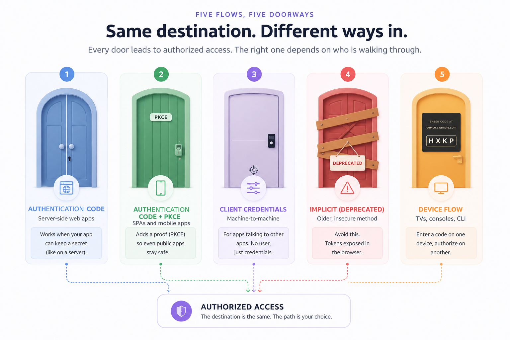
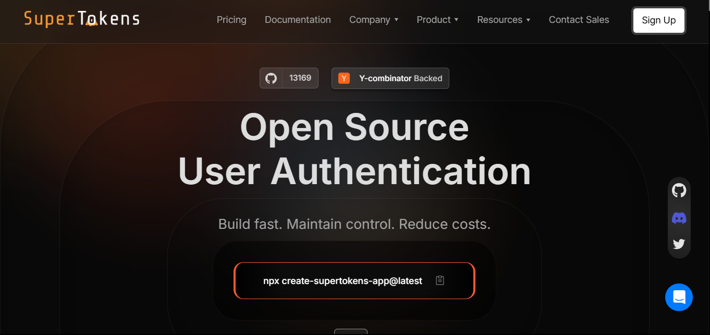
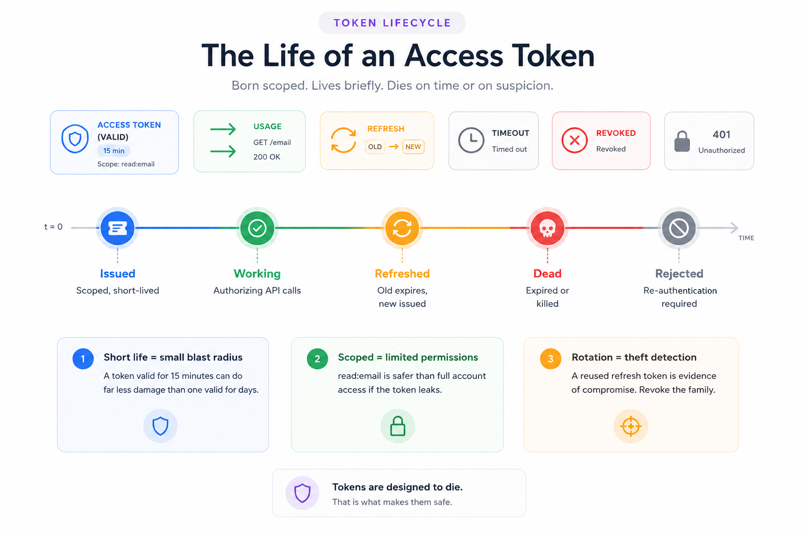

## Understanding OAuth Flows

Almost every "Sign in with Google" button, every API integration that acts on a user's behalf, and every machine-to-machine service call runs on OAuth. It has become the default language of delegated access on the web. Yet the framework defines several distinct flows, and picking the wrong one is a common source of authentication vulnerabilities in production. This guide explains each OAuth 2.0 flow, when each fits, and how SuperTokens handles the secure integration work so teams do not have to assemble it by hand.

## What is OAuth and why use it?

OAuth 2.0 is a delegated authorization framework. It lets an application access a user's data on another service without ever seeing that user's password. When an app asks to read a user's Google contacts, OAuth is what lets Google grant scoped, revocable access to just those contacts while the password stays with Google.

The mechanism is consent plus tokens. The user authenticates directly with the service that holds their data, approves a specific set of permissions, and the application receives a token representing that approval. The token is what the application uses on subsequent requests, never the credentials.

Why this matters comes down to three advantages. The first is security: because the application never handles the user's password, a breach of the application cannot leak credentials for the identity provider, and access is scoped to exactly what the user approved rather than full account access. The second is scalability: one identity provider can serve delegated access to hundreds of applications, and tokens can be issued, expired, and revoked independently. The third is usability: users log in with accounts they already have and trust, which removes another password to remember, and applications inherit the provider's security investment in areas like multi-factor authentication and breach detection.

A clarification worth making early: OAuth 2.0 is an authorization framework, not an authentication protocol. It answers "what can this application access" rather than "who is this user." When identity is the goal, OpenID Connect (OIDC) extends OAuth with an ID token that verifies who the user is. Conflating the two is a frequent and costly mistake, and later sections return to it.

## Core components of OAuth

Every OAuth flow is a conversation between four roles.

The **resource owner** is the user who owns the data and grants access to it. The **client** is the application requesting access on the user's behalf. The **authorization server** authenticates the user and issues tokens; this is the identity provider, such as Google or GitHub, or a self-hosted server. The **resource server** holds the protected data and accepts tokens as proof of authorized access, often an API. In many real deployments the authorization server and resource server are operated by the same organization, but the roles stay conceptually distinct.

**Tokens** are the currency of every flow. An access token is a short-lived credential the client presents to the resource server on each request, typically valid for minutes to an hour, so a leaked one expires quickly. A refresh token is longer-lived and used only to obtain new access tokens when the current one expires, which lets sessions persist without repeatedly prompting the user to log in. **Scopes** define the granularity of access, limiting a token to specific permissions like reading email rather than full account control. Short expiration on access tokens plus scoped permissions are what keep the blast radius small if a token leaks.

Two supporting pieces prevent common attacks. **Redirect URIs** are the pre-registered addresses the authorization server is allowed to send the user back to after login; restricting them to an exact, pre-registered list stops an attacker from redirecting the authorization response to a site they control. The **state parameter** is a unique, unguessable value the client generates before the flow and verifies when the user returns, which ties the response back to the original request and defends against cross-site request forgery (CSRF). Modern guidance treats both as mandatory rather than optional.

## Overview of OAuth 2.0 flows

OAuth defines several flows, each shaped for a different kind of client. The distinction that matters most is whether the client can keep a secret. A server-side web application can hold a client secret safely; a single-page app running entirely in the browser cannot, because anything shipped to the browser is readable by the user and any script on the page.

### **1. Authorization Code Flow**

**Best for:** web applications with server-side logic.

The classic flow works in three steps. The client redirects the user to the authorization server with an authorization request. The user authenticates and consents, and the server redirects back with a short-lived authorization code. The client's backend then exchanges that code, along with its client secret, for tokens at the token endpoint.

The reason this flow is secure is that the code exchange happens server-to-server. The access token is never exposed in the browser or the URL, and because the backend can safely store a client secret, the authorization server can confirm the token request comes from the legitimate application. This flow supports refresh tokens, so sessions can persist without re-prompting the user.

### **2. Authorization Code Flow with PKCE**

**Best for:** single-page apps (SPAs) and mobile apps.

Public clients cannot keep a client secret, which historically left them without the protection the secret provides. Proof Key for Code Exchange (PKCE) closes that gap. Before starting the flow, the client generates a random secret called a code verifier and sends a hashed version, the code challenge, with the authorization request. When it later exchanges the authorization code for tokens, it presents the original verifier. The authorization server checks that the verifier matches the challenge, which proves the same client that started the flow is the one finishing it.

This eliminates the need for a client secret while still preventing authorization code interception attacks. As of RFC 9700, published in January 2025, and the emerging OAuth 2.1 specification, PKCE is recommended for all clients using the authorization code flow, not only public ones. It has moved from an optional patch to a baseline expectation.

### **3. Client Credentials Flow**

**Best for:** server-to-server communication with no user involved.

Not every OAuth flow has a human in it. When a backend service needs to call another API on its own behalf, such as a cron job syncing data or one microservice calling another, there is no resource owner to consent. The client credentials flow handles this: the client authenticates with its own client ID and secret and receives an access token directly, with no user context and no redirect. The token represents the application itself rather than any user.

### **4. Implicit Flow (Deprecated)**

**Best for:** nothing, in current applications.

The implicit flow was an early shortcut for SPAs that could not perform a server-side code exchange. It returned the access token directly in the URL fragment, skipping the authorization code step entirely. That shortcut is exactly the problem: the token appeared in the URL, where it could leak through browser history, referer headers, server logs, and any script on the page. It also provided no refresh tokens.

The implicit flow is now formally deprecated. RFC 9700 recommends against it, and OAuth 2.1 removes it from the specification entirely. Any SPA still using it should migrate to the authorization code flow with PKCE, which solves the same problem securely. It appears here only so it can be recognized and retired.

### **5. Device Authorization Flow**

**Best for:** input-constrained devices such as smart TVs, gaming consoles, and CLI tools.

Some devices cannot present a practical login experience: a smart TV has no keyboard, and a command-line tool has no browser. The device authorization flow separates the device from the login. The device displays a short code and a URL, the user opens that URL on a phone or laptop and enters the code, and the device polls the token endpoint in the background until the user finishes authorizing on the other device. The user interface and the device logic live on separate hardware, connected by the code.

## When to use which OAuth flow?

Choosing a flow comes down to a few questions about the client.

The first is device and client type: is this a server-side web app, a browser-based SPA, a mobile app, a backend service, or an input-constrained device? The second is whether the client can keep a secret, which separates confidential clients (server-side) from public clients (browser and mobile). The third is the user interaction model: is a human present to consent, or is this an automated machine-to-machine call?

The table below summarizes the mapping.

|Flow|Ideal use case|Client type|User present|
|---|---|---|---|
|Authorization Code|Server-side web apps|Confidential|Yes|
|Authorization Code + PKCE|SPAs and mobile apps|Public|Yes|
|Client Credentials|Service-to-service, automation|Confidential|No|
|Implicit (deprecated)|None, migrate to PKCE|Public|Yes|
|Device Authorization|Smart TVs, consoles, CLI tools|Public|Yes, on another device|

The security consideration behind the table is that flows are not interchangeable. Using the implicit flow for a modern SPA exposes tokens that PKCE would protect. Using client credentials where a user's consent is actually required grants an application blanket access it should never have. Skipping PKCE on a public client leaves the door open to code interception. The right flow is the one that matches the client's real capabilities and trust level, and misusing a flow reintroduces exactly the risks OAuth was designed to remove.

## How SuperTokens enhances OAuth flow integration

Implementing these flows correctly, with PKCE, state validation, exact redirect matching, and secure token handling, is where most of the work and most of the mistakes live. SuperTokens handles that layer.

- **Built-in OAuth providers.** The [SuperTokens](https://supertokens.com/) ThirdParty recipe supports major providers out of the box, including Google, GitHub, Apple, and Facebook, plus custom OIDC providers configured through their standard endpoints. Adding a provider is a matter of supplying the client credentials rather than hand-building each integration.
- **OAuth plus passwordless hybrid.** Authentication rarely fits one mold. SuperTokens supports mixed models, such as offering social login alongside passwordless email magic links in the same application. Because each user can carry multiple login methods that resolve to a single identity, a user who first signed in with Google can later use a magic link and still be recognized as the same account.
- **Token management.** The controls that make OAuth safe in production are built in rather than bolted on. SuperTokens provides refresh token rotation, anti-CSRF protection, and secure session storage by default, and PKCE protection is enabled automatically for single-page apps through the frontend SDK, without extra configuration.

- **Frontend and backend SDKs.** Integration is framework-aware, with support across React, Next.js, Node, and other common stacks, so the flow wiring fits the tools a team already uses rather than forcing a particular architecture.

One honest note on scope: SuperTokens focuses on web and mobile authentication, and the device authorization flow is not one of its native flows. Teams that specifically need device flow for smart TVs or CLI tools typically pair an external OIDC provider that offers it with SuperTokens as the session manager for the authenticated user.

## Technical implementation tips

A few implementation details separate a working OAuth integration from a secure one.

- **Securing redirect URIs.** Treat the redirect URI as a security boundary. Register an exact, allow-listed set of URIs with the authorization server, serve every one of them over HTTPS, and generate a unique `state` value on each authorization request to verify on return. Exact matching matters: wildcard or partial-match redirect URIs are no longer acceptable under modern guidance, because they give an attacker room to redirect the response somewhere unintended.
- **Handling token storage.** Where tokens live determines how exposed they are. Storing tokens in browser `localStorage` puts them within reach of any script on the page, which turns a single XSS bug into full token theft. Storing them in `HttpOnly` cookies keeps them out of JavaScript's reach entirely, which is why cookie-based storage with the `HttpOnly`, `Secure`, and `SameSite` flags is the safer default for web applications. SuperTokens defaults to secure cookie handling for exactly this reason.
- **Rotating refresh tokens.** Refresh tokens are long-lived and therefore valuable, so they should rotate. With rotation, each use of a refresh token issues a new one and invalidates the old, which means a stolen token stops working the moment the legitimate client refreshes, and the reuse of an already-spent token becomes a detectable signal of theft. This is worth doing, and SuperTokens automates it rather than leaving it as manual work.

## Common OAuth integration pitfalls

Three mistakes account for a large share of OAuth vulnerabilities in the wild.

- **Misconfiguring scopes.** Requesting more access than the application needs is a standing liability. If a token scoped for full account access leaks, the damage is far larger than if it were limited to a single read permission. Request the narrowest scopes that satisfy the feature, and add more only when a specific need arises. Over-broad scopes are both a security risk and a red flag to users on the consent screen.
- **Skipping PKCE for public clients.** A browser or mobile app that runs the authorization code flow without PKCE is exposed to authorization code interception, where an attacker who captures the code can exchange it for tokens. PKCE prevents this, and under OAuth 2.1 it is expected for every client. Skipping it on a public client is leaving a known hole open.
- **Not verifying ID tokens.** When using OpenID Connect for authentication, the ID token is only trustworthy if its signature and claims are validated. Accepting an ID token without verifying its JWT signature, issuer, audience, and expiry means trusting data that could have been forged or replayed. Always validate ID tokens against the provider's published keys before treating the identity inside them as real.

## Summary and next steps

OAuth 2.0 is the backbone of delegated access, and using it well comes down to matching the flow to the client. Server-side web apps use the authorization code flow. SPAs and mobile apps use authorization code with PKCE, which is now the recommended default for every client type. Backend services with no user use client credentials. Input-constrained devices use the device authorization flow. The implicit flow is deprecated and should be retired in favor of PKCE. Around whichever flow fits, the constants are the same: exact redirect URIs, a verified `state` value, scoped tokens, secure storage, refresh token rotation, and proper ID token validation when authentication is involved.

Getting all of that right by hand is where teams lose time and introduce risk. SuperTokens operationalizes these practices with built-in provider support, automatic PKCE for SPAs, refresh token rotation, anti-CSRF protection, and secure session storage, exposed through framework-specific SDKs. For implementation details and the current list of supported providers, the SuperTokens OAuth and ThirdParty documentation is the place to start.
