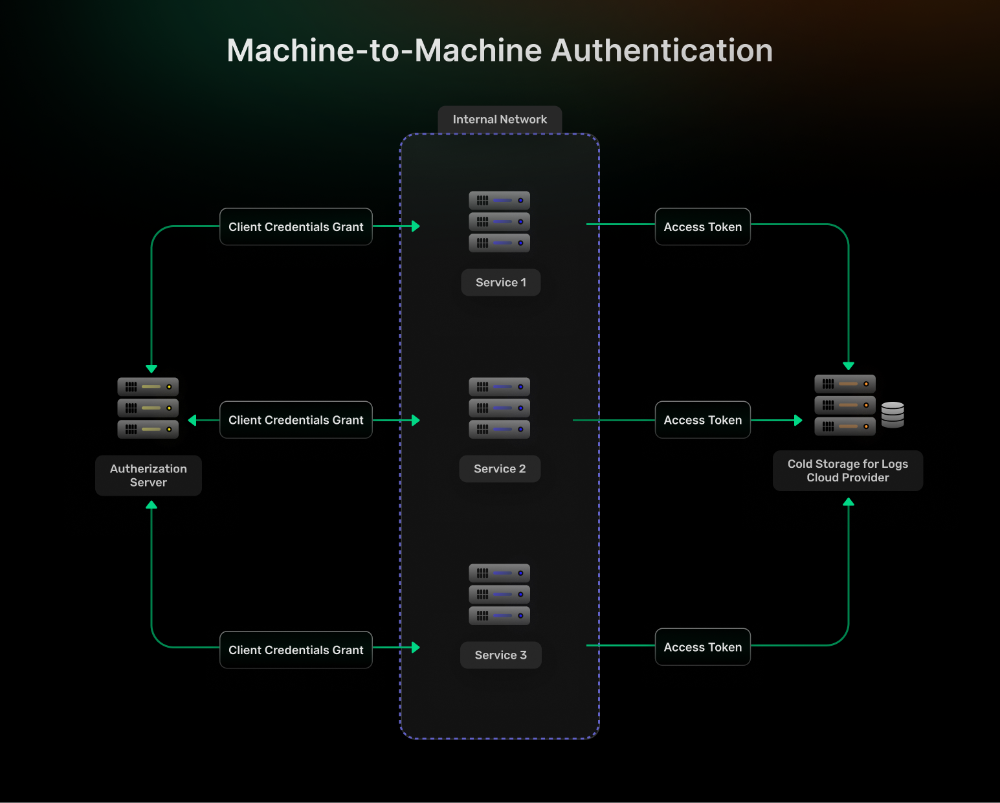
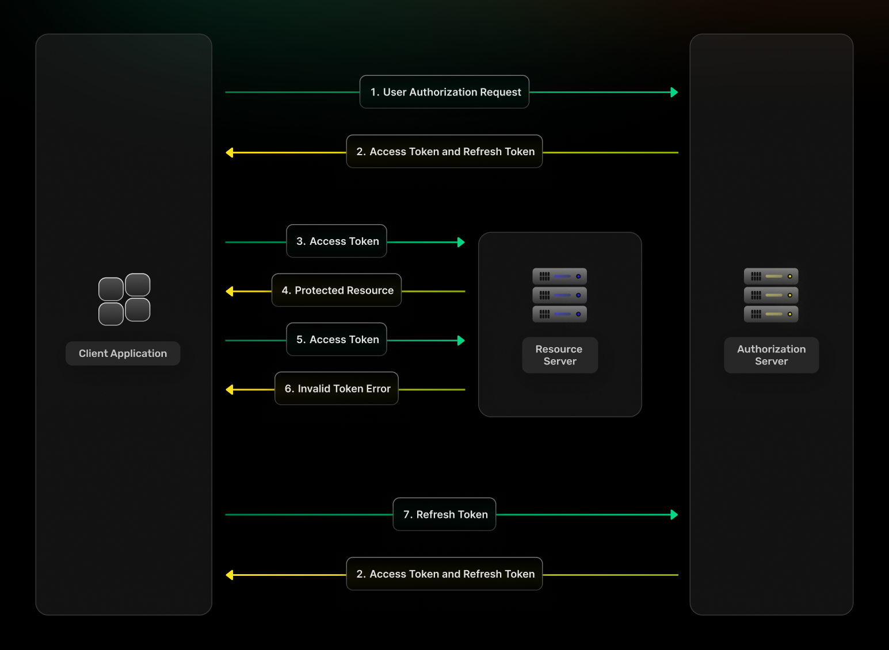
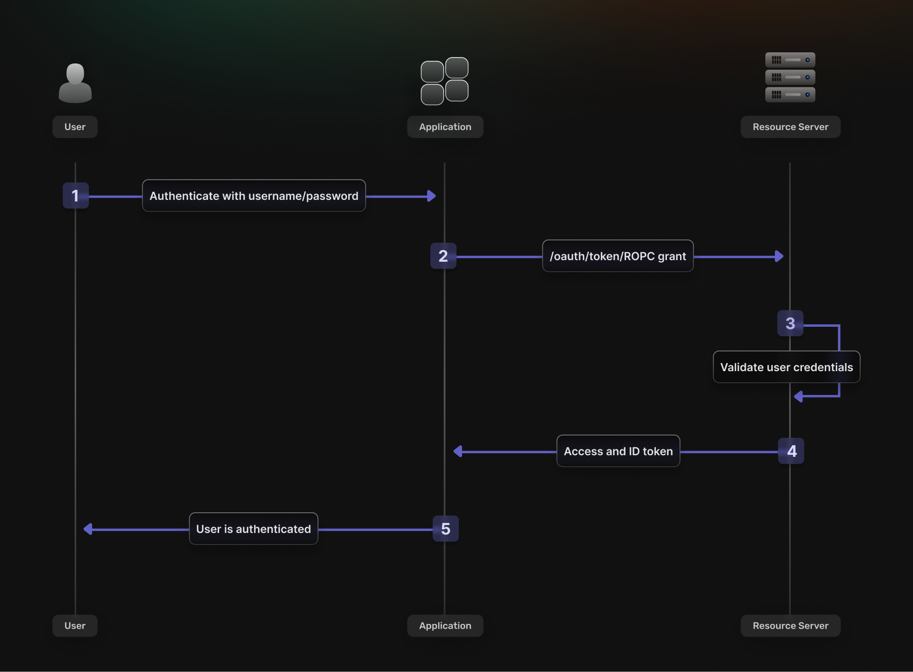

OAuth 2.0 offers multiple grant types for different authentication scenarios, but choosing the wrong flow can create security vulnerabilities or poor user experiences. This comprehensive guide breaks down each OAuth 2.0 grant type, with real-world implementation context and practical [SuperTokens](https://supertokens.com/) guidance to help developers avoid misusing insecure or legacy authentication flows.

## **1. Authorization Code (Best for Web + Mobile Apps)**

The Authorization Code grant represents the gold standard for user-facing applications that require secure authentication with external identity providers.

**Use it when:**

-   Your application architecture includes both frontend and backend components (e.g., React + Express, Vue + Django).
-   You want to support seamless sign-in integration with popular providers such as Google, GitHub, LinkedIn, or enterprise identity providers.
-   Security compliance requires avoiding credential exposure to client-side code.
-   Your application needs to maintain long-term user sessions with proper token management.

**Why it\'s the recommended choice:**

-   **Secure via redirect URIs and code exchange** that prevents credential interception during the authentication flow.
-   **Supports Proof Key for Code Exchange [(PKCE)](https://supertokens.com/blog/authorization-code-flow-with-pkce),** which adds an additional security layer specifically designed for public clients and single-page applications.
-   **Eliminates credential handling** by the client application, reducing attack surface and compliance requirements.
-   **Enables refresh token rotation** for long-lived sessions, without compromising security posture.

**SuperTokens Support:**

-   Works seamlessly out of the box with [SuperTokens\' ThirdParty recipe](https://supertokens.com/docs/web-js/modules/recipe_thirdparty.html) supporting major providers, including Google, GitHub, Apple, Facebook, and custom OIDC providers.
-   **PKCE protection is automatically enabled** for single-page applications via the auth-react SDK, without additional configuration.
-   **Built-in state validation** and CSRF protection automatically handle common OAuth security pitfalls.
-   **Custom provider integration** supported through flexible OIDC configuration for enterprise identity providers.

## **2. Client Credentials (Best for Machine-to-Machine Authentication)**

The Client Credentials grant serves backend-to-backend authentication scenarios where no human user participates in the authentication flow.

**Use it when:**

-   Backend services need secure authentication to other backend APIs or microservices.
-   Automated processes such as cron jobs, data synchronization tasks, or scheduled reports require API access.
-   Command-line tools or scripts need programmatic access to protected resources.
-   Service meshes require inter-service authentication without user context.

**Why it\'s the optimal choice for automation:**

-   **Simple, secure, token-based authentication** without complex redirect flows or user interaction requirements.
-   **No redirects or user interface components** needed, making it perfect for headless environments and automated systems.
-   **Straightforward credential management** by using a client ID and secret pairs that can be securely stored and rotated.
-   **Predictable token lifecycle** with clear expiration and renewal patterns suitable for automated systems.

**SuperTokens Support:**

-   While SuperTokens primarily focuses on user-centric authentication scenarios, teams can implement hybrid approaches effectively.
-   **Layer client credential flows alongside SuperTokens** by managing custom token issuance for internal service authentication.
-   **Recommended hybrid architecture**: Use SuperTokens for all user authentication while implementing OAuth client_credentials for service-to-service communication.
-   **Integration patterns** allow SuperTokens session management to coexist with client credentials, for comprehensive authentication coverage.

## **3. Refresh Token Grant (Token Renewal, Not Initial Login)**

The Refresh Token grant enables seamless token renewal without forcing users to re-authenticate, supporting long-lived sessions while
maintaining security through token rotation.

**Use it when:**

-   Users have already authenticated successfully via another OAuth grant type, such as an Authorization Code.
-   Applications need to renew expired access tokens silently without interrupting user workflows.
-   Long-running applications require extended session duration beyond typical access token lifetimes.
-   Background processes need to maintain an authenticated state for extended periods.

**Why it\'s essential for user experience:**

-   **Enables session longevity** without forcing repeated manual logins that frustrate users and reduce engagement.
-   **Reduces security risk exposure** compared to long-lived access tokens, by limiting the validity window of any single credential.
-   **Supports seamless background renewal** that maintains application functionality, without user intervention.
-   **Provides controlled session termination** through refresh token revocation when security incidents occur.

**SuperTokens Support:**

-   **SuperTokens manages refresh tokens automatically** with sophisticated rotating token mechanisms and built-in anti-theft detection systems.
-   **No manual implementation required**: Session management, token rotation, and renewal logic work out of the box, without custom development.
-   **Advanced security features** include automatic token fingerprinting, suspicious activity detection, and coordinated session invalidation across devices.
-   **Configurable token policies** allow customization of access token lifetimes, refresh token rotation frequency, and session duration limits.

## **4. Implicit Grant (Legacy &mdash; Don\'t Use It)**

The Implicit grant was historically used for single-page applications but is now considered deprecated due to fundamental security vulnerabilities that cannot be adequately mitigated.

**Was used in the past when:**

-   Single-page applications lacked secure storage mechanisms for sensitive credentials.
-   No backend infrastructure was available to handle secure token exchange processes.
-   Browser security models were less sophisticated and CORS restrictions were more limited.
-   OAuth 2.0 specification lacked modern security extensions such as PKCE.

**Why it\'s deprecated and dangerous:**

-   **Access tokens are exposed in URLs** during redirect flows, making them visible in browser history, server logs, and referrer headers.
-   **Highly vulnerable to token leakage and interception** through various attack vectors, including malicious browser extensions and network monitoring.
-   **Lacks support for refresh tokens** entirely, forcing either short-lived sessions with frequent re-authentication or dangerous long-lived credentials.
-   **Cannot leverage modern security enhancements** such as PKCE that significantly improve OAuth security posture.

**SuperTokens Support:**

-   **Intentionally not supported** because modern authentication architectures should never use deprecated flows with known security vulnerabilities.
-   **Recommended alternative**: Use Authorization Code flow with PKCE protection via auth-react SDK and supertokens-node backend integration.
-   **Migration guidance is available** for legacy applications currently using implicit flows to transition to secure modern alternatives.
-   **Security-first philosophy** prioritizes long-term application security over backwards compatibility with deprecated standards.

## **5. Resource Owner Password Credentials&mdash;Use with Caution**

The Resource Owner Password Credentials (ROPC) grant allows applications to collect user credentials directly, providing maximum user experience
control at the cost of increased security responsibility.

**Use it when:**

-   Applications require complete control over the login user interface and user experience design, without external redirects.
-   Users enter credentials directly into the application interface rather than being redirected to an external identity provider.
-   Legacy system integration demands direct credential handling for compatibility with existing authentication infrastructure.
-   Mobile applications need native login experiences that feel integrated rather than web-based.

**Why it carries significant security risks:**

-   **Applications directly handle user credentials**, increasing responsibility for secure transmission, validation, and storage.
-   **Identity providers cannot enforce advanced security features** such as adaptive multi-factor authentication, phishing protection, or risk-based authentication.
-   **Increased attack surface** through credential handling that could expose sensitive user information during security incidents.
-   **Limited audit trail** compared to redirect-based flows that provide comprehensive logging through identity provider systems.

**SuperTokens Support:**

-   **SuperTokens supports EmailPassword and Passwordless recipes** that provide ROPC-like functionality with significantly enhanced security measures.
-   **Modern security implementations** include proper password hashing, rate limiting, and breach detection that exceed basic ROPC security requirements.
-   **Custom UI and theming capabilities** enable complete user experience control, without sacrificing underlying security architecture.
-   **Recommended approach**: Use SuperTokens recipes for credential-based authentication while maintaining security best practices automatically.

## **6. Device Code Grant (For Devices Without Browsers)**

The Device Code grant enables authentication on devices with limited input capabilities or no web browser access, by using secondary devices for the actual authentication process.

**Use it when:**

-   Applications run on smart TVs, IoT devices, gaming consoles, or other devices with limited input capabilities.
-   Command-line tools or terminal applications need user authentication, without opening web browsers.
-   Users authenticate by visiting a separate URL and entering a short device code displayed on the primary device.
-   Cross-device authentication flows provide better user experience than attempting complex input on constrained devices.

**Why it\'s valuable for modern device ecosystems:**

-   **Supports diverse device types** that lack full web browser capabilities or convenient text input mechanisms.
-   **User experience optimized for cross-device flows** that leverage smartphones or computers for secure credential entry.
-   **Maintains security standards** while accommodating device limitations through proven authentication patterns.
-   **Enables modern IoT integration** without compromising on authentication security or user experience quality.

**SuperTokens Support:**

-   **Not supported natively today** as SuperTokens focuses primarily on web and mobile application authentication scenarios.
-   **Recommended integration pattern**: Use third-party OIDC providers such as Auth0, Okta, or AWS Cognito for device flow authentication.
-   **Hybrid architecture approach**: Integrate external device flow providers with SuperTokens as the primary session manager for authenticated users.
-   **Future roadmap consideration** for native device code support based on community demand and use case requirements.

## **How to Choose the Right OAuth Flow for Your Application**

Selecting the appropriate OAuth grant type requires careful consideration of application architecture, security requirements, and
user experience goals.

**Ask yourself these critical questions:**

-   **Is there a human user involved in the authentication flow?** → Use Authorization Code grant for secure user-centric authentication with proper redirect handling.
-   **Does the application control both client and backend infrastructure?** → Authorization Code with PKCE provides optimal security for controlled environments.
-   **Is this purely backend-to-backend communication?** → Client Credentials grant offers the most appropriate machine-to-machine authentication.
-   **Is the device headless or severely input-limited?** → Consider Device Code grant via an external provider integration for constrained environments.
-   **Do you need comprehensive session management, refresh token rotation, and theft detection?** → Use SuperTokens for complete authentication lifecycle management.

| **Grant Type**     | **Use Case**            | **Security Level** | **User Involved?** | **Best For**                                                                 |
|---------------------|-------------------------|--------------------|--------------------|-------------------------------------------------------------------------------|
| Authorization Code  | Web/Mobile Apps         | High               | Yes                | SPAs, mobile apps, web apps with backend                                       |
| Client Credentials  | Machine-to-Machine      | High               | No                 | APIs, cron jobs, service communication                                         |
| Refresh Token       | Token Renewal           | High               | No                 | Extending existing sessions                                                    |
| Implicit            | Legacy SPAs (Deprecated)| Low                | Yes                | **Avoid&mdash;use Authorization Code + PKCE**                                      |
| ROPC                | Direct Credentials      | Medium (Risky)     | Yes                | Apps requiring full UX control                                                 |
| Device Code         | Limited Input Devices   | High               | Yes                | Smart TVs, IoT, CLI tools                                                      |

**Additional architectural considerations:**

-   **Single-page applications** should always use Authorization Code with PKCE rather than deprecated implicit flows.
-   **Mobile applications** benefit from Authorization Code with custom URI schemes or universal links for seamless redirect handling.
-   **Enterprise applications** typically require Authorization Code to support SSO integration and compliance requirements.
-   **Microservice architectures** often combine multiple grant types with Authorization Code for users and Client Credentials for service communication.

## **Frequently Asked Questions**

**Q: Can I use SuperTokens as an OAuth authorization server or identity provider?** 
Not currently. SuperTokens functions as a comprehensive authentication solution for applications rather than serving as a standalone identity provider. The platform focuses on simplifying authentication implementation within applications while supporting integration with external OAuth providers and identity systems.

**Q: Can I use SuperTokens alongside existing OAuth providers and identity systems?** 
Absolutely. SuperTokens excels at integrating with third-party authentication providers through OIDC and OAuth standards. Native support includes major providers such as Google, GitHub, Apple, Facebook, and custom enterprise identity providers, allowing seamless social login and SSO integration.

**Q: How do social logins work with SuperTokens and OAuth flows?**
SuperTokens implements social logins by using the secure Authorization Code flow under the hood, automatically handling OIDC and OAuth provider integration. The system manages redirect URIs, state validation, token exchange, and user profile mapping without requiring manual OAuth implementation.

**Q: What about passwordless authentication and modern alternatives?**
SuperTokens supports [passwordless authentication](https://supertokens.com/features/passwordless-login) through email magic links and SMS OTP flows that provide ROPC-like user experience with enhanced security. These modern alternatives eliminate password-related security risks while maintaining seamless user experience.

**Q: How does SuperTokens handle token security and rotation?** 
SuperTokens automatically implements refresh token rotation, fingerprint validation, and theft detection mechanisms that exceed standard OAuth security requirements. The system provides enterprise-grade token management without requiring manual security implementation.

## **Final Thoughts**
OAuth 2.0 defines multiple grant types, but only a subset remains relevant today. Developers should favor **Authorization Code with PKCE**
for user-facing applications, use **Client Credentials** for backend services, and rely on **Refresh Tokens** for session longevity. Legacy options such as **Implicit** and **ROPC** should be avoided.

[SuperTokens](https://supertokens.com/) simplifies the process by implementing secure defaults, handling refresh tokens, and integrating with popular identity providers. With the correct grant type and a reliable session management layer, applications can achieve both strong security and a seamless user experience.
