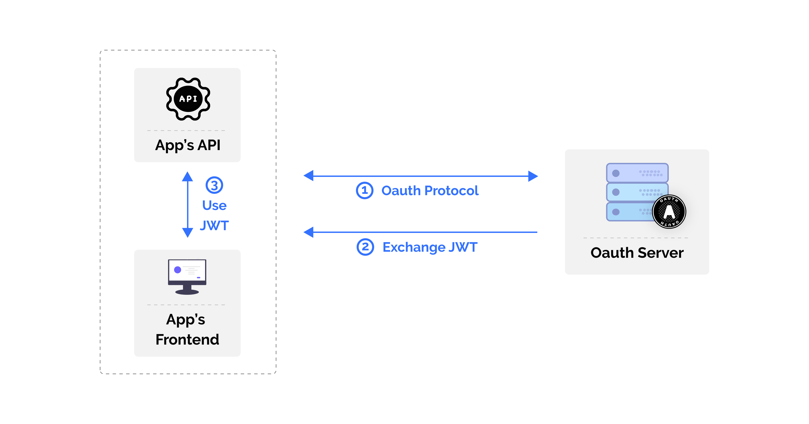
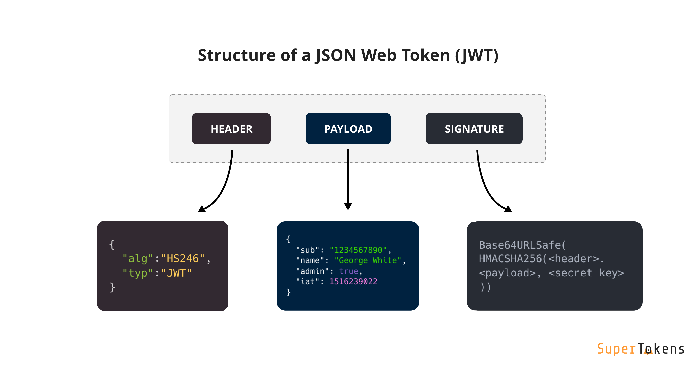

## Table of Contents

- [Introduction](#introduction)
- [OAuth vs JWT: Comparison Overview](#oauth-vs-jwt-comparison-overview)
- [What is OAuth?](#what-is-oauth)
- [What is JWT?](#what-is-jwt)
- [Key Differences Between OAuth and JWT](#key-differences-between-oauth-and-jwt)
- [Advantages and Disadvantages of OAuth](#advantages-and-disadvantages-of-oauth)
- [Advantages and Disadvantages of JWT](#advantages-and-disadvantages-of-jwt)
- [When to Use OAuth](#when-to-use-oauth)
- [When to Use JWT](#when-to-use-jwt)
- [Can OAuth and JWT be used together?](#can-oauth-and-jwt-be-used-together)
- [Experience Seamless Authentication with OAuth and JWT Integration!](#experience-seamless-authentication-with-oauth-and-jwt-integration)
- [Conclusion](#conclusion)

## Introduction

Today, we're diving into the fascinating world of authentication and authorization protocols. We'll explore the differences between OAuth and JWT (JSON Web Tokens), two heavyweight contenders in the world of secure information exchange and user authentication.

Whether you're building your first app or you're a seasoned pro looking to brush up on your knowledge, this guide will help you understand when and how to use OAuth and JWT. Let's get started!

## OAuth vs JWT: Comparison Overview

Before we dive into the nitty-gritty details, let's take a bird's-eye view of how OAuth and JWT stack up against each other:

| Dimension | OAuth | JWT |
| --------- | ----- | --- |
| Primary Use | Authorization and access delegation | Secure information exchange and authentication |
| Protocol Standards | OAuth 2.0, OpenID Connect | JSON Web Token (RFC 7519) |
| Workflow | Multi-step process with various flows | Simple encode-sign-verify process |
| SSO (Single Sign-On) | Supports SSO implementations | Can be used in SSO, but not inherently designed for it |
| Token Storage | Server-side (usually) | Client-side (usually) |
| Security Features | Scope-based access, token revocation | Signature verification, payload encryption |
| Implementation Complexity | More complex, involves multiple components | Simpler, self-contained |

Now that we've got a quick comparison, let's dive deeper into each of these technologies.

## What is OAuth?

OAuth, short for "Open Authorization," is an open standard protocol that allows secure authorization in a simple and standardized way for web, mobile, and desktop applications. It's like a valet key for your car – it gives limited access to your resources without handing over the full set of keys.

### How does OAuth Work?

OAuth works by delegating user authentication to the service that hosts the user account and authorizing third-party applications to access that user account. Here's a simplified flow:

1. The user initiates a request to the application.
2. The application redirects the user to the OAuth provider.
3. The user authenticates with the OAuth provider.
4. The OAuth provider asks the user to authorize the application.
5. The user grants permission.
6. The OAuth provider sends an authorization code to the application.
7. The application exchanges the code for an access token.
8. The application uses the access token to access protected resources.

OAuth supports several authorization flows, including the Authorization Code Flow, Implicit Flow, and Client Credentials Flow. Each has its use cases, but the Authorization Code Flow is generally recommended for most scenarios due to its security benefits.

## What is JWT?

JWT stands for JSON Web Token. It's an open standard (RFC 7519) that defines a compact and self-contained way for securely transmitting information between parties as a JSON object. Think of it as a secure postcard – all the information is right there, but only the intended recipient can verify its authenticity.

### How does JWT Work?

A JWT consists of three parts: a header, a payload, and a signature. These parts are separated by dots and typically look something like this: `xxxxx.yyyyy.zzzzz`

Here's a breakdown of each part:
- **Header**: Contains metadata about the token, including the type of token and the hashing algorithm used.
- **Payload**: Contains claims (statements about the user) and additional data.
- **Signature**: Ensures that the token hasn't been altered.

The process works like this:
1. The server generates a JWT by encoding the header and payload and signing it with a secret key.
2. The JWT is sent to the client.
3. The client sends the JWT back to the server with subsequent requests.
4. The server verifies the signature and, if valid, processes the request.

For a deep dive into the structure and functionality of JWTs, check out this detailed guide on [What is JWT](https://supertokens.com/blog/what-is-jwt).

## Key Differences Between OAuth and JWT

### Difference 1 - Use Cases and Purpose

- **OAuth**: Primarily used for authorization and delegating access. It's great when you need to grant third-party applications limited access to user resources without sharing credentials.
- **JWT**: Used for secure information exchange and authentication. It's perfect for stateless authentication in web applications, especially in microservices architectures.

### Difference 2 - Implementation and Complexity

- **OAuth**: Involves a multi-step process with different roles (client, resource owner, authorization server, resource server). It's more complex but offers more flexibility.
- **JWT**: Simpler to implement as it's self-contained. The token itself carries all necessary information, making it easier to use in stateless applications.

### Difference 3 - Security and Management

- **OAuth**: Offers fine-grained access control through scopes. Tokens can be easily revoked, enhancing security.
- **JWT**: Relies on cryptographic signatures for security. Once issued, JWTs are valid until they expire, which can be a security concern if not managed properly.

## Advantages and Disadvantages of OAuth

### Advantages of OAuth

- **Fine-grained access control**: OAuth's scope mechanism allows for precise control over what resources a third-party application can access. This granularity enhances security and user privacy by limiting exposure to only necessary data.
- **Support for Single Sign-On (SSO)**: OAuth facilitates seamless SSO implementations across multiple applications and domains. Users can authenticate once and access various services without repeatedly entering credentials.
- **Robust security features**: OAuth includes built-in security measures like token expiration and revocation. This allows for quick mitigation of potential security breaches by invalidating compromised tokens.
- **Standardized protocol**: As an industry-standard protocol, OAuth ensures interoperability across different platforms and services. This standardization simplifies integration with various third-party services.

### Disadvantages of OAuth

- **Complex implementation**: Setting up OAuth can be challenging, especially for smaller projects or teams with limited resources. The multi-step flow and various roles involved require careful planning and implementation.
- **Overhead from multiple components**: OAuth's architecture involves multiple components (authorization server, resource server, client), which can increase system complexity and potential points of failure.
- **Performance considerations**: The additional steps in the OAuth flow, such as token validation and exchange, can introduce slight latency in API calls compared to simpler authentication methods.

## Advantages and Disadvantages of JWT

### Advantages of JWT

- **Simplicity and ease of use**: JWTs are self-contained and don't require server-side storage, making them straightforward to implement and use in various scenarios.
- **Compact and self-contained**: All necessary information is encoded within the token itself, reducing the need for database lookups and improving performance in distributed systems.
- **Ideal for stateless applications**: JWTs fit perfectly into modern stateless architectures, especially in microservices environments where maintaining session state can be challenging.
- **Cross-domain / CORS**: Since JWTs are self-contained, they work well across different domains, making them suitable for single-page applications and mobile apps that interact with backend APIs.

### Disadvantages of JWT

- **Stateless nature limitations**: Once issued, JWTs cannot be easily revoked before their expiration time. This can be a security concern if a token is compromised.
- **Potential security risks**: Improper handling of JWTs can lead to vulnerabilities. Storing sensitive information in the payload (which is base64 encoded, not encrypted) can expose data if the token is intercepted.
- **Token size**: As all information is contained within the token, JWTs can become quite large, especially with many claims. This can impact performance when tokens are sent with every request.
- **Lack of fine-grained control**: Unlike OAuth's scope mechanism, standard JWTs don't inherently provide a way to control access at a granular level without custom implementation.

## When to Use OAuth

**OAuth shines in scenarios like::**

- **Third-party application access**: When you want to allow external apps to access user data on their behalf (think "Login with Google" or allowing a third-party app to post on your social media).
- **Implementing SSO**: For seamless user experience across multiple applications within an organization.
- **Scenarios requiring fine-grained access control**: When you need to limit what resources a third-party can access and for how long.

## When to Use JWT

JWT is ideal for:

- **Stateless authentication**: Perfect for web and mobile apps where you don't want to store session information server-side.
- **Secure data transmission**: When you need to send information securely between parties.
- **Microservices communication**: For authenticating requests between services in a distributed system.

For a more detailed comparison of authentication solutions, including OAuth providers, check out this article on [Auth0 Alternatives](https://supertokens.com/blog/auth0-alternatives).

## Can OAuth and JWT be used together?

Absolutely! In fact, OAuth and JWT often complement each other beautifully. OAuth 2.0 can use JWTs as tokens, combining OAuth's robust authorization framework with JWT's compact, self-contained nature.

Here's how they can work together:
1. OAuth handles the authorization process and issues access tokens.
2. These access tokens can be JWTs, containing claims about the user and their permissions.
3. The resource server can then validate these JWT access tokens without needing to contact the authorization server for every request.

This combination offers several benefits:

- Reduced load on authorization servers
- Improved performance in distributed systems
- Enhanced security through JWT's signature verification

A practical example might look like this:

- A user logs in to your application using OAuth (say, "Login with Google").
- Your authorization server creates a JWT containing user info and permissions.
- This JWT is used as the access token for subsequent API requests.
- Your API can verify the JWT's signature and extract user info without additional database lookups.

To learn more about advanced token usage, including JWKs (JSON Web Key Sets), check out this guide on [Understanding JWKS](https://supertokens.com/blog/understanding-jwks).

# Experience Seamless Authentication with OAuth and JWT Integration!
Ready to implement robust authentication in your application? Look no further than SuperTokens! Our solution leverages the power of both OAuth and JWT to provide secure, flexible, and user-friendly authentication.

With SuperTokens, you get:

- Easy integration of OAuth providers
- Secure JWT handling
- Customizable login flows
- SDKs for popular frameworks

Don't let authentication be a bottleneck in your development process. [Secure Your App with SuperTokens](https://supertokens.com/) today and experience the difference!

## Conclusion

We've covered a lot of ground, haven't we? Let's recap:
- **OAuth** is great for authorization and delegating access, especially when dealing with third-party applications.
- **JWT** excels in stateless authentication and secure information exchange, perfect for modern web apps and microservices.
- Both have their strengths and can even be used together for enhanced security and efficiency.

Remember, there's no one-size-fits-all solution in the world of authentication and authorization. The best choice depends on your specific use case, security requirements, and application architecture.

So, the next time you're building an app and scratching your head over authentication, you'll know whether to reach for OAuth, JWT, or both!

For more insights on authentication protocols, check out our comparison of [SAML vs OAuth](https://supertokens.com/blog/saml-vs-oauth).