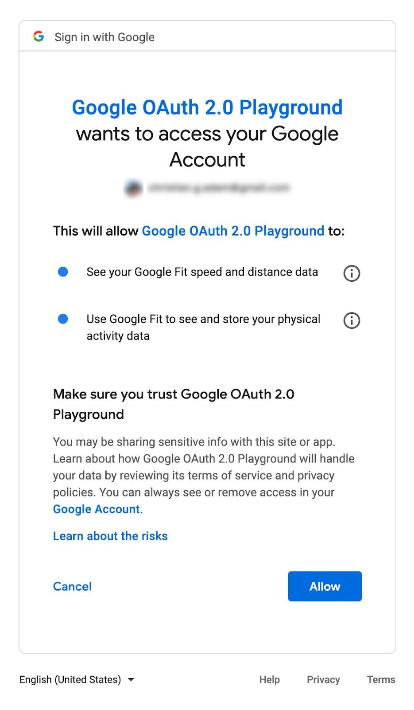
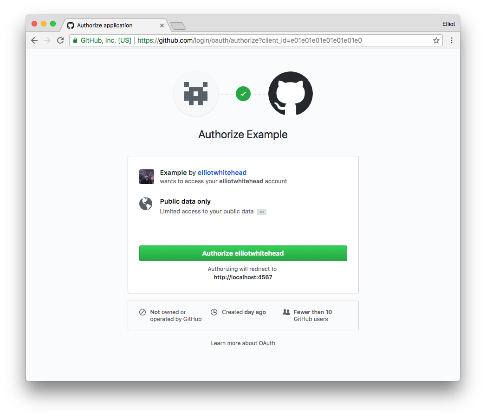
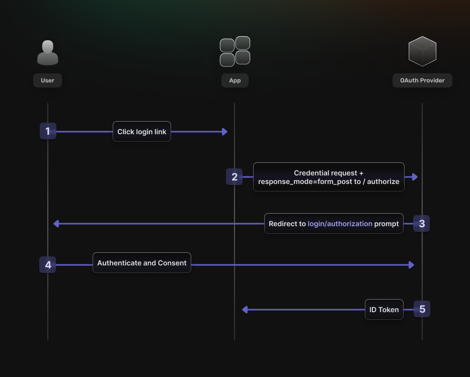
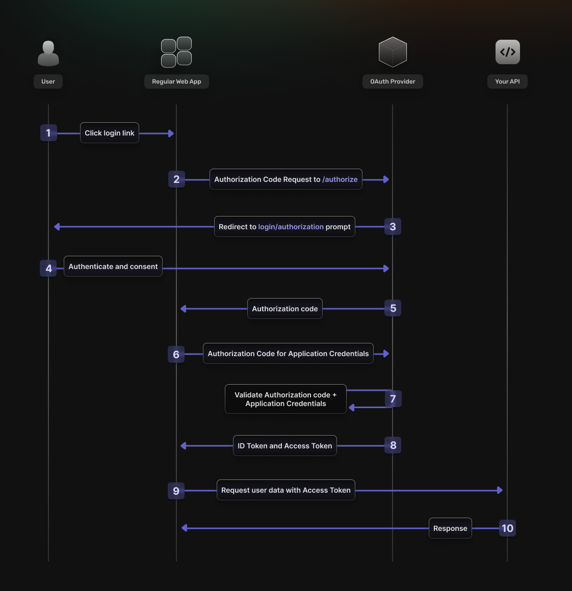
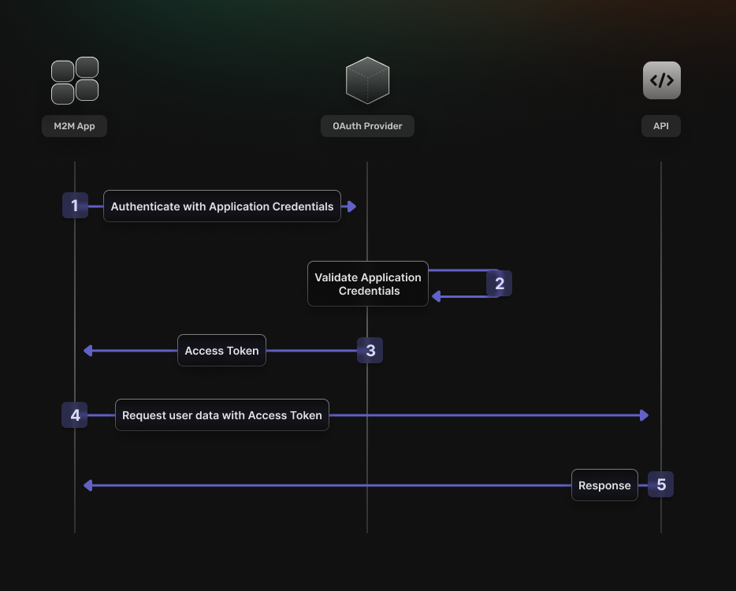

## Table of Content
- [Introduction](#introduction)
- [What is OAuth](#what-is-oauth)
- [Key Components of OAuth](#key-components-of-oauth)
- [How OAuth works](#how-oauth-works)
- [The Difference Between OAuth1.0 and OAuth 2.0](#the-difference-between-oauth10-and-oauth-20)
- [Common Misconceptions and Challenges with OAuth](#common-misconceptions-and-challenges-with-oauth)
- [Implementing OAuth in Your Application](#implementing-oauth-in-your-application)
- [The differences between OAuth 2.0 vs 2.1](#the-differences-between-oauth-20-vs-21)
- [Conclusion](#conclusion)

## Introduction

In the modern authentication space, there is some confusion regarding what OAuth is. Some people think it's the login form shown when you authenticate via a Social Provider like Google or Facebook. Others think it's a convoluted security mechanism and stop at that.

Through this blog we hope to show you what OAuth is, explain how it works, and give you a sense of how OAuth can help your application.

## What is OAuth

OAuth is not an API or service. It's an open standard for authorization and anyone can implement it. Let's break down the differences between Authentication and Authorization. Authentication verifies the identity of users, while authorization determines their permissions to access resources. In a previous [post](https://supertokens.com/blog/authentication-vs-authorization), we went over some of their differences, but essentially OAuth is an authorization framework created for "secure delegated access". Let's break that down.

In today's API-driven marketplace, there is a need for users to be able to authorize third-party applications with limited access to their resources without exposing their credentials. This could be allowing an application to access your photos from Google or your favorite playlist from Spotify. With OAuth, users are redirected to the identity provider and once signing in and confirming the required permissions, an access token is granted to the third-party application which they can use to access their resources.

OAuth 2.0 is now one of the most popular methods for delegating access due to its compatibility with a wide range of supported platforms which include, mobile phones, TVs, gaming consoles and IOT devices.

## Key Components of OAuth

OAuth comprises several key components that work together to facilitate secure access delegation.
These components include:
- Scopes and Consent
- Actors
- Clients
- Tokens
- Authorization servers

### OAuth scopes
In the OAuth flow, the authorization screen displays several permissions that will be granted to the third-party application should you choose to give access. This bundle of permissions is known as scopes and will be added to the access token.

### OAuth Actors

The actors in OAuth flows are as follows:
- Resource Owner: owns the data in the resource server. That would be the user
- Resource server: The API that stores the data the application wants to access. An example would be your Google photos.
- Client: the application that wants to access your data.
- The Authorization server: The main engine of OAuth.

### OAuth tokens
Tokens, such as Access Tokens and Refresh Tokens, are central to OAuth's functionality. Access tokens are the tokens the client uses to access the Resource Server (API). They’re meant to be short-lived. Think of them in hours and minutes, not days and months. You don’t need a confidential client to get an access token. You can access tokens with public clients. They’re designed to optimize for internet-scale problems. Because these tokens can be short lived and scale out, they can’t be revoked, you just have to wait for them to time out.

The other token is the refresh token. This is much longer-lived; days, months, years. This can be used to get new tokens. To get a refresh token, applications typically require confidential clients with authentication.

Refresh tokens can be revoked. When revoking an application’s access in a dashboard, you’re killing its refresh token. This gives you the ability to force the clients to rotate secrets. What you’re doing is you’re using your refresh token to get new access tokens and the access tokens are going over the wire to hit all the API resources. Each time you refresh your access token you get a new cryptographically signed token. Key rotation is built into the system.

## How OAuth Works

There are 3 main ways OAuth is implemented:

- The Implicit flow
- Authorization Code flow
- Client credentials flow

### Implicit flow

The first flow is caused by the implicit flow because all the communication occurs through the browser. There is no backend server redeeming the authorization grant for an access token. An SPA is a good example of this flow’s use case.

Implicit flow is optimized for browser-only public clients. An access token is returned from the authorization request. It typically does not support refresh tokens. It assumes the Resource Owner and Public Client are on the same device. Since everything happens on the browser, it’s the most vulnerable to security threats.

### Authorization Code Flow

The gold standard is the Authorization Code Flow and is the method most referenced in this blog. The frontend will receive the authorization code grant and the backend will proceed to to exchange the authorization code grant for an access token (and optionally a refresh token).

It assumes the Resource Owner and Client Application are on separate devices. It’s the most secure flow because you can authenticate the client to redeem the authorization grant, and tokens are never passed through a user agent.

### Client Credential Flow

For server-to-server scenarios, you might want to use a Client Credential Flow. In this scenario, the client application is a confidential client that's acting on its own, not on behalf of the user. It’s more of a service account type of scenario.

All you need is the client’s credentials to do the whole flow. It’s a back channel-only flow to obtain an access token using the client’s credentials. It supports shared secrets or assertions as client credentials signed with either symmetric or asymmetric keys.

## The Difference Between OAuth1.0 and OAuth 2.0

OAuth 2.0 is a complete rewrite of OAuth 1.0 and it’s not backward compatible with OAuth 1.0. During the time when many organizations are using OAuth 1.0 APIs, it was identified several areas that are challenging to implement and need improvements. Addressing those challenges, OAuth 2.0 came into the picture. Following are the major improvements that has happened.

- **Better support for non-browser applications**
OAuth 1.0 has been designed focusing on the interactions of inbound and outbound messages in web client applications. Therefore, it is inefficient for non-browser clients. OAuth 2.0 has addressed this issue by introducing more authorization flows for different client needs that do not use web UIs.

- **Reduced complexity in signing requests**
OAuth 1.0 needs to generate a signature on every API call to the server resource and that should be matched with the signature generated at the receiving endpoint in order to have access for the client. OAuth 2.0 do not need to generate signatures. It uses TLS/SSL (HTTPS) for communication.

- **The separation of roles**
Handling resource requests and handling user authorization can be decoupled in OAuth 2.0. It has clearly defined the roles involved in communication which are client, resource owner, resource server, and authorization server.

- **The short-lived access token and the refresh token**
In OAuth 1.0, access tokens can be stored for a year or more. But in OAuth 2.0, access tokens can contain an expiration time, which improves security and reduces the chances of illegal access. It offers a refresh token which can be used to get a new access token at the access token expiration without reauthorizing.

## Common Misconceptions and Challenges with OAuth

### Insecure Storage of Access Tokens
Access tokens are the lifeblood of OAuth 2.0, granting temporary access to user resources without exposing their credentials. However, improper storage of these tokens can lead to unauthorized access if attackers exploit vulnerabilities in your application.

**Mitigation**: For web applications, databases should always be on an internal network with tight access controls. In order to store OAuth access and refresh tokens, these fields should also be encrypted rather being stored in plain text. If these tokens are to be passed back to the user via a cookie, consider using HTTP-only and Secure cookies to store tokens, preventing them from being accessible via JavaScript and reducing the risk of cross-site scripting (XSS) attacks. 

### Redirect URI Manipulation

The redirect URI is a critical component in the OAuth 2.0 flow, determining where the authorization server sends the user after granting or denying access. Attackers can manipulate this URI to redirect users to malicious sites, potentially leading to phishing attacks or the theft of the authorization code

**Mitigation**: Always validate redirect URIs against a whitelist of approved URLs on the server side. Avoid using wildcards or dynamic redirects that can be easily manipulated.

### Cross-Site Request Forgery (CSRF) in OAuth Flows

CSRF attacks can exploit the OAuth 2.0 authorization flow, tricking a logged-in user into executing actions without their knowledge or consent. This can be particularly harmful if the user has privileged access.

**Mitigation**: Use the “state” parameter effectively by generating a unique token for each authorization request and validating it upon the user’s return to the callback URL. This ensures that the request originated from your application.

## Implementing OAuth in Your Application

Although OAuth is an open standard that you could implement in your application, several issues arise, as mentioned in the previous section. You would be better suited to choosing a third-party library or SDK that simplifies the integration and handles the security concerns effectively.

Additionally, if identity provider vendors were to change the API specification of their implementation, you would not have to be bothered with changes and patch the SDK to receive the new updates, cutting down on overhead.

SuperTokens is a great option for setting up OAuth-based Social login in your applications. It’s easy to use, quick to set up, and most importantly open source. Apart from the built-in providers, SuperTokens supports the configuration of custom identity providers making it compatible with effectively every identity provider. To get started with [OAuth with SuperTokens you can check our guide](https://supertokens.com/docs/thirdparty/introduction).

## The differences between OAuth 2.0 vs 2.1

The original OAuth 2.0 specification was released in October 2012 as RFC 6749 and RFC 6750. It replaced OAuth 1.0, released in April 2010. There have been a number of extensions and modifications to OAuth 2 over the subsequent years.

A new OAuth specification has been proposed and is currently under discussion. If approved, OAuth 2.1 will obsolete certain parts of OAuth 2.0 and mandate security best practices. The rest of the OAuth 2.0 specification will be retained.

The draft RFC has a section outlining the major changes between OAuth 2.0 and OAuth 2.1. Here are six such changes:

- The authorization code grant is extended with the functionality from PKCE (RFC7636) such that the default method of using the authorization code grant according to this specification requires the addition of the PKCE parameters

- Redirect URIs must be compared using exact string matching as per Section 4.1.3 of OAuth 2.0 Security Best Current Practices

- The Implicit grant ("response_type=token") is omitted from this specification as per Section 2.1.2 of OAuth 2.0 Security Best Current Practices

- The Resource Owner Password Credentials grant is omitted from this specification as per Section 2.4 of OAuth 2.0 Security Best Current Practices

- Bearer token usage omits the use of bearer tokens in the query string of URIs as per Section 4.3.2 of OAuth 2.0 Security Best Current Practices

- Refresh tokens must either be sender-constrained or one-time use as per Section 4.12.2 of OAuth 2.0 Security Best Current Practices

## Conclusion

OAuth 2.1 is still being discussed on the IETF OAuth mailing list. Looking beyond OAuth 2, the next step aims to consolidate security best practices but leave most of the rest of OAuth 2.0 untouched, there’s also a “next gen” working group, reimagining a Grant Negotiation and Authorization Protocol from the ground up. This protocol aims to cover the same use cases as OAuth2, but explicitly rules out backward compatibility. 

