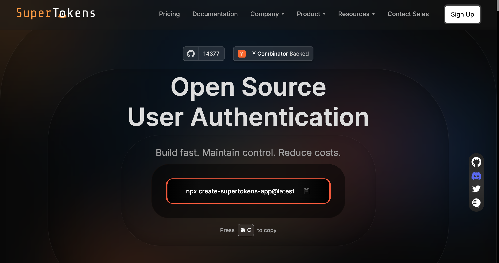

Authentication protocols set the foundation for how users access your application. Two of the most widely adopted are [SAML](https://supertokens.com/blog/demystifying-saml) and [OIDC](https://supertokens.com/blog/oidc-token). Both aim to let users sign in once and access services securely, but they approach the problem differently.

SAML was built for enterprise single sign-on, relying on XML assertions and certificate exchange. It’s proven and still common in corporate identity systems, but it's heavier to implement. OIDC, by contrast, builds on [OAuth](https://supertokens.com/blog/oauth) 2.0 and uses lightweight [JSON tokens](https://supertokens.com/blog/what-is-jwt). It’s easier to integrate, is designed for modern stacks like SPAs and mobile apps, and fits naturally into API-driven workflows.

The choice between them matters when working with SuperTokens. OIDC integrates natively, making it straightforward to connect with providers like Google or Azure AD. SAML can still be supported, but usually through a bridging service such as SAML Jackson. Knowing which protocol fits your environment saves development time, reduces friction, and ensures that SuperTokens can deliver unified session management regardless of the identity provider.

## What Is SAML?

Security Assertion Markup Language (SAML) is an XML-based standard widely used in enterprise single sign-on and federated identity. It enables a user to authenticate once with an identity provider (IdP), and then access multiple service providers (SPs) without re-entering credentials.

Key characteristics include:

- **XML assertions**: Carry authentication details between the IdP and SP.
- **Certificate exchange**: Ensures the integrity and trust of each login flow.
- **Centralized domains**: Common in enterprises running Active Directory or similar systems.

SAML remains valuable for organizations with **legacy systems** and long-standing compliance needs. The trade-off is complexity &mdash; verbose XML, certificate management, and metadata configuration can slow down modern development workflows.

## What Is OIDC?

OpenID Connect (OIDC) is a modern identity layer built on top of OAuth 2.0. It uses JSON Web Tokens (JWTs) and REST-based endpoints to share identity data securely between an IdP and your application.

Key characteristics include:

- **JWT-based tokens**: Compact, JSON-formatted credentials that are easy to parse and verify.
- **Designed for modern apps**: Works seamlessly with SPAs, mobile clients, APIs, and cloud-native services.
- **Dynamic discovery and key rotation**: Supports automatic retrieval of provider metadata, rotating signing keys, and OAuth-style consent flows.

OIDC is lightweight, developer-friendly, and highly scalable, making it the preferred choice for applications that need to integrate quickly with multiple identity providers while maintaining strong security.

## Protocol Comparison: OIDC vs SAML

Choosing between SAML and OIDC comes down to trade-offs in format, complexity, and ecosystem fit. The table below highlights their core differences so you can quickly see which protocol aligns best with your application’s needs.

|Feature|SAML|OIDC|
|---|---|---|
|Message Format|XML-based assertions|JWT-based id_token / access_token|
|Implementation|Complex, certificate-heavy, steep learning curve|Light, developer-friendly with common libraries|
|Use Cases|Web-only enterprise apps, legacy systems|SPAs, mobile, API-first, cloud-native|
|Security|Mature, high-assurance, but vulnerable to XML attacks (e.g., XSW)|Lightweight but still evolving; secure if implemented correctly (discovery attacks noted in academia)|
|Developer Experience|Harder, verbose, fewer modern SDKs|Much easier, JSON-first, broad language support|

In practice, SAML remains the right fit for established enterprise systems, while OIDC is better aligned with the lightweight, API-driven demands of modern applications.

## How SuperTokens Supports OIDC and SAML

[SuperTokens](https://supertokens.com/) is built to simplify authentication workflows while giving developers flexibility in protocol choice. Out of the box, it supports OIDC directly and makes SAML possible through a bridge service.

Key points:

- **Built-in OIDC support**: SuperTokens can act as an OIDC provider or client. It plugs into OAuth/OIDC flows used by social logins and enterprise IdPs like Google, Azure AD, or Okta.
- **SAML via integration**: SuperTokens is not a native SAML client. Instead, you can integrate by using a service like [**BoxyHQ’s SAML Jackson**](https://supertokens.com/docs/authentication/enterprise/saml/boxy-hq-guide), which communicates with the enterprise IdP by using SAML, then exposes the OAuth endpoints that SuperTokens consumes.
- **Unified session management**: Regardless of whether the identity came through OIDC or SAML, SuperTokens manages sessions and tokens in a consistent way across providers.

## When to Choose OIDC vs. SAML with SuperTokens

The right protocol depends on the systems you need to support and the environments you’re integrating with. SuperTokens gives you the flexibility to use either, but the decision often comes down to whether you’re building for modern apps or connecting to an established enterprise infrastructure.

Use **OIDC** when you need:

- Support for SPAs, mobile clients, and microservices
- Lightweight tokens in the JSON format and REST-friendly APIs
- Easy key rotation through the jwks_uri endpoint
- Quick setup with broad IdP coverage (Google, Auth0, Azure AD)

Use **SAML** when you need:

- Enterprise-grade integration with legacy IdPs such as ADFS or Shibboleth
- Compliance with long-standing corporate identity requirements
- XML-based assertion workflows mandated by the IdP

This way, you can lean on OIDC for modern, scalable apps while still accommodating SAML where enterprise environments require it.

## Example Integration Flows with SuperTokens

SuperTokens simplifies how different protocols fit into your application’s authentication flow. Whether you’re connecting to an OIDC provider or bridging to SAML, the session-handling experience remains consistent.

**OIDC flow**

- The user selects an option like “Sign in with Google” or “Sign in with Azure.”
- The backend uses the [SuperTokens’ OIDC recipe](https://supertokens.com/docs/nodejs/modules/recipe_openid.html) to manage the OAuth/OIDC exchange.
- The tokens are verified, and SuperTokens sets up the user session.

**SAML flow (via SAML Jackson)**

- The BoxyHQ service redirects the user to the enterprise IdP and processes the SAML assertion.
- That assertion is translated into OAuth tokens (id_token, access_token).
- SuperTokens consumes those tokens as if they came from a standard OAuth provider and manages the session.

This approach keeps the developer experience uniform. Whether the source is OIDC or SAML, SuperTokens ensures users are issued a secure session in the same way.

## Security and Compliance Considerations

Both SAML and OIDC are secure when implemented correctly, but each comes with its own risks and areas to watch. Understanding these differences helps teams choose the right protocol for their environment and compliance needs.

**SAML**

- Mature and widely adopted in enterprise environments.
- Uses **XML digital signatures**, which can be vulnerable to attacks like **XML Signature Wrapping (XSW)** if validation is not handled carefully.
- Strong fit for compliance-heavy sectors, but requires rigorous certificate and metadata management.

**OIDC**

- Built on top of OAuth 2.0 with a **simpler cryptographic surface** than SAML.
- Supports **dynamic discovery** and automatic **key rotation** via `jwks_uri`, reducing manual overhead.
- Needs careful audits of discovery endpoints to guard against second-order attacks highlighted in academic research.

In practice, SAML offers proven assurance in legacy and enterprise systems, while OIDC provides a more lightweight but equally secure option for modern applications.

## Best Practices When Using SuperTokens with OIDC or SAML

Getting authentication protocols in place is only the first step. To keep your system secure, reliable, and compliant, it’s important to follow best practices when using SuperTokens with OIDC or SAML.

- **Validate metadata regularly**: Certificates in SAML can expire, and OIDC keys rotate through the jwks_uri. Regular checks prevent login disruptions and reduce the risk of failed verifications.
- **Map user attributes consistently**: Whether attributes arrive in XML assertions or JSON tokens, map them cleanly into SuperTokens’ user metadata. This ensures consistent handling of roles, groups, or profile data across providers.
- **Maintain audit logs**: Track SSO activity, token exchanges, and session creation. Detailed logs help with troubleshooting and are essential for meeting standards like SOC 2, HIPAA, and GDPR.
- **Provide fallback login options**: If an IdP goes down, users should still be able to access your app. [Passwordless](https://supertokens.com/features/passwordless-login) or email-based login through SuperTokens gives you a safety net.

By following these practices, you reduce operational risks and ensure a smooth user experience no matter which protocol is in play.

## Frequently Asked Questions

**Q: Does SuperTokens support both OIDC and SAML natively?**
OIDC is supported out of the box. SAML is available through integrations like **SAML Jackson**, which bridges SAML IdPs into OAuth/OIDC flows that SuperTokens can consume.

**Q: Can I support both protocols simultaneously?**
Yes. SuperTokens can unify sessions across providers, so users signing in with OIDC or SAML are handled consistently inside your application.

**Q: Which protocol offers better performance?**
OIDC is typically faster and lighter, since it uses JSON tokens and REST endpoints. SAML tends to be heavier because of XML parsing, certificate handling, and multiple redirect steps.

## Conclusion

Choosing between OIDC and SAML isn’t about which protocol is “better,” but about which is a better fit for your environment. OIDC is the natural choice for modern apps &mdash; lightweight, API-friendly, and designed for SPAs, mobile, and cloud-native systems. SAML, on the other hand, remains critical for enterprises with established IdPs, compliance requirements, and XML-based workflows.

With SuperTokens, you don’t need to compromise. OIDC is supported natively, and SAML can be integrated through a bridging service like SAML Jackson. No matter the source, SuperTokens applies the same session model, giving you consistency, security, and a streamlined developer experience.

In practice, this means you can meet enterprise requirements while still building with modern tools &mdash; all under one session management framework.