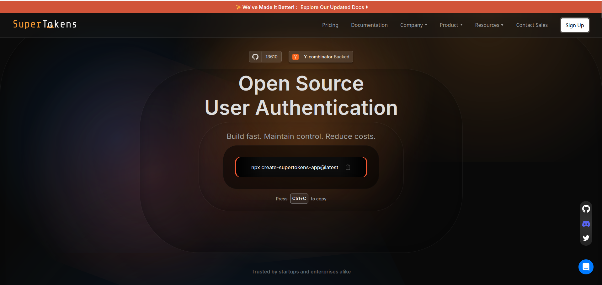
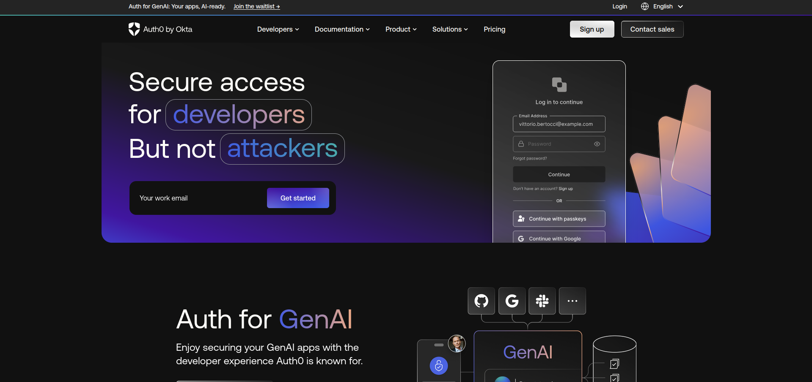
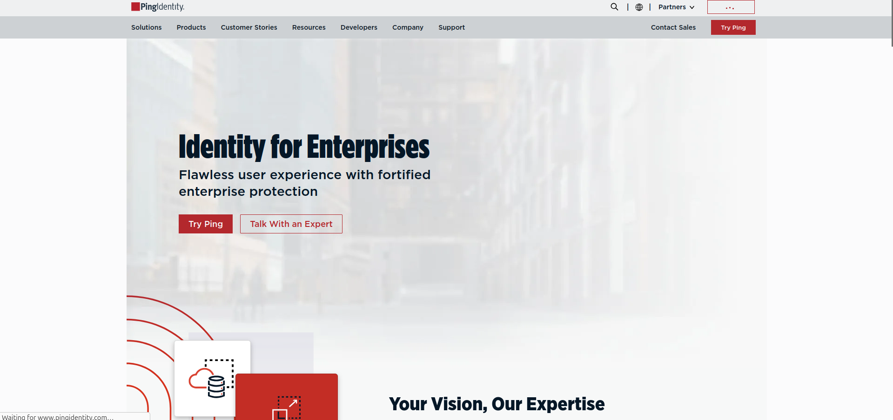
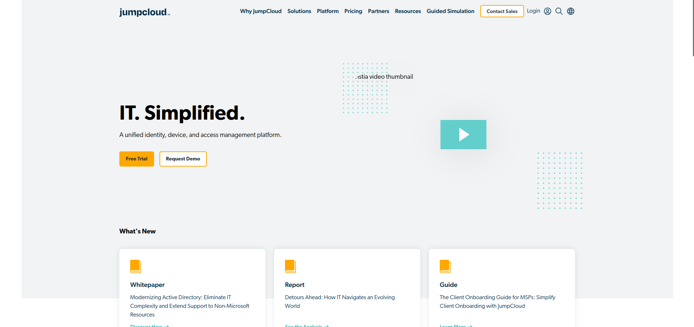
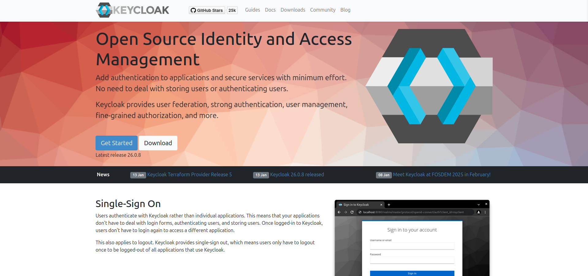
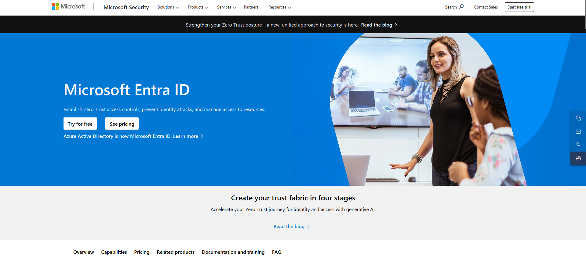
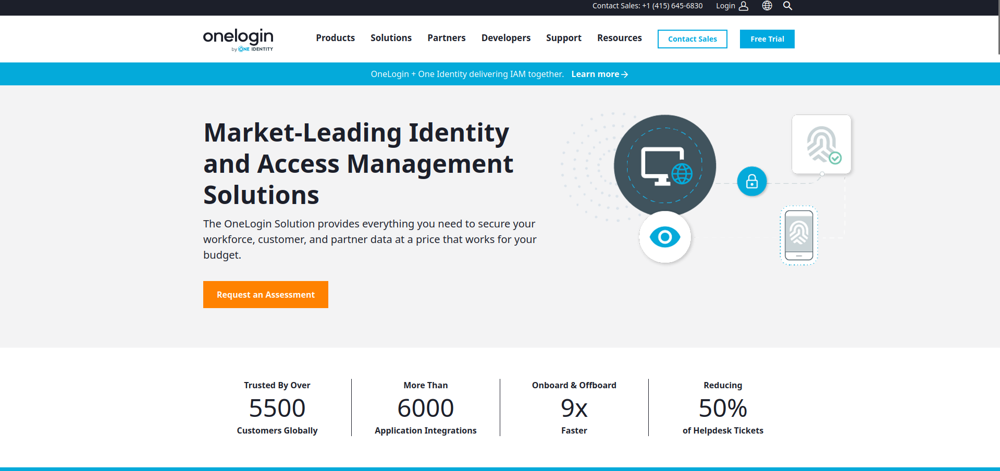

In the rapidly evolving world of Identity and Access Management (IAM), organizations are prioritizing solutions that offer flexibility, robust security, and cost efficiency. Okta, while a popular choice, isn’t always the perfect fit for every business. Whether due to complexity, cost, or lack of customization, many developers and businesses seek alternatives. This article dives deep into some of the best Okta alternatives, analyzing their features, pricing, limitations, and what makes them stand out.

## 3 Common Okta Challenges

### 1. Complexity in Configuration and Maintenance

Okta's expansive feature set is a double-edged sword. While it provides a broad range of functionalities, it can become overly complex for businesses that don’t need all the bells and whistles. Setting up integrations, managing configurations, and maintaining the system often require specialized expertise, leading to longer implementation times.

### 2. High Costs

Okta’s pricing can be prohibitive, especially for small businesses or startups. Costs tend to scale quickly with the number of users and features, making it less accessible for companies with tight budgets.

### 3. Limited Customization

For developers seeking to tailor authentication flows or user experiences, Okta’s closed architecture can be a limitation. The inability to easily customize certain elements can frustrate teams aiming to implement highly specific use cases.

## Top 7 Okta Alternatives to Use for Identity Management

| Feature/Aspect                 | Okta                     | SuperTokens            | Auth0                   | Ping Identity           | JumpCloud              | Keycloak               | Microsoft Entra ID     | OneLogin               |
|--------------------------------|--------------------------|-------------------------|-------------------------|-------------------------|------------------------|------------------------|------------------------|------------------------|
| **Primary Strength**           | Comprehensive IAM        | Open-source, customizable | Developer-friendly     | Enterprise-grade security | Unified IAM platform  | Open-source IAM        | Seamless Microsoft integration | User-friendly IAM     |
| **Pricing**                    | High cost, scales quickly | Free core, $0.02/MAU for extras | Free for 25K users, paid starts at $35/month | Starts at $3/user/month | Free for up to 10 users/devices, paid starts at $11/user/month | Free | Free tier available, paid for advanced features | Starts at $4/user/month |
| **Customization**              | Limited                 | High                   | Moderate                | Limited                 | Moderate              | High                   | Limited                 | Moderate               |
| **Integration**                | Extensive               | Moderate               | Extensive               | Extensive               | Cross-platform         | Standard protocols     | Deep Microsoft ecosystem | Extensive              |
| **Security Features**          | Robust MFA, SSO         | Self-hosting, MFA       | MFA, breached password detection | MFA, SSO, API security | MFA, conditional access | Fine-grained authorization | MFA, identity protection | MFA, context-aware access |
| **Scalability**                | Enterprise-grade         | Suitable for startups and enterprises | High                   | Large enterprises       | SMBs to enterprises    | Resource-intensive     | Suitable for large organizations | Suitable for all sizes |
| **Ease of Use**                | Complex for some         | Quick setup (15 minutes) | Developer-focused       | Complex for advanced use | Moderate learning curve | Learning curve         | Complex for advanced configurations | User-friendly         |
| **Deployment Options**         | Cloud-based             | Self-hosting available  | Cloud-based             | Cloud/on-premises       | Cloud-based           | On-premises, self-host | Cloud-based, hybrid    | Cloud-based            |
| **Target Users**               | Enterprises             | Startups, developers    | Developers, enterprises | Large enterprises       | SMBs, hybrid workforces | Enterprises, developers | Microsoft-heavy organizations | Enterprises, diverse apps |
| **Key Differentiator**         | Comprehensive features   | Open-source flexibility | Developer-friendly tools | Enterprise-scale security | Unified IAM and device management | Open-source and customizable | Microsoft ecosystem integration | User-friendly interface |

### 1. SuperTokens

SuperTokens is an open-source user authentication solution designed to help developers integrate secure and efficient authentication mechanisms into their applications. It supports various authentication methods, including email/password, passwordless (via OTP or magic links), and social logins.

SuperTokens' primary distinction lies in its open-source nature, granting developers full access to the codebase for customization and control. This transparency ensures robust security and flexibility, enabling seamless integration tailored to specific application needs. 

**Pros**
- **Quick Integration**: Developers can set up SuperTokens within 15 minutes, expediting the development process.
SuperTokens

- **Prebuilt and Customizable UI**: Offers prebuilt UI components for rapid deployment, with the option for custom UI to match application aesthetics.

- **Self-Hosting Capability**: Provides the flexibility to self-host, offering greater control over user data and compliance requirements.
SuperTokens

- **Scalability**: Designed to support both startups and large enterprises, ensuring scalability as your application grows. 

**Cons**

- **Advanced Features May Require Payment**: While the core features are free, certain advanced functionalities are part of the paid offerings. 
- **Customization Effort**: Depending on specific requirements, you might need to invest time in customizing the solution to fit your exact needs.

**How it compares to competitors**

SuperTokens stands out by combining open-source accessibility with a comprehensive feature set, allowing for deep customization and control over the authentication process. Its self-hosting option provides an advantage for organizations concerned with data privacy and compliance, distinguishing it from fully managed proprietary solutions. 

**Use cases**

- **Startups**: Quickly implement authentication without significant upfront costs, benefiting from the free core features.

- **Enterprises**: Leverage advanced features and self-hosting capabilities to meet complex security and compliance requirements.

- **Developers Seeking Customization**: Ideal for applications requiring tailored authentication flows and UI components.

- **Multi-Tenant Applications**: Supports multi-tenancy, making it suitable for SaaS applications serving multiple clients. 

**Rating**

- [ProductHunt](https://www.producthunt.com/products/supertokens): 4.6/5
- [Gartner](https://www.gartner.com/reviews/market/user-authentication/vendor/supertokens): 5/5
- [G2](https://www.g2.com/products/supertokens/reviews): 5/5

**Pricing**

- Self-hosted is completely free
- **Free under 5K** monthly active users (MAUs)
- After that, **$0.02 per MAU** 
- Paid add-ons

### 2. Auth0

Auth0 is a cloud-based identity and access management platform that enables developers to implement authentication and authorization for web, mobile, and legacy applications. It supports various authentication methods, including social logins, multi-factor authentication (MFA), single sign-on (SSO), and passwordless login. 

**Pros**
- **Ease of Integration**: Auth0 offers over [30 SDKs](https://auth0.com/docs/libraries) and quickstarts, allowing developers to integrate authentication into applications within minutes. 
- **Comprehensive Security Features**: Provides robust security measures, including MFA, breached password detection, and bot detection, enhancing application security. 
- **Scalability**: Designed to handle applications of all sizes, from startups to large enterprises, ensuring reliable performance as user bases grow. 
- **Customizable Authentication Flows**: Offers extensive customization options for login experiences, accommodating unique business requirements. 

**Cons**
- **Learning Curve**: Some users report a steep learning curve when configuring advanced features or customizing authentication flows. 
- **Pricing Structure**: The pricing model can be complex, and costs may escalate with increased usage or the need for advanced features. 

**How It Compares to Competitors**

Auth0 distinguishes itself with a developer-friendly approach, offering extensive documentation, quickstarts, and a wide range of SDKs for rapid integration. Its comprehensive security features and support for multiple authentication methods provide a robust solution for diverse application needs. However, the proprietary nature and potential costs associated with scaling may be considerations when compared to open-source alternatives like SuperTokens. 

**Use Cases**

- **Consumer Applications**: Implement secure and seamless user authentication for consumer-facing web and mobile applications. 

- **B2B SaaS Applications**: Provide secure access for business clients, supporting features like SSO and role-based access control. 

- **Enterprises**: Leverage advanced security features and scalability to manage employee and customer identities across multiple applications. 

- **Developers Requiring Customization**: Ideal for applications needing tailored authentication flows and extensive customization options. 

**Rating**

- [**G2**](https://www.g2.com/products/auth0-by-okta/reviews): 4.3/5 

- [**Capterra**](https://www.capterra.com/p/154900/Auth0/): 4.6/5 

- [**TrustRadius**](https://www.trustradius.com/products/auth0-from-okta/reviews): 7.4/10 

**Pricing**

- **Free Tier**: Includes up to 25,000 active users and basic features. 

- **Essentials Plan**: Starts at $35/month for 500 active users, offering additional features and support. 

- **Professional Plan**: Starts at $240/month for 1000 active users with numeruos additional features. 

Auth0 provides a robust and scalable authentication solution suitable for a wide range of applications, with extensive features and support for developers. 

### 3. Ping Identity

Ping Identity is an enterprise-focused identity and access management (IAM) platform that offers a comprehensive suite of solutions, including single sign-on (SSO), multi-factor authentication (MFA), access security, API cybersecurity, and data governance. These tools are designed to secure digital interactions and provide seamless user experiences across cloud, mobile, and on-premises applications. 

**Pros**

- **Comprehensive Security Features**: Ping Identity provides robust security measures, including MFA, SSO, and API security, enhancing the overall security posture of enterprises. 

- **Scalability**: Designed to support large enterprises, Ping Identity can manage identity and access needs at scale, accommodating complex organizational structures and large user bases. 

- **Integration Capabilities**: Offers extensive integration options with various applications and services, facilitating seamless incorporation into existing IT ecosystems. 

- **Flexible Deployment Options**: Provides both cloud-based and on-premises deployment models, allowing organizations to choose the setup that best fits their security and compliance requirements. 

**Cons**

- **Complexity**: Some users report that the platform can be complex to configure and manage, potentially requiring specialized expertise. 

- **Cost Considerations**: The pricing structure may be a concern for smaller organizations, as costs can escalate with the addition of advanced features and increased usage. 

**How It Compares to Competitors**

Ping Identity distinguishes itself with a robust suite of enterprise-grade IAM solutions that offer flexibility in deployment and extensive integration capabilities. Its focus on large-scale, complex environments makes it a strong contender for large enterprises seeking comprehensive identity management solutions.

**Use Cases**

- **Large Enterprises**: Ideal for organizations requiring scalable and comprehensive IAM solutions to manage complex access needs across diverse applications and user groups. 

- **Industries with Stringent Compliance Requirements**: Suitable for sectors such as finance and healthcare, where robust security measures and compliance with regulations are critical. 

- **Organizations Seeking Integration Flexibility**: Beneficial for enterprises needing to integrate IAM solutions with a wide range of existing applications and services. 

**Rating**

- [**Gartner**](https://www.gartner.com/reviews/market/access-management/vendor/ping-identity): 4.5/5 

- [**G2**](https://www.g2.com/products/ping-identity/reviews): 4.4/5 

- [**TrustRadius**](https://www.trustradius.com/products/ping-identity-pingone/reviews): 6/10 

**Pricing**

Ping Identity offers various pricing tiers tailored to organizational needs:

- **Workforce Plans**:

  - **Essential**: $3 per user per month

  - **Plus**: $6 per user per month

  - **Premium**: Custom pricing available upon request 

- **Customer Plans**:

  - **Essential**: $20,000 annually

  - **Plus**: $40,000 annually

  - **Premium**: Custom pricing available upon request 

Ping Identity provides a robust and scalable identity management platform suitable for large enterprises with complex security and integration requirements. Its comprehensive feature set and flexible deployment options make it a compelling choice for organizations seeking to enhance their identity and access management capabilities. 

### 4. JumpCloud

JumpCloud is a cloud-based open directory platform that unifies identity, access, and device management across various operating systems, including Windows, macOS, and Linux. It offers features such as single sign-on (SSO), multi-factor authentication (MFA), device management, and conditional access, enabling organizations to securely manage user identities and devices from a centralized platform. 

**Pros**

- **Cross-Platform Support**: JumpCloud provides seamless management across multiple operating systems, facilitating consistent identity and device management in heterogeneous IT environments. 

- **Unified Management**: Combines identity, access, and device management into a single platform, reducing the need for multiple tools and simplifying administrative tasks. 

- **Scalability**: Designed to accommodate organizations of varying sizes, offering flexible deployment options that can scale with business growth. 

- **Comprehensive Security Features**: Includes SSO, MFA, and conditional access policies, enhancing security by ensuring that only authorized users can access company resources. 

**Cons**

- **Learning Curve**: Some users report a learning curve when configuring advanced features or customizing the platform to fit specific organizational needs. 

- **Occasional Performance Issues**: There are occasional reports of slow performance and minor glitches, especially during peak usage times. 

**How It Compares to Competitors**

JumpCloud differentiates itself by offering a comprehensive, cloud-based directory platform that integrates identity, access, and device management across multiple operating systems. Its open directory approach provides flexibility and avoids vendor lock-in, contrasting with traditional solutions like Microsoft's Active Directory. Additionally, JumpCloud's unified platform can reduce the complexity and cost associated with managing multiple disparate tools. 

**Use Cases**

- **Small to Medium-Sized Businesses (SMBs)**: Ideal for SMBs seeking a cost-effective, scalable solution for managing user identities and devices without the overhead of maintaining on-premises infrastructure. 

- **Organizations with Diverse Operating Systems**: Suitable for companies operating in heterogeneous environments that require consistent management across Windows, macOS, and Linux systems. 

- **Remote and Hybrid Workforces**: Enables secure access and device management for remote employees, supporting hybrid work models by providing centralized control regardless of user location. 

**Rating**

- [**G2**](https://www.g2.com/products/jumpcloud/reviews): 4.5/5 

- [**TrustRadius**](https://www.trustradius.com/products/jumpcloud/reviews): 8.8/10 

- [**PeerSpot**](https://www.peerspot.com/products/jumpcloud-reviews): 4.3/5 

**Pricing**

JumpCloud offers flexible pricing options to accommodate various organizational needs:

- **Free Tier**: Includes core directory services for up to 10 users and 10 devices. 

- **Paid Plans**:

  - **Device Management**: $11 per user per month. 

  - **SSO**: $13 per user per month. 

  - **Device Management + Identity**: $15 per user per month. 

  - **Core Directory**: $15 per user per month. 

  - **JumpCloud Platform**: $22 per user per month. 

  - **JumpCloud Platform Prime**: $27 per user per month. 

A 30-day free trial is available for organizations to explore the full functionality of the JumpCloud platform. 

JumpCloud provides a versatile and scalable solution for organizations seeking to unify their identity, access, and device management across diverse environments, supporting modern IT infrastructures and remote workforces. 

### 5. Keycloak

Keycloak is an open-source identity and access management (IAM) solution that enables developers to add authentication and authorization to applications and services with minimal effort. It supports standard protocols such as OpenID Connect, OAuth 2.0, and SAML 2.0, facilitating seamless integration with various platforms. 

**Pros**

- **Open Source and Customizable**: As an open-source platform, Keycloak allows organizations to customize and extend its functionalities to meet specific requirements, reducing reliance on proprietary solutions. 

- **Comprehensive Feature Set**: Keycloak offers features like single sign-on (SSO), identity brokering, social login, user federation with LDAP and Active Directory, and fine-grained authorization, providing a robust IAM solution. 

- **Standard Protocol Support**: Supports industry-standard protocols, ensuring compatibility and ease of integration with a wide range of applications and services. 

- **Active Community and Documentation**: Maintained by a vibrant community, Keycloak provides extensive documentation and community support, aiding in implementation and troubleshooting. 

**Cons**

- **Complex Initial Setup**: The initial setup and configuration of Keycloak can be complex, potentially requiring significant time and expertise to achieve a stable production environment. 

- **Resource Intensive**: Operating Keycloak may demand considerable system resources, which could be a concern for organizations with limited infrastructure capabilities.

- **Learning Curve**: Due to its extensive feature set, there can be a learning curve for administrators and developers new to the platform.

**How It Compares to Competitors**

Keycloak stands out among IAM solutions due to its open-source nature, offering flexibility and cost advantages over proprietary systems. Its comprehensive feature set and support for standard protocols make it a versatile choice for various use cases. However, the complexity of its setup and resource requirements may pose challenges compared to more streamlined solutions like SuperTokens or managed services such as Auth0.

**Use Cases**

- **Enterprises Seeking Custom IAM Solutions**: Ideal for organizations that require a customizable and extensible IAM platform to fit specific business needs.

- **Organizations with Existing User Directories**: Suitable for integrating with existing LDAP or Active Directory services for user federation. 

- **Applications Requiring SSO and Social Login**: Beneficial for applications that aim to provide seamless user experiences through single sign-on and social media authentication. 

- **Developers Needing Fine-Grained Authorization**: Useful for applications that demand detailed access control policies beyond simple role-based access. 

**Rating**

- [**G2**](https://www.g2.com/products/keycloak/reviews): 4.2/5 

- [**Gartner**](https://www.gartner.com/reviews/market/access-management/vendor/ibm-red_hat/product/keycloak): 4.2/5 

**Pricing**

Keycloak is free to use under the Apache License 2.0, allowing organizations to deploy and customize the platform without licensing costs. 

Keycloak offers a robust and flexible IAM solution suitable for organizations seeking an open-source platform capable of extensive customization to meet diverse authentication and authorization requirements. 

### 6. Microsoft Entra ID (Formerly Azure Active Directory)

Microsoft Entra ID, previously known as Azure Active Directory (Azure AD), is a cloud-based identity and access management (IAM) solution from Microsoft. It provides organizations with tools to manage user identities and secure access to resources across cloud and on-premises environments. 

**Pros**

- **Comprehensive Integration**: Seamlessly integrates with a wide range of Microsoft services, including Microsoft 365, Azure, and Dynamics 365, as well as thousands of third-party applications, facilitating unified identity management. 

- **Robust Security Features**: Offers advanced security capabilities such as multi-factor authentication (MFA), conditional access policies, and identity protection to safeguard against unauthorized access and potential threats. 

- **Scalability**: Designed to support organizations of all sizes, from small businesses to large enterprises, ensuring scalability to accommodate growing user bases and complex access requirements. 

- **Single Sign-On (SSO)**: Provides SSO capabilities, allowing users to access multiple applications with a single set of credentials, enhancing user experience and reducing password fatigue. 

**Cons**

- **Complexity in Advanced Configurations**: Implementing advanced features and custom configurations can be complex, potentially requiring specialized knowledge and expertise.

- **Licensing Costs**: While a free tier is available, accessing advanced features and higher service levels may involve additional licensing costs, which could be a consideration for budget-conscious organizations.

- **Vendor Lock-in**: Integration with other Microsoft services is neat, but it comes at a cost of vendor lock-in.

**How It Compares to Competitors**

Microsoft Entra ID distinguishes itself through deep integration with Microsoft's ecosystem, providing a seamless experience for organizations heavily utilizing Microsoft products. Its comprehensive feature set and global scalability make it a robust choice for enterprises. However, organizations seeking open-source solutions or those with minimal reliance on Microsoft services might consider alternatives like Keycloak or SuoerTokens.

**Use Cases**

- **Enterprises Utilizing Microsoft Ecosystem**: Ideal for organizations deeply integrated with Microsoft services, seeking unified identity and access management across platforms.

- **Organizations Requiring Advanced Security Measures**: Suitable for businesses needing robust security features such as MFA, conditional access, and identity protection to safeguard sensitive data.

- **Hybrid Environments**: Beneficial for organizations operating in hybrid cloud and on-premises environments, providing seamless identity management across both.

**Rating**

- [**Gartner**](https://www.gartner.com/reviews/market/identity-governance-administration/vendor/microsoft/product/microsoft-entra-id): 4.5/5

- [**G2**](https://www.g2.com/products/microsoft-entra-id/reviews): 4.5/5

- [**TrustRadius**](https://www.trustradius.com/products/microsoft-entra-id/reviews): 8.9/10

**Pricing**

Microsoft Entra ID offers several pricing tiers to accommodate varying organizational needs:

- **Free Edition**: Includes user and group management, on-premises directory synchronization, basic reports, self-service password change for cloud users, and single sign-on across Azure, Microsoft 365, and many popular SaaS apps. 

- **Microsoft Entra ID P1**: In addition to the Free features, P1 also lets your hybrid users access both on-premises and cloud resources. 

- **Microsoft Entra ID P2**: Includes all P1 features, plus identity protection and privileged identity management. 

Microsoft Entra ID provides a robust and scalable identity and access management solution, particularly advantageous for organizations leveraging Microsoft's suite of services, offering comprehensive security features and seamless integration across platforms. 

### 7. OneLogin

OneLogin is a cloud-based identity and access management (IAM) provider that offers a unified access management platform for enterprises. Its solutions include single sign-on (SSO), multi-factor authentication (MFA), directory services, and user provisioning, designed to secure access to both cloud-based and on-premises applications. 

**Pros**

- **Ease of Use**: OneLogin provides a seamless single sign-on experience, simplifying access for users across various applications without the need to remember multiple usernames and passwords. 

- **Comprehensive Security Features**: The platform offers robust security measures, including multi-factor authentication and context-aware access management, ensuring that only authorized users can access sensitive data. 

- **Extensive Integration Capabilities**: With an extensive app catalog featuring over 6,000 integrations, OneLogin facilitates easy access and provisioning for a wide range of enterprise applications. 

- **Unified Access Management**: OneLogin's platform centralizes identity and access management across all user directories, applications, and devices, enhancing security and operational efficiency. 

**Cons**

- **Learning Curve**: Some users report a learning curve when configuring advanced features or customizing the platform to fit specific organizational needs. 

- **Pricing Considerations**: While OneLogin offers a range of features, some users note that certain advanced functionalities may come at an additional cost, which could be a consideration for budget-conscious organizations. 

**How It Compares to Competitors**

OneLogin distinguishes itself with its user-friendly interface and extensive integration capabilities, making it a strong contender in the IAM space. Its unified access management approach simplifies identity and access management across diverse environments..

**Use Cases**

- **Enterprises Seeking Unified IAM Solutions**: Ideal for organizations looking to centralize identity and access management across cloud and on-premises applications.

- **Businesses Requiring Robust Security Measures**: Suitable for companies needing comprehensive security features such as MFA and context-aware access management to protect sensitive data.

- **Organizations with Diverse Application Ecosystems**: Beneficial for enterprises that utilize a wide range of applications and require seamless integration and provisioning capabilities.

**Rating**

- [**G2**](https://www.g2.com/products/onelogin/reviews): 4.4/5 

- [**TrustRadius**](https://www.trustradius.com/products/onelogin/reviews): 9.7/10 

- [**Gartner Peer Insights**](https://www.gartner.com/reviews/market/access-management/vendor/one-identity/product/onelogin): 4.3/5 

**Pricing**

OneLogin offers flexible pricing options to accommodate various organizational needs:

- **Starter Plan**: Starts at $4 per user per month, providing basic IAM features suitable for small to medium-sized businesses. 

- **Enterprise Plan**: Offers advanced features and integrations, with pricing available upon request, tailored to large enterprises with complex IAM requirements.

A free trial is available for organizations to explore the platform's capabilities before committing to a subscription. 

OneLogin provides a robust and user-friendly identity and access management solution, suitable for organizations seeking to secure and streamline access across a diverse application landscape. 

## What to Look for in an Okta Alternative

**Ease of Integration**

Choose a solution that supports seamless integration with your existing tech stack, whether it’s cloud-based, on-premises, or hybrid.

**Scalability and Flexibility**

As your business grows, your IAM solution should scale with you. Look for tools that offer flexible deployment options and customization.

**Security Features**

Ensure the solution includes robust security measures, such as MFA, adaptive authentication, and threat detection.

## Conclusion

While Okta remains a strong contender in the IAM space, it’s not the only option. Alternatives like SuperTokens, Auth0, and Keycloak provide unique value propositions, whether it’s cost-effectiveness, customization, or ease of use. SuperTokens, in particular, stands out for its developer-centric approach and open-source flexibility.

Looking for a tailored IAM solution? See how SuperTokens brings innovative access solutions to your organization! [Signup today](https://supertokens.com/auth)!