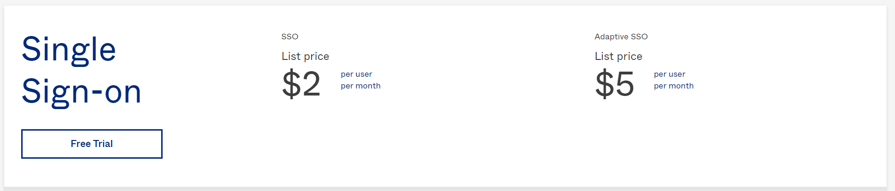
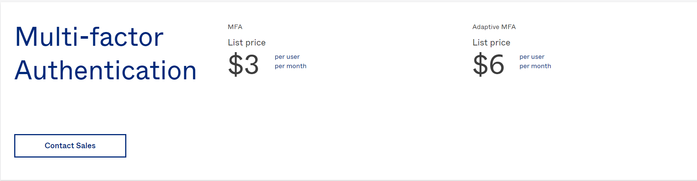
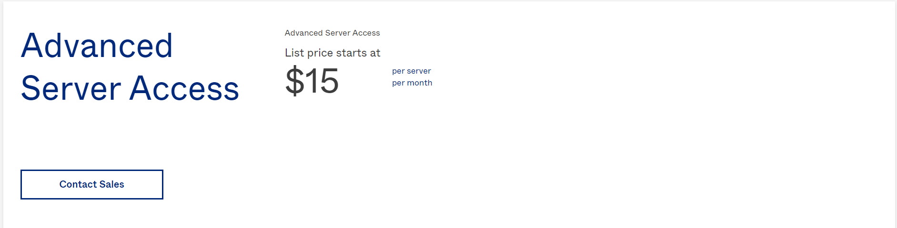
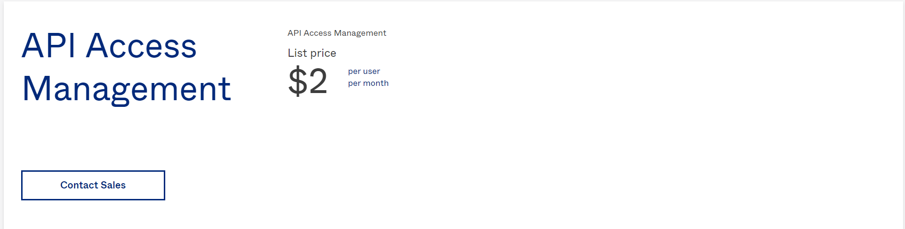

## Table of Contents
- [What is Okta?](#what-is-okta)
- [Okta Pricing](#okta-pricing)
- [Okta Alternative: SuperTokens](#okta-alternative-supertokens)

## What is Okta?

With an emphasis on workforce identity solutions, Okta is a leader in the enterprise authentication space, offering [identity products](https://www.okta.com/pricing/#workforce-identity-pricing) to secure employees and business resources within an organization.

To bolster its position as a market leader in the Authentication space, Okta has acquired a number of authentication solutions culminating in the [2021 Auth0 acquisition](https://supertokens.com/blog/the-real-reason-okta-spent-on-auth0).

Okta can now fill in the gaps in its customer identity product stack with Auth0’s solutions, making them the most significant player in the authentication space.

## Okta Pricing

Okta’s products fall into two categories:
- Workforce Identity Cloud Products 
- Customer Identity Cloud Products

### Workforce Identity Products

Workforce Identity products are aimed at securing employee access within an organization and ensuring business resources are protected.

As mentioned previously Okta is a leader in this space and offers 9 products to manage users in your organization.

Here are some of the main products they offer:

**Single Sign-on:**
SSO is an authentication tool that enables users to securely access multiple applications with the same set of credentials. 
This feature is priced at(Monthly pricing):
- Regular SSO: **$2 per user**
- Adaptive SSO(context-based SSO): **$5 per user**

**Multi-factor Autentication:**
This authentication method requires the user to provide two or more verification factors to access their account.

This feature is priced at(Monthly pricing):
- MFA: **$3 per user**
- Adaptive MFA: **$6 per user**

**Advanced Server Access:**
Advanced Sever Access allows organizations to manage employee access to windows and Linux servers.
This feature is priced at(Monthly pricing):
- $15 per user

**API Access Management:**
API Access Management is Okta's implementation of the OAuth 2.0 standard, allowing organizations to secure their APIs.
This feature is priced at(Monthly pricing):
- **$2 per user**

### Customer Identity Products
Customer Identity products are aimed at B2C organizations that want to manage and protect external identities like customers and partners.

Post Auth0 acquisition, Okta deprecated their own line of customer identity products and now serves Auth0’s products as their default customer identity solution.

You can find a complete guide to Auth0’s pricing [here](https://supertokens.com/blog/auth0-pricing-the-complete-guide).

## Okta Alternative: Supertokens

### What is SuperTokens?
SuperTokens is an open-source authentication solution that provides a managed service for hassle-free auth and an on-prem solution so developers can manage their data.

## SuperTokens Pricing:
At the time of writing this article, the SuperTokens feature set is completely free. If you decide to use the self-hosted version you can download the core and use it for free for an unlimited number of users.

- **Self-Hosted:**
  - Free forever for unlimited users.
- **Managed Service:**
  - Free for the first 5000 MAUs.
  - 2 cents / MAU post the first 5000 MAUs.

### Should you use SuperTokens?
SuperToken’s feature set and pricing make it an excellent choice for startups and mid-level businesses, but it may not be the best fit for large organizations that require enterprise features.
