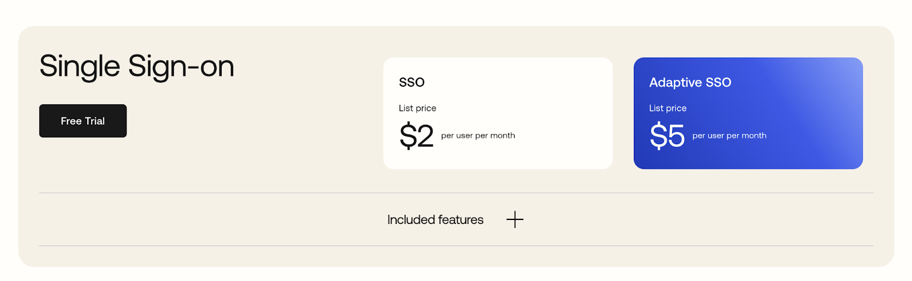
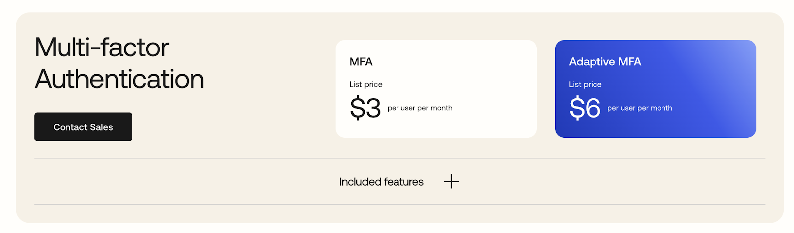
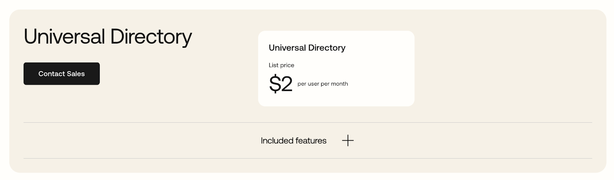
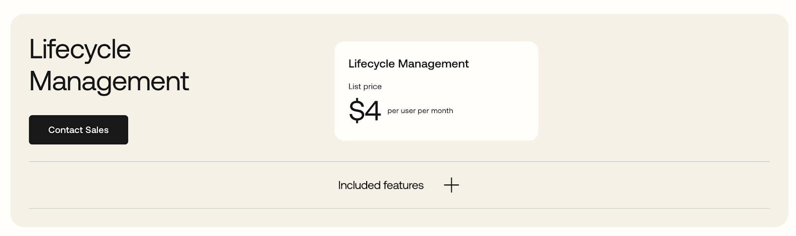
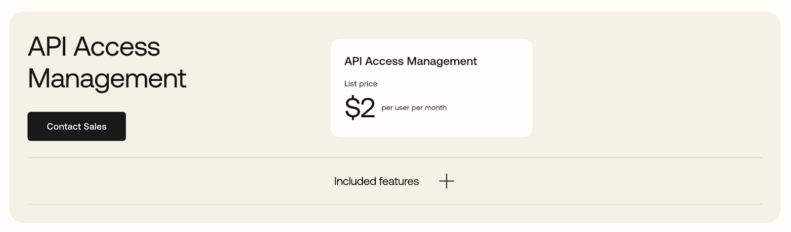

## Table of Contents
1. [What is Okta?](#what-is-okta)
2. [Understanding Okta’s Pricing Model](#understanding-oktas-pricing-model)
3. [Workforce Identity Cloud](#workforce-identity-cloud)
4. [Customer Identity Cloud](#customer-identity-cloud)
5. [Okta’s Pricing vs Other Identity Management Solutions](#oktas-pricing-vs-other-identity-management-solutions)
6. [Calculating the True Cost of Using Okta](#calculating-the-true-cost-of-using-okta)
7. [SuperTokens: An Alternative to Okta](#supertokens-an-alternative-to-okta)

## What is Okta?

With an emphasis on workforce identity solutions, Okta is a leader in the enterprise authentication space, offering identity products to secure employees and business resources within an organization.

To bolster its position as a market leader in the Authentication space, Okta has acquired a number of authentication solutions including Auth0 in 2021.

Okta’s portfolio of products now includes all customer identity needs, external authentication with Auth0, and internal authentication with Okta’s core product. They are the most significant player in the authentication space.

## Understanding Okta’s Pricing Model

Okta’s pricing plans are divided by product category, their products fall into two categories:
- Workforce Identity Cloud
- Customer Identity Cloud

## Workforce Identity Cloud

Okta’s workforce identity cloud range of products are aimed at allowing employees and members of your organization to access internal tools. For pricing, Okta further divides this category into separate products:

### Single Sign-On (SSO)

Single Sign-On (SSO) is a feature that allows users to access multiple applications and services with a single set of login credentials, streamlining the authentication process and enhancing user convenience. The SSO feature is priced at $2 per user per month for base SSO and $5 per user per month for Adaptive SSO. Okta’s [pricing page](https://www.okta.com/pricing/) has more information about how the two SSO plans compare.

### Multi-Factor Authentication (MFA)

Multi-Factor Authentication (MFA) is a security feature that requires users to provide two or more verification methods to gain access to an application or service, enhancing protection against unauthorized access. Okta prices this feature at $3 per user per month for base MFA and $6 per user per month for adaptive MFA. Visit their [pricing page](https://www.okta.com/pricing/) to learn more about how the plans compare.

### Universal Directory

Universal Directory is a feature that consolidates user identities from various sources into a single, centralized directory, simplifying identity management across an organization. This unified directory provides a comprehensive view of all user profiles, ensuring consistent and accurate identity data. This feature is priced at $2 per user per month.

### Lifecycle Management

Okta's Lifecycle Management solution automates the entire user lifecycle process, from onboarding to offboarding, ensuring that users have the right access at every stage of their employment. It provides streamlined workflows for provisioning and deprovisioning users across various applications and systems, reducing manual errors and improving efficiency. With robust integration capabilities, Okta's Lifecycle Management ensures that access permissions are consistently updated, enhancing security and compliance while optimizing operational processes. Okta prices its lifecycle management solution at $4 per user per month.

### API Access Management

Okta's API Access Management solution secures APIs by providing robust authentication and authorization controls, ensuring only authorized users and applications can access sensitive data. It uses OAuth 2.0 standards to manage API tokens, enabling fine-grained access policies and enhanced security. This feature is priced at $2 per user per month.

You can find a full list of the products they offer [here](https://www.okta.com/pricing/). Also note that Okta requires a minimum contract of $1500 annually with price reductions available for enterprise customers.

## Customer Identity Cloud

Customer identity solutions are designed to be used to authenticate end users to your application. As mentioned before, Okta acquired Auth0 in 2021, since then they have deprecated their own products and use Auth0 as the primary way to provide customer identity management. Okta’s [pricing page](https://auth0.com/pricing) lists a few options for customer identity management:
- Developers: Free for up to 7500 monthly active users
- B2C plans: Starting at $35 per month for the essentials plan and $240 per month for the professional plan
- B2B plans: Starting at $150 per month for the essentials plan and $800 per month for the professional plan
- Enterprise plan with custom pricing

You can find a full list of features in each plan and compare plans [here](https://auth0.com/pricing).

## Okta’s Pricing vs Other Identity Management Solutions

Okta's pricing is competitive with other identity and access management (IAM) solutions, offering a flexible, per-user, per-month subscription model that scales with organizational needs. Compared to competitors like SuperTokens, Stytch, Firebase, and AWS Cognito, Okta provides a modular approach, allowing customers to select and pay for only the features they require. While some competitors may offer bundled pricing with other enterprise services, let’s take a look at how Okta’s pricing compares with their competitors:

| Feature        | Okta                      | SuperTokens                | Stytch                   | Firebase                 | AWS Cognito             |
|----------------|---------------------------|----------------------------|--------------------------|--------------------------|-------------------------|
| SAML SSO       | Starting at $2 per user per month | $50 per connection using BoxyHQ | 3 connections starting at the Pro plan for $250 per month | $0.015 per MAU (Free up to 50 MAUs) | $0.015 per MAU (Free up to 50 MAUs) |
| MFA            | Starting at $3 per user per month | $0.01 per MAU              | Included in all plans    | Billed per SMS as per regional rates | Included in advanced security features priced at $0.05 per MAU. SMS charges based on SNS pricing |
| RBAC           | Included in Auth0 essentials plan at $35 per month | Included in all plans      | Included in all plans    | No out of the box solution | Included in all plans    |
| Account Linking| Included in Auth0 essentials plan at $35 per month | $0.005 / MAU               | Not available            | Included in all plans    | Included in all plans    |

For customer identity management, Okta’s/Auth0’s pricing can be a little expensive compared to other solutions in the market. You can find a full comparison of Okta’s features vs other popular competitors [here](https://www.okta.com/pricing/). You can also read our blog on [Auth0 alternatives](https://supertokens.com/blog/auth0-alternatives) for a comparison of specific solutions.

## Calculating the True Cost of Using Okta

Okta’s pricing seems straightforward at first glance but there are some hidden costs to consider when deciding to choose Okta. For example, integrating and maintaining Okta features can sometimes be tedious which adds to the overall cost. One of the biggest “hidden costs” when it comes to Okta is what is commonly referred to as “SSO Tax”. SSO Tax is an additional cost that is incurred from the fact that some applications require you to pay an additional cost to support your own SSO provider. While Okta itself does not directly charge you for this, it is a significant cost to consider.

In large organizations, it is very common for employees to require access to several SaaS tools that are used for internal operations, and often it is required that employees gain access to SSO solutions so that their internal login can provide them access to all such SaaS tools.

Let us take an example of a company ABC.inc that uses Okta’s base SSO feature for its 100 employees. Based on Okta’s pricing their monthly bill would be $200 ($2 per user per month). The company now also wants to use Slack as their messaging platform and would normally be charged ~7$ per user per month at the base price, which would be $700 per month for Slack. Now if ABC.inc wanted to enable SSO with Slack they would be charged ~12$ per user per month instead, which is a 70% increase in price and their new monthly bill would be $1200 per month for Slack and $1400 total including the $200 for Okta (which is 65% more than the $900 they would have to pay without using Slack’s SSO). Now imagine the large number of employees a mid-sized organization would have and the number of SaaS tools such companies normally use and the actual price of integrating Okta’s SSO feature alone would become really high. In our example, the actual cost would be $6200 per month if the company used just 5 tools. Also, keep in mind that some tools charge higher than a 70% increase for supporting your SSO provider, for example, GitHub charges $4 as base pricing but $21 for SSO pricing (which is close to a 425% increase!)

## SuperTokens: An Alternative to Okta

SuperTokens is an open-source user authentication solution. Their solution provides features such as passwordless login, MFA, etc., which are all core to building a robust authentication system for your apps. SuperTokens provides a hassle-free managed service option and a self-hosted option. Some of the features SuperTokens provides are:
- Passwordless Login
- Social Login
- Email Verification
- Session Management

SuperTokens also offers add-ons that are additional features that can be opted into:
- Multi-Factor Authentication
- Account Linking
- Role-Based Access Control
- Multi-Tenancy

### SuperTokens Pricing

SuperTokens has different pricing options for their managed service and self-hosted solution.

#### Self Hosted

The core authentication features such as passwordless, social login, etc., are available for free for the self-hosted option regardless of the number of users. Some features such as MFA are paid features with pricing mainly based on the number of monthly active users. You can see a full list of features and their pricing [here](https://supertokens.com/pricing).

#### Managed Service

SuperTokens provides a SaaS version for their service, the managed service is free under 5000 monthly active users and $0.02 per monthly active user beyond the first 5000.

### When Should You Choose SuperTokens

SuperTokens is a perfect solution for small to medium-sized businesses and for organizations where ease of integration is a priority. The flexible nature of the SuperTokens SDKs allows for more robustness when it comes to custom logic and handling and allows for quick development without having to resort to workarounds. SuperTokens also gives you full control of your authentication UI making it possible for your authentication solution to be part of your website as opposed to requiring redirections. The pricing is also a big plus point for SuperTokens, the general cost is a reasonable amount when compared to some large authentication solutions such as Auth0.

Okta, on the other hand, is a solution mainly designed for enterprise-scale customers, with its pricing being high but fairly reasonable for large organizations. Its workforce identity solutions have more features that are generally considered a requirement in companies with a large employee base. Furthermore, Okta has been in the industry for longer and has been battle-tested over several years, hence being considered more reliable and secure. If pricing is not too much of a concern and you prefer a reliable brand name which has evolved over the years, Okta can be a strong contender.
