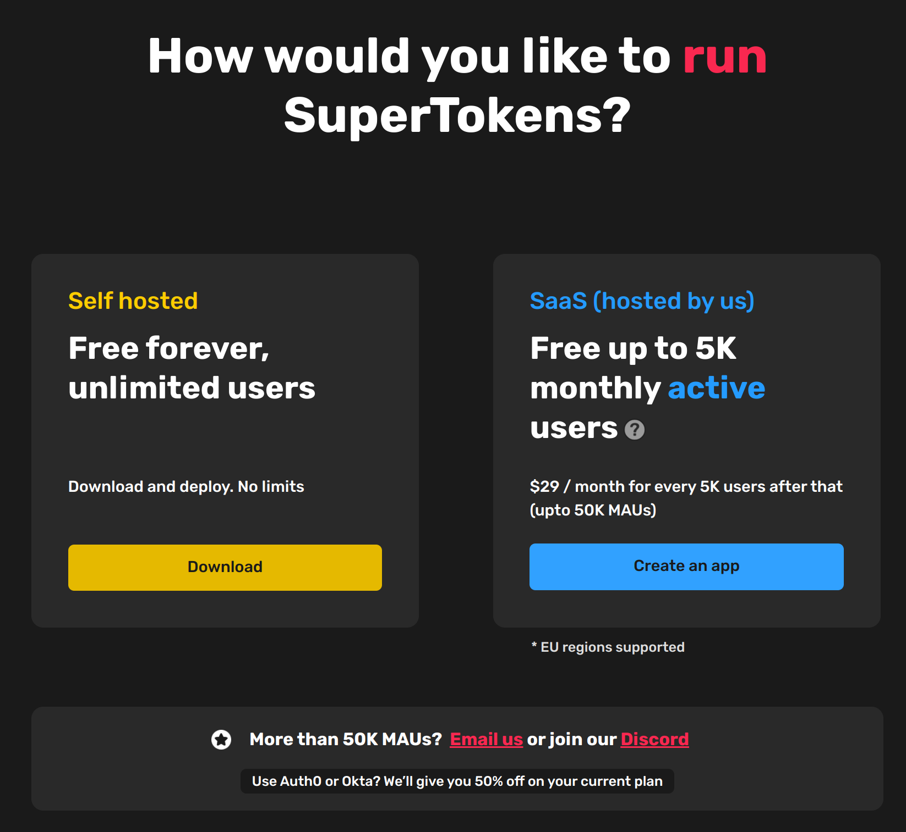

## Table Of Contents:
- [Introduction](#introduction)
- [Okta Pricing](#okta)
- [Auth0 Pricing](#auth0)
- [Amazon Cognito Pricing](#cognito)
- [SuperTokens](#supertokens)
- [Pricing Comparison Table](#pricing-comparison-table)
- [Conclusion](#conclusion)

## Introduction

Authentication providers share the same basic feature set - but differentiate themselves in architecture, product approach, extensibility, and pricing.

In a previous [post](https://supertokens.com/blog/auth0-alternatives-auth0-vs-okta-vs-cognito-vs-supertokens), we compared how some of these providers stack up against each other features wise but in today’s post, we are going to compare how they price their offerings.

## Okta Pricing

### What is Okta?
With an emphasis on workforce identity solutions, Okta is a leader in the enterprise authentication space, offering [identity products](https://www.okta.com/pricing/#workforce-identity-pricing) to secure employees and business resources within an organization.

After [acquiring Auth0 in 2021](https://supertokens.com/blog/the-real-reason-okta-spent-on-auth0), Okta now has a strong foothold in customer identity and has deprecated its own customer identity offering in favor of Auth0's. Hence its customer identity pricing is the same as Auth0’s.

Since it offers Auth0 products as the default customer identity solution, we’ll look at Auth0’s pricing. 

## Auth0 Pricing

### What is Auth0?
Auth0 is an authentication and authorization software as a service platform. It started in 2013 as an identity management service to allow developers to easily connect their apps to enterprise and social providers.

Over the years they have scaled their services, achieved compliance certifications, and added more features. 

### Pricing

Auth0’s offerings can be broadly categorized into their free and paid plans.

#### Free Plan
- Auth0’s free plan allows having up to 7000 MAUs and up to 2 social connections and 3 Actions, Rules, and hooks.
- This tier is ideal for testing out Auth0 or for personal projects, but, with limitations on social connections and features like user roles and custom domains being behind a paywall, you are incentivized to move to the paid plans for more serious projects.

#### Paid Plans
Auth0 splits its paid plans into 2 sections based on whether your app is “B2C” or “B2B”. , Each use case has it's own Essential, Professional, and Enterprise tiers. In both cases, the Enterprise tier has fully custom pricing.

**Use Case 1: Business to Consumer**

> **Note**: Both the Essential and Professional tiers allow for up to 10,000 monthly active users. If you cross these thresholds you will be asked to move to the Enterprise tier.

- **Essential:**
  - The essential plan allows for unlimited social connections, custom domains, and user role management. You also get 2 more Actions, Rules and Hooks.
  - Pricing starts at $23/month for 1,000 users and scales to $228/month for 10,000 users.

- **Professional:**
  - The professional plan adds multifactor authentication, admin roles, the ability to connect an external database, and additional action, rules, and hooks.
  - Pricing starts at $240/month for 1,000 and scales to $1,500/month

- **Enterprise:**
  - The Enterprise plan has 99.99% SLA & Enterprise Support and advanced cloud deployment options. This tier also allows private deployments.
  - Enterprise pricing is completely custom and requires you to talk with an Auth0 sales representative. From our research, it seems enterprise plans start at $30,000 / year ($2,500 / month) but scales to 6 and 7 figures as well.

  

**Use Case 2: Business to Business**

> **Note**: Both the Essential and Professional tiers allow for up to 10,000 monthly active users. If you cross these thresholds you will be asked to move to the Enterprise tier.

**Essential:**
- The essential plan offers enterprise connections, multi-factor authentication, user role management, and organizations.
- Pricing starts at $130/month for 500 users and scales to $1,420/month for 7,000 users.

**Professional:**
- The professional plan allows you to connect your database and increases the number of organizations and the actions, rules, and hooks.
- Pricing starts at $800/month for 500 users and scales to $1,800/month for 7,000 users.

**Enterprise:**
- The Enterprise plan has 99.99% SLA & Enterprise Support and advanced cloud deployment options. This tier also allows private deployments.
- It removes restrictions on the number of Monthly Active Users.
- Enterprise pricing is completely custom and requires you to talk with an Auth0 sales representative. From our research, it seems enterprise plans start at $30,000 / year ($2,500 / month) but scales to 6 and 7 figures as well.

**Should you use Auth0?**

- Integrating with Auth0 is easy. They support a large number of frameworks and have dedicated guides explaining their features, but, their pricing does not scale well.
- Since the Okta acquisition, Auth0 has restructured its features and pricing forcing some users into the enterprise tier. This could result in them paying up to 4 times more for features they do not need. 
- Enterprise pricing is also non-existent on their website. Users are required to get on a sales call to discuss pricing in this tier. This increases the difficulty of evaluating Auth0 for your company.
- Auth0 does offer a plan for startups. For a year they will provide the entire platform for free but will revert to the default pricing model once the startup plan expires.

## AWS Cognito Pricing

### What is AWS Cognito?

Cognito is a service that provides authentication, authorization, and user management for web and mobile apps. It is part of the AWS suite of products and can be used easily with any of their other offerings such as Lambda.

### Pricing
Cognito’s free tier offers up to **50,000** MAUs for free. Included are the Identity pool features which cover access control and RBAC.

**Free:**
- User pools free for up to 50,000 MAUs
- 50 MAUs for SAML / OIDC
- Identity pools (Access control, RBAC, etc)

**Paid Features:**
Cognito offers pricing tiers for additional MAUs and users with SAML/OIDC connections. They also offer advanced security features like compromised credential protection, risk-based adaptive authentication, and monitoring.

- Pricing tiers for additional MAUs:

- Additional SAML/OIDC users:
  - **$0.015** per MAU after the first **50** in the free tier
- Pricing tiers for advanced security features : 

- SMS charges for multi-factor: 
  - Inbound charges:
  
  - Outbound charges:
  

**Should you use Cognito?**
- Cognito’s free tier and integration with other AWS services position it as a great auth provider, but it does not provide the best developer experience.
- As seen in this [post](https://theburningmonk.com/2021/03/the-case-for-and-against-amazon-cognito/),  users have complained about the documentation being confusing at times, and features, like account linking being underdeveloped or missing in the case of exporting password hashes.
- There have also been complaints about Cognito being slow to respond to bugs and feedback. For example, [this issue](https://github.com/aws-amplify/amplify-js/issues/987) was breaking the flow for many users and was open for 4 years before it was resolved with the help of a community member.

## SuperTokens Pricing

### What is SuperTokens?
SuperTokens is an open-source authentication solution that provides a managed service for hassle-free auth and an on-prem solution so developers can manage their data.

### Pricing
At the time of writing this article, the SuperTokens feature set is completely free. If you decide to use the self-hosted version you can download the core and use it for free for an unlimited number of users.

- #### Self-Hosted:
  - Free forever for unlimited users.

- #### Managed Service:
  - Free for the first **5000 MAUs** .
  - Free for the first **5000 MAUs**.
  - **2 cents / MAU** post the first **5000 MAUs**.

### Should you use SuperTokens?

SuperToken’s feature set and pricing make it a great choice for startups and mid-level businesses, but it may not be the best fit for large organizations that require enterprise features.

## Pricing Comparison Table

|  	| Free 	| Starter 	| Enterprise 	|
|---	|---	|---	|---	|
| Auth0 	| Under 7000MAUs 	| B2B:  Essential: $228/mo @10,000 users    Professionnal: $1,500/mo @10,000 users   B2C:  Essential: $1,420/mo @7,000 users   Professional: $1,800/mo @7,000   	| $2,500/ mo More than 3 enterprise connections. 	|
| Okta 	| (Same as Auth0) 	| (Same as Auth0) 	| (Same as Auth0) 	|
| Cognito 	| Under 50,000 MAUs  Under 50 MAUs for SAML/OIDC  	| $0.00055/MAU post 50,000 users $0.05/MAU post 50,000 users for additional security features 	| N/A 	|
| SuperTokens 	| Managed Service: Free up to 5000 MAUs 	| 2 cents/MAU post the first 5000 MAUs 	| N/A 	|

## Conclusion:
So what authentication provider do you go with? Well in the end it depends on your budget.
- Auth0 has the features most people need but their pricing scales very quickly which could result in you having to migrate to another solution.
- AWS Cognito’s generous free tier and tight integration with other AWS services make it a great option if you can deal with the missing features and sub-par documentation.
- SuperTokens is ideal for startups to mid-level organizations looking for an open-source solution that can grow with their organization which is reflected in their pricing. They might not be the best choice for enterprises though since they lack some enterprise features like SCIM provisioning, admin, and organization support.
You can learn more about how the features of these providers stack up against each other in this [post](https://supertokens.com/blog/auth0-alternatives-auth0-vs-okta-vs-cognito-vs-supertokens).