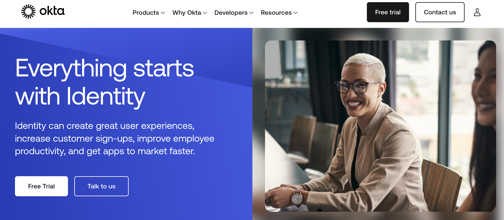
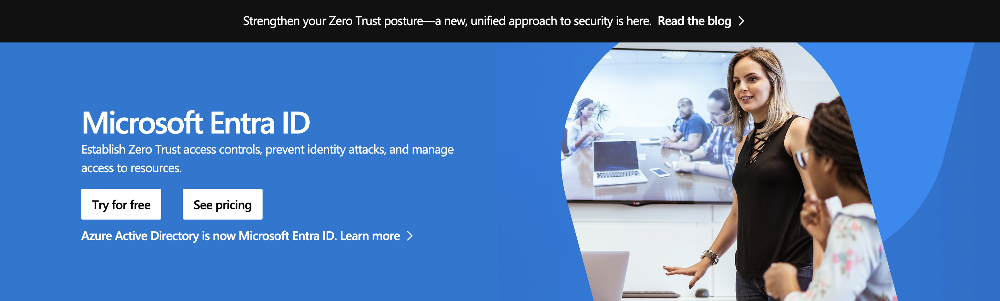

## The Battle of Identity Providers 🤺

Security is a crucial part of any business. When securing your company resources, one of the decisions you will need to make is to choose an Identity and Access Management (IAM) solution. 

Let’s meet our two contenders for today!

In the blue corner, we have Okta &mdash; the cloud-native security expert. And in the red corner, Azure AD &mdash; the heavyweight champion of enterprises. Who will emerge victorious in the IAM battle royale? Let’s find out!

### Why Identity and Access Management (IAM) is Critical for Businesses Today
IAM makes sure that only the right people, machines, and apps have access to the right resources from your company at the right time. 

Cyberattacks often target compromised user credentials, making IAM a vital layer of protection. With IAM, you can:

- Verify and authenticate users securely.
- Track and manage user access.
- Automate user provisioning and de-provisioning to reduce security risks.

If you want to learn more about the benefits of IAM for your business' security, we've written a more in-depth article on this topic: [**8 Benefits of Identity and Access Management (IAM) for Security**](https://supertokens.com/blog/8-benefits-of-identity-and-access-management-for-security).

### Quick Intro to Okta and Azure AD &mdash; Two of the Biggest Players in the IAM Space

Let's get into a little introduction about the two giants in the IAM space &mdash; Okta and Azure AD (Microsoft Entra ID)

We’ll use both names &mdash; Azure AD and Microsoft Entra ID &mdash; throughout this article. Microsoft is still transitioning to the new name, and we want to clarify that they refer to the same product.

### Okta: The Cloud IAM Wizard 🧙‍♂️

[**Okta**](https://www.okta.com/) is a San Francisco-based company that makes cloud software to help businesses manage and protect user logins. It was founded in 2009 and became a public company in 2017. Okta is comprised of Okta Platform and Auth0 Platform. 

In this guide we are going over Okta Platform which is Okta's IAM solution for secure authentication of your employees, contractors, and partners. 

**The Key Features of Okta Platform:**
- **Single Sign On** &mdash; One username, one password, and you’re in! Employees can access everything they need from one handy dashboard, no matter what device they’re using.
- **Adaptive Multi-Factor Authentication** &mdash; Extra security that’s smart. Depending on things like where you’re logging in from, it might ask for a second step — like confirming on your phone or scanning your fingerprint.
- **Identity Governance** &mdash; Think of this as organized access control. It makes sure people only get access to what they actually need — and keeps track of it all for security peace of mind.
- **Privileged Access** &mdash; Some accounts need extra protection. Protects your most sensitive accounts by giving higher-level controls to admins and limiting access to critical systems.
- **Identity Threat Protection** &mdash; Detects suspicious activity, like unusual login attempts, and takes steps to block threats before they cause harm.
- **Lifecycle Management** &mdash; Automates user account creation and removal, so when employees join, switch roles, or leave, their access updates automatically.
- **Extensive App Integrations** &mdash; Connects seamlessly with over 7,000 pre-built app integrations, making it easy to link Okta with the tools your team already uses.

#### Pros and Cons of Okta 

| **Pros**                         | **Cons**                        |
|:----------------------------------|:--------------------------------|
| ✅ Works with any tech stack       | ❌ Can get pricey as you scale    |
| ✅ Tons of app integrations        | ❌ Limited on-premises support     |
| ✅ Great for businesses of all sizes |                                 |

### Azure AD: The Microsoft Identity Fortress 🏰

[**Microsoft Entra ID**](https://www.microsoft.com/en-us/security/business/identity-access/microsoft-entra-id) &mdash; previously called Azure Active Directory (Azure AD) &mdash; is Microsoft's IAM product built to help you manage and protect identities across both cloud and on-premises environments. It’s tightly integrated with Azure, Office 365, and Windows, making it a natural fit for businesses already using Microsoft services.

**The Key Features of Microsoft Entra ID (Azure AD):**
- **Single Sign-On (SSO) and Conditional Access** &mdash; Users can sign in once to securely access Microsoft 365 and other connected apps. Conditional Access adds extra security by requiring things like MFA or location checks when needed.

- **Azure Multi-Factor Authentication (MFA)** &mdash; Strengthens security by asking for additional verification, such as a phone notification or biometric scan, especially when logging in from unfamiliar devices or locations.

- **Privileged Identity Management (PIM)** &mdash; Some accounts need extra protection. Provides additional safeguards for sensitive accounts by granting higher-level controls to administrators and limiting access to critical systems

- **Hybrid Identity Support** &mdash; Supports hybrid identity by bridging cloud and on-premises environments, allowing integration with existing Active Directory setups.

#### Pros and Cons of Microsoft Entra ID (Azure AD)

| **Pros**                                   | **Cons**                                        |
|:--------------------------------------------|:-------------------------------------------------|
| ✅ Perfect for Microsoft-heavy environments | ❌ Less flexible for multi-cloud setups            |
| ✅ Built-in security tools (Defender, Intune, etc.) | ❌ Not as developer-friendly for third-party integrations |
| ✅ Strong on-prem and hybrid cloud support  |                                                   |

## Okta vs Azure AD – The IAM Showdown 🥊

| **Category**            | **Okta** 🚀                                         | **Azure AD** 🏢                                    |
|:------------------------|:-----------------------------------------------------|:----------------------------------------------------|
| **Security & Authentication** 🔒 | Strong in adaptive authentication and AI-driven security | Ideal for enterprises with built-in Microsoft Defender integration |
| **Integration & Ecosystem** 🔗 | Excels with 7,000+ third-party integrations (Google, AWS, Salesforce, etc.) | Best suited for Microsoft environments (Azure, Office 365) |
| **Pricing & Scalability** 💰 | While Okta's per-user pricing can become expensive at scale, it offers a highly tailored IAM solution. | Often bundled with Microsoft 365, making it cost-effective for existing Microsoft users |

### Best Use Cases
- **Use Okta if:** You need a cloud-agnostic IAM solution with deep third-party integrations.
- **Use Microsoft Entra ID (Azure AD) if:** Your business is heavily invested in Microsoft services and Windows infrastructure.

## SuperTokens &mdash; The Open-Source Alternative

### Why Consider SuperTokens?
SuperTokens is an open-source, developer-friendly solution for managing user authentication. Unlike services like Okta or Azure AD, SuperTokens gives you complete control by allowing you to self-host it on your own infrastructure. Here’s why it’s worth considering:

#### 🛠️ Open-Source and Developer-Friendly
SuperTokens is built with developers in mind. Its lightweight design makes it easy to integrate, customize, and maintain. Plus, since it's open-source, you can inspect the code, contribute to improvements, and avoid unexpected costs.

#### 🔓 No Vendor Lock-In
With SuperTokens, you're not tied to a specific provider. You can design your own authentication flows, customize the user experience, and adapt it to your project’s unique needs &mdash; all without relying on a third-party platform.

#### 🛡️ Greater Control Over Security & Sessions
SuperTokens offers more flexibility when it comes to managing security and user sessions. Because you control the hosting, you can fine-tune security settings, session lifetimes, and data storage to align with your company’s policies.

If you’re looking for an affordable, flexible alternative to traditional IAM providers, SuperTokens could be the right fit. You can also explore other open-source alternative in our guide &mdash; [**Top Open Source Identity Management Systems**](https://supertokens.com/blog/open-source-identity-management)

## Final Verdict – Which IAM Solution Should You Choose?
Choosing the right identity and access management (IAM) solution depends on your company's needs:

**🏢 For Microsoft-heavy enterprises:** Azure AD is the clear winner. Its deep integration with Microsoft 365, Azure, and Windows makes it a seamless choice for businesses already invested in Microsoft’s ecosystem.

**🌐 For flexible, multi-cloud authentication:** Okta shines here. With over 7,000 integrations and strong adaptive security features, it’s ideal for businesses that rely on a variety of tools and platforms.

**🛠️ For a lightweight, open-source option:** SuperTokens is the best alternative. It’s perfect for developers who want full control over their authentication flows without being tied to a vendor.