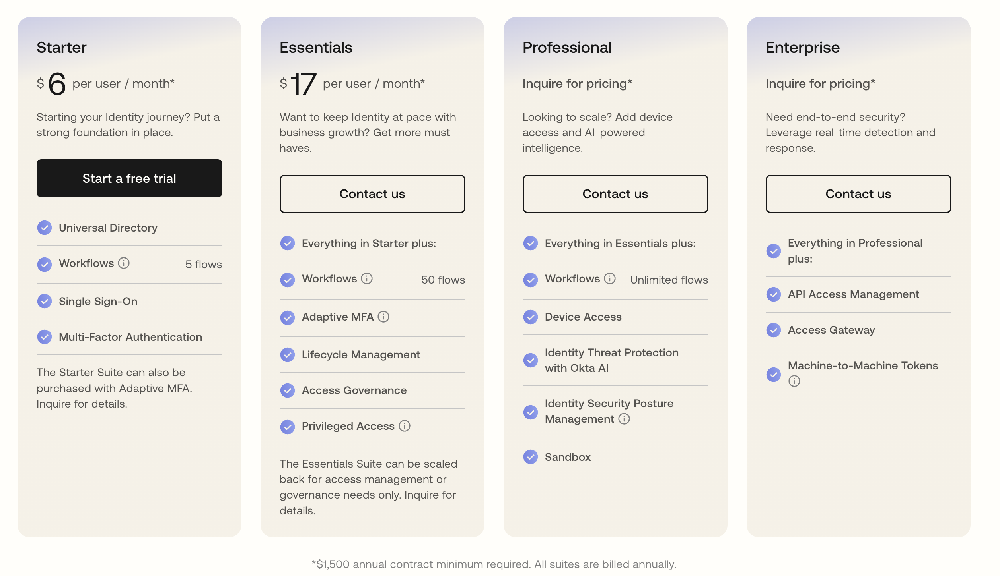
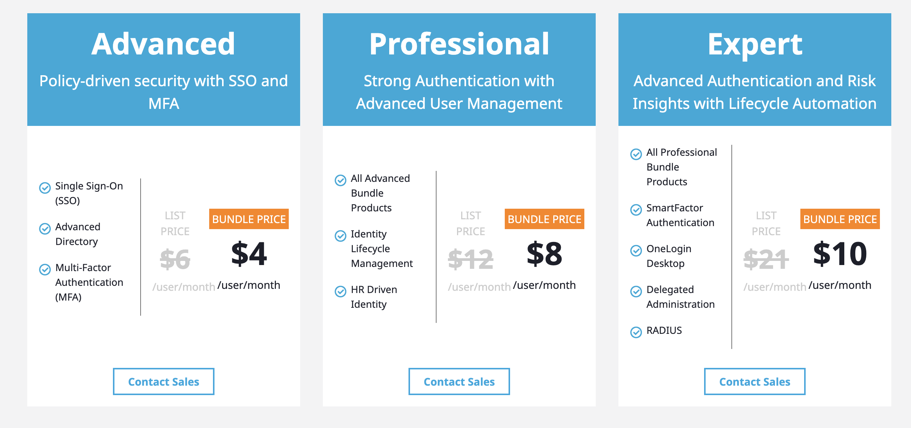

When it comes to managing user access and authentication, [**Okta**](https://www.okta.com/workforce-identity/) and [**OneLogin**](https://www.onelogin.com/product) are two major players in the game. 🎮

But which one is the right fit for your organization? 

In this guide, we’ll compare both side by side, exploring their key features, price structure, and differences. By the end, you’ll have a clear picture of what each platform brings to the table — and which one might be your ideal match. ❤️

Both solutions provide the basics of what you would need, so at the end of the day your pick should depend on which one has a feature you absolutely need to have. 

```toc
tight: true
toHeading: 3
```

## Introduction to Identity and Access Management 🔐

**Identity and Access Management (IAM)** is a framework of tools, policies, and processes that ensures the right people have access to the right resources at the right time — and that unauthorized users are kept out.

At its core, IAM is about managing digital identities and controlling who can do what within your systems and data. It covers everything from confirming a user's identity (**authentication**) to determining their permissions (**authorization**).

### Key Components of IAM ⚙️
IAM is built on several core components that work together to manage identities and control access:
- 🔑 **Authentication:** Verifies a user's identity using by credentials like passwords, biometrics, or MFA.
- 🛂 **Authorization:** Determines what resources a verified user can access.
- 👥 **User Management:** Manages user identities, roles, and groups across systems.
- 🔗 **Single Sign-On (SSO):** Allows users to log in once and access multiple systems without re-authenticating.
- 🛡️ **Privileged Access Management (PAM):** Adds extra security for accounts with elevated privileges.
- 📊 **Audit and Reporting:** Tracks user activities and logs them to support compliance and security policies.

Together, these components help organizations maintain security, improve efficiency, and reduce risks.

### How IAM Works 🏗️
IAM relies on the following mix of technologies and protocols to manage identities and enforce access controls effectively:
- 📝 **User Enrollment:** Users are registered, often with verified credentials like government-issued IDs or company records.
- 🔒 **Credential Storage:** Credentials are securely stored, often encrypted, to prevent breaches.
- 📋 **Access Policies:** Organizations define rules that control who can access what resources under specific conditions.
- 🧩 **Authentication Mechanisms:** Systems verify identities by using methods like MFA (Multi-Factor Authentication), biometrics, or token-based authentication.
- 📂 **Access Provisioning:** After authentication, users are granted appropriate permissions based on their role or access level
- 👀 **Monitoring and Revocation:** User activity is monitored to ensure appropriate access, with permissions adjusted or revoked as needed.

By combining these elements, IAM helps organizations manage security, streamline access, and reduce risk.

For a deeper dive into how IAM operates, check out our article: [**How Identity and Access Management Works: Detailed Guide**](https://supertokens.com/blog/identity-and-access-management). It breaks down each component in detail, helping you understand how IAM solutions keep your systems secure and efficient.

## Overview of Okta 
- **Company Background:** Okta is an American cloud-based IAM company based in San Francisco. It was founded in 2009 and [**IPOed in 2017, showing a drastic shift in entirely cloud-based SaaS companies**](https://techcrunch.com/2017/03/14/okta-filed-its-s-1-and-youll-never-guess-what-happened-next/). 
- **Core Features:** 
    - **Single Sign-On (SSO):** Unified access to multiple applications with one set of credentials.
    - **Multi-Factor Authentication (MFA):** Enhanced security through additional verification methods.
    - **Lifecycle Management:** Automated user provisioning and deprovisioning.
    - **Adaptive Security Policies:** Contextual access management based on user behavior and risk factors.
    - **Integration Network:** Access to a vast array of pre-built integrations with various applications and services.

## Overview of OneLogin
- **Company Background:** OneLogin is also a cloud-based IAM provider. It's developed for enterprise level businesses. OneLogin officially launched in 2010. In October 4, 2021, OneLogin was acquired by One Identity. 

- **Core Features:**
    - **Single Sign-On (SSO):** Streamlined access to applications with a single login.
    - **Multi-Factor Authentication (MFA):** Strengthened security with multiple authentication factors.
    - **SmartFactor Authentication:** AI-driven authentication that adapts to user behavior.
    - **Unified Directory:** Centralized user directory that integrates with various data sources.
    - **Integration Network:** Extensive catalog of pre-built integrations with popular applications.

## Market Overview of Okta and OneLogin 🌍
**Okta and OneLogin are both leading providers in the cloud-based IAM space.** 

Both companies were founded in 2009 in San Francisco. As of now, OneLogin reports having more than **5,500 customers**, while Okta serves more than **19,300 customers**.

Both companies target mid- to enterprise-level businesses, with Okta focusing more on enterprise-level solutions.

## Feature Comparison: Okta vs OneLogin

Both Okta and OneLogin offer a solid set of features for identity and access management, but there are some differences: 
- **Okta:** Provides a wide range of features like Single Sign-On (SSO), Multi-Factor Authentication (MFA), Lifecycle Management, and Adaptive Security Policies. However, some advanced features — like Identity Threat Protection — are only available in higher-tier plans.
- **OneLogin:** Offers similar core features, including SSO, MFA, and Lifecycle Management. One standout feature is **SmartFactor Authentication**, which uses AI to assess risk in real-time and adapt security measures accordingly.

**While both platforms cover the basics well, Okta leans heavily on modular add-ons, while OneLogin provides some advanced features at lower price points.**

### User Experience
Both Okta and OneLogin offer intuitive and user-friendly experiences.  
- **Okta** stands out with its **End-User Dashboard** and **Browser Plugin**, which boost productivity with **customizable layouts**, **enhanced search**, and **onboarding guides**.  

- **OneLogin** shines with its **custom branding** options, seamless **directory integration**, and **mobile SSO** for secure access on the go.  

### Integration Capabilities

Both Okta and OneLogin provide extensive pre-built integrations. Based on their websites, **Okta provides more than 7,000** and **OneLogin provides more than 6,000** pre-built integrations. Both provide integrations for all the major technologies your company may use, so you wouldn't go wrong with either choice if integration choices are your concern. 

### Security Measures
**Both Okta and OneLogin offer strong security features, but they take slightly different approaches:**

- **Okta** uses **adaptive security policies** and [**AI-driven risk assessment**](https://help.okta.com/oie/en-us/content/topics/itp/overview.htm) to detect and respond to potential threats in real-time. 
- **OneLogin** relies on [**SmartFactor Authentication**](https://www.onelogin.com/product/smartfactor-authentication) and **role-based access control** to ensure users only access what they’re supposed to.

Both provide solid protection, but the right choice may depend on your team's specific security needs.

### Pricing Structure

**Disclaimer:** The pricing information provided in this article is accurate as of the date of publication. Prices and plan details may change over time, so we recommend checking the official websites of Okta and OneLogin for the most up-to-date information.

***
#### Okta Pricing


[**Okta’s pricing**](https://www.okta.com/pricing/) is based on a **per-user model with extra costs for additional features** — and those costs can add up fast. Their IAM platform has four pricing tiers: **Starter**, **Essentials**, **Professional**, and **Enterprise**.
- The **Starter plan** is the most affordable at **$6 per user/month**. It includes basics like Universal Directory, Single Sign-On (SSO), Multi-Factor Authentication (MFA), and up to five Workflows.
- If you need features like Adaptive MFA, Lifecycle Management, Access Governance, or Privileged Access, you’ll be looking at **$17 per user/month.**
- For anything beyond that, you’ll need to reach out to Okta for pricing.

**Regarding which one you choose, all plans are billed annually, so it would potentially require a substantial upfront cost.**

We have an article that further breaks down Okta's pricing for each feature if you are interested in checking it out -- [**Okta Pricing: The Complete Guide**](https://supertokens.com/blog/okta-pricing-the-complete-guide)

**Lastly, all plans require a minimum annual contract of $1,500, which could be a hurdle for smaller teams or companies just getting started, but seem fair and doable for larger or enterprise companies.**

***

#### OneLogin Pricing


[**OneLogin’s pricing**](https://www.onelogin.com/product/pricing) also follows a **per-user model** with feature-based tiers, and it’s often seen as more budget-friendly than some competitors. OneLogin offers three main plans: **Starter**, **Advanced**, and **Professional**.
- The **Starter plan** begins at **$4 per user/month** and includes essentials like Single Sign-On (SSO), Multi-Factor Authentication (MFA), and basic reporting.
- For more **advanced security features** like Adaptive MFA, SmartFactor Authentication, and policy enforcement, you'll need the Advanced plan, which starts at **$8 per user/month**.
- The **Professional plan** offers enhanced capabilities like Lifecycle Management and advanced reporting, but **pricing requires contacting OneLogin directly**.

Similar to Okta, all OneLogin plans are billed annually, which may require a larger upfront investment.

**Unlike Okta, OneLogin doesn’t have a mandatory minimum contract, which may make it a better fit for smaller teams or those exploring IAM solutions for the first time.**

## Real-World Insights and User Experience 🌍
- **Okta:**
    - **Market Position:** Recognized as a leader in the IAM space, often considered the "800 lb gorilla" 🦍 due to its extensive integrations and established reputation. 
    - **User Feedback:** Some user express concerns about pricing, noting that while the product is robust, costs can escalate with additional features. 
- **OneLogin:** 
    - **Agility and Support:** Valued for its flexibility and responsive support, with users highlighting its cost-effectiveness and ease of deployment. 💰 
    - **User Feedback:** Some users have reported downtime issues in the past, though improvements have been noted with infrastructure upgrades.

## What is the Difference Between Okta and OneLogin? 🤔

| **Feature**                              | **Okta**                                                        | **OneLogin**                                                   |
|------------------------------------------|-----------------------------------------------------------------|---------------------------------------------------------------|
| **Key Differentiators**                  | Broader, integrated IAM suite with more features                | Focuses specifically on core access management                |
| **AI & Security**                        | Already has Identity Threat Protection, with more AI features coming soon. Features like Universal Logout will help mitigate risks by logging users out of compromised sessions. 🔐 | AI-based adaptive authentication adjusts security based on user behavior |
| **IAM Tools**                            | Comprehensive set of IAM tools                                  | Focuses on core access management                             |
| **Integration Options**                  | Offers a larger number of pre-built connectors 🔌                | Offers various integration options, but fewer than Okta       |
| **Setup Time**                           | Quicker setup, ideal for fast deployment                        | Longer deployment due to a more complex feature set           |
| **Interface**                            | Simple and easy-to-use, non-technical users can manage easily   | More complex interface, suited for tech-savvy administrators  |
| **Pricing**                              | Generally higher, depending on the scale and features           | Competitive pricing, especially for smaller businesses 💲     |
| **Advanced Security**                    | Adaptive MFA                                      | SmartFactor Authentication uses machine learning for enhanced security 🔐 |


## How SuperTokens Enhances IAM Solutions 🔑
If you’re looking for a more affordable option than Okta or OneLogin, you might want to start with a smaller plan from these IAM providers and use open-source tools like SuperTokens to meet your needs.

This can save you a lot of money, especially if you want extra security features like **bot detection** and **session hijacking protection**, which might cost more with other IAM providers.

SuperTokens is a flexible, open-source authentication solution that offers **customizable login** and **advanced session management** for better security. Since it's open-source, you can modify and extend features as needed, while easily integrating it with your existing systems for more control over your IAM setup.

## Final Thoughts
Choosing between Okta and OneLogin depends on what your organization needs. 
- **Okta** offers a wide range of features and security tools, making it a great choice for large companies that need a lot of different IAM options. It’s ideal for businesses that can invest in a more complex, feature-packed solution. 🚀
- **OneLogin** is more affordable and works well for smaller businesses or those looking for a simpler solution. It provides strong security with features like SmartFactor Authentication, making it a good option if you're on a budget but still need solid protection. 💡

Both Okta and OneLogin are good choices for managing user access and security. The right option for you depends on your priorities, like pricing, ease of use, and the features you need.


