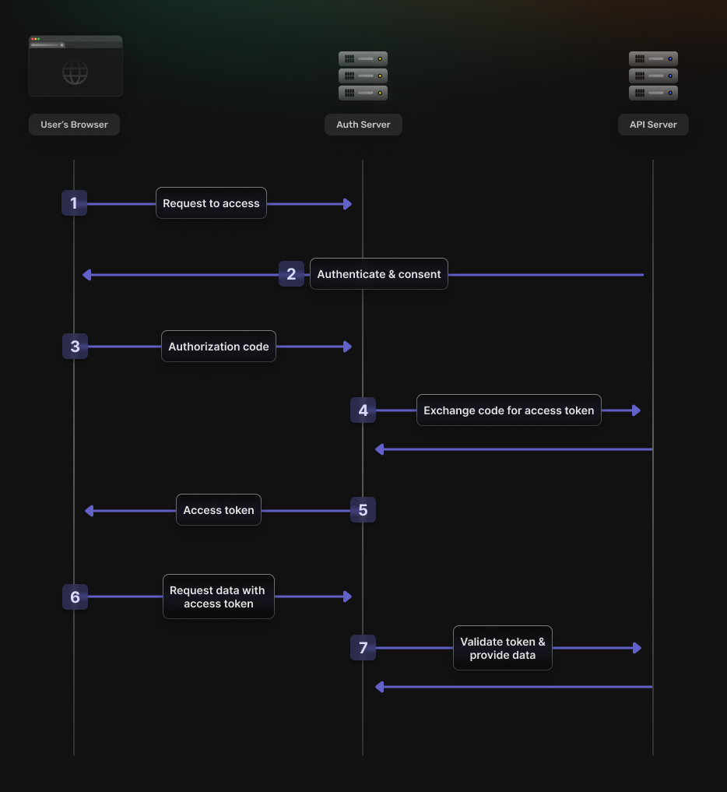
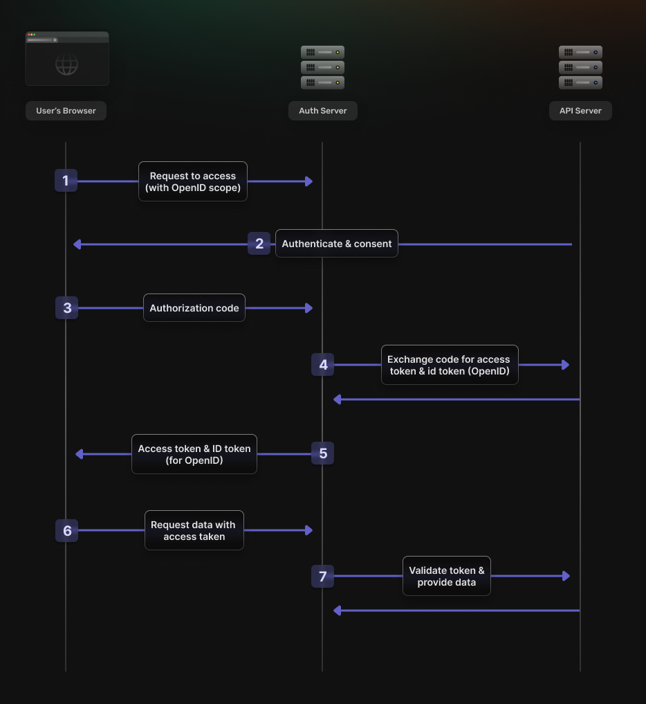

## Introduction

As developers, we can agree that authentication (and authorization) are a cornerstone of most modern software. It's pretty hard to imagine the Facebooks and Googles of the world without being able to confirm who you are as a user of that service (authentication) and what data that service is able to access (authorization).
That said, the underlying standards that drive the concepts of authentication and authorization are often misunderstood and confusing. In this piece, we'll try to demystify those concepts and the accepted standards embodying them—OpenID Connect and OAuth 2.

## What's OAuth 2.0?

At its core, [OAuth2](https://oauth.net/2/) is an authorization framework that has become the industry standard for authorizing third-party access to user information on a service without sharing their user credentials themselves (most commonly, passwords).

It revolves around the concept of granting permissions or "tokens" to third-party applications, allowing delegated authorization. These tokens provide limited access to the user's data, ensuring that the user's credentials remain safe and that their information is only accessed as per their explicit consent.

OAuth 2.0 builds upon the original [OAuth framework](https://www.oauth.com/oauth2-servers/differences-between-oauth-1-2/), focusing on enhanced security, flexibility, and ease of use for developers and users. Recognizing the limitations and complexities of the process flows in the first version, OAuth 2.0 introduces more streamlined flows tailored to different application types, from web and mobile applications to desktop and even IoT devices.

*Concept 1 - Authorization in OAuth*: "Authorization" in the context of OAuth2 refers to the process by which a user grants a third-party application the ability to access their information or perform actions on their behalf on another protected resource or server without divulging their log-in credentials (such as a username and password).

To give this concept a practical angle, the consent screens that you see when trying to log in via some third-party apps, e.g., Google, is a UI equivalent that maps to OAuth2. For instance, when a user logs in to a third-party service via Google, they might allow the service access to their photos but not to their email or contacts.

Looking under the hood into the code, we can see that OAuth2 governs things like access tokens and scopes.

## What's OpenID Connect?

[OpenID Connect](https://openid.net/developers/how-connect-works/) is an open standard authentication protocol built on top of the OAuth 2.0 authorization framework. It allows developers to authenticate users across websites mobile apps and applications without needing to own and manage password credentials. Apart from being OAuth2 compliant Google is also an OpenID provider.

The OpenID Connect has two flows.
- Implicit flow
- Authorization code flow

Both are based on OAuth2, but also return an ID token(which is a JSON Web Token) along with an access token, now enabling both authentication and authorization. You can learn more about

In essence, OpenID Connect provides an additional identity layer on top of OAuth 2.0, enabling clients (websites or applications) to verify the identity of a user.

Where OAuth 2.0 governs access to your data, OpenID establishes your identity based on the access granted by OAuth 2.0.

Expanding on the consent screen example, let's clarify the distinct but complementary roles of OpenID Connect and OAuth 2.0. Imagine you're using a service that asks you to log in via your Google account—a common scenario on many websites. Here's what happens behind the scenes:

1. **User's Action:** You click on 'Log in with Google' (or Facebook, GitHub ...).
2. **OpenID Connect's Role:** At this point, OpenID Connect steps in to authenticate your identity. It's responsible for the 'log-in' part, ensuring that you are indeed who you claim to be. It does this by directing you to the Google sign-in page, where you securely enter your Google credentials.
3. **Authentication Confirmation:** Once your identity is verified by Google, OpenID Connect issues an ID Token. This token is proof of your authenticated status, securely indicating to the service that you are the user you claim to be.
4. **OAuth 2.0's Role Begins:** With your identity confirmed, the service now knows 'who' you are, thanks to OpenID Connect. It's here that OAuth 2.0 comes into play, transitioning from 'who you are' to 'what permissions you grant'. The service presents a consent screen, detailing the access it requires to your Google data—like viewing your email or accessing your Google Drive.
5. **User Grants Permission:** You review the requested permissions and decide to grant the third-party service access to the specified resources in your Google account.

In essence, OpenID Connect and OAuth 2.0 work in tandem—OpenID Connect verifies your identity, your client credentials while OAuth 2.0 manages the permissions you grant for accessing your data.

*Concept 2 - Authentication:* "Authentication" is the process by which an application confirms a user's identity to ensure they are who they claim to be. This is typically achieved by challenging the user to prove their identity, often through a username and password, biometrics, or other verification methods.

In OpenID Connect, authentication is facilitated through an ID Token, issued after the user logs in with an Identity Provider (IdP). This token contains claims about the user's identity, which the application can then use to confirm that the user is indeed who they say they are, without the application needing to manage or store the user's login credentials directly.

## The differences between OpenID Connect and OAuth

While OAuth 2.0 and OpenID Connect are closely related and often used together, they serve different purposes and address different needs in security and access management. Recognizing the distinctions between these two standards is crucial for implementing appropriate *authentication* (OpenID Connect) and *authorization* (OAuth) mechanisms in your applications.

While it's possible to shoehorn OAuth as an authentication mechanism, it comes with some unexpected security issues. As this [StackExchange post](https://security.stackexchange.com/questions/37818/why-use-openid-connect-instead-of-plain-oauth2) aptly puts it:

Relying on plain OAuth 2.0 for authentication is dangerous if you (the client) are just trusting ANY valid access token you receive that's associated with that user as a reliable indicator that you're receiving the request from the actual user without knowing whether that access token was generated by the user trying to log into your site or if it was generated by the user logging into some other (malicious) website/app.
With OpenID Connect, you can just look inside the JWT ID token provided by incoming requests and see if that token was generated by the user logging into your app or if they were logging into some other web app.

This discussion ultimately ends up as Authentication vs. Authorization: If your application needs to request access to user data and authenticate the user's identity, OpenID Connect is the way to go. OAuth 2.0 alone does not provide mechanisms to authenticate users—it assumes that authentication is performed by the application itself or through another mechanism.

Understanding the differences between OpenID Connect and OAuth 2.0 is crucial for developers looking to implement secure access to resources and robust user authentication. While OAuth 2.0 lays the groundwork for secure user authorization only, OpenID Connect builds upon this foundation to provide a comprehensive authentication and identity layer. The choice between them depends on your application's specific needs - whether you require simple authorization or also need to authenticate user identities.

## How to choose between OpenID Connect and OAuth
When developing a web or mobile application, you might decide to integrate OpenID Connect or OAuth 2.0 to handle user identity and permissions. Although they work together harmoniously, recognizing when to use one over the other—or both—is crucial for creating a secure, efficient, and user-friendly web application.

### Identify the problem your application is trying to solve:

1. **Authentication (Who is this user?):** If the primary requirement is to authenticate the identity of your users - to know who is interacting with your application - you need OpenID Connect. It extends OAuth 2.0 by providing an authentication layer, which enables you to know the permissions and confirms the user's identity behind those permissions.

2. **Authorization (What can this user do?):** If your application needs to access a user's data from another service or perform actions on behalf of the user without necessarily authenticating their identity, OAuth 2.0 is sufficient. It allows your application to request specific access to resources from another service without getting access to the user’s credentials.

### Following that, consider the user experience:
1. **Single Sign-On (SSO):** If you aim to provide a seamless experience across multiple applications, allowing users to log in once and not have to authenticate again for access to other services, OpenID Connect is the preferred choice. It supports SSO by leveraging its authentication mechanism across different applications.

2. **Consent and Trust:** OAuth 2.0’s consent mechanism can be a critical factor in how users perceive your application's trustworthiness. Being clear about what permissions your application is requesting and ensuring you only ask for what’s necessary can improve user trust and compliance. OpenID Connect adds a layer of user authentication, which can further enhance trust by securely verifying user identity.

## Conclusion
Choosing between OpenID Connect and OAuth 2.0 should be based on the specific needs of your application and the problems its trying to solve. Whether it be client applications authenticating user identity with OpenID Connect or managing resource access with OAuth 2.0, the implementation of these standards is a critical step towards enhancing application security and user trust.

So, if you're looking for a way to *authenticate* your users, go with OpenID Connect. If you're looking for a robust way to manage a user's *authorization*, go with OAuth2. Ultimately, if your application needs it, you can use both.
