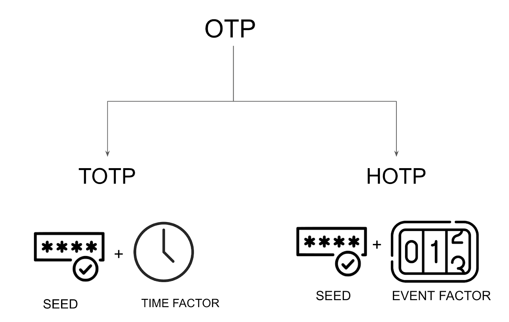
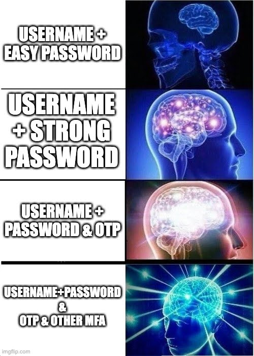

## Introduction

Traditional username and password authentication methods have historically served as the default choice for ensuring secure access. However, [nearly half (49%) of incidents](https://www.verizon.com/business/en-gb/resources/reports/dbir/) cited in Verizon's 2023 Data Breach Investigations Report involved compromised passwords.

A director of Identity Security at Microsoft wrote a post titled “[passwords don’t matter](https://techcommunity.microsoft.com/t5/microsoft-entra-blog/your-pa-word-doesn-t-matter/ba-p/731984)”, which states that regardless of a password’s strength, hackers will likely find new and evolved ways to either guess or intercept them. 

[Brute force attacks](https://en.wikipedia.org/wiki/Brute-force_attack) and [credential stuffing](https://en.wikipedia.org/wiki/Credential_stuffing) are just a few of the tactics that hackers use to illegally infiltrate systems and accounts. One-Time-Password (OTP) is one of  one of the methods to strengthen security against attacks

## Understanding Multi-factor authentication and OTP

[Multi-factor authentication (MFA)](https://supertokens.com/blog/benefits-of-multi-factor-authentication) is a security process that requires individuals to provide more than one method of identification from separate categories to verify their identity. 

This identification can come in various forms, such as: 
1. Something the user knows (like a password), 
2. Something they have (such as a security token or a mobile device),  
3. Something they are (biometric data like fingerprints or facial recognition).

This article explores One-Time Passwords (OTPs), an MFA method that falls under #2 i.e verification of access to a device. It discusses how various OTP methods can enhance the security of authentication systems, whether that’s users accessing SaaS apps, personal devices, or navigating internal company systems.

## One-Time-Passwords (OTP)

An OTP, short for One-Time Password, is a time-sensitive authentication code designed for a single-use or transactional authentication process. 

The primary distinction between traditional username and password authentication and OTP is that the traditional method is static, whereas OTP is dynamic. In OTP, the authentication server generates a unique code for a specific use or purpose, enhancing security by ensuring its validity is confined to a singular instance or intended transaction.

An OTP method consists of two different components which determine the type of OTP that is used: 

- `A seed`: a secret value or key that serves as a starting point for generating these one-time passwords. It's a confidential unique value stored securely by the authentication system.
- `A moving factor`: The moving factor is the element that changes with each OTP generation. It could be based on time (time-based OTPs) or on a counter that increments with each use (event-based OTPs). 

This dynamic “moving factor” is combined with the seed to create a unique and time-sensitive OTP for each authentication attempt; it adds extra protection by ensuring that the password is only valid for a short period or a specific use.

While the seed is almost always a dynamic set of numbers or letters, the moving factor is really what determines the type of OTP method to be used. In that regard, there are two different types of OTP methods, each with its own sets of advantages and common use cases: Time-Based OTP (TOTP) and Hash-Based OTP (HOTP).

While TOTP relies on the current time, HOTP relies on a counter value that increments with each use. Both methods enhance security by generating unique, one-time passwords that are challenging for attackers to predict or replicate.

Industry regulations like SOC 2 and HIPAA often emphasize the importance of implementing strong security controls, and MFA methods such as TOTP and HOTP align with these principles. Thankfully, adding an OTP layer to your applications is now easier than ever with solutions like the [SuperTokens OTP recipe](https://supertokens.com/docs/passwordless/custom-ui/login-otp).

## TOTP

TOTP stands for Time-Based One-Time Password. It is a type of algorithm used for generating one-time passwords for authentication. TOTP adds a time factor (the moving factor) to the generation of passwords, making them valid only for a short and predefined period. The process typically involves the following steps:

- The user device and the authentication server share a secret key. This key is unique to each user and is securely stored on both the server and the user's device.
- TOTP relies on time synchronization between the server and the user's device. Both devices need to have an accurate and synchronized clock.
- At any given time, the authenticator app on the user's device combines the secret key with the current time to generate a one-time password (OTP).
- The combination of the secret key and the current time is usually hashed using a cryptographic hash function (such as HMAC-SHA-1 or HMAC-SHA-256). The generated OTP (the seed) is then presented to the user, who enters it during the authentication process.
- Simultaneously, the server independently generates an OTP using the same secret key and current time.
- The server compares the OTP provided by the user with the one it generated. If the codes match within an acceptable time window, the authentication is successful.

This process ensures that the OTP is only valid for a short period (e.g., 30 seconds), adding an extra layer of security. Even if an attacker intercepts the OTP, it quickly becomes invalid, reducing the risk of unauthorized access.

### Drawbacks of TOTP
**Intercept attacks**:  TOTP uses a secret key in the client and server that makes it susceptible to interception by potential hackers. 

**Inconvenient UX**: The time-sensitive nature of TOTP can also pose an inconvenience if users fail to input the code within the designated time window, requiring users to make multiple requests.

**Device dependency**: Users are dependent on their mobile devices or other authenticator devices to generate TOTP. If the device is lost or unavailable, and backup codes weren’t saved, accessing accounts becomes impossible - unless there is a manual support process in place for account recovery.

## HOTP

HOTP stands for Hash Based OTP, It is another algorithmic method for generating one-time passwords used in authentication processes. Unlike TOTP which relies on a clock as a moving factor, HOTP relies on a counter value that increments with each use. This counter value, combined with a shared secret key, produces a unique and one-time authentication code. the HOTP generally works as follows:

- The authentication server maintains a counter value which increments with each authentication attempt, ensuring that each one-time password is unique.

- The authentication server and the user's device both maintain the same counter value and shared secret key. 

- The HMAC (Hash-based Message Authentication Code) function is employed, utilizing a cryptographic hash function such as HMAC-SHA-1 or HMAC-SHA-256. This function takes two inputs: the seed (secret key) and the counter value.

- The HMAC function combines the seed and the counter value, producing a hash output.

- The hash output is then processed to generate a dynamic and unique one-time password which is then presented to the user and verified against the password that the server has generated. 

- If successful, the server increments the counter value to make sure subsequent authentication attempts use unique passwords. 

### Drawbacks of HOTP

The inclusion of a moving factor (counter) in HOTP mitigates the risk of replay attacks, where intercepted passwords cannot be reused. However, unlike Time-Based One-Time Passwords (TOTP), HOTP is not time-sensitive. That lack of time constraints might expose it to certain vulnerabilities, such as if an intercepted password is used within the allowable window. 

## TOTP vs HOTP

When it comes to choosing an OTP method, many teams choose either one method or the other but it is not uncommon to use both. Many authenticator apps, such as Google Authenticator as an example, allow for both TOTP and HOTP. 

The decision between the two depends on whether you prioritize convenience over security and setup complexity. According to recent research, we’ve put together a comprehensive head-to-head comparison between these two approaches:

|                      | TOTP                                                                                                                         | HOTP                                                                                                                                                    |
|----------------------|------------------------------------------------------------------------------------------------------------------------------|---------------------------------------------------------------------------------------------------------------------------------------------------------|
| Generation mechanism | Relies on the current time to generate one-time passwords. Passwords change at regular intervals, typically every 30 seconds | Uses a counter value as the basis for generating one-time passwords. Each authentication attempt increments the counter.                                |
| Time dependency      | Time-sensitive. The generated password is only valid for a specific window, enhancing security.                              | Not time-sensitive. The validity of the password is not dependent on a specific time window but on the counter value.                                   |
| Convenience          | Less convenient for end-users as it requires users to input their codes within a short period.                               | More user friendly as generated code does not expire, therefore users have a longer window of time to complete their authentication.                    |
| Security             | Generally considered secure, especially with its time-sensitive nature, reducing the window for potential attacks.           | Also secure, but the lack of time sensitivity might expose it to certain vulnerabilities if intercepted passwords are used within the allowable window. |
| Support              | More commonly used and supported by apps such as Google authenticator, Microsoft authenticator and Authy.                    | Less commonly used. Is supported by hardware authenticators such as Yubico by Yubikey or apps such as Google authenticator.                             |
| Use cases            | Electronic payment systems, HR systems                                                                                       | This method is less popular than TOTP and is most commonly used in HR systems for user onboarding and secure employee authentication.                   |

At the end of the day, while TOTP presents a more secure option that is less susceptible to hacking attempts, both options rely on external factors that may be beyond one's control. This could include issues such as internet connectivity when using app-based authenticators, reliance on broadband connectivity for SMS authenticators, or the potential risk of misplacing a hardware authenticator. 

That is precisely why users should refrain from depending solely on these methods and, instead, consider incorporating additional or backup multi-factor authentication measures such as [knowledge-based authentication](https://en.wikipedia.org/wiki/Knowledge-based_authentication) with security questions as well as [biometric](https://www.thalesgroup.com/en/markets/digital-identity-and-security/government/inspired/biometrics) and [geolocation](https://en.wikipedia.org/wiki/Location-based_authentication) authentication whenever possible and needed.

## Conclusion
To sum things up, [Time-Based OTPs are more secure](https://stumejournals.com/journals/confsec/2021/4/131.full.pdf) as they excel in providing security through time-sensitive passwords but may face challenges in terms of time synchronization and device dependency. On the other hand, Hash-Based OTPs offer resilience against replay attacks but lack time sensitivity, potentially exposing them to certain vulnerabilities.

As technology evolves, addressing these drawbacks remains a priority, paving the way for more resilient and user-friendly authentication solutions. For now, a thoughtful combination of OTP methods and supplementary authentication measures provides a robust approach to securing digital identities in an ever-changing online landscape.

