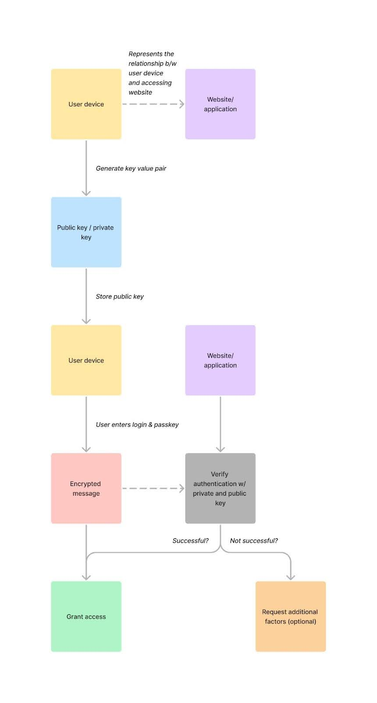

## Table of Content

1. [Introduction](#introduction)
2. [Passkeys vs. Passwordless Authentication](#passkeys-vs-passwordless-authentication)
3. [How Passkey Authentication Works](#how-passkey-authentication-works)
4. [Benefits of Implementing Passkey Authentication](#benefits-of-implementing-passkey-authentication-in-your-application)
5. [Common Implementation Pitfalls and How to Avoid Them](#common-implementation-pitfalls-and-how-to-avoid-them)
6. [Conclusion](#conclusion)

## Introduction

If you're like most people, you're probably tired of passwords. Creating, managing, and updating them regularly is a lot of overhead. Add the challenge of trying to prevent phishing scams, brute force attacks, and password guessing, and you've got a recipe for a bad case of password fatigue.

Luckily, we live in a digital age with other secure options. The Fast Identity Online (FIDO) Alliance developed passkey authentication to replace passwords and provide faster, easier, and more secure sign-ins. According to FIDO, passkeys are "always strong and phishing-resistant."

The strength of passkeys can't be understated because they are:
- Unique to the websites or applications they're created for
- Cannot be stolen in a data breach
- Easy to use

These benefits are just the tip of the iceberg. This article will examine what makes passkeys different from passwordless authentication, how passkey authentication works, the benefits of implementing passkeys for your application, and common pitfalls.

## Passkeys vs. Passwordless Authentication

Before we go deeper into how passkey authentication works, it's essential to distinguish it from an authentication method with a similar name: passwordless authentication. Both aim to ditch traditional passwords, but they do it differently.

| Authentication method | Description of authentication factors | Example |
|-----------------------|---------------------------------------|---------|
| Passwordless | Relies on alternative authentication factors like one-time codes and magic links | Entering your email address and using a tokenized "magic link" to authenticate |
| Passkey | Involves using a specific code or token, often stored on a physical device or digital platform | Using a USB device programmed with a unique token to unlock a company laptop |

Another way to distinguish the two is to think of a passkey as a type of passwordless authentication. Both methods don't require traditional passwords, but passkeys use a unique and specific physical mechanism to authenticate users.

## How Passkey Authentication Works

Passkeys are stored on physical devices or digital authentication platforms. Passkey authentication uses asymmetric cryptography, also known as public-key cryptography, which uses a public and private key to authenticate messages and logins.

Here's a breakdown of the authentication process:

1. **Key pair generation**: A unique public and private key pair is generated for each user. The public key is stored on the website or application.

2. **User authentication**: When users attempt to authenticate, they present their passkey containing their unique private key.

3. **Message encryption**: The user or application constructs a message, typically containing authentication data, encrypted using the user's public key.

4. **Passkey verification**: The encrypted message is transmitted to the user's passkey device, where the private key resides. The user's device decrypts the message using the private key.

5. **Authentication**: Once decrypted, the user's device confirms the message's authenticity and extracts the necessary authentication data.

You can combine passkey authentication with other authentication methods to enhance security. A common pairing is passkey and token-based authentication. In this configuration, token-based authentication acts as an additional layer of protection. After users authenticate with their passkey, they can be issued a token, which is required for subsequent application use. This configuration has the following benefits: 

- **Reduced credential theft**: Even if an attacker intercepts a token, without its associated passkey, they can’t access sensitive data. 
- **Expiration**: Tokens-based authentication lets you implement expiration policies, where tokens automatically expire after a specified period. Additionally, compromised tokens can be revoked if necessary. Combining token-based authentication with passkeys provides finer access control and reduces the window of opportunity for attacks.   

### WebAuthn and Passkey Authentication

[WebAuthn](https://www.w3.org/press-releases/2019/webauthn/), short for Web Authentication, is a web standard developed by the World Wide Web Consortium (W3C) and the FIDO Alliance. It leverages public-key cryptography to enable secure and passwordless authentication for web applications. Notice some similarities with passkey authentication? WebAuthn and passkey authentication work similarly, with WebAuthn being developed specifically for web applications. By enabling WebAuthn for your web applications, you can allow users to authenticate using passkey authentication. This standard is recommended and supported by all major web browsers. For more information, see W3C’s [WebAuthn press release](https://www.w3.org/press-releases/2019/webauthn/).  

## Benefits of Implementing Passkey Authentication in Your Application

You might be concluding the benefits of passkey authentication. We’ve broken down the benefits that we feel will benefit you and your users the most when developing applications: 

- **Enhanced security**: Asymmetric cryptography ensures that sensitive data remains secure even if intercepted. You can use passkey authentication to mitigate risks associated with password breaches, phishing attacks, and credential stuffing. 
- **Reduced password management overhead**: Using passkey authentication reduces password fatigue and improves user experience. It also reduces the likelihood of users resorting to password reuse or writing down passwords. 
- **Compliance and regulatory standards**: Some industries have strict standards to protect user data, such as GDPR (General Data Protection Regulation) and PCII (Payment Card Industry Data Security Standard) compliance requirements. Passkey authentication complies with regulatory requirements and helps mitigate the risk of penalties and legal consequences. Additionally, implementing secure and compliant authentication methods builds trust with users and shows your commitment to protecting their sensitive data. 
- **Scalability and flexibility**: Passkey authentication is scalable, making it a perfect choice for applications with growing user bases. It is also flexible enough to meet evolving security standards, can be implemented into various applications (web, mobile, IoT, etc.), and can support additional authentication methods for robust solutions. 

## Common Implementation Pitfalls and How to Avoid Them

1. **Complexity**: 
For developers unfamiliar with cryptographic principles, passkey authentication may require additional learning. We recommend starting with a fundamental overview of cryptography by reading NIST’s “Overview of Cryptography”, browsing online forums like the Cryptography Stack Exchange, reviewing WC3’s Web Authentication Specification, and reviewing hands-on projects such as SuperToken’s User Recipes. 

Use the following resources to gain a better understanding of asymmetric cryptography and authentication protocols: 

   - Resources:
     - [NIST's "Overview of Cryptography"](https://www.nist.gov/cryptography)
     - [Cryptography Stack Exchange](https://crypto.stackexchange.com/)
     - [WC3's Web Authentication Specification](https://www.w3.org/TR/webauthn-2/)
     - [SuperToken's User Recipes](https://supertokens.com/docs/guides)

2. **Performance**:
It is important to consider performance when implementing passkey authentication. Asymmetric encryption and decryption can be resource-intensive and potentially impact your application's performance. To mitigate performance degradation: 

- **Choose efficient cryptographic algorithms** that balance security and performance. For example, consider using elliptic curve cryptography (ECC) instead of RSA for asymmetric encryption, as ECC offers similar security with smaller key sizes. 
- **Utilize hardware acceleration features** available on modern CPUs to offload cryptographic operations from the CPU to specialized hardware. 
- **Batch cryptographic operations together** to minimize overhead. 
- **Implement caching mechanisms** to mitigate bottlenecks. 

3. **Key management**: 
Proper key management is critical to the success and security of implementing passkey authentication. Educate passkey users and implement robust key management practices, such as secure key storage and rotation policies. 

4. **Cross-platform compatibility**: 
It is important to test your implementation rigorously across different operating systems, web browsers, and devices to ensure a seamless passkey experience for your users. 

5. **Error handling**: 
With any authentication method, errors will happen. Whether it is a user or machine error, creating descriptive error messages and status codes will ensure the best user experience. Additionally, implementing fallback mechanisms in case of an error will ensure users can access their accounts if their passkey authentication method fails. 

6. **Monitoring, logging, and incident response**: 
Passkeys are secure but not 100% foolproof. Implementing robust monitoring and logging is essential to detect unusual behavior and potential security breaches. Additionally, developing an incident response plan for the event that a security breach happens can help mitigate the impact of a breach and minimize application downtime. 

## Conclusion

In summary, passkey authentication significantly enhances app security, providing users with a robust defense against common threats like phishing scams and brute force attacks. Its unique approach eliminates the burdens of password management and ensures data privacy and protection. SuperTokens is a valuable ally in simplifying the implementation process, offering developers a seamless path to integrating passkey authentication into their applications. By embracing passkey authentication, you can reaffirm your commitment to developing applications that put user data privacy and protection at the forefront, fostering trust and confidence among users.