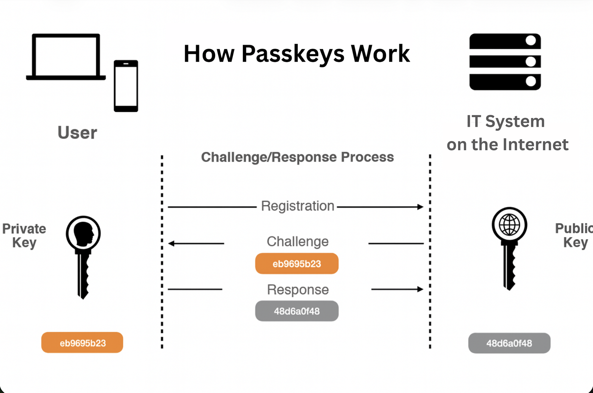

Passkeys deliver frictionless, phishing-resistant login experiences across platforms, with [more than 1 billion people worldwide having activated at least one passkey as of January 2025](https://www.biometricupdate.com/202501/state-of-passkeys-2025-passkeys-move-to-mainstream). This guide provides an end-to-end tour of passkeys in action &mdash; examining how major platforms like Apple, Google, and Coinbase implement passwordless login; exploring practical code examples across different programming languages; and demonstrating how to properly name, register, and authenticate with passkeys in your own applications.

Whether you\'re a developer evaluating passkey implementation for your application or a technology decision-maker assessing [passwordless authentication](https://supertokens.com/blog/what-is-passwordless-authentication) strategies, this comprehensive resource covers real-world examples, technical implementation details, and best practices that make passkey deployment successful.

## **What Is a Passkey?**



**A passkey is a cryptographic credential** stored securely on a user\'s device that enables passwordless login to websites and applications. Unlike traditional passwords composed of letters, numbers, and symbols,
passkeys use public-key cryptography to create unique authentication credentials that cannot be guessed, phished, or stolen through data breaches.

**How passkeys work** relies on asymmetric cryptography, where a private key remains securely stored on the user\'s device while the corresponding public key resides on the server. During authentication, the device uses the private key to sign a challenge from the server, proving possession without ever transmitting the private key itself. This architecture fundamentally eliminates password-related vulnerabilities, including phishing attacks, credential stuffing, and database breaches exposing user credentials.

The passkey authentication flow occurs nearly instantaneously, typically requiring only biometric verification like Face ID, Touch ID, or fingerprint recognition &mdash; the same gesture users already perform to
unlock their devices. This seamless experience combines enhanced security with superior usability compared to traditional password-based authentication.

## **What Are Common Passkey Examples?**


### **Apple Passkey Example**

Apple has integrated passkey support comprehensively across iOS, iPadOS, and macOS, enabling users to authenticate by using Face ID or Touch ID without passwords. A typical scenario involves accessing a banking application on an iPhone where, instead of entering a password, Face ID verifies the user\'s identity, and the passkey authenticates automatically with the server.

Apple promotes passkeys through Safari and iCloud Keychain,with iOS 18 introducing new APIs that allow developers to create passkeys automatically for users. This native platform support means passkeys sync securely across all Apple devices through iCloud Keychain, enabling seamless authentication whether using an iPhone, iPad, or Mac laptop.

### **Google Passkey Example**

Google has made passkeys available and even the default for Google accounts, calling passkey adoption \"the beginning of the end\" for passwords. Chrome\'s built-in credential management enables users to sign into Gmail and other Google services by using passkeys stored in Google Password Manager.

The integration extends across Android devices, where users can authenticate by using fingerprint sensors or face unlock, with passkeys synchronizing through Google Password Manager for cross-device compatibility. This ecosystem-wide support demonstrates Google\'s commitment to passwordless authentication as the future standard.

### **Coinbase Passkey Example**

Cryptocurrency exchanges like Coinbase rank highly in passkey adoption due to the critical importance of security for platforms managing digital assets worth billions. Coinbase supports biometric login through
passkeys in both mobile applications and web browsers, allowing users to access their accounts by using Face ID, fingerprint authentication, or device PINs.

The Coinbase Smart Wallet implementation demonstrates advanced passkey usage where the passkey itself protects access to blockchain wallets. Users create passkeys that verify ownership without managing complex seed phrases, combining enterprise-grade security with a simplified user
experience. Coinbase\'s passkey implementation includes support for multiple devices and browsers, catering to technically sophisticated users while maintaining accessibility.

### **Passkey Login Example on Websites**

Modern websites implement passkey authentication through the WebAuthn API, creating flows where users click login buttons and immediately receive biometric prompts. A typical implementation in React or plain HTML triggers `navigator.credentials.get()`, which prompts the browser\'s native passkey interface.

The user experience feels identical to unlocking a smartphone &mdash; tap the login button, authenticate with biometrics, and gain immediate access. No password typing, no remembering complex credentials, and no vulnerability to phishing attacks that might capture traditional login
credentials.

### **Passkey Example iPhone**

Safari on iPhone displays prompts like \"Use Passkey for example.com\" when users visit sites offering passkey authentication. The seamless integration means iOS handles passkey storage through iCloud Keychain, automatically syncing across devices and prompting for Face ID or Touch
ID when authentication is required.

This native implementation requires no additional apps or configuration &mdash; users simply authenticate as they normally would to unlock their device, with the passkey authentication occurring transparently in the background.

## **How to Choose a Passkey Name and Nickname**

### **Passkey Name Example**

Clear, descriptive passkey names help users manage multiple credentials across different devices. A passkey name like \"My MacBook Pro\" immediately identifies which device the credential resides on, preventing confusion when selecting from multiple available passkeys.

For example, Coinbase Smart Wallet automatically generates passkey names by using creation dates like \"Smart Wallet 6/16/2024,\" providing temporal context that helps users track when credentials were established. This naming convention becomes particularly valuable when users need to identify and remove outdated passkeys.

### **Passkey Nickname Example**

User-assigned nicknames provide additional context beyond device identification. Examples like \"Work iPhone\" versus \"Home iPad\" distinguish devices used in different contexts, while nicknames like \"Main Laptop\" or \"Backup Device\" indicate primary versus secondary credentials.

Effective nickname strategies combine device type, location, and usage context: \"Office Desktop - Engineering,\" \"Personal iPhone 15,\" or \"Travel Tablet.\" This specificity reduces authentication friction when
selecting the appropriate passkey from multiple available options.

### **Best Practices**

- **Keep names descriptive but concise** to ensure readability in selection interfaces that may display passkeys in compact lists. Names exceeding 20-30 characters risk truncation in user interfaces, potentially obscuring distinguishing information.
- **Include device type and context** to create instantly recognizable identifiers. \"MacBook\" alone provides less context than \"MacBook Pro - Personal,\" which clarifies both device and usage.
-   **Update names when circumstances change**, such as when transitioning devices between work and personal use, or when replacing hardware. Stale passkey names create confusion that undermines the security benefits of multi-device authentication.

## **How to Implement a Passkey Login Flow**

### **Register a Passkey (WebAuthn Create)**

Registration begins by calling `navigator.credentials.create()` with options containing a server-generated challenge, relying party information, and user details:

```js
const registrationOptions = await fetch('/passkey/register/options', {
    method: 'POST',
    headers: { 'Content-Type': 'application/json' },
    body: JSON.stringify({ userId: currentUser.id })
});
const options = await registrationOptions.json();

// Create passkey credential
const credential = await navigator.credentials.create({
    publicKey: {
        challenge: Uint8Array.from(options.challenge, c => c.charCodeAt(0)),
        rp: {
            name: "Your Application",
            id: "yourdomain.com"
        },
        user: {
            id: Uint8Array.from(options.user.id, c => c.charCodeAt(0)),
            name: options.user.email,
            displayName: options.user.displayName
        },
        pubKeyCredParams: [
            { alg: -7, type: "public-key" },
            { alg: -257, type: "public-key" }
        ],
        authenticatorSelection: {
            authenticatorAttachment: "platform",
            userVerification: "required"
        },
        timeout: 60000
    }
});
```

### **Store Public Key on Server**

After credential creation, extract and transmit the public key and credential ID to your server for storage:

```js
// Send credential to server for storage
const response = await fetch('/passkey/register/verify', {
    method: 'POST',
    headers: { 'Content-Type': 'application/json' },
    body: JSON.stringify({
        id: credential.id,
        rawId: btoa(String.fromCharCode(...new Uint8Array(credential.rawId))),
        response: {
            clientDataJSON: btoa(String.fromCharCode(...new Uint8Array(credential.response.clientDataJSON))),
            attestationObject: btoa(String.fromCharCode(...new Uint8Array(credential.response.attestationObject)))
        },
        type: credential.type
    })
});
const result = await response.json();
if (result.verified) {
    console.log('Passkey registered successfully');
}
```

Server-side storage associates the public key with the user\'s account, enabling future authentication verification.

### **Authenticate with a Passkey (WebAuthn Get)**

Authentication requests credentials through `navigator.credentials.get()` by using a server-provided challenge and a list of acceptable credential IDs:

```js
// Request authentication options from server
const authOptions = await fetch('/passkey/login/options', {
    method: 'POST',
    headers: { 'Content-Type': 'application/json' },
    body: JSON.stringify({ username: userEmail })
});
const options = await authOptions.json();

// Get passkey credential
const assertion = await navigator.credentials.get({
    publicKey: {
        challenge: Uint8Array.from(options.challenge, c => c.charCodeAt(0)),
        allowCredentials: options.allowCredentials.map(cred => ({
            id: Uint8Array.from(atob(cred.id), c => c.charCodeAt(0)),
            type: 'public-key'
        })),
        userVerification: "required",
        timeout: 60000
    }
});
```

### **Verify Assertion on Server**

Server-side verification validates the signed assertion by using the stored public key:

```js
// Send assertion to server for verification
const verifyResponse = await fetch('/passkey/login/verify', {
    method: 'POST',
    headers: { 'Content-Type': 'application/json' },
    body: JSON.stringify({
        id: assertion.id,
        rawId: btoa(String.fromCharCode(...new Uint8Array(assertion.rawId))),
        response: {
            authenticatorData: btoa(String.fromCharCode(...new Uint8Array(assertion.response.authenticatorData))),
            clientDataJSON: btoa(String.fromCharCode(...new Uint8Array(assertion.response.clientDataJSON))),
            signature: btoa(String.fromCharCode(...new Uint8Array(assertion.response.signature))),
            userHandle: assertion.response.userHandle
                ? btoa(String.fromCharCode(...new Uint8Array(assertion.response.userHandle)))
                : null
        },
        type: assertion.type
    })
});
const verifyResult = await verifyResponse.json();
if (verifyResult.verified) {
    window.location.href = '/dashboard';}
```
Successful verification confirms the user possesses the private key corresponding to the stored public key, thus completing passwordless authentication.

## **Passkey Implementation Examples in Code**

### **PHP Passkey Example**

PHP developers can implement WebAuthn by using the `web-auth/webauthn-lib` library:

```php
<?php
use Webauthn\Server;
use Webauthn\PublicKeyCredentialRpEntity;
use Webauthn\PublicKeyCredentialUserEntity;

// Initialize WebAuthn server
$rpEntity = new PublicKeyCredentialRpEntity('Your Application','yourdomain.com');
$server = new Server($rpEntity,$credentialRepository,null);

// Registration
$userEntity = new PublicKeyCredentialUserEntity('user@example.com',$userId,'John Doe');
$publicKeyCredentialCreationOptions = $server->generatePublicKeyCredentialCreationOptions(
    $userEntity,
    PublicKeyCredentialCreationOptions::ATTESTATION_CONVEYANCE_PREFERENCE_NONE,
    [],
    null
);

// Store options in session for verification
$_SESSION['registration_challenge'] = $publicKeyCredentialCreationOptions;

// Return options to client
echo json_encode($publicKeyCredentialCreationOptions);
```

### **JavaScript (Node.js) Example**

Node.js implementations benefit from `@simplewebauthn/server` for backend logic and `@simplewebauthn/browser` for client-side integration:

```js
// Server-side (Node.js with Express)
const { generateRegistrationOptions, verifyRegistrationResponse } = require('@simplewebauthn/server');
app.post('/passkey/register/options', async (req, res) => {
    const user = await getUserById(req.body.userId);
    const options = await generateRegistrationOptions({
        rpName: 'Your Application',
        rpID: 'yourdomain.com',
        userID: user.id,
        userName: user.email,
        userDisplayName: user.displayName,
        attestationType: 'none',
        authenticatorSelection: {
            authenticatorAttachment: 'platform',
            userVerification: 'required'
        }
    });

    // Store challenge in session
    req.session.currentChallenge = options.challenge;

    res.json(options);
});

app.post('/passkey/register/verify', async (req, res) => {
    const verification = await verifyRegistrationResponse({
        response: req.body,
        expectedChallenge: req.session.currentChallenge,
        expectedOrigin: 'https://yourdomain.com',
        expectedRPID: 'yourdomain.com'
    });

    if (verification.verified) {
        await storeCredential(verification.registrationInfo);
        res.json({ verified: true });
    } else {
        res.status(400).json({ verified: false });
    }
});
```

### **Generic Pseudocode**

Simplified pseudocode illustrates the core flow:

```js
// Registration Flow
const options = await fetch('/generate-registration-options');
const credential = await navigator.credentials.create(options);
await fetch('/verify-registration', {
    method: 'POST',
    body: JSON.stringify(credential)
});

// Authentication Flow
const authOptions = await fetch('/generate-authentication-options');
const assertion = await navigator.credentials.get(authOptions);
await fetch('/verify-authentication', {
    method: 'POST',
    body: JSON.stringify(assertion)
});
```
## **How SuperTokens Supports Passkey-Based Authentication**


Passkeys provide a modern, phishing-resistant alternative to passwords, allowing users to authenticate by using simple device-based gestures instead of memorizing credentials. [SuperTokens](https://supertokens.com/) streamlines this approach by offering fully managed components that handle the complexity of WebAuthn and passkey infrastructure for developers.

- **Built-in WebAuthn flows** automate challenge generation, credential verification, and session management without requiring developers to implement complex cryptographic operations. SuperTokens handles the entire passkey lifecycle from registration through authentication and credential revocation.
- **Secure credential storage** manages public keys, signature counters, and device metadata in a hardened data store with encryption at rest. The platform tracks credential usage patterns and signature counters to detect potential security anomalies like credential cloning attempts.
- **Device management UI** enables users to name, list, and revoke their passkeys through pre-built interfaces that integrate seamlessly with existing authentication flows. Users can manage multiple passkeys across different devices, removing credentials for lost or replaced hardware.
- **CSRF and session integration** ensure passkey authentication coordinates properly with existing session management, providing seamless cookie handling alongside [passwordless login.](https://supertokens.com/features/passwordless-login) This integration maintains security across the complete authentication lifecycle without requiring developers to synchronize multiple authentication mechanisms manually.

## **What Are the Best Practices for Passkey Implementation?**

Passkey deployments benefit most when supported by strong operational and security practices that ensure reliability across different devices and environments. The following guidelines help maintain a secure, user-friendly passwordless experience while reducing failure points and support overhead.

- **Use HTTPS everywhere** as WebAuthn APIs are mandatory requirements that will not function over insecure HTTP connections. All authentication flows, from registration through authentication, must occur over properly configured HTTPS with valid TLS certificates.
- **Offer fallback authentication methods,** including traditional multi-factor authentication or recovery codes, for scenarios where passkey authentication fails. Users might encounter situations where biometric authentication is unavailable or devices are lost, requiring alternative authentication paths.
- **Limit registered devices** by prompting users to review and remove old passkeys periodically. Accumulated credentials from replaced devices create security risks and user confusion, particularly when multiple outdated passkeys appear during authentication.
- **Monitor signature counters** to detect credential cloning or misuse. WebAuthn includes signature counters that increment with each use&mdash;unexpected counter values indicate potential security issues requiring investigation and possible credential revocation.
-   **Educate users** through clear prompts explaining passkey functionality, security benefits, and naming guidance. User education reduces support burden while increasing adoption rates by building confidence in passwordless authentication.

## **Conclusion and Next Steps**

Passkeys mark a clean break from the old username-plus-password ritual, giving users a login experience that feels intuitive on day one and resilient by design. [Consumer awareness has jumped from 39% to 57% in just two years](https://fidoalliance.org/wp-content/uploads/2024/10/Barometer-Report-2024-Oct-29.pdf?), demonstrating rapid mainstream acceptance of passwordless authentication technology.

Major platforms, including Apple, Google, Microsoft, PayPal, Coinbase, and hundreds of others, have implemented passkey support, creating an ecosystem where users increasingly expect passwordless authentication as the standard experience. This momentum signals that passkeys represent not merely an incremental improvement but a fundamental shift in authentication architecture.

**SuperTokens provides turnkey WebAuthn support** that eliminates implementation complexity while delivering production-grade security. The platform handles cryptographic operations, credential storage, device management, and session integration, enabling developers to
deploy passkey authentication in hours rather than weeks of custom development.

***Start implementing passkey authentication today to provide users with the security and convenience they increasingly expect from modern applications.***
