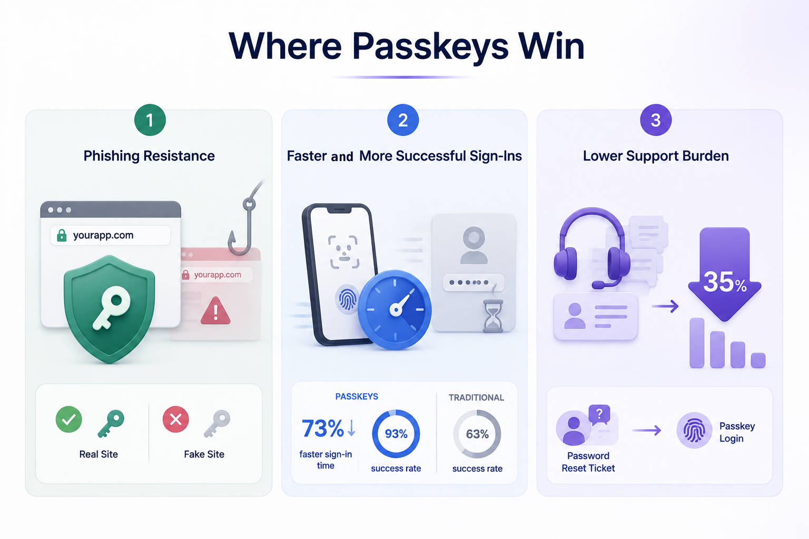

Passwordless is no longer a bet on the future. According to the [FIDO Alliance State of Passkeys 2026 report](https://fidoalliance.org/fido-alliance-reports-accelerating-global-passkey-adoption-on-world-passkey-day-2026/), based on a survey of 11,000 consumers and 1,400 enterprise decision-makers conducted by Sapio Research in April 2026, an estimated 5 billion passkeys are now in active use worldwide, 90% of consumers are aware of passkeys, and 68% of organizations have deployed, are piloting, or are rolling out passkeys for employee sign-in.

On the supply side, FIDO Alliance figures reported in 2026 put passkey support at roughly 48% of the world's top 100 websites, more than double the 2022 figure. That shift makes the question for most teams no longer whether passwordless is real, but which method fits the product being built. This post compares the four options an engineering lead actually weighs, passwords, magic links, one-time passcodes, and passkeys, and lays out a framework for choosing between them.

## Quick Comparison

Each method makes a different trade-off between security, user experience, and effort. The table below summarizes the differences that matter most when choosing.

||**Passwords**|**Magic Links**|**OTP (Email/SMS)**|**Passkeys**|
|---|---|---|---|---|
|Phishing resistance|Weak: shared secret can be stolen or phished|Moderate: no stored secret, but links can be relayed|Weak to moderate: codes can be phished in real time|Strong: origin-bound, no shared secret|
|UX friction|High: users must remember and type|Low to moderate: requires an email round trip|Moderate: requires a code round trip|Low: biometric or PIN, no typing|
|Recovery complexity|Low: well-understood reset flows|Low: re-send a link|Low: re-send a code|High: must design for lost devices upfront|
|Browser/device support|Universal|Universal|Universal|Broad, all major platforms, some edge cases|
|Implementation effort|Low, but security burden is high|Low|Low to moderate|Moderate: WebAuthn ceremony or an SDK|

The pattern across the table is the core trade-off. Passwords and OTP are the easiest to reach for and the weakest against phishing. Passkeys invert that, strongest against phishing but demanding real thought about recovery. Magic links sit in between, low friction and no stored password, but not truly phishing-resistant.

Adoption also varies sharply by sector, which is worth weighing against your own market. A 2026 cross-industry benchmark from MojoAuth, which blends FIDO Alliance, Dashlane, and Microsoft data, placed active passkey adoption among eligible users at roughly 60% in fintech, 35% in ecommerce, 28% in B2B SaaS, and 18% in media and entertainment. A fintech team's users are far likelier to expect a passkey prompt than a media product's, and that expectation should factor into how aggressively passkeys are pushed at signup.

## Where Passkeys Win

The case for passkeys rests on three concrete advantages, each backed by data rather than promise.

The first is **phishing resistance**, and it is structural rather than incremental. A passkey has no shared secret to steal, and it is cryptographically bound to the origin that created it, so a credential for your real domain will not release on a lookalike phishing page. This is not a marginal improvement over passwords. Microsoft has reported that 97% of the identity attacks it observes are password spray attacks, exploiting weak and reused passwords rather than anything sophisticated. A credential that cannot be typed, reused, or handed to a fake site removes that entire attack class.

The second is **sign-in speed and success rate**. The [FIDO Alliance Passkey Index](https://www.businesswire.com/news/home/20251013549390/en/FIDO-Alliance-Launches-Passkey-Index-Revealing-Significant-Passkey-Uptake-and-Business-Benefits), a composite of data from companies including Amazon, Google, Microsoft, PayPal, and Target, found that passkeys cut sign-in time by 73% compared to other methods, averaging 8.5 seconds per login. On success rate, passkey sign-ins have been measured at roughly 93% versus about 63% for traditional methods, and Google has reported that passkey sign-ins are about four times more successful than passwords. For a product where a failed login is an abandoned session or a lost sale, that gap is revenue, not just convenience.

The third is a **lighter support burden**. Password resets are one of the highest-volume, lowest-value tickets most support teams handle. The State of Passkeys 2026 report cites organizations seeing meaningful helpdesk cost reductions after moving to passkeys, with figures around 35% in reduced support costs reported among deployers. Every login a user completes with a biometric instead of a forgotten password is a reset request that never gets filed.

## Where Passkeys Still Have Friction

Being honest about the rough edges is what makes the advantages above credible, and passkeys still have real ones.

The first is **cross-platform edge cases**. A synced passkey moves effortlessly within one ecosystem, but a user who lives across ecosystems, an iPhone for personal use and a Windows laptop for work, does not get automatic syncing between them. Authenticating on the other platform relies on the cross-device QR flow, which works but adds a step and can confuse users who expected their passkey to simply appear. The State of Passkeys 2026 data reflects this: awareness is at 90%, but only 49% of consumers report using passkeys regularly, and cross-ecosystem syncing gaps are part of what explains the distance between those two numbers.

The second is **enterprise device management**. Rolling passkeys out across a managed fleet raises questions that a consumer app never faces: which authenticators are permitted, how device-bound keys are provisioned and de-provisioned, and how account recovery works when a corporate device is wiped or replaced. The FIDO report notes that legacy system compatibility and account recovery remain the barriers most cited by organizations still working through their rollouts.

The third is **user education**. Passkeys are still a new mental model for many people, who have spent decades being trained that logging in means typing a secret. In the State of Passkeys 2026 workforce data, 53% of organizations that flagged user behavior as a barrier described it as a minor factor requiring some training, but in the United States that resistance runs higher, with 43% reporting active user pushback and 15% saying it directly delayed their rollout. The technology is ready; user habit is the slower variable.

## When Magic Links or OTP Are Still the Pragmatic Choice

Passkeys are not automatically the right answer, and for some products a simpler passwordless method is the better engineering decision.

The clearest case is a low-stakes application without a dedicated authentication or security team. If the product is a newsletter tool, an internal dashboard, or an early-stage app where the threat model is modest and engineering time is scarce, a magic link or an email OTP gets users in without passwords and without the recovery design work passkeys demand. The phishing resistance is weaker, but for a product that is not a high-value target, that trade can be entirely reasonable in the short term.

The second case is a large, non-technical user base unfamiliar with passkeys. If most users would hit a passkey prompt and not know what it is, forcing that mental model at signup can cost more conversions than the security gains justify. A magic link, in that context, is a familiar and frictionless entry point.

The honest caveat is that both magic links and OTP are more phishing-susceptible than passkeys, because a code or a link can be relayed to a real site by an attacker in real time. They are faster to ship and gentler on unfamiliar users, but they are a pragmatic starting point, not a security destination. Many teams use them as the on-ramp and add passkeys as adoption and resources grow.

## Build vs. Buy: Rolling Your Own WebAuthn vs. Using SuperTokens

Once passkeys are on the table, the next decision is whether to implement WebAuthn directly or use a managed or open-source authentication provider. The gap between those two paths is larger than it first appears.

Rolling your own means owning the entire relying-party side of the ceremony detailed in Post 2 of this series: generating cryptographically secure challenges, parsing and validating attestation objects at registration, verifying assertion signatures against each stored public key at login, tracking signature counters to detect cloned authenticators, storing credentials safely, and handling the base64url serialization of every binary field crossing the browser boundary. None of it is impossible, but each piece is a place where a subtle mistake becomes a silent security gap, and WebAuthn is unforgiving about subtle mistakes.

An open-source SDK like [SuperTokens](https://supertokens.com/) removes that list. The WebAuthn recipe issues challenges, verifies attestation and signatures, and stores credentials, so application code calls a method rather than implementing the cryptography. Because SuperTokens is open source and self-hostable, that abstraction does not come at the cost of control or data ownership: the credentials stay on infrastructure the team runs. The comparison is not managed convenience versus self-hosted control, which is the usual trade. It is hand-rolling a security-critical ceremony versus standing on a maintained implementation while keeping the data in-house.

## A Decision Framework

Use this checklist to pick a method for a specific product:

- **Choose passkeys** if the product handles sensitive data or money, if phishing is a real part of the threat model, or if login success rate directly affects revenue, and the team can commit to designing recovery properly.
- **Choose magic links or OTP** if the app is low-stakes, the team lacks dedicated authentication resources, or the user base is non-technical and unfamiliar with passkeys, accepting weaker phishing resistance as a conscious trade.
- **Keep passwords** only as a fallback factor alongside a stronger method, not as the primary path, given their weak phishing resistance.
- **Go hybrid**, which is what most successful rollouts do: add passkeys alongside existing login, often starting at signup, and let adoption grow rather than forcing a hard cutover.
- **Buy or adopt an SDK** rather than rolling your own WebAuthn unless authentication is your core product, because the ceremony is security-critical and easy to get subtly wrong.

## Closing

There is no single correct authentication method, only the right fit for a given product, threat model, and team. For most products handling anything valuable, passkeys are now the strongest option and mainstream enough to ship, with magic links and OTP as reasonable on-ramps for simpler cases. For teams ready to build, Post 2 in this series walks through a complete passkey implementation in Next.js. And for teams comparing authentication providers specifically on passkey support, the SuperTokens comparison pages against Auth0, Clerk, and Descope lay out where a self-hosted, open-source approach differs from the managed alternatives.
