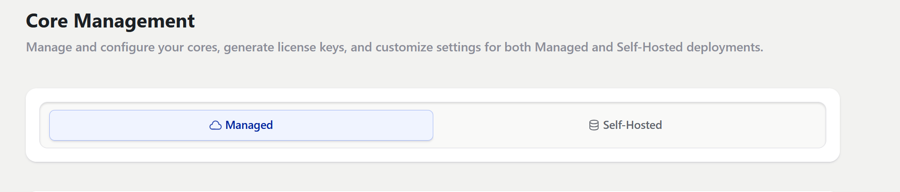

Passwords have been obsolete for some time now. They are insecure, [susceptible to a number of attack vectors](https://supertokens.com/blog/what-is-passwordless-authentication#common-problems-with-password-based-authentication-) and are honestly a pain to remember. The more astute amongst you have already moved to more secure methods like using a password manager or passwordless authentication using multiple factors but, they can be more cumbersome and require additional steps. Waiting for OTPs can take time and the delivery service can be prone to failure, setting up and managing an authenticator app is cumbersome and dealing with multiple factors is always tedious. Passkeys is a modern alternative that aim to solve a number of the issues associated with traditional and more advanced authentication methods. Let's break it down.

## What Are Passkeys?

Passkeys are cryptographic credentials built on **FIDO2/WebAuthn** standards. Unlike passwords, they do not depend on a user’s memory. Instead, they use a device-bound private-public key pair for authentication. Users typically unlock their credentials using biometrics (like a fingerprint or facial recognition) or a device PIN.

### Key Technical Difference

Passwords are *knowledge-based*—users must know something (their password) to log in. Passkeys eliminate this knowledge factor. Instead, they are *possession-based*, stored securely on the user’s device and validated using a cryptographic challenge-response model.

## Security Comparison – Passkeys vs Passwords

### Password Vulnerabilities

- **Phishing**: Users can be tricked into entering passwords on fake sites.
- **Credential Stuffing**: Reusing passwords across services leads to chain-compromises.
- **Brute-force Attacks**: Weak or short passwords are easily cracked.
- **Database Leaks**: Even with hashing, stored passwords can be compromised.

### Passkey Strengths

- **Phishing Resistant**: Passkeys are bound to the origin, so they can’t be reused on fraudulent websites.
- **No Reuse**: Each passkey is unique to the service.
- **Asymmetric Cryptography**: Only the public key is stored on the server, while the private key never leaves the user’s device.
- **No Shared Secrets**: There’s nothing for attackers to steal in a breach.

### Data Breach Resilience

If a database storing passkey public keys is breached, attackers gain nothing usable. In contrast, even hashed password leaks can eventually be exploited.

## Usability and User Experience

### Passwords UX

- Must be created, remembered, and frequently updated.
- Forgotten passwords lead to recovery flows that frustrate users.
- Complex rules (e.g., symbols, numbers) degrade user experience.

### Passkeys UX

- Authenticate using biometrics or a simple device PIN.
- No passwords to remember or reset.
- Faster and more intuitive login flows.

### Cross-Device Sync

Thanks to ecosystems like:

- **Apple iCloud Keychain**
- **Google Password Manager**

Passkeys can sync across user devices securely, making cross-platform login seamless.

## Implementation Complexity

### Password Setup

- Easy to implement.
- Requires secure storage (hashing with salt).
- Must monitor for breaches and enforce strong policies.

### Passkey Setup

- Requires WebAuthn support from browsers and devices.
- Implementation requires understanding FIDO2 standards.
- Must handle fallback for unsupported clients.

### Developer Considerations

- Leverage SDKs like [SimpleWebAuthn](https://simplewebauthn.dev/), or built-in browser APIs.
- Requires initial user education and UX tuning.
- Need to support multiple authenticators (e.g., platform vs cross-platform).

## Implementing Passkeys in your application (With SuperTokens!)

### Setup SuperTokens in your application

You will first need to set up SuperTokens in your web application.

1. Create a [SuperTokens Account](https://supertokens.com/auth)
    - Once you crate an account you can either use the managed cloud service or [self-host the SuperTokens core service](https://supertokens.com/docs/deployment/self-host-supertokens).
    
2. Integrate[ SuperTokens into your Frontend and Backend stack using the SuperTokens SDKs](https://supertokens.com/docs/quickstart/introduction). Alternatively, if you are starting from scratch you can use SuperTokens CLI tool to test it out! This is what we will be doing
`npx create-supertokens-app@latest`

### Initialize the WebAuthn recipes

Once you setup SuperTokens in your application you will need to initialize the WebAuthn re

### WebAuthn Support
SuperTokens includes **WebAuthn-based passwordless login**, offering full support for passkey-style authentication.

### Flexible Authentication Flows
Want to support users with passwords, OTP, and passkeys in one app? SuperTokens enables hybrid login models with configurable flows.

### Security-First Architecture
SuperTokens is open-source and built with security and developer control in mind. You can enforce domain-bound credentials and handle fallback logic without black-box limitations.

## When Should You Choose Passkeys Over Passwords?

### High-Security Apps

Applications that handle:
- **Financial data** (e.g., banking)
- **Healthcare records**
- **Enterprise infrastructure**

Can benefit significantly from the phishing resistance and strong assurance offered by passkeys, since the fallout from a comprimised account can be catastrophic.

### Scalability
Passkeys remove the burden of forgotten password flows and reduce support overhead—making it easier to scale user authentication.

### User Retention
A smoother login experience reduces drop-off during sign-in and account creation, especially on mobile.

## Challenges of Switching to Passkeys

### Device Limitations
Not all devices or browsers fully support WebAuthn. Older smartphones or niche browsers may lack compatibility.

### User Familiarity
Users may not understand what a passkey is. Onboarding flows and education are critical for adoption.

### Fallback Systems
You still need to offer:
- Email-based magic links
- OTPs via SMS/email
- Social login or recovery flows

These ensure users aren’t locked out if their device is lost.

## The Future of Authentication – Are Passwords Dead?

### Industry Trends
- **Apple, Google, and Microsoft** have committed to passkeys as the future of authentication.
- **Passkeys are now supported across major platforms and browsers**.

### Open Standards
- **FIDO Alliance** and **WebAuthn** are becoming global standards.
- Regulatory and compliance landscapes are also evolving to favor phishing-resistant methods.

### Legacy Systems
Despite their weaknesses, passwords may stick around in hybrid systems or legacy environments for a while. The transition is happening—but it’s gradual.

---

**Final Thoughts**

Passwords have served us well—but their time is coming to an end. Passkeys offer a safer, simpler, and more modern approach to authentication. While challenges remain in adoption, the long-term benefits in security and user experience are hard to ignore.

If you're building an app today, consider building with passkeys at the core—or at the very least, give your users the choice. Platforms like SuperTokens can help you get there faster and safer.
