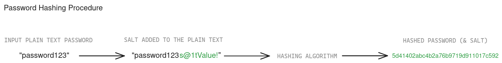

## Table of Contents

- [What is Password Hashing?](#what-is-password-hashing)
- [5 Reasons to Use Password Hashing](#5-reasons-to-use-password-hashing)
- [Password Hashing vs. Encryption: What's the Difference?](#password-hashing-vs-encryption-whats-the-difference)
- [How Does Password Hashing Work?](#how-does-password-hashing-work)
- [Which Hash Function to Choose?](#which-hash-function-to-choose)
- [Choosing the Right Hash Function](#choosing-the-right-hash-function)
- [Footnotes](#footnotes)

## What is Password Hashing?

Password hashing is a crucial aspect of password management in the digital world, particularly for developers managing user authentication systems. It involves transforming a plaintext password into a fixed-length string of characters using a hashing algorithm. This one-way function ensures that even if someone gains unauthorized access to the hashed password, they cannot easily revert it to the original password.

Common algorithms used for password hashing include the [bcrypt](https://en.wikipedia.org/wiki/Bcrypt) algorithm, [Argon2](https://en.wikipedia.org/wiki/Argon2), and the [Secure Hash Algorithm 2 (SHA-2)](https://en.wikipedia.org/wiki/SHA-2) family, which includes SHA-256. These algorithms are designed to handle inputs of any length and produce a consistent hash. They are built to resist attacks by being computationally intensive, requiring significant computation time and resources to break.

When a user creates an account and sets a password, the system applies a hashing algorithm to convert the plaintext password into a hash. This hash is stored in the database, not the plaintext password. When the user attempts to log in, the system hashes the entered password and compares it with the stored hash. If they match, the user is authenticated.

A key characteristic of password hashing is that the same input will always produce the same output. This is vital for comparison purposes, ensuring that the correct password is matched every time. However, this also means that two identical passwords will produce the same hash, which could be exploited if not mitigated by techniques like salting passwords.

### 5 Reasons to Use Password Hashing

- 1. **Enhanced Security**: Password hashing significantly enhances the security of stored passwords. Even if an attacker gains access to the hashed passwords, it is extremely difficult to reverse-engineer the original passwords, especially if strong, modern hashing algorithms like the bcrypt algorithm or Argon2 are used. Using a salted hash adds an additional layer of security, making it even harder for hackers to crack the passwords.
- 2. **Regulatory Compliance**: Many industries have stringent data protection regulations that mandate the secure storage of user passwords. Password hashing helps organizations comply with these regulations, such as GDPR, HIPAA, and PCI DSS, by ensuring that user passwords are not stored in plaintext.
- 3. **Protection Against Plaintext Storage**: Storing passwords in plaintext is a major security risk. If a database is compromised, hackers can immediately access all user passwords. Hashing ensures that passwords are stored in a secure, non-human-readable format, reducing the risk of data breaches.
- 4. **Resistance to Brute Force and Rainbow Table Attacks**: Hashing algorithms are designed to be computationally intensive, making it difficult for hackers to use brute force methods to guess passwords. Additionally, hashing combined with salting protects against rainbow table attacks, where precomputed tables of hash values are used to crack passwords.
- 5. **Building User Trust**: Implementing robust security measures like password hashing, is a crucial demonstrator of commitment to protecting user data. This builds trust with users, who are more likely to use services that prioritize their security and privacy.

## Password Hashing vs. Encryption: What's the Difference?

Understanding the difference between password hashing and encryption is essential for developers working on secure authentication systems. While both techniques are used to protect data, they serve different purposes and function in distinct ways.

### Hashing

- One-way Function: Password hashing is a one-way process, meaning once data is hashed, it cannot be reverted to its original form.
- Fixed Output Length: Regardless of the input size, a hashing algorithm produces a fixed-length string. For instance, SHA-256 always generates a 256-bit message digest, ensuring uniformity in storage and comparison.
- Primary Use Case: Hashing is primarily used for verifying data integrity and securely storing sensitive information like passwords. When a password is hashed and stored, subsequent password attempts are hashed and compared against the stored hash for verification.

### Encryption

- **Two-way Function**: Encryption involves converting plaintext data into ciphertext using an encryption key. The original data can be recovered by decrypting the ciphertext with the appropriate decryption key. This two-way functionality is crucial for protecting data that needs to be accessed and read later.
- **Variable Output Length**: The length of the encrypted data (ciphertext) can vary based on the encryption algorithm and the length of the input data. This means encrypted data may not have a consistent size.
- **Primary Use Case**: Encryption is used for protecting data in transit and at rest, ensuring that only authorized parties with the correct key can access the original information. Common use cases include secure communication channels (like HTTPS) and encrypted file storage.

In summary, password hashing is used for secure, irreversible storage of data like passwords, while encryption is used for reversible protection of data that needs to be read or accessed later.

## How Does Password Hashing Work?

Password hashing is a multi-step process designed to transform plaintext passwords into secure, fixed-length hashes that are difficult to reverse-engineer. Here’s a detailed look at how this process works:

1. **User Creates a Password**: When a user registers or updates their password, they provide a plaintext password. This password is the initial input for the hashing process.
2. **Generating a Salt**: To enhance security, a unique salt (a random string of characters) is generated for each password. This random salt ensures that even identical passwords result in different hashes, preventing hackers from using precomputed tables (rainbow tables) to crack hashes.
3. **Hashing the Password**: The plaintext password, combined with the salt, is passed through a hashing algorithm such as the bcrypt algorithm, Argon2, or SHA-256. These algorithms perform complex mathematical operations on the input data to produce a fixed-length hash. The computational intensity of these algorithms makes it challenging for hackers to use brute force methods to guess passwords.
4. **Storing the Hash**: The resulting hash, along with the salt, is stored in the database. The salt is typically stored alongside the hash, as it is needed for password verification.
5. **User Login and Password Verification**: When a user attempts to log in, they provide their plaintext password. The system retrieves the stored salt associated with the user’s hash and combines it with the entered password. This combination is then hashed using the same algorithm. If the resulting hash matches the stored hash, the user is authenticated. This process ensures that the correct password can be verified without ever needing to store or transmit it in plaintext.

### Example



Consider a user with the password "password123":
1. A salt, say "s@1tValue!", is generated.
2. The password "password123" is combined with the salt to form "password123s@1tValue!".
3. This combined string is hashed using a secure algorithm, producing a hash like "5d41402abc4b2a76b9719d911017c592".
4. Both the salt and the hash are stored in the database.
5. During login, the system combines the entered password with the stored salt and hashes it. If the result matches the stored hash, the login is successful.

By following these steps, developers can ensure that user passwords are stored securely and remain protected even if the database is compromised.

#### What is Salting and Why Hashing Alone is Not Good Enough - Problems with Humans

**Salting**: Salting is a technique used to enhance the security of password hashing. It involves adding a unique, random string of characters (salt) to each password before hashing it. This ensures that even identical passwords result in different hashes, preventing hackers from using precomputed tables (rainbow tables) to crack hashes.

**Problems with Humans**: Humans are prone to using common passwords that are easily guessable. Without salting, identical passwords would produce identical hashes, making it easier for hackers to crack them using precomputed tables known as rainbow tables. Salting mitigates this risk by making each hash unique, even for identical passwords.

#### Example

Without salt:
- Password: "12345"
- Hash: "5994471abb01112afcc18159f6cc74b4f511b99806da59b3caf5a9c173cacfc5"
With salt:
- Password: "12345"
- Salt: "ab$45"
- Hash: "2bb12bb768eb669f0e4b9df29e22a00467eb513c275ccfff1013288facac7889.ab$45"

## Which Hash Function to Choose?

Choosing the right hash function is crucial for ensuring the security and performance of your application. Different hash functions offer varying levels of security, speed, and resistance to attacks. Here’s a detailed look at some popular hash functions and considerations for selecting the best one for your needs:

### SHA-256

- **Overview**: SHA-256 is part of the SHA-2 family of cryptographic hash functions, designed by the United States’ National Security Agency (NSA). It generates a 256-bit message digest and is widely used across many applications, including SSL/TLS certificates, digital signatures, and blockchain.
- **Pros**:
  - Security: SHA-256 is currently considered secure and has not been compromised.
  - Performance: It is relatively fast, making it suitable for applications where speed is a priority.
- **Cons**:
  - Speed: Its speed can be a disadvantage for password hashing because faster hashes are easier to brute-force.
  - Lack of Built-in Salt: SHA-256 does not include a built-in mechanism for salting, requiring developers to implement this separately.
- **Use Cases**:
  - Verifying data integrity
  - SSL/TLS certificates
  - Blockchain applications

### bcrypt

- Overview: bcrypt is a password hashing function designed specifically for securing passwords. It incorporates a salt to protect against rainbow table attacks and is intentionally slow to make brute-force attacks more difficult.
- Pros:
  - Security: bcrypt includes a salt and is designed to be computationally intensive.
  - Adjustable Work Factor: The work factor (or cost factor) can be increased over time to maintain security as hardware improves.
- Cons:
  - Performance: While its slowness enhances security, it can be a drawback for systems requiring high-speed password verification, though in a modern stack this shouldn’t be an issue at all (~100ms for a hash verification could be slow for let’s say a close-to-real-time API).
- Use Cases:
  - Password hashing
  - User authentication systems

### PBKDF2
- **Overview**: PBKDF2 (Password-Based Key Derivation Function 2) is a key derivation function that applies a pseudorandom function (e.g., HMAC) to the input password along with a salt value and repeats the process many times.
- **Pros**:
  - **Security**: PBKDF2 is well-established and widely used.
  - **Configurability**: The iteration count can be increased to improve security.
- **Cons**:
  - **Performance**: Higher iteration counts can significantly impact performance.
  - **Complexity**: Properly configuring PBKDF2 for optimal security and performance can be challenging.
- **Use Cases**:
  - Password hashing
  - Key derivation for cryptographic keys

## Choosing the Right Hash Function

**Security Considerations**

- **Algorithm Strength**: Choose an algorithm with no known vulnerabilities. bcrypt and Argon2 are specifically designed for password hashing and offer strong security features.
- **Resistance to Attacks**: Ensure the hash function is resistant to known attacks, including brute-force, rainbow table, and side-channel attacks.

P**erformance Considerations**
- Computational Cost: The hash function should be computationally expensive to thwart brute-force attacks but not so slow that it impacts user experience.
- Scalability: Consider the impact on system performance, especially if your application needs to handle a large number of authentication requests.

**Future-Proofing**

- **Adjustable Parameters**: Opt for algorithms like bcrypt and Argon2, which allow you to adjust parameters (such as the work factor or memory usage) to maintain security as hardware capabilities improve.
- **Community and Industry Adoption**: Use widely adopted algorithms with strong community support and regular updates. Argon2, as the latest and most secure, is highly recommended for new applications.


**Recommended Configurations**
- **Argon2id**
  - **Memory**: At least 15 MiB
  - **Time**: An iteration count of 2
  - **Parallelism**: 1 degree of parallelism
- **bcrypt**
  - **Cost Factor**: At least 12 (can be adjusted based on system performance and security requirements)
- **PBKDF2**
  - **Iterations**: At least 100,000 (can be increased for higher security)

Example Codes

**Node.js**

```typescript
const hashingConfig = {
    parallelism: 1,
    memoryCost: 64000, // 64 MB
    timeCost: 3 // number of iterations
}

async function hashPassword(password) {
    let salt = crypto.randomBytes(16);
    return await argon2.hash(password, {
        ...hashingConfig,
        salt,
    });
}

async function verifyPassword(password, hash) {
    return await argon2.verify(hash, password);
}

hashPassword("examplePassword").then(async (hash) => {
    console.log("Hash + salt of the password:", hash);
    console.log("Password verification success:", await verifyPassword("examplePassword", hash));
});
```

```python
import argon2

argon2Hasher = argon2.PasswordHasher(
    time_cost=3, 
    memory_cost=64 * 1024, 
    parallelism=1, 
    hash_len=32, 
    salt_len=16 
)

password = "examplePassword"
hash = argon2Hasher.hash(password)

print("Hash + salt of password", hash)

verify_valid = argon2Hasher.verify(hash, password)
print("Password verification success:", verify_valid)
```


```java
import de.mkammerer.argon2.Argon2;
import de.mkammerer.argon2.Argon2Factory;

public class PasswordHashing {
    public static void main(String[] args) {
        Argon2 argon2 = Argon2Factory.create(
                Argon2Factory.Argon2Types.ARGON2id,
                16,
                32);

        char[] password = "examplePassword".toCharArray();
        String hash = argon2.hash(3, 
                64 * 1024, 
                1, 
                password);
        System.out.println("Hash + salt of the password: "+hash);
        System.out.println("Password verification success: "+ argon2.verify(hash, password));
    }
}
```

## Footnotes

- Secure vaults can help protect encryption keys, but there is always a risk of compromise.
- The same password can produce the same hash, making it vulnerable to attacks without proper salting.
- Hashing, salting, and usually anything related to complex cryptography isn’t something you should make yourself. To ensure maximum security, please use battle-tested, and scientifically proven methods, like algorithms mentioned above.
- Refer to the OWASP Password Storage Cheat Sheet for the latest recommendations.