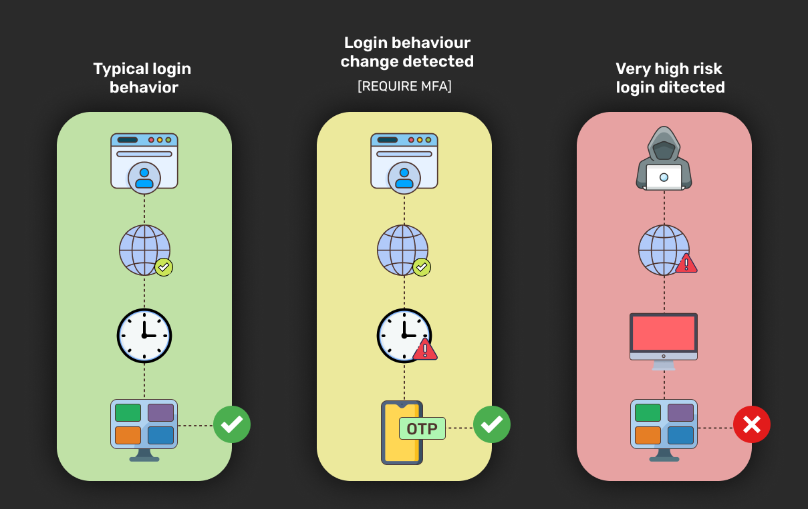

Passwordless Authentication is an authentication method that allows a user to log in to an app without using a password.

## Disadvantages of Using Passwords
- **Passwords can be stolen:** Shoulder surfing is the most common way to steal someone’s password. An example of that is looking over someone’s shoulder when they’re entering their password.  
- **Passwords can be guessed:** While passwords are at a risk from brute force attacks and social engineering, simply guessing can work too — no wonder “123456” was the [most popular password of 2020!](https://nordpass.com/most-common-passwords-list/) 🤯
- **Passwords are hard to remember:** Ideally, you should have different and unique passwords for each account. But this quickly becomes a problem when you have multiple accounts and too many combinations to remember. 
- **Passwords are re-used:** A lot of people end up using the same passwords across various apps and website. So if one password is exposed, it’ll be fairly easy for a hacker to access multiple accounts of the user.

## Different Types of Passwordless Authentication Methods
### 1. Magic links
When using passwordless authentication via magic links, the user is prompted to enter their email address to which an email will be sent instantly. This email contains a link they can click on to be instantly logged in to the system. Unlike passwords, the magic link is different for every time the user wants to login. 

One of the downsides to using magic links for authentication is that the email may land up in the user’s spam folder. Also, this feature requires that the user has access to their email. But what happens if the user cannot access their email for some reason? This problem can be solved with the next method that we are going to discuss.

### 2. One-time passwords / codes (OTP / OTC)
In this method, the user  receives a password / code via email or SMS that they can use to log in to the website or mobile application. Unlike magic links, an OTP is easier to view on one device and type on the other device quickly. It solves the problem magic links have where the user needs to login to the email ID on the device where they want to authenticate. Which is why it is highly recommended to use OTP alongwith magic links. It improves the user experience and allows you to create a more secure system.
> > Note: The longer (in character length) the OTP, the higher the security of the system. Similarly, it is advisable to use diverse characters in the OTP (e.g. alphanumerics versus just numerics - X4A3Xi98B) to increase system security.

### 3. Biometrics
Instead of a password, biometric authentication uses unique physical traits to verify a user’s identity (like retina scanning). Biometric authentication is more secure than a password because no two people have the exact same fingerprints (even if you are an identical twin) or the exact faces (the chances of two faces being similar enough to bypass facial recognition is [extremely unlikely](https://www.sciencedirect.com/science/article/abs/pii/S0379073815003758), even in the case of identical twins).

One of the downsides of using biometric authentication is that the user requires specialised hardware to be able to scan their face / fingerprint. If you are building a consumer facing app or website, you can’t expect all of your potential users to be able to use this login method.

### 4. Social login
Using this method, users can choose to sign up or sign in via their social media accounts. It’s quick, super easy and is heavily used by developers — especially when building the MVP or version 1 of their mobile / web app.

One of the downsides to using social login is that social media companies (like Facebook, Instagram) can track users across sites that they login to, and therefore some users may not prefer this method.
> > Note: Social login is mostly referred to as third-party login although it is a form of passwordless login. Most users today stay logged in to their social media accounts and therefore they hardly ever need to enter a password when using this type of login method.

### 5. Push notifications
Push Notification Authentication enables user authentication by sending a notification directly to a secure application on the user’s device, alerting them that an authentication attempt is taking place. Users can view authentication details and approve or deny access, typically via a simple press of a button. Like SMS, push notification also shares an OTP with the user and is a more secure authentication method (since attacks like SIM swapping are not possible). It is often deployed as part of a multi-factor authentication (MFA) solution.

The downside to using push notifications is that users sometimes opt-out of notifications for various apps and therefore wouldn’t realise that they’ve been sent the code / OTP via a push notification. There is also a high chance that push notifications get hidden or lost within the cluster of notifications received by users.

### 6. Physical tokens
Physical tokens are peripheral devices used to gain access to an electronically restricted device. The token is used in addition to or in place of a password. Examples include a wireless keycard opening a locked door, or in the case of a customer trying to access their bank account online, the use of a bank-provided token (like an encrypted USB) that authenticates the user’s identity. 

The downsides to using physical tokens is that they can be stolen or the user could lose them. Another downside is the additional costs associated with them and the fact that they may require some form of user training.

## Different Ways to Build Passwordless Authentication
Here’s how you could approach implementing passwordless authentication: 
1. **Pick your mode:** This is the first step in choosing your preferred authentication factor. You can refer to the list above and choose the type of authentication method that is right for your use case. 
2. **Number of factors:** It’s recommended to use multiple authentication factors with or without passwordless. Reliance on one single factor, regardless of how safe it may seem, is not recommended.
3. **Buy required hardware / software:** The user or the organisation may have to buy equipment to implement biometric-based passwordless authentication (like a fingerprint or retina scanner). For other modes, like magic links or mobile OTPs, one may have to use an email / sms sending service such as Twilio or MailChimp.
4. **Provision users:** Start registering people on your authentication system. E.g., For a fingerprint scanning system, you will need to scan the fingers of all your users / employees.
> > Note: Combining Passwordless Authentication with Adaptive (Behavioural) Authentication can bring the optimum balance between user experience vs security. For example, suppose a user logs in to the system, via their laptop, early in the morning, every weekday. Over time, the system learns that this is their typical login behaviour. Then one day, all of a sudden, the user logs in to the system on a Saturday. They used the same laptop to login and it was still early in the morning, and their geographical location was also the same. The system calculates a relatively higher risk score for this behaviour, which warrants the use of a secondary authentication factor, like an SMS OTP.

## Is the Future Passwordless?
Even though passwords are far less prevalent than ever before, they are still being used all around the world. However, we at SuperTokens expect passwordless authentication to get more and more popular, especially as a second factor of authentication.
Records already indicate that passwordless authentication helps in solving [CX pain points](https://www.the-future-of-commerce.com/2022/05/10/passwordless-authentication-solve-cx-pain-points-boost-revenue/) and leads to a boost in revenue. Plus, keep in mind that the average person has to keep track of [about 100+ passwords](https://tech.co/password-managers/how-many-passwords-average-person#:~:text=According%20to%20new%20research%20from,has%20100%20passwords%20to%20remember!) and spends almost [12 minutes](https://resources.yubico.com/53ZDUYE6/at/q3tmql-974v8g-73e8p5/YubicoPonemon_2019_State_of_Password_and_Authentication_Security_Behaviors_Report.pdf?format=pdf) every week resetting those passwords.
Also, a frictionless UX can be a powerful competitive advantage for businesses at every level. Often, B2C companies are particularly concerned about the negative impact of login friction on conversion / retention rates and revenue. By enabling a frictionless customer experience, investment in passwordless supports **customer retention** and **revenue growth.**

Plus, Apple, Google and Microsoft [have already committed](https://www.apple.com/in/newsroom/2022/05/apple-google-and-microsoft-commit-to-expanded-support-for-fido-standard/) to expand support for the FIDO standard to accelerate availability of passwordless sign-ins. This will definitely help boost adoption of passwordless login methods.

But how soon could we see this shift happening? Not very soon. A number of users make use of password managers to manage and store their passwords. There are password managers out there that’ll generate strong 12 letter passwords for the user and automatically fill them on the appropriate websites whenever you visit them. It’s important to recognise here that password managers also provide a great UX.

So, to conclude, the idea of eliminating our reliance on centrally managed passwords definitely has multiple benefits. However, there is no single passwordless solution that would fit most businesses or use cases. Nevertheless, we’re witnessing an increase in [adoption of passwordless authentication methods](https://www.globenewswire.com/news-release/2022/06/09/2459721/0/en/The-Global-Passwordless-Authentication-Market-size-is-estimated-to-be-USD-12-79-billion-in-2021-and-is-predicted-to-reach-USD-53-64-billion-by-2030-with-a-CAGR-of-16-7-from-2022-20.html) because of the range of business benefits it offers, including an enhanced UX, fewer data breaches, lower support and development costs, and overall better product security.

[Demo](https://passwordless.demo.supertokens.com/) | [Source Code on GitHub](https://github.com/supertokens/supertokens-core) | Please leave a ⭐️ if you think we deserve it.