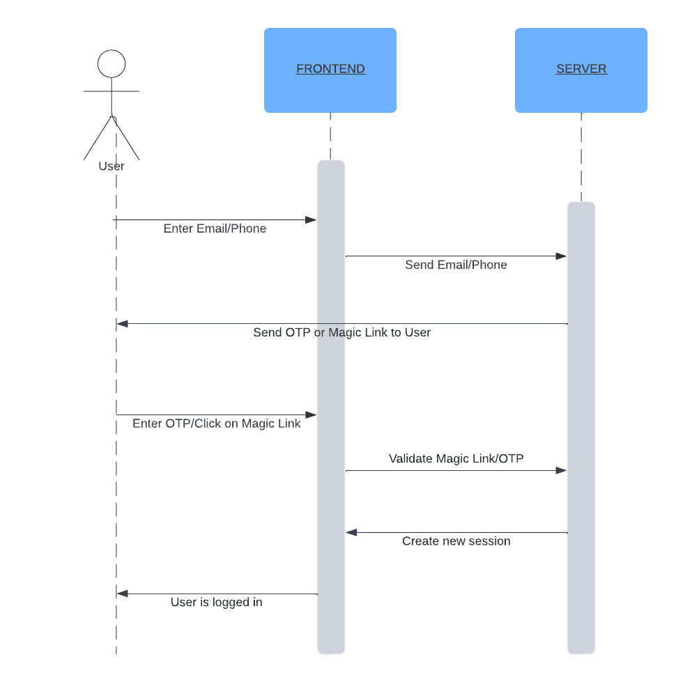

## Introduction

Passwordless authentication works the way it sounds; it lets users log into your app/website without having to configure and remember a password. Typically this involves a One Time Password (OTP) or a Magic Link being sent to the user which they can use to log in, the code/link can be sent to the user’s email or phone.

Traditional login methods involve using an email/username and a password, while this system works it results in poor user experience because user’s need to remember different passwords or end up using the same passwords everywhere which is a security risk. Because Passwordless login does not require the user to generate or remember passwords, your system is generally more secure because you are not exposed to common attacks such as passwords being leaked or data breaches resulting in passwords being stolen. Also building your system becomes easier and involves less steps because you can skip flows such as the forgot password flow or the reset password flow.

## Methods of Passwordless Authentication

### Magic Links

Magic links are unique URLs sent to the user that expire after some time. Typically magic links are sent to the user’s email. The user can simply click on the link to log into your app. 
This is a great way to authenticate your users, sending URLs over email is typically a very cheap option and users do not need to enter any code typically associated with OTP based logins.

### One Time Passwords (OTP)

This involves sending a code, typically numbers, to the user’s email or phone number. This method is even more convenient for users on modern smartphones that allow autocompletion of OTPs without the user having to switch between apps.

### Biometric Authentication

Biometric authentication usually involves a physical trait of the user which is used to identify them. Common examples of this are fingerprints, facial recognition, voice recognition etc. Biometric authentication can be a great way to ensure high security in your apps because they are hard to duplicate or steal.

Typical passwordless mechanisms such as OTP or magic links come with a degree of unreliability. Emails can bounce or end up being flagged as spam, SMS based OTPs may get delayed or not get delivered at all and are subject to the network conditions of the user etc. Biometric login does not have these problems, and because the user needs to typically be present to authenticate themselves it is very secure.

## Passwordless Authentication vs. 2FA & MFA

When talking about authentication methods it is important to distinguish between Passwordless authentication and Two-Factor/Multi-Factor authentication. Passwordless authentication involves logging the user in without a password and Multi-Factor authentication involves verifying the user with multiple steps of authentication. Passwordless authentication is a very common step in Multi-Factor authentication but is not always involved in the process.

While it is common to have multi-step authentication, passwordless authentication can be a good alternative. For example using SMS based OTPs you can log the user in and still get the security benefits of multiple factors. Passwordless authentication with either email or phone has the built-in implication of the user’s contact information being verified. That being said, multi-factor can be very beneficial because it allows users to have a way to recover their accounts if they lose access to their primary login methods.

## How to implement Passwordless authentication

Building passwordless authentication involves the following steps:

### Deciding what login method to use

Depending on your use case you need to choose what method should be used for passwordless login. Typically you need to choose between OTP or magic link based login.

OTP login is one of the more common methods used in apps today. One of the main advantages is convenience to the user, however using SMS based OTPs may result in additional costs.

Magic Links are also a convenient way to implement passwordless login, but the main disadvantage here is that if the user begins the login process on their computer and then consumes the magic link from their phone (via email for example) they would not be logged into their account on the computer and would have to restart the flow again. OTPs on the other hand simply need to be entered on whatever device the user is already using. Similar to SMS based OTPs, using SMS based magic links usually involve additional costs.

### Building the login flow

#### Sending the user a Link/OTP

Prompt the user to enter their email/phone number. You can also opt in to allowing both email and phone numbers depending on whether you support both methods. Once the user submits their information you need to send them the code/link. For OTP flows you need to prompt the user to enter the information, for Magic Links you can explain to the user that they need to check their email/phone.

Because Email and SMS based messaging is not 100% reliable and delivery may fail you also need to allow the user to be able to re-trigger the email/SMS. When implementing such a flow you should consider adding some minimum time between resend attempts to avoid excessive calls, this is especially useful when using SMS based delivery to avoid high costs.

#### Consuming the Link/Code

For OTP based login the flow is rather simple, you check if the code entered by the user is valid and log them in if it is. For invalid codes you can display some error to the user, you should also consider adding a lifetime for a generated OTP and display an appropriate message if the user tries to use an old OTP. As a security measure you can block login attempts for some duration if the user has entered an incorrect OTP too many times, in this case it is good practice to notify the user by email/SMS about this.

When using Magic Links, the link sent to the user typically contains a unique identifier which can be used to validate if the Magic Link used by the user is valid. Similar to OTPs you should implement a timeout after which the Magic Link should be considered invalid. 

#### Logging users into the application

Once you have verified that the OTP/Link used by the user is valid, you should use your normal session management flow to log the user in.

### Using Passwordless authentication with SuperTokens

While you can build your own login system with passwordless, it is easier to use a third party solution. For example with SuperTokens your entire process gets simplified to the following steps:

- **Installation**: Install the SuperTokens SDKs on the frontend and backend
- **Follow the quick setup guide**: The quick setup for Passwordless authentication involves copy pasting some basic code on the frontend and backend to quickly get setup.
- **Get Started**: That’s it! You can now stop thinking about your login flow and focus on building your app.

To learn more about using Passwordless authentication with SuperTokens refer to the [official documentation](https://supertokens.com/docs/passwordless/introduction).

## Is Passwordless Authentication Secure?

### Benefits of using Passwordless
- **Improved Security**: Because the code/link is directly sent to the user, risks involved with traditional attacks such as phishing, brute force etc are reduced.
- **Improved UX**: Users do not need to remember passwords or regularly reset them, and with SMS based OTP the process of logging in becomes much more convenient for users.
- **Compliance**: Removing the need to manage passwords in a secure way can make meeting requirements for compliance easier.
- **Email/phone verification**: Because the OTP/Link is sent to the user’s email or phone, when the user signs up you know that their contact information is authentic.
- **Scalability**: Passwordless solutions are generally easy to scale across an organisation.
- **Decreased Risk of Credential Reuse**: Passwordless systems prevent the common security issue of credential reuse across multiple platforms, which is a prevalent cause of data breaches.

## Disadvantages of Passwordless authentication
- **Dependence on the email or phone**: If the user loses access to their phone or email they lose access to the account. Stolen email or phone can also put the user’s information at risk.
- **Biometric Data Concerns**: Biometric authentication systems raise privacy and security concerns because once biometric data is compromised, it cannot be changed like a password.
- **Technology and Infrastructure Costs**: Implementing advanced passwordless systems like biometric scanners or sophisticated token-based hardware can involve significant initial costs

Passwordless authentication is a great way to log your users in, and it is more secure than traditional login methods but it is important to remember that no system is ever full proof and adding additional security mechanisms such as MFA is recommended.

## Using a Third Party vs Building it yourself

Building passwordless authentication yourself can be quite a task involving a lot of work and may require hiring multiple developers. We have a full blog dedicated to explaining how you can build Passwordless authentication yourself, you can read it here.

Apart from the work required to building the system you also have to:
- Maintaining the systems
- Staying up to date with latest security risks and concerns
- Adapting to new security threats, updating with latest technologies and practices

All of this can be a significant overhead to your regular development. On the other hand using a third party helps in the following ways:
- Quick to get setup
- You can focus on developing flows specific to your app
- Third party solutions used by multiple companies has been battle tested
- The responsibility of keeping up to date and responding to new threats is with the third party
- The third party will have a specialised skill set resulting in better quality of the login system. And because their focus is on the login system, responding to new threats will be faster.

## Conclusion

Passwordless authentication is a great way to log your users into your app/website. It helps keep your system secure while adding to the end user experience.
