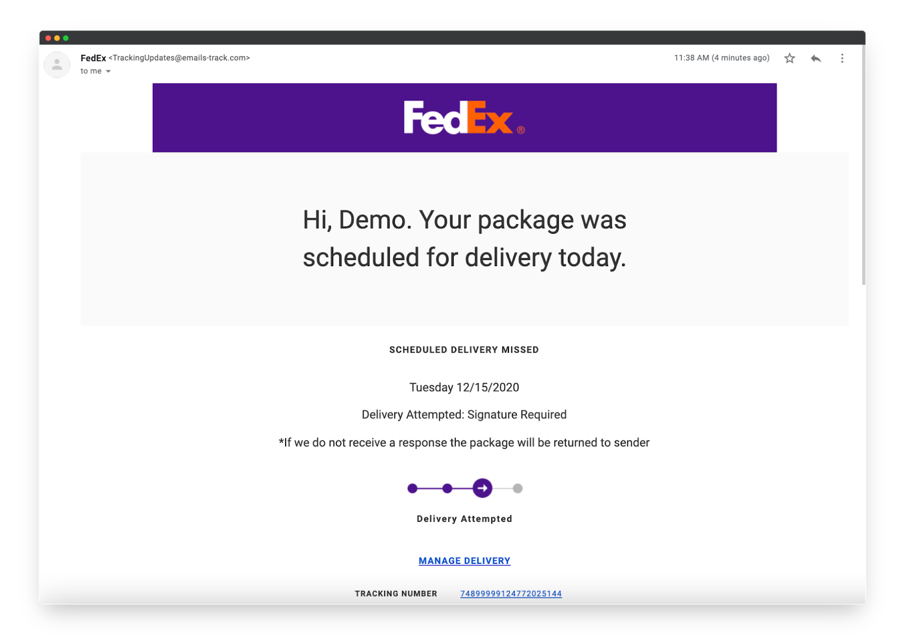
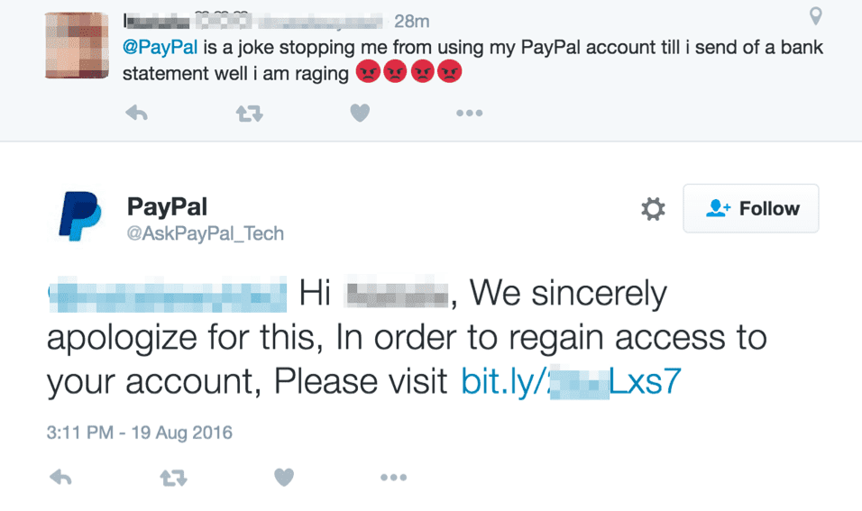
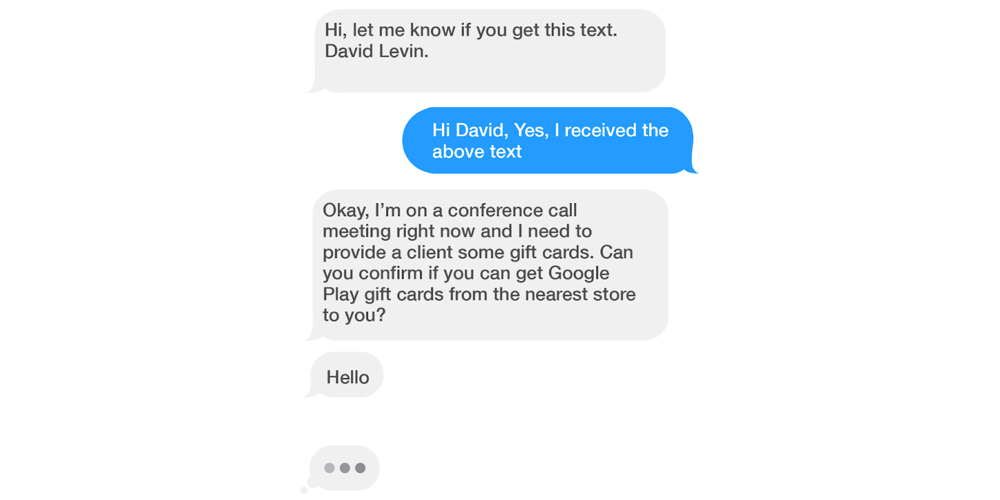
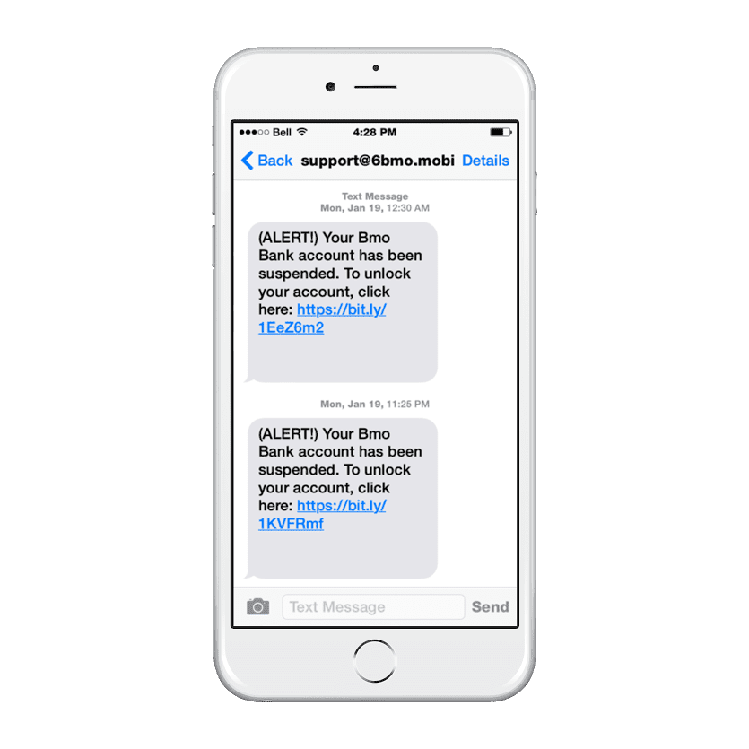
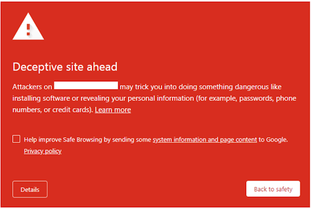

## Table of Content
- [Introduction](#introduction)
- [Phishing in a New Era](#phishing-in-a-new-era)
- [Detecting a phish](#detecting-a-phish)
- [Conclusion](#conclusion)

## Introduction

Have you ever received an email saying you had a package that could not be delivered, but you know you haven’t ordered anything online lately? This scenario is a real phishing scam that looks similar to the following image: 

This email attempts to get the user to click the “MANAGE DELIVERY” link, which will route them to a phishing website or download malware to their device.

Today, phishing attacks are more sophisticated than ever, and developers play a crucial role in combating them. Data from the Anti-Phishing Working Group (AWPG) shows that phishing incidents reached 5 million in 2023. Due to the prevalence of phishing, it is no surprise that Egress’s “[2024 Email Security Risk Report](https://pages.egress.com/whitepaper-email-risk-report-01-24.html)” reports that 94% of organizations experienced email security incidents. As a result of these email security incidents, 96% of affected organizations were negatively impacted by them. These negative consequences include account takeover, organizational costs, and data loss. 

This blog delves into the world of phishing, explores its modern complexities, and equips developers with the knowledge needed to contribute to a safer online environment.

## Phishing in a New Era

In the past, phishing emails were the go-to method for cybercriminals to steal sensitive data. However, as email clients like Gmail implemented safeguards and filtering for phishing emails, attackers had to innovate. These innovations in safeguarding users led to the emergence of more sophisticated phishing strategies. 
Attackers are now exploiting various channels and using new techniques. Some of the examples of new phishing techniques include: 

**WhatsApp and social media**: Attackers create fake accounts, often impersonating trusted contacts or businesses, to trick users into clicking malicious links or sharing personal information. These fake accounts are designed to look legitimate, making it difficult for users to identify the scam. 

In the following image, a fraudulent PayPal account responds to a user's complaint on Twitter. This attack aims to trick the user into clicking on the link in the reply, which redirects them to a malicious website. If the user is not cautious and fails to verify the authenticity of the fake account, they can easily become a victim of this scam.

**OTP (One-time password) phishing**: Scammers exploit the growing reliance on multi-factor authentication (MFA) by tricking users into revealing their one-time passwords received via SMS or authenticator apps. They may do this by sending fake messages that appear to come from a legitimate source, asking the user to enter the OTP.

A famous example of OTP phishing is the Amazon OTP scams, which started in 2022 and are notorious today. These attacks consisted of scammers sending OTP text messages when users were not attempting to log in to their Amazon accounts. Receiving an OTP text message out of the blue is a sign that someone is trying to log in to your account and has your password. For more information on this scam, see Verified.org's [Amazon OTP case study](https://www.verified.org/articles/scams/amazon-otp-text-scam).

**Vishing**: A phishing attack conducted over phone calls, often using caller ID spoofing to appear legitimate. The attacker may pose as a representative from a company or organization and ask for sensitive information, such as credit card numbers or social security numbers.

A well-known example of a vishing scam is one that targets older adults, called the “grandparent scam”. In this scam, the attacker poses as a grandchild or other family member in distress, such as being in jail or facing a medical emergency. The attacker typically requests money via wire transfer or gift cards to “help” with the situation. These scams have gained widespread popularity, leading to the FCC publishing consumer warnings about them. 

**Smishing**: A type of phishing attack conducted over SMS text messages. Attacks send messages that appear to come from a legitimate source, such as a bank or government agency, asking the user to click on a malicious link or provide personal information.

Smishing attacks take many forms, but one notable one in the technology industry is the “CEO fraud” scam. With this scam, attackers impersonate a CEO via text message and try to persuade staff to make an urgent payment. These attacks have gained so much popularity that companies are implementing strict policies against CEOs being allowed to text employees altogether. The following image provides an example of a CEO fraud text message conversation: 

**QR code scams**: When scanned, malicious QR codes can lead users to phishing websites or download malware onto their devices. Attackers may place these codes publicly or send them through email or social media.

QR codes are becoming increasingly popular, especially in the post-COVID world. We now use them to pay at restaurants, board flights, and attend concerts. The FCC recently released an article warning consumers about scammers using malicious QR codes on parking meters and in text messages or emails. For a full overview of these warnings, see the FCC’s [QR code case study](https://consumer.ftc.gov/consumer-alerts/2023/12/scammers-hide-harmful-links-qr-codes-steal-your-information). 

**Deep fakes**: This is a type of phishing attack where the attacker creates realistic video or audio recordings of individuals to impersonate and manipulate users into trusting them, potentially exposing sensitive information.

With the rise in AI technology comes sophisticated phishing attacks that we must proactively prepare for. [As reported by CNN](https://www.cnn.com/2024/02/04/asia/deepfake-cfo-scam-hong-kong-intl-hnk/index.html), a finance worker at a multinational firm was tricked into paying out $25 million to scammers posing as the company’s chief financial officer in a video conference call. This level of sophistication shows just how dangerous modern phishing has become and that we must remain vigilant in protecting our applications and users. 

It’s crucial for developers to stay knowledgeable about emerging phishing techniques and to take steps to strengthen the security of their applications. These measures include implementing multi-factor authentication, encrypting sensitive data, and educating users on how to stay safe online. 

## Detecting a phish

How can we detect a phishing attempt when it happens to us? Let’s take a look at a real-life smishing attempt. In the following text thread, the attacker contacts the user multiple times, notifying them that their bank account has been suspended. The link in the text message looks legit, right? Little does the user know that behind this link is a phishing website designed to steal the user’s login credentials. 

So how do we know this text message is a smishing attack, not a legitimate one?

1. The sender’s contact information is suspicious. It is not saved in the user’s contact list and has an unusual format. The format is not a phone number or a valid email address. 
2. The message has a sense of urgency. Starting the message off with an “alert” signal and notifying a user that their account is suspended may induce a sense of panic. 
3. The URL is suspicious. The format of the URL is suspicious. Scammers use [URL shorteners](https://www.expressvpn.com/blog/bit-ly-malware-spam/) to hide malicious links. 

Now that you know how to dissect a phishing attempt, how can you educate users? Use the following tips to safeguard yourself and your users from phishing attempts: 

- **Know the sender**. Be wary of messages from unknown phone numbers, especially ones with unusual area codes or formatting. If you receive text messages from a company or service provider you trust, add their phone number to your contact list. 
- **Review the content**. Never click on URLs in text messages, note any signs of urgency, check for spelling and grammar mistakes, and be wary of requests for sensitive information. 
- **Don’t reply**. Don’t reply to suspicious messages because it may confirm that your phone number is active, giving the attacker more reason to reach out. 
- **Contact the “source”**. If a text message claims to be from a legitimate source, contact the company directly through their official channels to verify the message’s legitimacy. 
- **Report the message**. Report suspicious messages to your mobile carrier. 

Help spread awareness of the growing prevalence of smishing by educating yourself and others on recognizing it. Doing so can better protect yourself and those around you from falling victim to these scams.

### Google: Protecting you from the phish
What happens if you click on a phishing link? Many times, phishing links will send you to phishing websites. A phishing website is a deceptive website designed to obtain sensitive information from users. APWG [estimates that as of Q3 2022](https://apwg.org/reportphishing/), there were over 1.35 million phishing websites worldwide. 

Google plays a crucial role in protecting users from phishing websites. Google’s Safe Browsing system utilizes machine learning models trained using vast amounts of data and user reports. The machine learning models can use this data to identify patterns and characteristics associated with known phishing websites. If a user tries to visit a website listed as unsafe by Safe Browsing, Google displays the “Deceptive site ahead” warning message to discourage users from proceeding. For more information on how it works and how to use it, see [Google's Safe Browsing developer guides](https://developers.google.com/safe-browsing#:~:text=Safe%20Browsing%20is%20a%20Google,Come%20see%20what's%20possible.). 

When developing websites and applications, it’s crucial to understand how Google’s Safe Browsing system analyzes websites to ensure your website passes phishing checks. Following these tips when developing websites can help create a safer online experience for everyone: 

1. **Prioritize security**: Implement secure coding practices to protect your website or application from being hijacked. For example, you can [hash and salt passwords](https://nordvpn.com/blog/what-are-salted-passwords-and-password-hashing/), use SQL injection prevention with prepared statements, and implement secure authentication with MFA (Multi-Factor Authentication). Tools like SuperTokens can handle everything for you, making secure development a breeze. 
2. **Regular scans and tests**: Perform regular vulnerability scans to ensure packages used in your website or application are secure and up to date. Additionally, penetration tests and security audits will help you find vulnerabilities, especially when handling sensitive user data. 
3. **Protect user data**: It’s essential to provide a transparent privacy policy that helps users understand how their data is used. Obtain user consent for collecting data, and implement secure data storage and transmission practices, such as encrypting sensitive data in transmission and at rest. Use secure protocols like HTTPS to protect data transmitted on your website or application. 
4. **Avoid risky practices**: It is important to be transparent about your website's purpose and function while respecting users' privacy by only collecting essential data. Avoid collecting data that is not relevant to the purpose of your website or application. Ensure that your website or application complies with privacy regulations like [GDPR](https://gdpr.eu/what-is-gdpr/) (General Data Protection Regulation) and [CCPA](https://oag.ca.gov/privacy/ccpa) (California Consumer Privacy Act), to name a few. 
5. **Create ethical user experiences**: Use respectful language and communication when designing your website or application. Create feedback channels to give users a voice and address their concerns. Ensure accessibility for all users, including those with disabilities. 

## Conclusion

It's important to keep up the fight against phishing, and both developers and users play a crucial role in this battle. Developers can contribute by creating secure online environments and educating users, while users can stay informed and watchful. We can regain control of phishing by working together, learning how companies like Google protect their users, and implementing best practices.
