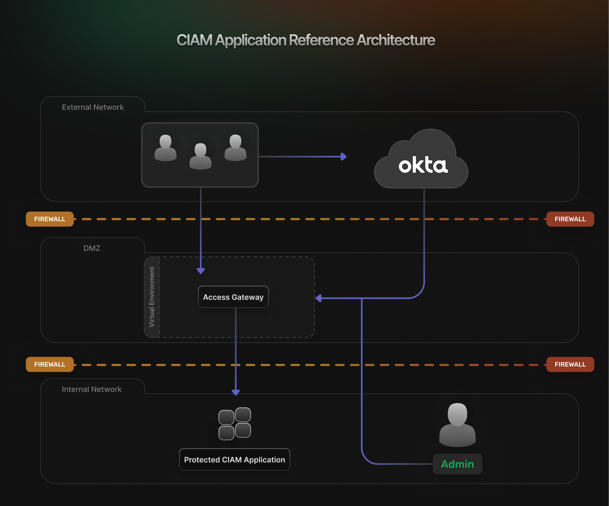
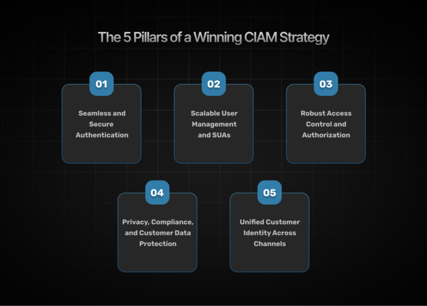
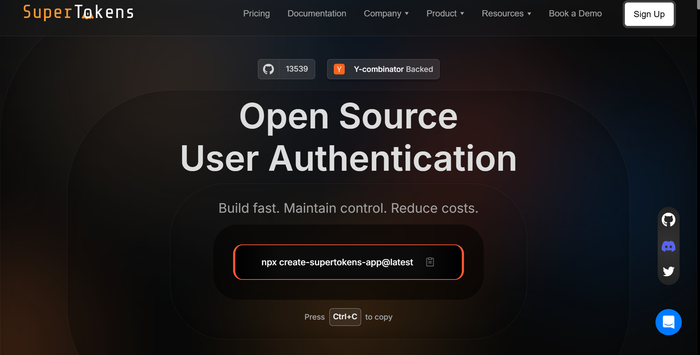
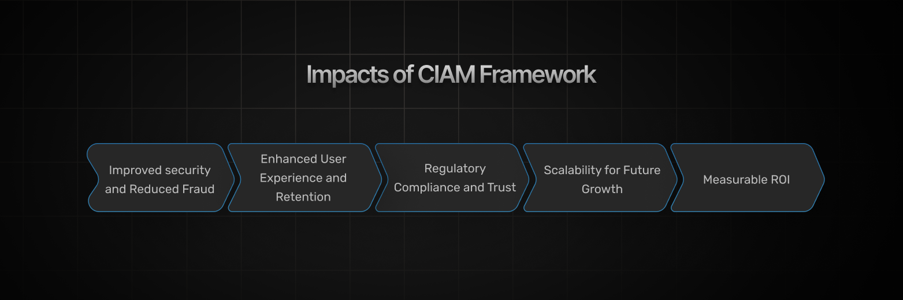

Customer Identity and Access Management (CIAM) isn't just about
authentication &mdash; it's the cornerstone of digital customer experiences,
security, and compliance. Companies must ensure that customers have
frictionless, secure, and personalized access to services across
multiple channels. A well-crafted CIAM strategy reduces login headaches,
prevents security breaches, and keeps regulatory risks at bay. In this
post, we break down the five essential pillars of a winning CIAM
strategy and explore how to implement them with cutting-edge tools like
[SuperTokens](https://supertokens.com/).

## **What is CIAM and Why Does It Matter?**

At its core, CIAM is the process of securely managing and authenticating
customer identities at scale. Unlike traditional Identity and Access
Management (IAM) &mdash; which primarily focuses on employee or internal user
access &mdash; CIAM is tailored for consumer interactions across web, mobile,
and IoT environments. It encompasses everything from registration and
authentication, to consent management and customer data privacy.

**CIAM Application Reference Architecture**

### **Key Differences from Traditional IAM**

While enterprise IAM deals with workforce identities and internal access
control, CIAM must contend with millions of external customers and
provide a seamless experience. This means CIAM strategies emphasize:

-   **User Experience (UX):** Every touchpoint, from sign-up to ongoing
    access, should be intuitive and frictionless.

-   **Scalability:** CIAM solutions need to handle high volumes of users,
    without compromising performance.

-   **Privacy and Compliance:** With regulations such as GDPR and CCPA,
    ensuring customer data protection and transparency is
    non-negotiable.

### **Real-World Impact**

A robust CIAM system reduces the risk of account takeover fraud,
minimizes login friction, and helps maintain compliance with data
privacy laws. Companies that invest in CIAM can improve user retention
and boost conversions by providing a secure and enjoyable digital
journey. In essence, a strong CIAM strategy is not just a security
measure &mdash; it's a competitive advantage.

## **The 5 Pillars of a Winning CIAM Strategy**

A high-performing CIAM strategy is built on five core pillars that
together ensure security, scalability, and personalization. Let's
explore each pillar in detail.

### **Pillar 1: Seamless and Secure Authentication**

Authentication is the first line of defense and the starting point of
any CIAM strategy. The challenge is to balance robust security measures
with a smooth, hassle-free user experience.

#### **Balancing Security and UX**

Modern customers expect login processes to be quick and easy. If
authentication is too cumbersome, users may abandon their transactions
or turn to competitors. The key is to deploy authentication methods that
safeguard access without slowing down the customer journey.

#### **Modern Authentication Methods**

1.  **Passwordless Login:** Methods such as biometrics (fingerprint or
    facial recognition), magic links, and passkeys eliminate the need
    for traditional passwords. By using one-time codes or device-based
    recognition, these systems not only improve security but also
    enhance the user experience.

2.  **Adaptive Multi-Factor Authentication (MFA):** Rather than applying
    the same level of scrutiny to every login attempt, adaptive MFA
    uses contextual data &mdash; like device information and login
    behavior &mdash; to determine the appropriate level of verification.
    This approach reduces friction for low-risk activities, while
    tightening security for suspicious logins.

3.  **Risk-Based Authentication:** By continuously analyzing factors
    such as geolocation, time of access, and user behavior patterns,
    risk-based authentication can dynamically adjust security
    measures. This ensures that legitimate users enjoy a smooth
    experience, while potential threats trigger additional checks.

#### **Example in Action**

Consider Amazon, which has long been recognized for its frictionless
customer experience. Amazon's authentication system adapts in real time:
when a user logs in from a familiar device and location, the process is
seamless. But if an unusual pattern is detected, the system
automatically introduces extra security steps without burdening every
customer.

### **Pillar 2: Scalable User Management and Shared User Accounts**

Managing millions of customer identities in a fast-growing digital
ecosystem requires both scalability and smart user management
strategies. Moreover, many businesses today &mdash; such as streaming
services &mdash; need to support shared user accounts (SUAs), while still
ensuring security and personalization.

#### **Scalability Challenges**

As your customer base grows, the CIAM system must handle increased loads
without compromising on performance. This means the back-end
infrastructure should be designed to support rapid growth and high
concurrency, while maintaining low latency.

#### **Handling Shared User Accounts**

SUAs, common in platforms like Netflix or
family-oriented streaming services, add another layer of complexity. The
CIAM system must differentiate between individual profiles within a
shared account, while maintaining the overall security of the master
account.

#### **Best Practices for User Identity Storage**

-   **Federated Identity:** Allowing customers to sign in by using trusted
    providers like Google, Apple, or enterprise Single Sign-On (SSO)
    streamlines the login process and enhances security. Federated
    identity reduces the burden on your system to manage and secure
    passwords.

-   **Progressive Profiling:** Instead of overwhelming users at sign-up
    with lengthy forms, collect only essential data initially. As
    customers continue to interact with your platform, progressively
    request additional information to enrich their profiles. This not
    only improves the customer experience, but also ensures compliance
    with data minimization principles.

#### **Example in Action**

Spotify is a great example of scalable user management. Spotify allows
users to sign in by using various methods &mdash; whether through email, social
media accounts, or mobile credentials &mdash; while also supporting multiple
profiles under one subscription. This flexibility has enabled Spotify to
offer a highly personalized experience to millions of users around the
world.

### **Pillar 3: Robust Access Control and Authorization**

Once a customer is authenticated, the next challenge is to ensure they
can only access the resources and data they are entitled to. This is
where robust access control and authorization come into play.

#### **The Role of Authorization in CIAM**

Authorization ensures that every action a customer takes is within their
permitted scope. It's about granting the right level of access to the
right users, at the right time.

#### **Techniques for Secure Authorization**

1.  **Role-Based Access Control (RBAC):** This method assigns
    permissions based on predefined roles. For example, a basic
    customer may have more limited access than a premium subscriber.
    RBAC simplifies the management of user permissions, particularly
    in large organizations.

2.  **Attribute-Based Access Control (ABAC):** ABAC takes a more
    granular approach by considering various attributes &mdash; such as user
    demographics, location, and behavioral patterns &mdash; to make
    authorization decisions. This dynamic approach allows for more
    personalized and context-aware access control.

3.  **OAuth 2.0 for Customer Data Sharing:** OAuth 2.0 is widely used
    for secure authorization, particularly when third-party
    applications require access to customer data. By issuing tokens
    rather than sharing credentials, OAuth 2.0 protects sensitive
    customer information, while enabling seamless integrations.

#### **Example in Action**

Stripe uses OAuth 2.0 to manage access to customer data across
third-party applications. This system enables external partners to
integrate with Stripe's payment infrastructure securely, without
compromising customer privacy or data security.

### **Pillar 4: Privacy, Compliance, and Customer Data Protection**

With the increasing scrutiny on data privacy and strict regulatory
requirements, building trust through robust data protection is a must
for any CIAM strategy.

#### **The Regulatory Landscape**

Regulations such as the General Data Protection Regulation (GDPR) in
Europe and the California Consumer Privacy Act (CCPA) in the United
States impose strict requirements on how companies collect, store, and
process customer data. Non-compliance can result in hefty fines, legal
battles, and a tarnished reputation.

#### **Building Trust Through Transparency**

A strong CIAM strategy not only protects customer data but also gives
users control over their own information. Features such as privacy
preference centers and clear opt-in/opt-out options empower customers,
fostering trust and transparency.

#### **Security Measures for Data Protection**

-   **Encryption:** Encrypt customer data both in transit (by using
    TLS/SSL) and at rest to protect against data breaches.

-   **Tokenization:** Replace sensitive data elements with non-sensitive
    equivalents (tokens) that can be used internally without exposing
    actual data.

-   **Regular Audits and Monitoring:** Continuously monitor and audit
    your CIAM system to detect and respond to potential security
    threats swiftly.

#### **Example in Action**

Apple's CIAM model is often cited as a gold standard in privacy. With
its privacy-first approach, Apple ensures that user data is encrypted
and that customers have clear control over what data is shared. This
transparency and robust data protection significantly strengthens
customer trust.

### **Pillar 5: Unified Customer Identity Across Channels**

In today's omnichannel environment, customers expect a consistent
experience whether they interact with a brand on a mobile app, website,
or even an IoT device. Breaking down identity silos is essential for
achieving a unified customer identity.

#### **The Problem of Identity Silos**

When customer identities are managed separately across different
channels, it leads to disjointed experiences. Customers may need to
register multiple times, and businesses miss opportunities to
personalize interactions.

#### **Single Customer View**

Single customer view (SCV) refers to the unification of customer identities across various
platforms into one comprehensive profile. By consolidating data from
multiple sources, businesses can gain a 360-degree view of their
customers, which is crucial for personalization and effective marketing.

#### **Strategies for Unified CIAM**

-   **Identity Federation (SSO):** Single Sign-On (SSO) solutions enable
    customers to log in once and access multiple services without the
    need for repeated authentication. Federated identity systems allow
    for a seamless user experience across different brands or
    platforms.

-   **Centralized vs. Decentralized Models:** Depending on business
    needs, companies can choose to implement centralized CIAM systems
    that consolidate identity data in one repository, or decentralized
    models where data remains at the channel level but is synchronized
    across systems.

#### **Example in Action**

Microsoft provides a stellar example of unified CIAM. With a single
identity that works across Office 365, Teams, and Azure, Microsoft
ensures that users enjoy a seamless experience regardless of the
application. This unified approach not only simplifies access, but also
enables personalized services based on comprehensive customer profiles.

## **Implementing CIAM with SuperTokens**

Building a robust CIAM strategy requires powerful tools that can deliver
security, scalability, and flexibility. This is where solutions like
[SuperTokens](https://supertokens.com/) come into
play.

### **Why SuperTokens?**

SuperTokens is a secure, scalable, open-source CIAM platform that offers
an excellent alternative to proprietary systems. It provides the
building blocks needed to implement the five pillars of a winning CIAM
strategy, while allowing for extensive customization to meet unique
business needs.

### **Key Features of SuperTokens for CIAM**

-   **Passwordless Authentication:** SuperTokens supports modern
    authentication methods such as magic links, one-time passwords
    (OTPs), and biometrics. This enhances security and simplifies the
    user experience.

-   **Customizable Authentication Flows:** Tailor your sign-up and login
    processes to align with your brand's look and feel, without
    compromising on security.

-   **Scalable Session Management:** Designed to handle millions of
    users simultaneously, SuperTokens ensures that session data is
    managed efficiently, even during peak traffic.

-   **Easy Integration:** Whether you run a SaaS platform or an
    eCommerce site, SuperTokens integrates smoothly with various
    front-end and back-end systems, streamlining your CIAM deployment.

### **Example: Enhancing CIAM for SaaS and eCommerce**

Consider a SaaS platform that needs to cater to users from different
regions and with varying authentication needs. By integrating
SuperTokens, the platform can enable passwordless authentication for a
smoother user experience, while also ensuring robust session management
and compliance with global data protection regulations.

This not only improves customer retention, but also reduces the risk of
security breaches and fraud. One such example is the [Arena Club team
who was able to get SuperTokens integrated within 2.5 weeks, with
minimal impact on the user
experience](https://supertokens.com/customers/arena-club).
SuperTokens enables a more secure flow with MFA and a native integration
in mobile experiences. All of which were key for Arena Club.

## **Final Thoughts: The ROI of a Strong CIAM Strategy**

Investing in a strong CIAM strategy isn't just about preventing security
breaches &mdash; it's about driving business growth. Here's how a robust CIAM
framework impacts your bottom line:

### **Improved Security and Reduced Fraud**

A CIAM strategy built on seamless authentication, robust access
controls, and comprehensive data protection minimizes the risk of
account takeover and fraud. This not only saves costs associated with
data breaches, but also protects your brand's reputation.

### **Enhanced User Experience and Retention**

When customers experience frictionless and personalized interactions,
they are more likely to stay engaged. By streamlining authentication and
unifying identities across channels, businesses can boost conversions
and build long-term loyalty.

### **Regulatory Compliance and Trust**

Compliance with regulations such as GDPR and CCPA is critical. A strong
CIAM system that emphasizes privacy, transparency, and data protection
builds trust with customers, ensuring they feel safe and valued when
interacting with your brand.

### **Scalability for Future Growth**

As your business scales, your CIAM solution must adapt. The pillars of
CIAM &mdash; ranging from scalable user management to unified identity across
channels &mdash; ensure that your customer access remains smooth and secure,
even as user numbers soar.

### **Measurable ROI**

Investing in CIAM yields measurable returns: fewer abandoned carts,
lower fraud losses, improved customer satisfaction, and a solid
foundation for future digital initiatives. Companies that prioritize
CIAM are better positioned to leverage customer data for personalized
experiences, driving growth and competitive differentiation.

## **Conclusion**

A strong CIAM strategy is essential in today's digital landscape for
secure, scalable, and personalized customer experiences. By focusing on
five pillars &mdash; authentication, user management, access control, privacy,
and unified identity &mdash; businesses can protect data and boost engagement.
Solutions like SuperTokens further enhance implementation with
customizable options. Investing in CIAM not only improves security and
user experience, but also provides a competitive advantage as digital
interactions increase, making these pillars vital for fostering trust
and innovation.

If you're looking to transform your customer access management and
elevate your digital security posture, now is the time to assess your
CIAM approach. Embrace best practices, leverage cutting-edge tools, and
build a CIAM strategy that truly secures, scales, and personalizes
customer interactions.
