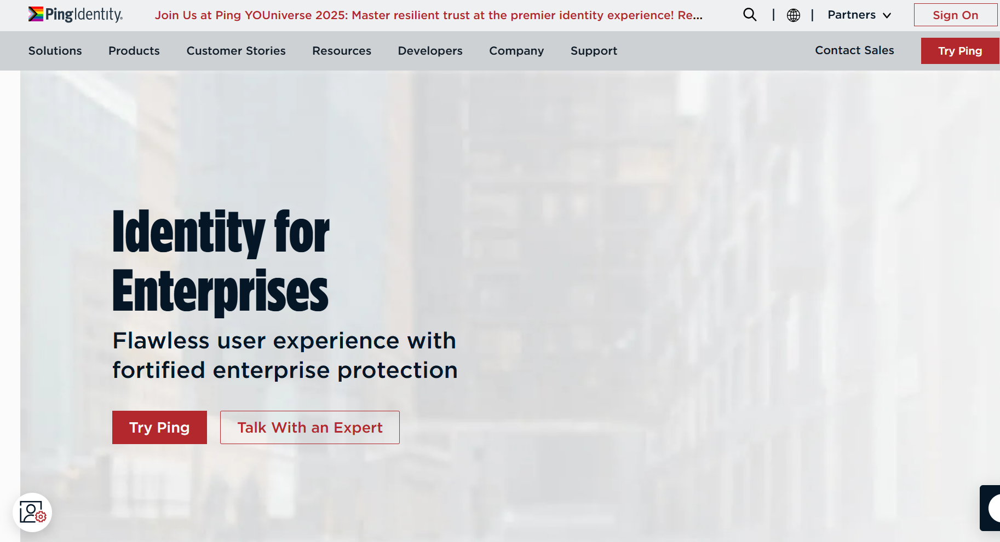
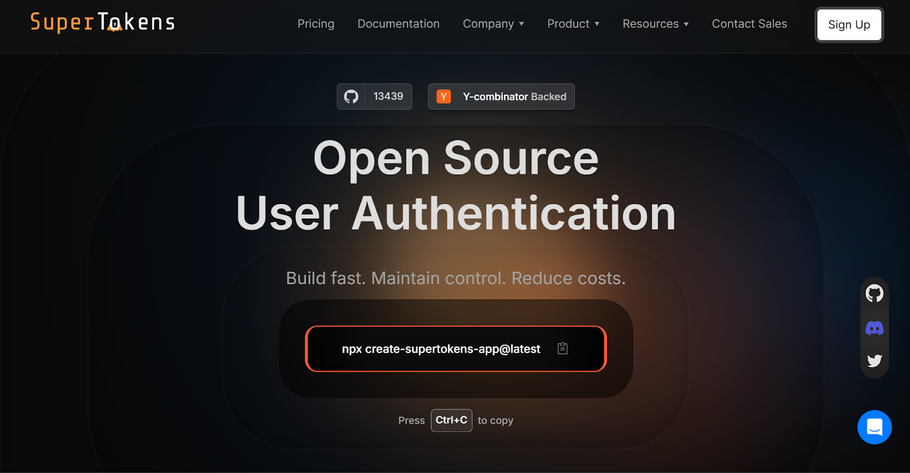
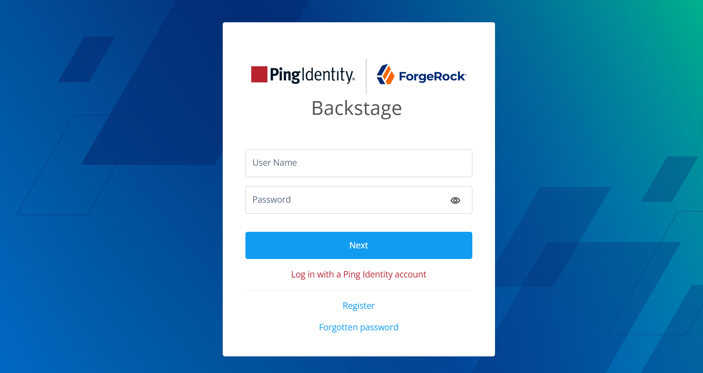
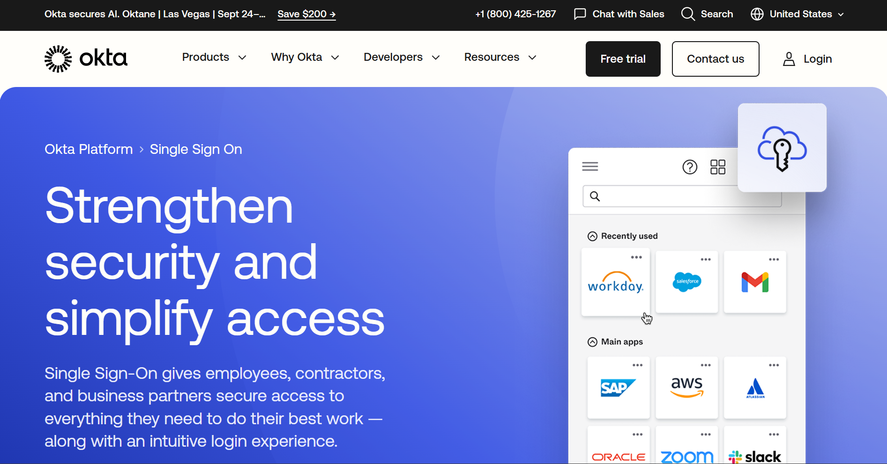
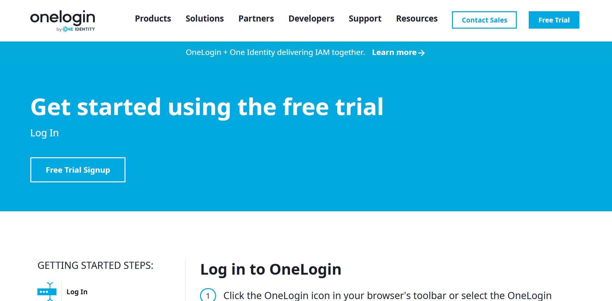

In an era where applications and data span on‑premises infrastructures, cloud environments, and mobile devices, organizations need robust
identity and access management (IAM) solutions. Ping Identity has emerged as a leading enterprise IAM provider, offering federated Single
Sign‑On (SSO), adaptive Multi‑Factor Authentication (MFA), directory services, and advanced access controls. However, with other platforms&mdash;such as Okta, ForgeRock, OneLogin, and SuperTokens&mdash;vying for developer and enterprise mindshare, how does Ping Identity truly stack up?

This post delivers a developer‑centric, unbiased comparison of the major IAM offerings on the market. We'll discuss Ping Identity's history, ownership, core services, and ideal use cases, followed by head‑to‑head breakdowns against ForgeRock, Okta, OneLogin, and SuperTokens. By the end, you'll have clarity on which platform best aligns with your organization's technical and business requirements.

## **What Is Ping Identity & Who Owns It?**

Founded in 2002 by Andre Durand and Bryan Field‑Elliot, Ping Identity Corporation set out to address the growing complexity of authentication and access management in heterogeneous environments. The company's flagship solutions include PingFederate (federation server), PingID (adaptive MFA), PingAccess (access management), PingDirectory (LDAP‑based directory), PingAuthorize (policy engine), and
PingIntelligence (AI‑driven threat detection).

In October 2022, [ThomaBravo](https://www.thomabravo.com/press-releases/thoma-bravo-completes-acquisition-of-ping-identity), a leading software private equity firm, completed its acquisition of Ping Identity for \$2.8 billion in cash. This transaction concluded an agreement first announced on August 3, 2022, and approved by shareholders on October 17, 2022. As a privately held company under Thoma Bravo's portfolio, Ping Identity benefits from significant investment capacity and strategic guidance aimed at consolidating complementary identity solutions.

## **What Does Ping Identity Do and What Is It Used For?**

Ping Identity's integrated platform addresses critical IAM needs:

-   **Federated Single Sign‑On (SSO)** via PingFederate and PingOne, supporting SAML 2.0, OAuth 2.0, OpenID Connect, WS‑Trust, and WS‑Federation. These capabilities simplify access management across cloud and on-prem systems while maintaining robust securityand compliance standards.
-   **Adaptive Multi‑Factor Authentication (MFA)** through PingID, enabling step‑up and risk‑based policies that leverage device posture, geo‑location, and behavior analytics. This approach enhances protection while minimizing user friction, with contextual policies tailored to dynamic user behavior and threat landscapes.
-   **Directory Services** with [PingDirectory](https://www.pingidentity.com/en/product/pingdirectory.html), a high‑performance LDAP server designed for scaling millions of identities. It ensures high availability, low latency, and strong data consistency, making it suitable for real-time identity operations in large-scale environments.
-   **Access Security** via [PingAccess](https://www.pingidentity.com/en/platform/capabilities/authorization/pingaccess.html), enforcing access policies for applications and APIs. It offers fine-grained control over resource access, integrating easily with both legacy applications and modern APIs for consistent policy enforcement.
-   **Policy‑Based Authorization** using PingAuthorize to manage context‑aware entitlements. It allows organizations to centrally define and enforce authorization policies based on attributes like user role, location, time, and device, supporting dynamic decision-making at runtime.
-   **AI‑Enhanced Threat Detection** through PingIntelligence for API cybersecurity and anomaly detection. This component leverages machine learning to detect malicious behaviors and usage anomalies in real time, helping prevent advanced threats and data breaches across digital assets.

### **Enterprise Use Cases**

1.  **Employee (B2E) Authentication:** Secure workforce SSO and MFA across cloud, on‑prem, and mobile apps.
2.  **Zero Trust Environments:** Enforce least‑privilege access policies at the network, application, and data layer.
3.  **Hybrid Deployments:** Seamlessly integrate on‑prem LDAP, Active Directory, and emerging cloud identity stores.
4.  **Regulated Industries:** Achieve compliance (e.g., PCI DSS, HIPAA, GDPR) via audit trails, encryption, and strong authentication.

### **Limitations**

While Ping Identity excels in complex enterprise scenarios, its breadth and configurability can introduce overhead: lengthy deployment cycles, steeper learning curves, and high licensing costs may deter agile startups or dev‑first teams.

## **SuperTokens vs Ping Identity -- Modern vs Enterprise IAM**

### **SuperTokens Overview**

SuperTokens is an open‑source, developer‑first authentication framework designed for web and mobile applications. Key characteristics:

-   **Lightweight & Extensible:** Core service mediates between frontend and backend for customizable flows.
-   **Session Management:** Built‑in, secure JWT‑based sessions with anti‑CSRF protections.
-   **Authentication Methods:** Email/password, [passwordless](https://supertokens.com/docs/authentication/passwordless/introduction) (magic links), social logins (OAuth).
-   **Multi‑Factor Authentication & Attack Protection:** Optional plugins for OTP and advanced security.
-   **Self‑Hosted & Open‑Core:** No vendor lock‑in; [full code access](https://github.com/supertokens/supertokens-core) for customization.

### **Where SuperTokens Wins**

-   **Simplicity:** Minutes to set up with NPM packages and prebuilt UI components.
-   **Flexibility:** Self‑host or opt for managed service; adapt flows without enterprise overhead.
-   **Cost‑Effective:** Open‑source core, free forever; pay only for managed service beyond baseline limits.
-   **Passwordless‑First:** Offers magic links and OTP out of the box, lowering friction.

### **Where Ping Leads**

-   **Comprehensive Federation:** Enterprise‑grade SAML/OIDC token brokering and protocol agility.
-   **Granular Policy Control:** Rich access policies via PingAccess and PingAuthorize.
-   **Enterprise Support & Compliance:** SLA‑backed support, certified security posture, and audit capabilities.
-   **Scalability & Performance:** Designed for millions of identities with global deployments.

### **Use Case Fit**

-   *SuperTokens* suits agile SaaS teams, startups, and dev‑centric products that need simple, secure auth without infrastructure complexity.
-   *Ping Identity* is ideal for large enterprises&mdash;banks, governments, and Fortune 500s&mdash;requiring deep integration, compliance, and centralized management.

## **Ping Identity vs ForgeRock**

### **Shared Ownership & Background**

Both Ping Identity and ForgeRock now reside under Thoma Bravo's ownership: [Ping acquired in October 2022 for \$2.8 billion](https://www.thomabravo.com/press-releases/thoma-bravo-completes-acquisition-of-ping-identity); [ForgeRock for \$2.3 billion in October 2022](https://www.darkreading.com/cybersecurity-operations/thoma-bravo-practical-decision-merge-forgerock-into-ping-identity), closed in August 2023, and subsequently merged into Ping Identity.

### **Platform Philosophy**

 
| **Capability**              | **Ping Identity**         |  **ForgeRock**          |
|-----------------------------|---------------------------|------------------------ |
| **Federation**              | SAML, OAuth, OIDC via PingFederate     |   SAML, OAuth, OIDC via ForgeRock AM|
| **Directory**               | PingDirectory (LDAP)      |  ForgeRock Directory Services (DS)    |
| **Workflow/Orchestration**  | Limited out‑of‑the‑box, relies on partner tools   |  Native orchestration engine for complex flows  |
| **Developer Extensibility** | Config‑driven adapters, REST APIs  |  Groovy scripting, custom authentication modules     |

### **Overlap**

Both offer SSO, MFA, and directory services. ForgeRock's orchestration and open‑source roots make it appealing for highly customized identity journeys, whereas Ping Identity generally delivers faster time‑to‑value with a more opinionated, packaged experience.

Additionally, ForgeRock tends to be favored in environments requiring complex policy enforcement and advanced user journey control. Ping, on the other hand, excels in hybrid IT and cloud-first environments where speed and ease of deployment are priorities.

Both platforms support modern identity standards like OAuth, OIDC, and SAML, ensuring compatibility with a wide range of enterprise systems. Ultimately, the choice often depends on organizational
priorities&mdash;flexibility versus speed.

### **SuperTokens Lens**

SuperTokens provides core SSO and MFA capabilities similar to Ping and ForgeRock, but without the orchestration overhead. It's built for
developers who want lightweight, pluggable auth without enterprise complexity or legacy baggage.

## **Ping Identity vs Okta -- Enterprise Power vs SaaS Simplicity**

### **Okta Strengths**

-   **User Experience:** [Okta](https://www.okta.com/products/single-sign-on-workforce-identity/) offers an intuitive admin console with plug‑and‑play integrations across 7,000+ apps, making it easy for enterprises to deploy identity solutions quickly and at scale.
-   **SaaS‑Native:** Cloud‑first architecture, minimal on‑prem footprint required. This allows organizations to scale identity services globally with reduced infrastructure overhead.
-   **Developer Ecosystem:** SDKs, APIs, and a developer portal with robust documentation. Developers can rapidly build, test, and integrate identity features into any application stack. Support for multiple programming languages and frameworks ensures flexibility in implementation.
-   **Self‑Service Onboarding:** End users can federate personal apps via OAuth and SAML. This empowers users to manage access without involving IT, reducing administrative load. Custom branding and policy controls ensure the onboarding experience aligns with enterprise standards.

### **Ping Identity Strengths**

-   **Protocol Customization:** Deep support for WS‑Trust, SCIM, bespoke protocols.Ideal for legacy modernization and complex B2B integrations. Enables seamless identity federation across non-standard or proprietary environments.
-   **On‑Prem & Hybrid Support:** Run fully on‑prem for air‑gapped or regulated workloads. Supports high-security deployments in government, defense, and financial sectors. Provides full control over data residency, patching, and infrastructure management.
-   **Risk‑Based Policies:** Adaptive MFA that integrates with network and device posture. Evaluates risk in real time to allow, deny, or challenge access dynamically. Reduces friction for low-risk users while tightening security where needed.
-   **Enterprise Compliance:** Audit logs, encryption at rest/in transit, FIPS‑certified modules. Meets regulatory requirements such as HIPAA, GDPR, and FedRAMP. Delivers full visibility and traceability for access events and policy changes.

|  Use Case              | Okta                        |     Ping Identity                        |
|------------------------|-----------------------------|------------------------------------------|
| *Cloud‑First Startups* | Turnkey IAM                 |     Heavy for lightweight needs          |
|  *Regulated Industries*| Primarily cloud             |     On‑prem/hybrid for compliance        |
|  *Custom Protocols*    | Limited WS‑\* support       |      Extensive protocol coverage         |
|  *SaaS Integrations*   | Prebuilt integrations       |      Requires partner downloads          |  

### **Where SuperTokens Fits**

Okta prioritizes easy onboarding and polished UX. Ping is built for complex policies, compliance, and hybrid environments. SuperTokens offers dev teams agility and full control&mdash;with an open-core model that avoids the lock-in and complexity of enterprise IAM stacks.

## **Ping Identity vs OneLogin -- Security Depth vs Deployment Ease**

### **OneLogin Benefits**

-   **Fast Rollout:** Cloud‑based, intuitive setup wizard. Organizations can deploy SSO and identity services in hours, not weeks. Minimal training is needed for IT admins, accelerating time-to-value.
-   **User‑Friendly MFA:** Push notifications via [OneLogin](https://www.onelogin.com/learn/what-why-adaptive-authentication?utm_source=chatgpt.com) Protect app; adaptive step‑up flows. MFA is integrated seamlessly into the user journey, reducing friction. Contextual signals like location and device type help determine when to challenge users.
-   **Pre‑Built Connectors:** Hundreds of SAML/OIDC connectors, unified directory sync. Out-of-the-box integrations simplify the onboarding of popular SaaS apps. Supports real-time sync with directories like AD, LDAP, and G Suite.
-   **SmartFactor Authentication:** Risk‑based, AI‑powered decision engine for context‑aware MFA. Analyzes user behavior, device reputation, and geolocation for smarter access decisions. Reduces false positives while strengthening security posture against advanced threats.

### **Ping Identity Benefits**

-   **Granular Access Control:** Policy engine supporting attribute‑based access control (ABAC). Enables precise permissioning based on user role, device, location, and more. Supports dynamic, real-time decisions for high-security use cases.
-   **Hybrid IAM:** Full on‑prem and cloud deployments with consistent tooling. Ideal for organizations transitioning to cloud at their own pace. Ensures policy consistency and user experience across environments.
-   **Modular Platform:** Decouple login (Federate), directory (Directory), and access (Access). Organizations can adopt only the components they need, reducing overhead. Each module integrates seamlessly with third-party systems and standards.
-   **AI‑Enhanced Protection:** PingIntelligence's anomaly detection for API abuse. Uses machine learning to baseline normal behavior and flag outliers in real time. Mitigates threats like token misuse, credential stuffing, and bot-driven attacks.

|  Dimension            |   OneLogin               | Ping Identity          | 
|-----------------------|--------------------------|------------------------|  
|  *Deployment Speed*   |   Minutes to hours       |  Days to weeks|        | 
|  *Adaptive Security*  |   SmartFactor Auth       |  PingID risk‑based policies    |
|  *Hybrid Support*     |   Primarily cloud        |   On‑prem & cloud      |
|  *Customization*      |   Moderate via policies  | Deep via scripting & adapters  |

### **Use Case Match**

OneLogin suits mid-market teams looking for quick deployment and ease of use. Ping supports regulated industries that demand fine-grained access controls and smart MFA. SuperTokens fits teams building in-app auth with a developer-first stack, offering native session management and passwordless features without enterprise bloat.

## **When to Use Each Platform**

-   **Ping Identity:** Large enterprises with stringent compliance, complex legacy integration, and hybrid or on‑prem needs. Best suited for industries like finance, healthcare, and government, where control and customization are critical. Offers deep support for standards and policy enforcement across distributed environments.
-   **Okta:** Cloud‑centric organizations seeking rapid time to value, self‑service onboarding, and SaaS app catalogs. Ideal for fast-scaling companies prioritizing ease of use and strong admin tooling. Integrates seamlessly with thousands of cloud applications and services.
-   **ForgeRock:** Enterprises with highly customized identity workflows, open‑source advocates, or legacy migration projects. Preferred in cases requiring advanced orchestration, fine-grained control, and extensibility. Often chosen by teams needing to tailor identity journeys beyond standard flows.
-   **OneLogin:** Mid‑market companies valuing usability, straightforward MFA, and quick rollout. Balances enterprise-grade features with approachable configuration and pricing. Known for ease of deployment and a strong directory integration layer.
-   **SuperTokens:** Developer‑led product teams building web/mobile apps, startups, and any team desiring open‑source, self‑hosted passwordless, and session‑centric auth. Highly customizable and ideal for embedding auth directly into product stacks. Lightweight and privacy-friendly, making it a solid fit for modern app architectures.

## **Frequently Asked Questions (FAQ)**

**Q: What is Ping Identity used for?** A: Managing enterprise identities, federated SSO, adaptive MFA, directory services, API security, and zero‑trust policy enforcement.

**Q: Who owns Ping Identity?** A: [Thoma Bravo](https://www.thomabravo.com/press-releases/thoma-bravo-completes-acquisition-of-ping-identity) acquired Ping Identity in an all‑cash transaction valued at \$2.8 billion, closing in October 2022.

**Q: What are the main advantages of Ping over OneLogin?** A: Deeper protocol support (WS‑Trust, SCIM), on‑prem/hybrid deployments, and integrated AI‑driven threat detection.

**Q: How does SuperTokens compare?** A: SuperTokens is open‑source, self‑hosted, and developer‑friendly, focusing on session management and passwordless auth without enterprise federation overhead.

## **Conclusion**

Ping Identity remains a powerhouse IAM platform for regulated enterprises requiring broad protocol coverage, hybrid deployment options, and comprehensive access policies. Yet, for organizations with lighter needs or dev‑first teams, Okta and OneLogin offer simplified SaaS‑based IAM, while open‑source SuperTokens empowers rapid, cost‑effective authentication and session management. ForgeRock bridges the gap via advanced orchestration and open‑source DNA, especially post‑integration with Ping under Thoma Bravo's stewardship. Select the solution that aligns with your compliance, customization, and developer velocity priorities&mdash;each platform shines in its ideal scenario.

*Auth decisions shape your security posture and user experience&mdash;choose wisely!*
